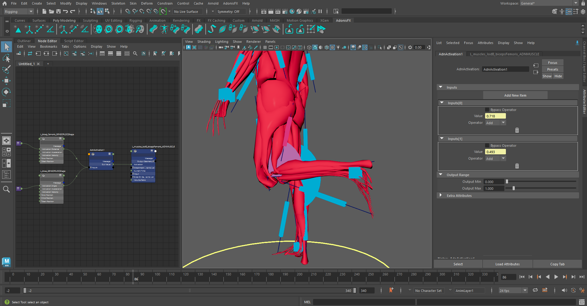

# AdnActivation

The AdnActivation node is a dependency node that allows operations on activation values for the computation of a final activation value that can be used to drive, for example, muscle activations. An example of its use case could be the merging of various sensor activations into one single driven activation to activate a muscle given multiple poses.

## How To Use

To create this node, follow these steps:

1. Open the Node Editor from Windows > Node Editor.
2. Press the Tab key, type *AdnActivation* and press Enter to create a new instance of this node.

The activation node can now be used to override, add, subtract, multiply or divide the activations from different sources (sensors) into one final activation value.
For example, multiple distance sensors of a character can be merged together to produce different kinds of activations throughout the simulation.

<figure markdown>
  
  <figcaption><b>Figure 1</b>: Use case in which AdnActivation is created for merging two activations to drive a muscle's activation.</figcaption>
</figure>

To add new inputs to the AdnActivation node:

1. Go to the AET and press *Add New Item*.
2. Set the desired *Operator*.
3. Type in a fixed value in *Value*, animated it or connect the plug with an AdonisFX sensor's output.

> [!NOTE]
> All operators will be evaluated from top to bottom (starting from index 0 and ending on index N).

## Operators

1. **Over (Override)**: Overrides the accumulated output activation value with Value. If the current accumulated activation value is 1.0 and Value is 2.0 the output activation will be 2.0.
2. **Add (Add)**: Adds the accumulated output activation value with Value. If the current accumulated activation value is 1.0 and Value is 2.0 the output activation will be 3.0.
3. **Sub (Subtract)**: Subtracts the accumulated output activation value with Value. If the current accumulated activation value is 1.0 and Value is 2.0 the output activation will be 0.0.
4. **Mult (Multiply)**: Multiplies the accumulated output activation value with Value. If the current accumulated activation value is 1.0 and Value is 2.0 the output activation will be 2.0.
5. **Div (Divide)**: Dives the accumulated output activation value with Value. If the current accumulated activation value is 1.0 and Value is 2.0 the output activation will be 0.5.

## Example

<figure markdown>
  
  <figcaption><b>Figure 1</b>: Closeup use case in which AdnActivation is created for merging two activations to drive a muscle's activation.</figcaption>
</figure>

In the above setup we have the following characteristics:

1. 1 AdnSensorRotation.
2. 1 AdnSensorPosition.
3. 1 AdnActivation.
4. 1 AdnMuscle.
5. 2 Inputs added to AdnActivation.
6. Input 1 has an Over operator and is connected to the AdnSensorRotation.
7. Input 2 has an Add operator and is connected to the AdnSensorPosition.
8. The bypass option is unchecked for both inputs.
9. Out Value will be: AdnSensorRotation Activation + AdnSensorPosition Activation.

## Attributes

### Inputs Attributes
The *inputs* attribute is presented as an array of 3 attributes which can be found below.

| Name | Type | Default | Animatable | Description |
| :--- | :--- | :------ | :--------- | :---------- |
| **Bypass Operator** | Boolean | True            | ✓ | If enabled, it bypasses the current operator in the input list, which will not contribute to the final activation value |
| **Value**           | Float   | 0.0             | ✓ | Activation value that will contribute, given the operator type, to the final activation. |
| **Operator**        | Enum    | 0 (Over)        | ✓ | Operator used to contribute to the final activation. This can be: (0) Over; (1) Add; (2) Sub; (3) Mult; (4) Divide. |

### Output Attributes
| Name | Type | Default | Animatable | Description |
| :--- | :--- | :------ | :--------- | :---------- |
| **Output Min** | Float | 0.0 | ✓ | Minimum supported output activation value. |
| **Output Max** | Float | 1.0 | ✓ | Maximum supported output activation value. |

## Attribute Editor Template

<figure markdown>
  
  <figcaption><b>Figure 3</b>: AdnActivation Attribute Editor.</figcaption>
</figure>
