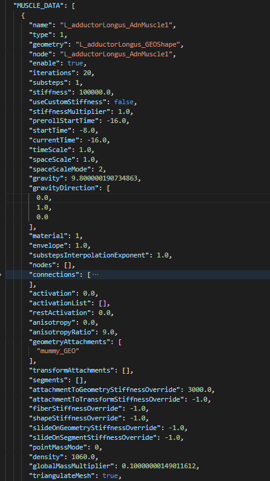

# API

### Experimental Python API

> [!NOTE]
> - This API is experimental, and will be subject to changes in following versions of AdonisFX.
> - The use of this API in production applications is not supported.

An experimental Python API has been developed to allow Technical Directors to implement custom Python scripts for exporting and rebuilding AdonisFX rigs programmatically.

This API enables users to:
- Extract the setup from an existing rig in Maya.
- Rebuild the rig in another Maya scene.
- Export rig data in a format that could be imported into other DCCs (for example Houdini).

As this API is still under active development, please do not hesitate to send an email to **adonis.support@inbibo.co.uk** to provide feedback and/or feature requests. The support and development teams will work together to incorporate user feedback and refine the implementation.

The API can be found in `AdonisFX/python/adn/api/adnx.py`. 
The definitions can be imported with `from adn.api.adnx import *`.

Since the method definitions may change before the API becomes production-ready, here are some examples showing how to use the current experimental Python API for Maya. Similar methods can be found directly in the `adnx.py` file.

1. How to create a rig instance with Maya as the host: `rig = AdnRig(AdnHost.kMaya)`
2. How to create an AdonisFX rig component and add it to the rig (e.g. an AdnMuscle inside the rig): `muscle = AdnMuscle(rig)` and `rig.addSolver(muscle)`
3. How to gather data from an existing AdonisFX scene to populate the rig component entry (assuming AdnMuscle1 exists in the Maya scene): `muscle.fromNode("AdnMuscle1")`
4. How to get the dictionary containing the extracted data: `data = muscle.getData()`
5. How to populate the rig component from a dictionary that contains all required entries: `muscle.fromDict(data)`. The required dictionary formatting can be found in the `__init__` methods of the `AdnMuscleBase` and `AdnMuscle` classes. Modifying dictionary entries allows users to update or rebuild rigs with custom values.
6. How to update an existing rig component in the scene after modifying its values: `muscle.update()`. This method assumes that the target AdnMuscle already exists in the scene.
7. How to build rig components in the scene: `muscle.build()` to build the muscle or `rig.build()` to build all the components.
8. How to define the execution order when extracting data from an existing scene: `rig.buildExecutionOrder()`. With an already configured scene, this deduces the correct reconstruction order required to preserve deformation and node dependency chains.
9. How to clear a specific rig component from the scene: `muscle.clear()`

All other methods can be found in the `AdonisFX/python/adn/api/adnx.py` file.

The API is the base foundation for the Import/Export tools of AdonisFX. Below is an example of exported rig data in a .json file:

<figure markdown>
  
  <figcaption><b>Figure 1</b>: Maya API Json example.</figcaption>
</figure>

> [!NOTE]
> - Deformed geometry uses the `Shape` suffix to describe the "geometry" entry. This is important when moving data between DCCs, as it must adhere to the naming convention.
> - Data such as "geometryAttachments" are represented using the name without the `Shape` suffix. This is also important for interoperability between DCCs..
> - No context needs to be defined in the current version of the Maya API.
