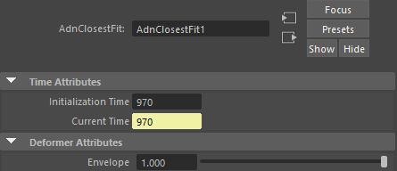

# AdnClosestFit

AdnClosestFit is a Maya deformer that projects an input geometry onto one or more target geometries using a closest-surface projection model.

For every point of the deformed geometry, the deformer searches for the closest point on the closest surface of the connected target geometries. Each input point is then moved directly to its corresponding target surface point, causing the input geometry to conform to the shape of the target geometry.

AdnClosestFit is particularly useful for conforming meshes to anatomical models, fitting accessories onto character surfaces or creating surface-matching workflows between unrelated geometries.

## How To Use

The AdnClosestFit is easy to create and configure in Maya. It requires the mesh to apply the deformation onto and the target(s) that will drive the deformation.

1. Select targets and then the mesh on which to apply the deformer.
2. Press *Closest Fit* {style="width:4%"} in the Adonis menu, under the Create Deformers section.
3. A message in the terminal will notify that AdnClosestFit has been created properly. Check the [Attributes](closest_fit#attributes) section to customize their configuration.

## Attributes

### Time Attributes
| Name | Type | Default | Animatable | Description |
| :--- | :--- | :------ | :--------- | :---------- |
| **Initialization Time** | Time | *Current frame* | ✗ | Sets the frame at which the deformer will be initialized. |
| **Current Time**        | Time | *Current frame* | ✓ | Current playback frame. |

### Deformer Attributes
| Name | Type | Default | Animatable | Description |
| :--- | :--- | :------ | :--------- | :---------- |
| **Envelope** | Float | 1.0 | ✓ | Specifies the deformation scale factor. Has a range of \[0.0, 1.0\]. The upper and lower limits are soft, values can be set in a range of \[-2.0, 2.0\]|

## Attribute Editor Template

<figure markdown>
  
  <figcaption><b>Figure 1</b>: AdnClosestFit Attribute Editor.</figcaption>
</figure>

## Paintable Weights

The Maya paint tool must be used to paint the *Weights* map to ensure that the values satisfy the deformation needs.

| Name | Default | Description |
| :--- | :------ | :---------- |
| **Weights** | 1.0 | Maya standard weights map used to control the influence of the deformer at each vertex. |
