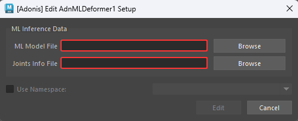
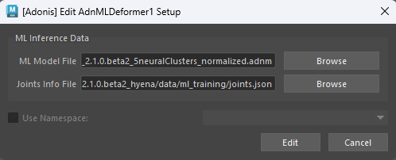
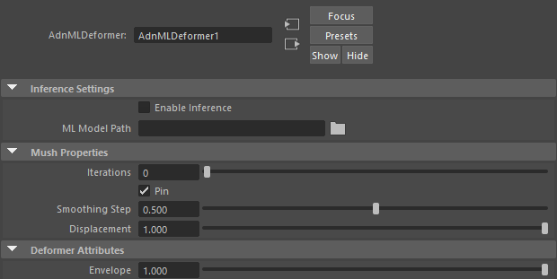

# AdnMLDeformer

The AdnMLDeformer is a Maya deformer that applies deformation driven by a trained Adonis ML model. It uses Maya joint transforms as inputs for ML inference and applies the resulting deformation to the input geometry. The node also integrates mush smoothing to refine the inferred shape and provides paintable weights to control the influence of the inference, mush smoothing, and overall deformation per vertex.

To learn more about how to train an Adonis ML model, please check the [Adonis ML Neural Training Tool](../tools/neural_training_tool) page.

> [!IMPORTANT]
> - The AdnMLDeformer can be used with an FX license. However, an Adonis ML license is required to generate the Adonis ML model required by this deformer.

## How To Use

The AdnMLDeformer requires three main inputs:

- The geometry to apply the deformer to. This is the geometry deformed by a skinCluster node.
- The Adonis ML model file (.adnm).
- The Maya rig joints used as inputs for the Adonis ML model.

Apart from the inputs required, there are also other aspects to be satisfied for this deformer to produce the expected results:

- The skinCluster node must exist in the deformable chain of the geometry to apply the AdnMLDeformer to.
- The input geometry and the skinCluster node must be the same used in the data extraction process.

To create and configure the deformer easily, there is a shortcut in the Adonis menu.

1. Select the geometry to apply the deformer to.
2. Click on {style="width:4%"} in the Adonis shelf or go to the Adonis > Deformers > ML Deformer.
3. A simple UI will pop up to provide two inputs: ML Model File and Joints Info File.

<figure markdown>
  
  <figcaption><b>Figure 1</b>: Simple UI to easy the creation and configuration of AdnMLDeformer.</figcaption>
</figure>

4. Click on the Browse button of the ML Model File to provide the .adnm file.
5. Click on the Browse button of the Joints Info File to provide the joints.json file. Make sure that both files are compatible with each other; that is, the joints.json file must be the one generated during the training process when the Adonis ML model was trained. If the joints are assigned to a namespace, make sure to enable *Use Namespace* and select the correct namespace from the combo box.

<figure markdown>
  
  <figcaption><b>Figure 2</b>: UI to create AdnMLDeformer with the model and joints files provided.</figcaption>
</figure>

6. Click on the Create button.
7. The AdnMLDeformer will be created before the skinCluster node, if present, of the given geometry, and the joints found in the Maya scene and present in the joints.json file will be populated as input connections to the deformer.
8. The deformer is ready. Tweak the envelope and/or enable or disable the inference to see the effect of the Adonis ML model.

> [!NOTE]
> - Creating the node manually is also possible through Python script or from the Node Editor.
> - In that case, the ML Model path and the connections to the input joints can also be populated afterwards from the same UI by selecting the geometry and launching Adonis > Deformers > ML Deformer.
> - The use of this UI is recommended to ensure that the list of ML Inputs is consistent with the Adonis ML Model.
> - Machine learning dependencies are installed inside the Adonis installation directory rather than system-wide. As a result, the system environment remains unchanged and no global Python packages are installed.
> - (Windows Only) ML inference will run on the GPU if the ML Dependencies have been previously installed. If not, the ML inference is performed on the CPU. Please, learn how to install the dependencies in this [section](../../installation#ml-dependencies) on the Installation page.

The AdnMLDeformer integrates the mush algorithm to apply smoothing to the shape resulting from the inferred deformation. This algorithm requires a reference geometry to cache the displacements. Typically, the AdnMLDeformer is applied before the skinCluster node; that is, the input source geometry is at rest, meaning that the input source is valid for mush data initialization. However, the AdnMLDeformer supports a custom rest shape to optionally initialize the mush data from a different reference geometry which should be connected to the `originalGeometry` plug.

## Attributes

### ML Inference Attributes

| Name | Type | Default | Animatable | Description |
| :--- | :--- | :------ | :--------- | :---------- |
| **Enable Inference** | Boolean | True | ✓ | Flag to enable or disable the inferred deformation. |
| **ML Model Path**    | String  |      | ✓ | File path to the trained Adonis ML model.           |

### Mush Properties

| Name | Type | Default | Animatable | Description |
| :--- | :--- | :------ | :--------- | :---------- |
| **Iterations**     | Integer | 10      | ✓ | Number of smoothing iterations applied by the mush algorithm. Greater values produce smoother results at the expense of additional computational cost. Has a range of \[0, 20\]. The upper limit is soft; higher values can be used. |
| **Pin**            | Boolean | True    | ✓ | Flag to pin the vertices on the boundaries.                                                                                                                                                                                        |
| **Smoothing Step** | Float   | 0.5     | ✓ | Amount of smoothing applied at each iteration. Has a range of \[0.0, 1.0\].                                                                                                                                                          |
| **Displacement**   | Float   | 1.0     | ✓ | Controls how much of the computed displacement is applied to the geometry. Has a range of \[0.0, 1.0\].                                                                                                                              |

### Deformer Attributes
| Name | Type | Default | Animatable | Description |
| :--- | :--- | :------ | :--------- | :---------- |
| **Envelope** | Float | 1.0 | ✓ | Specifies the deformation scale factor. Has a range of \[0.0, 1.0\]. The upper and lower limits are soft, and values can be set in a range of \[-2.0, 2.0\]. |

### Connectable Attributes
| Name | Type | Default | Animatable | Description |
| :--- | :--- | :------ | :--------- | :---------- |
| **ML Inputs** | Matrix | Identity | ✓ | Local transformation matrix of the joints used as input to the Adonis ML model for inference. |

## Parameter Template

<figure markdown>
  
  <figcaption><b>Figure 1</b>: AdnMLDeformer Attribute Editor.</figcaption>
</figure>

## Paintable Weights

| Name | Default | Description |
| :--- | :------ | :---------- |
| **Inference Weights** | 1.0 | Weights map used to control the influence of the inferred deformation at each vertex. |
| **Mush Weights**      | 1.0 | Weights map used to control the influence of the mush deformation at each vertex.     |
| **Weights**           | 1.0 | Global weights map used to control the influence of the deformer at each vertex.      |
