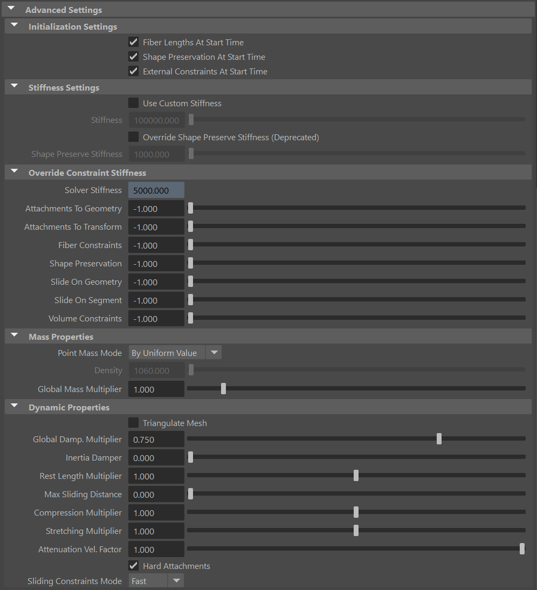
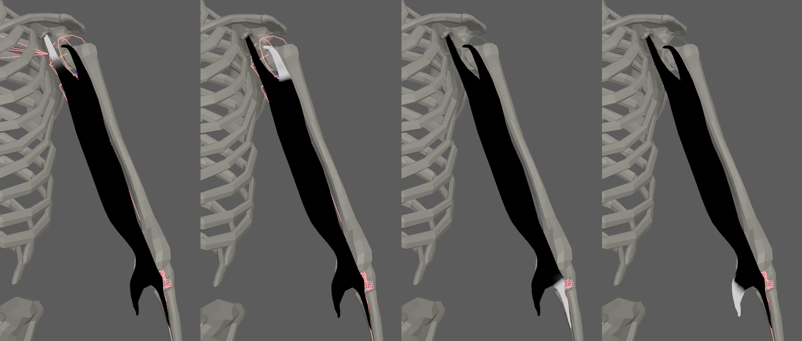
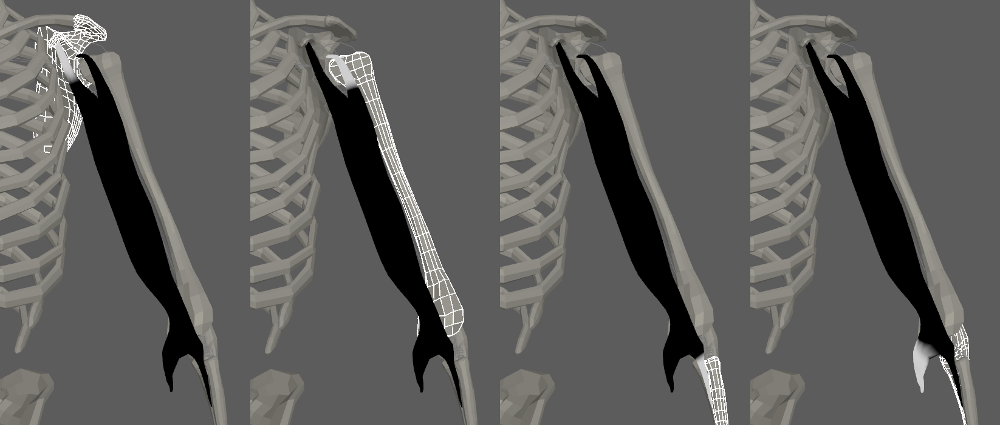
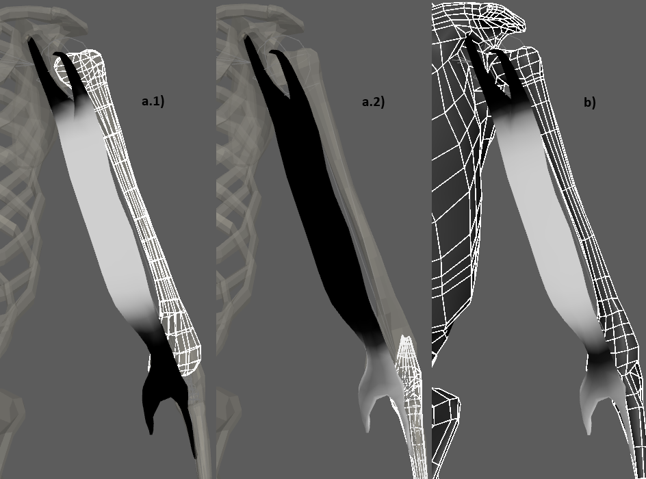
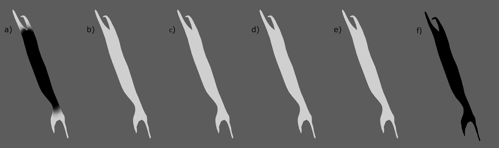
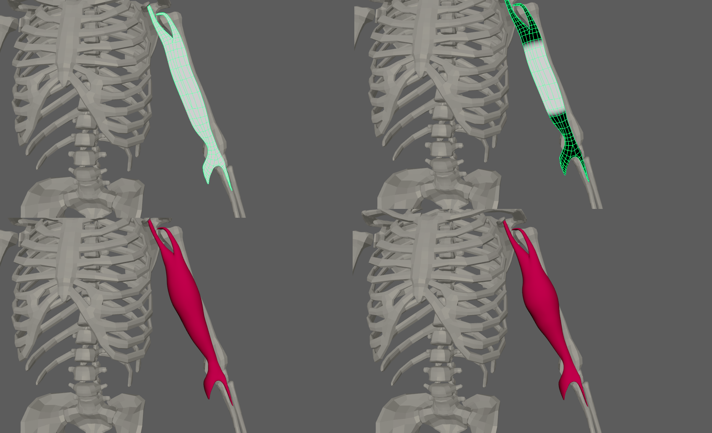
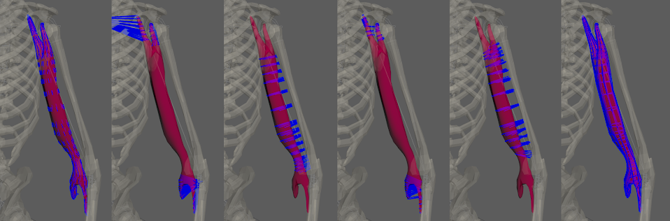
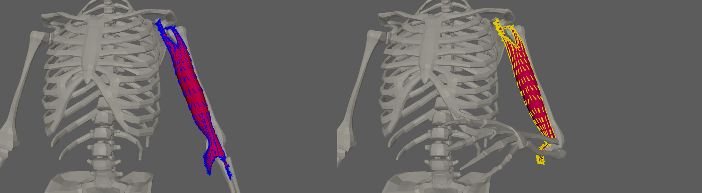
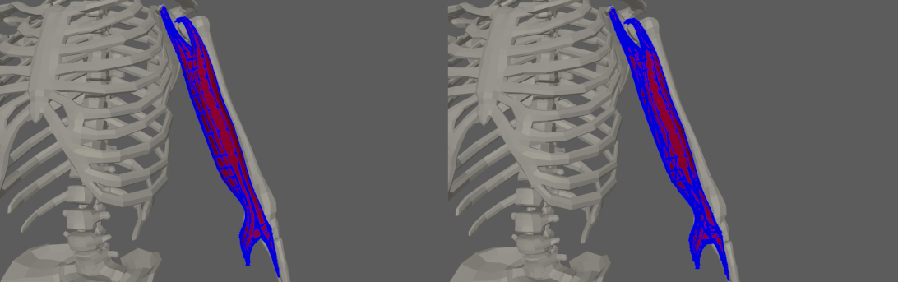
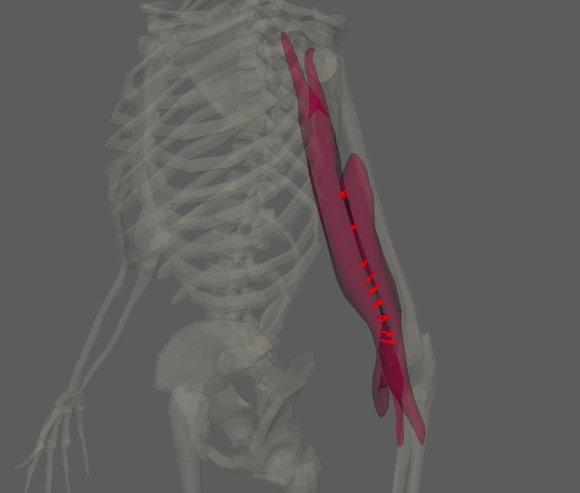

# AdnMuscle

AdnMuscle is a Maya deformer for fast, robust and easy-to-configure volumetric muscle simulation for digital assets. Thanks to the combination of internal (structural) and external (attachment and slide) constraints, this deformer can produce dynamics that allow the mesh to acquire the simulated characteristics of a muscle with realistic volume preservation, fibers activations to modulate the rigidity, and attachments properties to external objects to follow the global kinematics of the character.

The influence these constraints have on the simulated mesh can be freely modified by painting them via the [AdonisFX Paint Tool](../tools#paint-tool) or by uniformly regulating their influence via multipliers in the Attribute Editor. Besides the maps and multipliers there are many other parameters to regulate the muscle's dynamics and behavior to a wide array of options.

### How To Use

The AdnMuscle deformer is of great simplicity to set up and apply to a mesh within a Maya scene. The way this deformer works is by applying simulation on top a mesh emulating a muscle which follows the dynamics of attachment points. Those attachments mark the anchor points for the muscle, prepared to act as tendons, and will introduce a great part of the dynamics of the deformer.

An AdnMuscle requires the following inputs to be provided:

  - **Targets (T)**: List of objects with which the simulated muscle will interact. The targets can be either transform nodes (e.g. rig joints, locators, etc) or geometries (e.g. bones). Providing a list of targets is optional on create. However, they are required to add attachment and sliding behaviors to the muscle. One or multiple targets are supported.
  - **Muscle Geometry (M)**: Mesh that the muscle deformer will be applied onto.

> [!NOTE]
> It is not mandatory to select the targets on creation of the AdnMuscle deformer. Targets can be added and removed after creating the deformer. For more information check the advanced [section](#targets).

To create an AdnMuscle, follow these steps:

1. Select the **Targets** (if any), then the **Muscle Geometry**.
2. Press the {style="width:4%"} button in the AdonisFX shelf or press *Muscle* in the *Solvers* submenu from the AdonisFX menu. If the shelf button is double-clicked or the option box in the menu is selected a window will be displayed where a custom name and initial attribute values can be set.
3. AdnMuscle is ready to simulate with default settings. Check the next section to customize their configuration.

## Attributes

### Solver Attributes
| Name | Type | Default | Animatable | Description |
| :--- | :--- | :------ | :--------- | :---------- |
| **Enable**               | Boolean    | True   | ✓ | Flag to enable or disable the deformer computation. |
| **Iterations**           | Integer    | 10     | ✓ | Number of iterations that the solver will execute per simulation step. Greater values mean greater computational cost. Has a range of \[1, 10\]. The upper limit is soft, higher values can be used. |
| **Material**             | Enumerator | Muscle | ✓ | Solver stiffness presets per material. The materials are listed from lowest to highest stiffness. There are 7 different presets: Fat: 103, Muscle: 5e3, Rubber: 106, Tendon: 5e7, Leather: 106, Wood: 6e9, Concrete: 2.5e10. |
| **Stiffness Multiplier** | Float      | 1.0    | ✓ | Multiplier factor to scale up or down the material stiffness. Has a range of \[0.0, 2.0\]. The upper limit is soft, higher values can be used. |
| **Activation**           | Float      | 0.0    | ✓ | Current activation of the deformed muscle. The activation modifies the stiffness of the muscle depending on the fibers direction of the muscle. Has a range of \[0.0, 1.0\]. To ingest activations driven by multiple sensors into the muscle, refer to the [AdnActivation](../nodes/activation#adnactivation) page. |
| **Rest Activation**      | Float      | 0.0    | ✓ | Value representing the amount of rest activation to apply to the muscle. Has a range of \[0.0, 1.0\]. |
| **Volume Preservation**  | Float      | 1.0    | ✓ | The amount of volume to preserve the current simulated muscle. Has a range of \[0.0, 1.0\]. The upper limit is soft, higher values can be used. |
| **Volume Ratio**         | Float      | 1.0    | ✓ | The amount of volume ratio increases or decreases to apply to the simulated muscle. Has a range of \[0.0, 2.0\]. The upper limit is soft, higher values can be used. |

### Time Attributes
| Name | Type | Default | Animatable | Description |
| :--- | :--- | :------ | :--------- | :---------- |
| **Preroll Start Time** | Time | *Current frame* | ✗ | Sets the frame at which the preroll begins. The preroll ends at *Start Time*. |
| **Start Time**         | Time | *Current frame* | ✗ | Determines the frame at which the simulation starts. |
| **Current Time**       | Time | *Current frame* | ✓ | Current playback frame. |

### Scale Attributes
| Name | Type | Default | Animatable | Description |
| :--- | :--- | :------ | :--------- | :---------- |
| **Time Scale**       | Float      | 1.0             | ✓ | Sets the scaling factor applied to the simulation time step. Has a range of \[0.0, 2.0\]. The upper limit is soft, higher values can be used. |
| **Space Scale**      | Float      | 1.0             | ✓ | Sets the scaling factor applied to the masses and/or the forces (e.g. gravity). AdonisFX interprets the scene units in centimeters. If modeling your creature you apply a scaling factor for whatever reason (e.g. to avoid precision issues in Maya), you will have to adjust for this scaling factor using this attribute. If your character is supposed to be 170 units tall, but you prefer to model it to be 17 units tall, then you will need to set the space scale to a value of 10. This will ensure that your 17 units creature will simulate as if it was 170 units tall. Has a range of \[0.0, 2.0\]. The upper limit is soft, higher values can be used. |
| **Space Scale Mode** | Enumerator | Forces          | ✓ | Determines if the spatial scaling affects the masses, the forces, or both. The available options are: <ul><li>Masses: The *Space Scale* only affects masses.</li><li>Forces: The *Space Scale* only affects forces.</li><li>Masses + Forces: The *Space Scale* affects masses and forces.</li><ul> |

### Gravity
| Name | Type | Default | Animatable | Description |
| :--- | :--- | :------ | :--------- | :---------- |
| **Gravity**           | Float  | 0.0              | ✓ | Sets the magnitude of the gravity acceleration in m/s2. The value is internally converted to cm/s2. Has a range of \[0.0, 100.0\]. The upper limit is soft, higher values can be used. |
| **Gravity Direction** | Float3 | {0.0, -1.0, 0.0} | ✓ | Sets the direction of the gravity acceleration. Vectors introduced do not need to be normalized, but they will get normalized internally. |

### Advanced Settings

#### Initialization Settings
| Name | Type | Default | Animatable | Description |
| :--- | :--- | :------ | :--------- | :---------- |
| **Fiber Lengths At Start Time**        | Boolean | True  | ✗ | Flag that forces the fiber constraints to reinitialize the rest length at start time. This attribute has effect only if preroll start time is lower than start time. |
| **Shape Preservation At Start Time**   | Boolean | False | ✗ | Flag that forces the shape preservation constraints to reinitialize at start time. This attribute has effect only if preroll start time is lower than start time. |
| **External Constraints At Start Time** | Boolean | True  | ✗ | Flag that forces the external constraints (attachments to transform, attachments to geometry, slide on segment and slide on geometry) to reinitialize at start time. This attribute has effect only if preroll start time is lower than start time. |

#### Stiffness Settings
| Name | Type | Default | Animatable | Description |
| :--- | :--- | :------ | :--------- | :---------- |
| **Use Custom Stiffness**                  | Boolean | False          | ✓ | Toggles the use of a custom stiffness value. If custom stiffness is used, *Material* and *Stiffness Multiplier* will be disabled and *Stiffness* will be used instead. |
| **Stiffness**                             | Float   | 105 | ✓ | Sets the custom stiffness value. Its value must be greater than 0.0. |
| **Override Shape Preserve Stiffness**     | Boolean | False          | ✓ | Override the shape preservation stiffness with a custom value. If disabled it will use either the material stiffness or the custom stiffness value. |
| **Shape Preserve Stiffness**              | Float   | 103 | ✓ | Sets the stiffness shape preservation override value. Its value must be greater than 0.0. |

#### Override Constraint Stiffness
| Name | Type | Default | Animatable | Description |
| :--- | :--- | :------ | :--------- | :---------- |
| **Solver Stiffness**         | Float |  0.0 | ✗ | Shows the global stiffness value currently used by the solver. |
| **Attachments To Geometry**  | Float | -1.0 | ✓ | Sets the stiffness override value for attachment to geometry constraints. If the value is less than 0.0, the global stiffness will be used. Otherwise, this custom stiffness will override the global stiffness. Has a range of \[0.0, 1012\]. The upper limit is soft, higher values can be used. |
| **Attachments To Transform** | Float | -1.0 | ✓ | Sets the stiffness override value for attachment to transform constraints. If the value is less than 0.0, the global stiffness will be used. Otherwise, this custom stiffness will override the global stiffness. Has a range of \[0.0, 1012\]. The upper limit is soft, higher values can be used. |
| **Fiber Constraints**        | Float | -1.0 | ✓ | Sets the stiffness override value for fiber constraints. If the value is less than 0.0, the global stiffness will be used. Otherwise, this custom stiffness will override the global stiffness. Has a range of \[0.0, 1012\]. The upper limit is soft, higher values can be used. |
| **Shape Preservation**       | Float | -1.0 | ✓ | Sets the stiffness override value for shape preservation constraints. If the value is less than 0.0, the global stiffness will be used. Otherwise, this custom stiffness will override the global stiffness. This value is only considered if the *Override Shape Preserve Stiffness* checkbox is disabled. Has a range of \[0.0, 1012\]. The upper limit is soft, higher values can be used. |
| **Slide On Geometry**        | Float | -1.0 | ✓ | Sets the stiffness override value for slide on geometry constraints. If the value is less than 0.0, the global stiffness will be used. Otherwise, this custom stiffness will override the global stiffness. Has a range of \[0.0, 1012\]. The upper limit is soft, higher values can be used. |
| **Slide On Segment**         | Float | -1.0 | ✓ | Sets the stiffness override value for slide on segment constraints. If the value is less than 0.0, the global stiffness will be used. Otherwise, this custom stiffness will override the global stiffness. Has a range of \[0.0, 1012\]. The upper limit is soft, higher values can be used. |
| **Volume Constraints**       | Float | -1.0 | ✓ | Sets the stiffness override value for volume constraints. If the value is less than 0.0, the global stiffness will be used. Otherwise, this custom stiffness will override the global stiffness. Has a range of \[0.0, 1012\]. The upper limit is soft, higher values can be used. |

> [!NOTE]
> - The *Override Shape Preserve Stiffness* and *Shape Preserve Stiffness* attributes have been deprecated. If the *Override Shape Preserve Stiffness* checkbox is enabled, the *Shape Preserve Stiffness* value will be used to override the stiffness for shape preservation constraints. For that reason, we recommend to disable the *Override Shape Preserve Stiffness* checkbox and use the *Shape Preservation* attribute located in the Override Constraint Stiffness section.
> - Providing a stiffness override value of 0.0 will disable the computation of that constraint.

#### Mass Properties

| Name | Type | Default | Animatable | Description |
| :--- | :--- | :------ | :--------- | :---------- |
| **Point Mass Mode**        | Enumerator | By Uniform Value | ✓ | Defines how masses should be used in the solver.<ul><li>*By Density* allows to estimate the mass value by multiplying Density * Volume.</li><li>*By Uniform Value* allows to set a uniform mass value.</li></ul> |
| **Density**                | Float      | 1060.0           | ✓ | Sets the density value in kg/m3 to be able to estimate mass values with *By Density* mode. The value is internally converted to g/cm3. Has a range of \[0.001, 106\]. Lower and upper limits are soft, lower and higher values can be used. |
| **Global Mass Multiplier** | Float      | 1.0              | ✓ | Sets the scaling factor applied to the mass of every point. Has a range of \[0.001, 10.0\]. Lower and upper limits are soft, lower and higher values can be used. |

#### Dynamic Properties
| Name | Type | Default | Animatable | Description |
| :--- | :--- | :------ | :--------- | :---------- |
| **Triangulate Mesh**            | Boolean    | False | ✗ | Use the internally triangulated mesh to build constraints. |
| **Global Damping Multiplier**   | Float      | 0.75  | ✓ | Sets the scaling factor applied to the global damping of every point. Has a range of \[0.0, 1.0\]. The upper limit is soft, higher values can be used. |
| **Inertia Damper**              | Float      | 0.0   | ✓ | Sets the linear damping applied to the dynamics of every point. Has a range of \[0.0, 1.0\]. The upper limit is soft, higher values can be used. |
| **Rest Length Multiplier**      | Float      | 1.0   | ✓ | Sets the scaling factor applied to the edge lengths at rest. Has a range of \[0.0, 2.0\]. The upper limit is soft, higher values can be used. |
| **Max Sliding Distance**        | Float      | 0.0   | ✗ | Determines the size of the sliding area. It corresponds to the maximum distance to the closest point on the target mesh computed on initialization. The higher this value is, the higher quality and the lower performance. If the value provided is considered too high for a given target mesh, a warning will be displayed to the user. Has a range of \[0.0, 10.0\]. The upper limit is soft, higher values can be used. |
| **Compression Multiplier**      | Float      | 1.0   | ✓ | Sets the scaling factor applied to the compression resistance of every point. Has a range of \[0.0, 2.0\]. The upper limit is soft, higher values can be used. |
| **Stretching Multiplier**       | Float      | 1.0   | ✓ | Sets the scaling factor applied to the stretching resistance of every point. Has a range of \[0.0, 2.0\]. The upper limit is soft, higher values can be used. |
| **Attenuation Velocity Factor** | Float      | 1.0   | ✓ | Sets the weight of the attenuation applied to the velocities of the simulated vertices driven by the *Attenuation Matrix*. Has a range of \[0.0, 1.0\]. The upper limit is soft, higher values can be used. |
| **Hard Attachments**            | Boolean    | True  | ✓ | If enabled, attachment constraints will force the vertices to stick to the target transformation completely. |
| **Sliding Constraints Mode**    | Enumerator | Fast  | ✓ | Defines the mode of execution for the slide on geometry constraints.<ul><li>*Quality* is more accurate, recommended for final results.</li><li>*Fast* provides higher performance, recommended for preview.</li></ul> |

### Debug Attributes
| Name | Type | Default | Animatable | Description |
| :--- | :--- | :------ | :--------- | :---------- |
| **Debug**            | Boolean      | False         | ✓ | Enable or Disable the debug functionalities in the viewport for the AdnMuscle deformer. |
| **Feature**          | Enumerator   | Muscle Fibers | ✓ | A list of debuggable features for this deformer. <ul><li>Attachments To Geometry: Draw *Attachment To Geometry Constraints* connections from the simulated mesh to the geometry targets.</li><li>Attachments To Transform: Draw *Attachment To Transform Constraints* connections from the simulated mesh to the transform targets.</li><li>Fiber Constraints: Draw *Fiber Constraint* connections representing the constrained pair of vertices in the simulated mesh.</li><li>Muscle Fibers: Draw *Muscle Fibers* fiber directions on the simulated mesh's surface. When the muscle is activated the color of the fibers will change according to the *Activation Color*.</li><li>Shape Preservation: Draw *Shape Preservation* connections between the vertices adjacent to the vertices with this constraint.</li><li>Slide On Geometry: Draw *Slide On Geometry Constraints* connections from the simulated mesh to the geometry targets the simulated mesh is sliding on.</li><li>Slide On Segment: Draw *Slide On Segment Constraints* connections from the simulated mesh to the segment the simulated mesh is sliding on.</li></ul> |
| **Width Scale**      | Float        | 1.0           | ✓ | Modifies the width of all lines. |
| **Color**            | Color Picker | Red           | ✓ | Selects the line color from a color wheel. Its saturation can be modified using the slider.      |
| **Fiber Scale**      | Float        | 3.0           | ✓ | The scale can be modified to set a custom fiber length. |
| **Fiber Color**      | Color Picker | Blue          | ✓ | The fibers color when Muscle Fibers debug mode is selected and the muscle is not activated (*Activation* Attribute). |
| **Activation Color** | Color Picker | Red           | ✓ | The fibers color when Muscle Fibers debug mode is selected and the muscle is activated (*Activation* Attribute). |

### Deformer Attributes
| Name | Type | Default | Animatable | Description |
| :--- | :--- | :------ | :--------- | :---------- |
| **Envelope** | Float | 1.0 | ✓ | Specifies the deformation scale factor. Has a range of \[0.0, 1.0\]. The upper and lower limits are soft, values can be set in a range of \[-2.0, 2.0\]|

### Connectable Attributes
| Name | Type | Default | Animatable | Description |
| :--- | :--- | :------ | :--------- | :---------- |
| **Attenuation Matrix**           | Matrix | Identity | ✓ | Transformation matrix to drive the attenuation. |
| **Attachment Matrix**            | Matrix | Identity | ✓ | List of attachments to transform matrices (from a compound attribute) used for setting up transform attachments. |
| **Slide On Segment Root Matrix** | Matrix | Identity | ✓ | List of root matrices (from a compound attribute) used for setting up segments of slide on segment constraints. |
| **Slide On Segment Tip Matrix**  | Matrix | Identity | ✓ | List of tip matrices (from a compound attribute) used for setting up segments of slide on segment constraints. |
| **Target World Mesh**            | Mesh   |          | ✓ | List of geometry meshes (from a compound attribute) used for setting up attachment to geometry and slide on geometry constraints. |
| **Target World Matrix**          | Matrix | Identity | ✓ | List of geometry matrices (from a compound attribute) used for setting up attachment to geometry and slide on geometry constraints. |

## Attribute Editor Template

<figure markdown>
   
  <figcaption><b>Figure 1</b>: AdnMuscle Attribute Editor.</figcaption>
</figure>

<figure markdown>
  
  <figcaption><b>Figure 2</b>: AdnMuscle Attribute Editor (Advanced Settings).</figcaption>
</figure>

<figure markdown>
  
  <figcaption><b>Figure 3</b>: AdnMuscle Attribute Editor (Debug menu).</figcaption>
</figure>

## Paintable Weights

In order to provide more artistic control, some key parameters of the muscle solver are exposed as paintable attributes in the deformer. The [AdonisFX Paint Tool](../tools#paint-tool) must be used to paint those parameters to ensure that the values satisfy the solver requirements.

| Name | Default | Description |
| :--- | :------ | :---------- |
| **Attachments To Geometry**     | 0.0             | Multi-influence weight to indicate the influence of each geometry attachment at each vertex of the muscle. |
| **Attachments To Transform**    | 0.0             | Multi-influence weight to indicate the influence of each transform attachment at each vertex of the muscle. |
| **Compression Resistance**      | 1.0             | Force to correct the edge lengths if the current length is smaller than the rest length. A higher value represents higher correction. |
| **Fibers**                      | {0.0, 0.0, 0.0} | The deformer estimates the fiber directions at each vertex based on the tendon weights. In case that the estimated fibers do not fit well to the desired directions, the paint tool can be used to comb the fibers manually. The fibers can be displayed using the *Muscle Fibers* option in the [debugger](#debugger). |
| **Fibers Multiplier**           | 1.0             | Controls the area in which to concentrate the activation and volume of the muscle. A higher value means more concentrated activation and volume. |
| **Global Damping**              | 1.0             | Set global damping per vertex in the simulated mesh. The greater the value per vertex is the more it will attempt to retain its previous position. |
| **Masses**                      | 1.0             | Set individual mass values per vertex in the simulated mesh. |
| **Shape Preservation**          | 0.0             | Amount of correction to apply to the current vertex to maintain the initial state of the shape formed with the surrounding vertices. |
| **Slide On Geometry**           | 0.0             | Multi-influence weight to force vertices to displace only on the target geometry area defined by the *Max Sliding Distance* value. |
| **Slide On Segment**            | 0.0             | Multi-influence weight to force vertices to displace only in the direction of a user-specified group of segments. |
| **Sliding Distance Multiplier** | 1.0             | Determines the size of the sliding area per vertex. It corresponds to the maximum distance to the closest point on the target mesh computed on initialization. Greater values will allow for larger sliding areas but will also increase the computational cost.<ul><li>*Tip*: For areas where sliding is not required paint to 0.0. Use values closer to 1.0 in areas where more sliding freedom should be prioritized.</li></ul> |
| **Stretching Resistance**       | 1.0             | Force to correct the edge lengths if the current length is greater than the rest length. A higher value represents higher correction. |
| **Tendons**                     | 0.0             | Floating values to indicate the source of the muscle fibers. The solver will use that information to make an estimation of the fiber direction at each vertex. It is recommended to set a value of 1.0 wherever the tendinous tissue would be in an anatomically realistic muscle and a value of 0.0 in the rest of the mesh. |

<figure>
  
  <figcaption><b>Figure 4</b>: Example of attachment to transform weights painted on a biceps with 4 transform targets.</figcaption>
</figure>

<figure>
  
  <figcaption><b>Figure 5</b>: Example of attachments to geometry weights painted on a biceps with 4 geometry targets.</figcaption>
</figure>

<figure>
  
  <figcaption><b>Figure 6</b>: Example of slide on geometry weights painted on a biceps with different setups, labeled as: <b>a)</b> Multi-influenced: two bones, <b>b)</b> One single geometry.</figcaption>
</figure>

<figure>
  
  <figcaption><b>Figure 7</b>: Example of slide on segment weights painted on a biceps with a single influence.</figcaption>
</figure>

<figure>
  
  <figcaption><b>Figure 8</b>: Example of painted weights on a biceps, labeled as: <b>a)</b> Tendons, <b>b)</b> Compression Resistance, <b>c)</b> Stretching Resistance, <b>d)</b> Global Damping, <b>e)</b> Masses, and <b>f)</b> Shape Preservation.</figcaption>
</figure>

<figure>
  
  <figcaption><b>Figure 9</b>: Muscle to muscle attachments to geo painted map example between biceps and brachialis.</figcaption>
</figure>

<figure>
  
  <figcaption><b>Figure 10</b>: Example of fibers multiplier map painted on a biceps concentrating the activations in the belly of the muscle.</figcaption>
</figure>

> [!NOTE]
> - The attachment weights are normalized at each vertex. This normalization is applied when a stroke is finished. The use of the AdonisFX Paint Tool is mandatory for that.
> - It is recommended to paint the values for the most influent attractors at the end in order to avoid the internal normalization overriding them in further strokes.

## Activation Control (Fibers Multiplier)
Painting the fibers multiplier map allows to concentrate the activation and volume of a muscle in certain areas which would allow for more artistic control over the final shape of the muscle after contraction (activation).
Not painting the fibers multiplier map will cause the muscle to contract uniformly over its whole volume without concentrating the activations in the belly of the muscle. Painting to 0.0 the tendinous areas and painting to 1.0 the belly of the muscle will allow (after combing fibers and activating the muscle) to activate only the areas that had been painted with a value of 1.0.

<figure>
  
  <figcaption><b>Figure 10</b>: Example use case of the fibers multiplier map on a biceps muscle. Top-Left) represents the painting without concentrated activations; Top-Right) represents the painting with concentrated activations in the belly of the muscle; Bottom-Left) Shows the results of the non-concentrated activations when the muscle is fully activated; Bottom-Right) Shows the results of the concentrated activations when the muscle is fully activated.</figcaption>
</figure>

## Debugger

In order to better visualize deformer constraints and attributes in the Maya viewport there is the option to enable the debugger, found in the dropdown menu labeled *Debug* in the attribute editor.

To enable the debugger the *Debug* checkbox must be marked. To select the specific feature to be visualized, choose it from the list provided in *Features*. The features that can be visualized with the debugger in the AdnMuscle deformer are:

 - **Attachments To Geometry**: For each vertex with a geometry attachment constraint weight greater than 0.0, a line will be drawn from the mesh vertex to its respective geometry target closest point at rest.
 - **Attachments To Transform**: For each vertex with a transform attachment constraint weight greater than 0.0, a line will be drawn from the mesh vertex to its respective transform target.
  - **Fiber Constraints**: For each pair of vertices forming a constraint a line will be drawn. If the *Triangulate Mesh* option is disabled the debugged lines will align with the edges of the mesh polygons. If the *Triangulate Mesh* option is enabled the debugged lines will align with the edges of the underlying triangulation of the mesh.
 - **Muscle Fibers**: For each vertex, a line will be drawn showing the direction of the muscle fibers. In addition, the colors of the fibers will be modulated given the *Activation* value by interpolating the *Fibers Color* and the *Activation Color*. This will allow debugging the activation of the muscle more precisely.
 - **Shape Preservation**: For each vertex with a shape preservation weight greater than 0.0, a line will be drawn from each adjacent vertex to the opposite adjacent vertex.
 - **Slide On Geometry**: If the *Max Sliding Distance* value is greater than 0.0, for each vertex with a slide on geometry weight greater than 0.0, a line will be drawn from the mesh vertex to the closest point on its respective geometry target.
 - **Slide On Segment**: For each vertex with a slide on segment weight greater than 0.0, a line will be drawn from the mesh vertex to the closest point on its respective segment.

<figure markdown>
  
  <figcaption><b>Figure 11</b>: AdnMuscle debug features. From left to right: Muscle Fibers, Attachment To Transform Constraints, Slide On Segment Constraints, Attachment To Geometry Constraints, Slide On Geometry Constraints and Shape Preservation.</figcaption>
</figure>

<figure markdown>
  
  <figcaption><b>Figure 12</b>: On the left side the Muscle Fibers mode is set and the fibers are displayed when the muscle is not activated. On the right side the Muscle Fibers mode is set and the fibers are displayed when the muscle is activated. The activated color has been changed to yellow. </figcaption>
</figure>

<figure markdown>
  
  <figcaption><b>Figure 13</b>: In gray the target mesh, in red the simulated muscle. Debugger enabled displaying the <i>Fiber Constraints</i> coloured in blue with *Triangulate Mesh* option disabled (Left) and enabled (Right).</figcaption>
</figure>

<figure markdown>
  
  <figcaption><b>Figure 14</b>: In gray the target mesh, in red the simulated muscle. Debugger enabled displaying the <i>Shape Preservation Constraints</i> coloured in blue with *Triangulate Mesh* option disabled (Left) and enabled (Right).</figcaption>
</figure>

<figure>
  
  <figcaption><b>Figure 15</b>: Muscle to muscle attachments to geo debugging example between biceps and brachialis.</figcaption>
</figure>

## Advanced

### Targets

Once the AdnMuscle deformer is created, it is possible to add and remove new targets to the system. Targets that are transform based like joints and locators will be treated as transform targets. Targets that are mesh based will be considered as geometry targets.

- **Add targets**:
    1. Select the transform or mesh nodes (one or more) to be assigned as targets to the AdnMuscle.
    2. Select the mesh that has the AdnMuscle deformer applied.
    3. Press the {style="width:4%"} button in the AdonisFX shelf or press *Add Targets* in the AdonisFX menu from the Edit Muscle submenu.
- **Remove targets**:
    1. Select one or more transform or mesh nodes that are assigned as targets to the AdnMuscle.
    2. Select the mesh that has the AdnMuscle deformer applied.
    3. Press the {style="width:4%"} button in the AdonisFX shelf or press *Remove Targets* in the AdonisFX menu from the Edit Muscle submenu. 
    4. Alternatively, if only the mesh with the AdnMuscle deformer is selected, when pressing the {style="width:4%"} button, all targets will be removed (transform and mesh targets).

Targets can be any transformation nodes or meshes. On one hand, transformation nodes such as joints or locators are used to create attachments to their world transformation matrices. On the other hand, meshes are used to create attachments to geometry and slide on geometry constraints. Check [A Simple Setup](../simple_setup#AdnMuscle) for more information on how to paint the influence maps for the mentioned constraints.

> [!NOTE]
> - Attachments to geometry and slide on geometry constraints are meant to simulate muscle-to-bone and muscle-to-muscle interactions.
> - For muscle-to-muscle interactions, only unidirectional relationships are supported. This means that having muscles A and B, it is possible to assign A as target of B or B as target of A, but not the two at the same time.

### Slide On Segment Constraint

Additionally to all previously mentioned constraints, muscles can have an additional, optional constraint that can define a segment over which the muscle will slide.

- **Add Segment**:
    1. Select the transform nodes from which a segment would be created for the muscle to slide on.
    2. Select the mesh that has the AdnMuscle deformer applied.
    3. Press *Add Slide On Segment Constraint* in the AdonisFX menu from the Edit Muscle submenu.

> [!NOTE]
> - The transform node selection must follow a parent to child relationship in the hierarchy (like rig joints do).
> - It is also recommended to paint only the vertices that are not attached to the rig, i.e. excluding the tendon vertices.
> - This constraint is recommended especially for muscles on the limbs.

- **Remove Segment**: 
    1. Select one or more transform nodes that are assigned as segment anchors to the AdnMuscle.
    2. Select the mesh that has the AdnMuscle deformer applied.
    3. Press *Remove Slide On Segment Constraint* in the AdonisFX menu from the Edit Muscle submenu. 
    4. Alternatively, if only the mesh with the AdnMuscle deformer is selected, when pressing *Remove Slide On Segment Constraint* in the AdonisFX menu, all segments will be removed.
