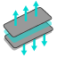
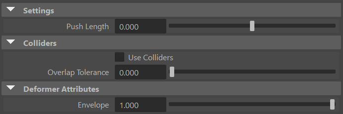
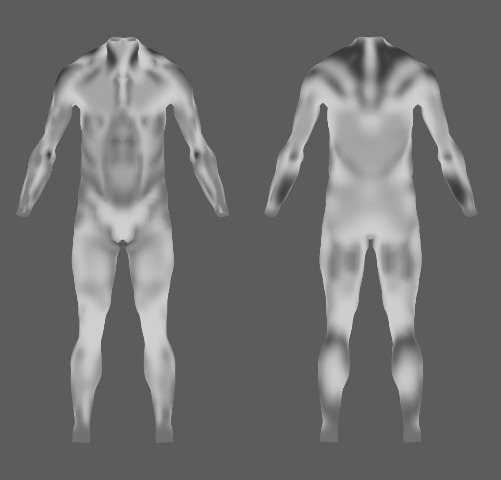

# AdnPush

AdnPush is a Maya deformer designed to push a surface along the direction of its normals. This deformation can be applied outwards (i.e., the surface bulges and gains volume) or inwards (i.e., the surface shrinks and loses volume). Optional collider meshes can limit the displacement and prevent the pushed surface from passing through surrounding geometry. This deformer is useful for refining meshes by increasing or decreasing their volume, as well as for modeling purposes. For example, a common use case is generating internal fascia geometry from skin geometry. Check [this section](../simple_setup#adnpush) to see a simple setup of this.

## How To Use

The AdnPush deformer is easy to create and configure in Maya. It requires a mesh to apply the node to and can optionally receive one or more collider meshes. Following the example mentioned above, the input mesh would be the skin geometry at rest, while muscles or other internal tissues could be used as colliders.

1. Select any collider meshes first, then select the mesh on which to apply the deformer last. Selecting colliders is optional.
2. Press {style="width:4%"} in the Adonis shelf or *Push* in the Adonis menu, under the Create Deformers section.
3. A message in the terminal will notify that AdnPush has been created properly.
4. Modify the value of the *Push Length* parameter to see the result of the push deformation.
5. If colliders were provided, the option *Use Colliders* will be enabled.

When colliders are enabled, each vertex is displaced until its push path hits a collider. If the path hits multiple colliders, the displacement stops at the closest hit.

## Attributes

### Settings
| Name | Type | Default | Animatable | Description |
| :--- | :--- | :------ | :--------- | :---------- |
| **Push Length** | Float | 0.0 | ✓ | Length of the push to apply. A positive value pushes the vertices along the direction of the normal, while a negative value pushes them in the opposite direction. Has a range of \[-1.0, 1.0\]. The upper and lower limits are soft; higher or lower values can be used. |

### Colliders
| Name | Type | Default | Animatable | Description |
| :--- | :--- | :------ | :--------- | :---------- |
| **Use Colliders** | Boolean | False | ✓ | Toggles the use of colliders. If enabled, the provided colliders are processed; if disabled, they are ignored. |
| **Overlap Tolerance** | Float | 0.0 | ✓ | Distance used to offset the input geometry along its vertex normals before raycasting against the colliders. Use a small value to tolerate initial overlaps with the colliders; 0.0 otherwise. Has a range of \[0.0, 1.0\]. The upper limit is soft; higher values can be used. |

### Deformer Attributes
| Name | Type | Default | Animatable | Description |
| :--- | :--- | :------ | :--------- | :---------- |
| **Envelope** | Float | 1.0 | ✓ | Specifies the deformation scale factor. Has a range of \[0.0, 1.0\]. The upper and lower limits are soft, values can be set in a range of \[-2.0, 2.0\]|

### Connectable Attributes
| Name | Type | Default | Animatable | Description |
| :--- | :--- | :------ | :--------- | :---------- |
| **Collider World Mesh**   | Mesh   |          | ✓ | List of collider meshes (from a compound attribute) used to limit the displacement of the pushed surface. |
| **Collider World Matrix** | Matrix | Identity | ✓ | List of collider world matrices (from a compound attribute) used to evaluate the collisions in the right space. |

## Attribute Editor Template

<figure markdown>
  
  <figcaption><b>Figure 1</b>: AdnPush Attribute Editor.</figcaption>
</figure>

## Colliders

Collider meshes can be connected when creating AdnPush or edited afterward. Colliders must be mesh objects. Duplicate colliders and the mesh receiving AdnPush cannot be added to the collider list.

- **Add colliders**:
    1. Select one or more collider meshes to add.
    2. Select the mesh with the AdnPush deformer last.
    3. In the Adonis menu, under the *Edit* section, go to *Deformers* > *Push* > *Add Colliders*.
- **Remove colliders**:
    1. Select one or more connected collider meshes to remove.
    2. Select the mesh with the AdnPush deformer last.
    3. In the Adonis menu, under the *Edit* section, go to *Deformers* > *Push* > *Remove Colliders*.

Adding colliders after creating AdnPush does not enable collision processing automatically. Enable *Use Colliders* in the Attribute Editor to make AdnPush stop vertex displacement at the closest collider hit.

## Paintable Weights

To provide more control, the AdnPush deformer includes two paintable attributes. The Maya paint tool must be used to paint those parameters to ensure that the values satisfy the deformation needs.

| Name | Default | Description |
| :--- | :------ | :---------- |
| **Push Multiplier** | 1.0 | Weight used to multiply the global Push Length to determine the amount of adjustment applied at each vertex. |
| **Weights**         | 1.0 | Maya standard weights map used to control the influence of the deformer at each vertex. |

<figure markdown>
  
  <figcaption><b>Figure 2</b>: Example of Push Multiplier map of AdnPush deformer applied to the skin layer of a biped to obtain the fascia geometry. Left: front view. Right: back view.</figcaption>
</figure>
