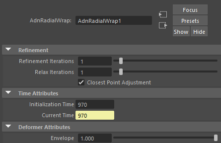

# AdnRadialWrap

AdnRadialWrap is a Maya deformer that reshapes and reposes an input geometry using pairs of corresponding landmarks.

The deformation is driven by two sets of landmarks: one describing locations on the input geometry and another describing the desired locations on the goal geometries. By establishing these correspondences, AdnRadialWrap computes a smooth deformation that transforms the input geometry toward the shape defined by the corresponding goal landmarks.

To further improve the result, the deformation can be refined using one or more goal geometries. During this process, the geometry is progressively adjusted and fitted to the goal surfaces, helping produce smoother and more accurate results while preserving the overall shape defined by the landmark correspondences.

AdnRadialWrap does not require topological correspondence between the input and goal geometries. This makes it particularly useful for character reshaping, anatomy transfer, pose transfer, and fitting operations between related but structurally different meshes.

Landmarks are represented using [AdnPointLocator](../utils/locators#adnpointlocator) nodes. These are specialized Adonis nodes designed specifically to define landmark positions and should be used instead of regular Maya transforms or locators. The recommended workflow for creating landmarks, establishing correspondences, and creating the deformer is through the [Landmark Tool](../tools/landmark_tool.md), which automates and simplifies the setup process.

## How To Use

The AdnRadialWrap is easy to create and configure in Maya. It requires the mesh to apply the deformation onto and the goal meshes.

1. Select the goal meshes and then the mesh on which to apply the deformer.
2. Press *Radial Wrap* {style="width:4%"} in the Adonis menu, under the Create Deformers section.
3. A message in the terminal will notify that AdnRadialWrap has been created properly. Check the [Attributes](radial_wrap#attributes) section to customize its configuration.

> [!NOTE]
> - AdnRadialWrap requires at least four pairs of corresponding landmarks to produce a deformation.
> - Once the deformer has been created by following the previous steps, landmarks can be created and automatically connected to the AdnRadialWrap by using the Landmark Tool.
> - Alternatively, the Landmark Tool may also be used to create the AdnRadialWrap deformer directly, allowing the entire setup to be performed from a single workflow.
> - For more information about the Landmark Tool, refer to this [page](../tools/landmark_tool.md).

## Attributes

### Refinement
| Name | Type | Default | Animatable | Description |
| :--- | :--- | :------ | :--------- | :---------- |
| **Refinement Iterations**    | Integer | 1    | ✓ | Number of iterations for the refinement process. Higher values may produce a better quality result at the cost of performance. Has a range of \[1, 20\]. The upper limit is soft, higher values can be used. |
| **Relax Iterations**         | Integer | 1    | ✓ | Number of relaxation iterations performed for each refinement iteration. Higher values may produce a better quality result at the cost of performance. Has a range of \[1, 20\]. The upper limit is soft, higher values can be used. |
| **Closest Point Adjustment** | Boolean | True | ✓ | Toggles the closest point adjustment performed at the end of each refinement iteration. |

### Time Attributes
| Name | Type | Default | Animatable | Description |
| :--- | :--- | :------ | :--------- | :---------- |
| **Initialization Time** | Time | *Current frame* | ✗ | Sets the frame at which the deformer will be initialized. |
| **Current Time**        | Time | *Current frame* | ✓ | Current playback frame. |

### Deformer Attributes
| Name | Type | Default | Animatable | Description |
| :--- | :--- | :------ | :--------- | :---------- |
| **Envelope** | Float | 1.0 | ✓ | Specifies the deformation scale factor. Has a range of \[0.0, 1.0\]. The upper and lower limits are soft, values can be set in a range of \[-2.0, 2.0\]. |

## Attribute Editor Template

<figure markdown>
  
  <figcaption><b>Figure 1</b>: AdnRadialWrap Attribute Editor.</figcaption>
</figure>

## Paintable Weights

The Maya paint tool must be used to paint the *Weights* map to ensure that the values satisfy the deformation needs.

| Name | Default | Description |
| :--- | :------ | :---------- |
| **Weights** | 1.0 | Maya standard weights map used to control the influence of the deformer at each vertex. |
