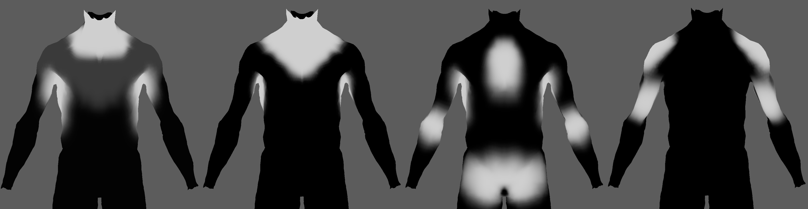

# AdnRelax

AdnRelax is a Maya deformer designed to smooth creases and correct over-compression or over-stretching on geometry surfaces. This deformer can help refining different types of meshes, like the fascia and skin resulting from the simulation by computing an iterative algorithm that combines smoothing, relaxation, and volume corrections. The AdnRelax deformer applies smoothing and relaxation in each iteration, while the volume correction (i.e. a push in and push out adjustment in the direction of the point normals) is applied during the final iteration.

### How to use

The AdnRelax deformer is easy to create and configure in Maya. It only requires the mesh to apply the relaxation onto. Typically, this mesh would be the simulated fascia or skin.

1. Select the mesh on which to apply the deformer.
2. Press {style="width:4%"} in the AdonisFX shelf or *Relax* in the AdonisFX menu, under the Create Deformers section.
3. A message in the terminal will notify that AdnRelax has been created properly. Increase the number of iterations to see the effect of the deformation. Check the [Attributes](relax#attributes) section to customize their configuration.

## Attributes

### Settings
| Name | Type | Default | Animatable | Description |
| :--- | :--- | :------ | :--------- | :---------- |
| **Iterations**         | Integer | 0      | X | Number of iterations of the relaxation algorithm. Greater values mean greater computational cost. Has a range of \[1, 10\]. The upper limit is soft, higher values can be used. |
| **Pin**                | Boolean | False  | ✓ | Flag to pin the vertices on the boundaries. |
| **Smooth**             | Float   | 0.5    | ✓ | Amount of smoothing to apply. Has a range of \[0.0, 1.0\]. |
| **Relax**              | Float   | 0.5    | ✓ | Amount of relaxation to apply. Has a range of \[0.0, 1.0\]. |
| **Push In Ratio**      | Float   | 0.0    | ✓ | Amount of correction applied by the push in adjustment. Has a range of \[0.0, 2.0\]. The upper limit is soft, higher values can be used. |
| **Push In Threshold**  | Float   | -1.0   | ✓ | Maximum correction applied by the push in adjustment. The threshold will be ignored if its value is 0.0 or less. Has a range of \[-1.0, 2.0\]. The upper limit is soft, higher values can be used. |
| **Push Out Ratio**     | Float   | 0.0    | ✓ | Amount of correction applied by the push out adjustment. Has a range of \[0.0, 2.0\]. The upper limit is soft, higher values can be used. |
| **Push Out Threshold** | Float   | -1.0   | ✓ | Maximum correction applied by the push out adjustment.. The threshold will be ignored if its value is 0.0 or less. Has a range of \[-1.0, 2.0\]. The upper limit is soft, higher values can be used. |

### Deformer Attributes
| Name | Type | Default | Animatable | Description |
| :--- | :--- | :------ | :--------- | :---------- |
| **Envelope** | Float | 1.0 | ✓ | Specifies the deformation scale factor. Has a range of \[0.0, 1.0\]. The upper and lower limits are soft, values can be set in a range of \[-2.0, 2.0\]|

## Attribute Editor Template

<figure markdown>
  
  <figcaption><b>Figure 1</b>: AdnRelax Attribute Editor.</figcaption>
</figure>

## Paintable Weights

In order to provide more control, some key parameters of the AdnRelax deformer are exposed as paintable attributes. The Maya paint tool must be used to paint those parameters to ensure that the values satisfy the solver requirements.

| Name | Default | Description |
| :--- | :------ | :---------- |
| **Push In Ratio Multiplier**  | 1.0 | Weight to multiply the push in adjustment applied to the geometry surface. |
| **Push Out Ratio Multiplier** | 1.0 | Weight to multiply the push out adjustment applied to the geometry surface. |
| **Smooth Multiplier**         | 1.0 | Weight to multiply the smoothing applied to the geometry surface. |
| **Relax Multiplier**          | 1.0 | Weight to multiply the relaxation applied to the geometry surface.  |

<figure markdown>
  
  <figcaption><b>Figure 2</b>: Example of paintable weights of AdnRelax deformer applied to the fascia layer of a biped. From left to right: smooth multiplier, relax multiplier, push in ratio multiplier, push out ratio multiplier.</figcaption>
</figure>
