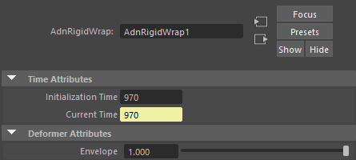

# AdnRigidWrap

AdnRigidWrap is a Maya deformer that transfers deformations from one or more target geometries to an input geometry using a closest-surface attachment model.

For every point of the deformed geometry, the deformer searches for the closest point on the closest surface of the connected target geometries. Each input point is attached to its corresponding target surface point, preserving its relative position as the target geometry deforms.

AdnRigidWrap is particularly useful for attaching secondary geometry to deforming surfaces, transferring deformations between unrelated meshes, and creating rigid surface-following deformation setups. It is also a core component of the [AdnTransfer Tool](../tools/transfer_tool), enabling the transfer of fascia and skin anatomy between character models.

## How To Use

The AdnRigidWrap is easy to create and configure in Maya. It requires the mesh to apply the deformation onto and the target(s) that will drive the deformation.

1. Select targets and then the mesh on which to apply the deformer.
2. Press *Rigid Wrap* {style="width:4%"} in the Adonis menu, under the Create Deformers section.
3. A message in the terminal will notify that AdnRigidWrap has been created properly. Check the [Attributes](rigid_wrap#attributes) section to customize their configuration.

## Attributes

### Time Attributes
| Name | Type | Default | Animatable | Description |
| :--- | :--- | :------ | :--------- | :---------- |
| **Initialization Time** | Time | *Current frame* | ✗ | Sets the frame at which the deformer will be initialized. |
| **Current Time**        | Time | *Current frame* | ✓ | Current playback frame. |

### Deformer Attributes
| Name | Type | Default | Animatable | Description |
| :--- | :--- | :------ | :--------- | :---------- |
| **Envelope** | Float | 1.0 | ✓ | Specifies the deformation scale factor. Has a range of \[0.0, 1.0\]. The upper and lower limits are soft, values can be set in a range of \[-2.0, 2.0\]|

## Attribute Editor Template

<figure markdown>
  
  <figcaption><b>Figure 1</b>: AdnRigidWrap Attribute Editor.</figcaption>
</figure>

## Paintable Weights

The Maya paint tool must be used to paint the *Weights* map to ensure that the values satisfy the deformation needs.

| Name | Default | Description |
| :--- | :------ | :---------- |
| **Weights** | 1.0 | Maya standard weights map used to control the influence of the deformer at each vertex. |
