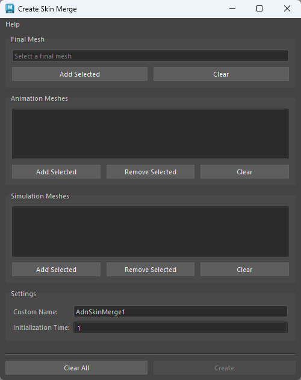
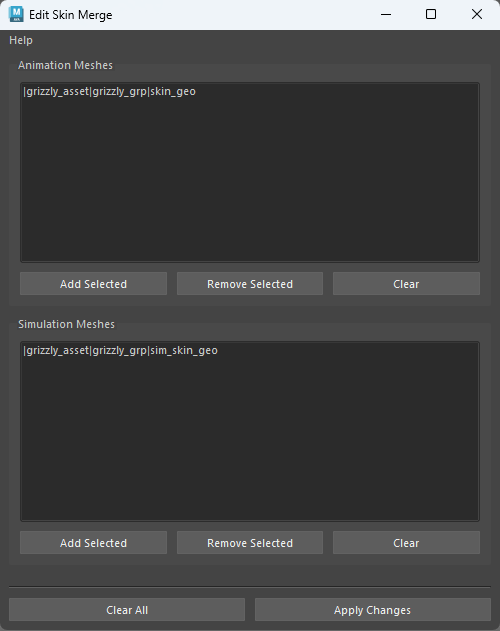
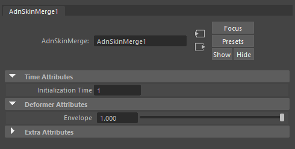

# AdnSkinMerge

AdnSkinMerge is a Maya deformer to blend animation and simulation together. It allows for the merging of several animation and simulation meshes into a single final mesh.

The influence simulation or animation meshes will have on the final mesh can be freely painted and modified by painting a blend weights map.

### How To Use

AdnSkinMerge makes use of its own User Interface to create and modify the deformer.

To create an AdnSkinMerge deformer within a Maya scene, the following inputs must be provided:

  - **Final Mesh (F)**: Mesh to apply the merge results.
  - **Animation Mesh List (Al)**: Mesh(es) to drive the simulation skin.
  - **Simulation Mesh List (Sl)**: Mesh(es) with either an AdnSkin deformer applied or with the results from the skin simulation applied.

The process to create an AdnSkinMerge deformer is:

1. Press {style="width:4%"} in the AdonisFX shelf or *Skin Merge* in the AdonisFX menu, under the *Deformers* submenu in the *Create* section to open the following UI.

<figure markdown>
   
  <figcaption><b>Figure 1</b>: Create Skin Merge UI.</figcaption>
</figure>

2. In the UI select the final mesh in the scene and press the *Add Selected* button in the *Final Mesh* section.

3. Add the animation and simulation meshes taking into consideration the following requirements:
    - At least one mesh must be added in each field.
    - To add meshes to any list, select the meshes in the scene and click the respective *Add Selected* button.
    - Adding the same mesh twice to a list is not supported.
    - Adding the same mesh as a Simulation Mesh and as an Animation Mesh is not advised.
    - If you wish to remove a single element from the list, select it in the Skin Merge UI and press the Remove Selected button.
    - You may also clear any list fully by pressing the respective Clear button.

4. Set a custom name to the deformer and specify the initialization time.

5. Press the *Create* button and a message box will notify you that AdnSkinMerge has been created properly. The final mesh will follow the animation mesh inputs by default.

6. To modulate the influence of the simulation mesh inputs, use the maya paintable context and customize the blend weights map.

Once the AdnSkinMerge deformer is created, to modify its input meshes (animation mesh list, simulation mesh list or both) the follow process can be followed:

1. Go to *Deformers > Skin Merge* in the AdonisFX menu, under the *Edit* section.

2. The following UI will get displayed. Here you will see listed the current animation and simulation meshes the deformer has connected. From this UI you may freely add or remove from either list. Note that at least one element must be present in each list to be able to apply the changes. 

<figure markdown>
   
  <figcaption><b>Figure 2</b>: Edit Skin Merge UI.</figcaption>
</figure>

3. Once everything has been set up, press the *Apply changes* button. A message box will notify you that AdnSkinMerge has been edited properly.

## Attributes

### Time Attributes
| Name | Type | Default | Animatable | Description |
| :--- | :--- | :------ | :--------- | :---------- |
| **Initialization Time** | Time  | *Current frame* | ✗ | Sets the frame at which the deformer will be initialized. |
| **Envelope**            | Float | 1.0             | ✓ | Specifies the deformation scale factor. Has a range of \[0.0, 1.0\]. The upper and lower limits are soft, values can be set in a range of \[-2.0, 2.0\]|

## Attribute Editor Template

<figure markdown>
  
  <figcaption><b>Figure 3</b>: AdnSkinMerge Attribute Editor.</figcaption>
</figure>

## Paintable Weights
| Name | Default | Description |
| :--- | :------ | :---------- |
| **Blend**       | 0.0 | Weight to modulate the influence the simulation meshes have over the animation meshes. Higher values will add more influence of the simulation meshes over the final mesh.<ul><li>*Tip*: Paint only over areas where animation and simulation meshes overlap.</li></ul> |
| **Weight**      | 1.0 | Default weight attribute to determine the influence of the deformer over the input geometry. |

<figure markdown>
  
  <figcaption><b>Figure 4</b>: Example of Blend weights painted.</figcaption>
</figure>
