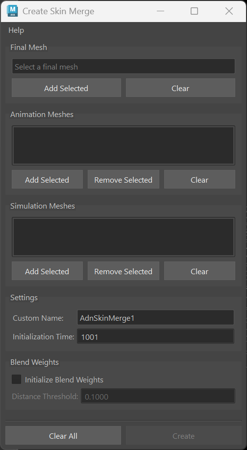
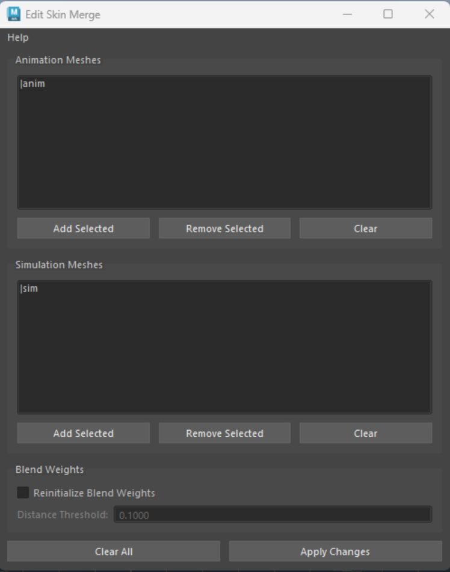
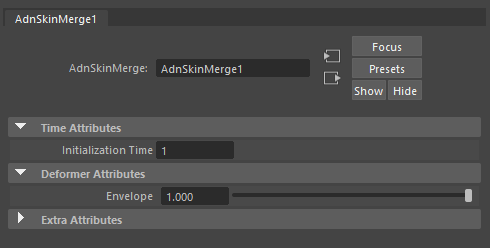
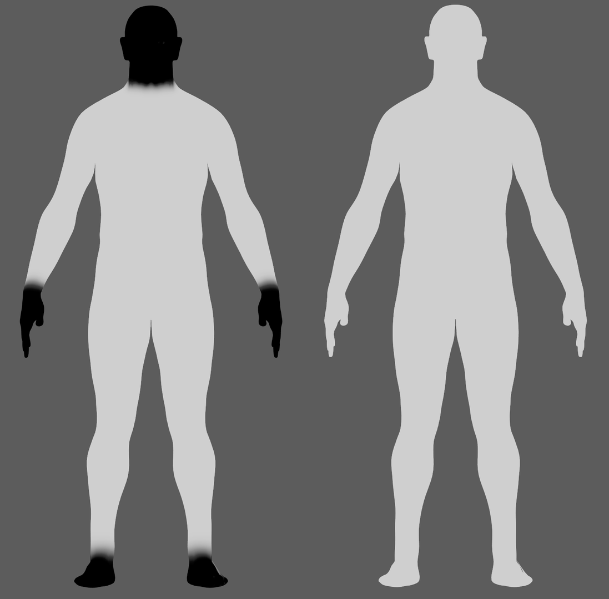

# AdnSkinMerge

AdnSkinMerge is a Maya deformer to blend animation and simulation together. It allows for the merging of several animation and simulation meshes into a single final mesh.

The influence simulation or animation meshes will have on the final mesh is controlled by a blend weights map. This map can be initialized automatically from the proximity between the final mesh and the simulation meshes, and then refined using Maya's paintable context.

### How To Use

AdnSkinMerge makes use of its own User Interface to create and modify the deformer.

To create an AdnSkinMerge deformer within a Maya scene, the following inputs must be provided:

  - **Final Mesh (F)**: Mesh to apply the merge results.
  - **Animation Mesh List (Al)**: Mesh(es) to drive the simulation skin.
  - **Simulation Mesh List (Sl)**: Mesh(es) with either an AdnSkin deformer applied or with the results from the skin simulation applied.

The process to create an AdnSkinMerge deformer is:

1. Press {style="width:4%"} in the Adonis shelf or *Skin Merge* in the Adonis menu, under the *Deformers* submenu in the *Create* section to open the following UI.

<figure markdown>
   
  <figcaption><b>Figure 1</b>: Create Skin Merge UI.</figcaption>
</figure>

2. In the UI select the final mesh in the scene and press the *Add Selected* button in the *Final Mesh* section.

3. Add the animation and simulation meshes taking into consideration the following requirements:
    - At least one mesh must be added in each field.
    - To add meshes to any list, select the meshes in the scene and click the respective *Add Selected* button.
    - Adding the same mesh twice to a list is not supported.
    - Adding the same mesh as a Simulation Mesh and as an Animation Mesh is not advised.
    - If you wish to remove a single element from the list, select it in the Skin Merge UI and press the Remove Selected button.
    - You may also clear any list fully by pressing the respective Clear button.

4. Set a custom name for the deformer and specify the initialization time.

5. In the *Blend Weights* section, enable blend weight initialization to generate the map automatically and set the distance threshold. Final-mesh vertices within this distance of any simulation mesh receive simulation influence; vertices outside the threshold keep their animation influence.

6. Press the *Create* button. A message in the terminal will confirm that AdnSkinMerge has been created. If blend weight initialization is disabled, the final mesh follows the animation mesh inputs by default.

7. To refine the influence of the simulation mesh inputs, use Maya's paintable context to customize the blend weights map.

Once the AdnSkinMerge deformer is created, to modify its input meshes (animation mesh list, simulation mesh list or both) do the following:

1. Go to *Deformers > Skin Merge* in the Adonis menu, under the *Edit* section.

2. The following UI will be displayed. It lists the animation and simulation meshes currently connected to the deformer. From this UI, you may add or remove meshes from either list. At least one element must be present in each list to apply the changes.

<figure markdown>
   
  <figcaption><b>Figure 2</b>: Edit Skin Merge UI.</figcaption>
</figure>

3. To regenerate the blend weights after changing the mesh lists, enable blend weight reinitialization in the *Blend Weights* section and set the distance threshold.

4. Press the *Apply changes* button. A message in the terminal will confirm that AdnSkinMerge has been edited.

## Automatic Blend Weight Initialization

Automatic initialization computes the *Blend* map from the distance between each vertex of the final mesh and the simulation meshes. Vertices within the configured threshold are assigned simulation influence, while vertices outside it remain driven by the animation meshes.

The option is available both when creating an AdnSkinMerge deformer and when editing an existing one. In edit mode, reinitialization replaces the current blend weights.

If no final-mesh vertices are found within the threshold, no simulation region can be initialized and a warning is displayed. Increase the threshold or verify the positions of the final and simulation meshes, then initialize the map again.

> [!NOTE]
> - In v2.0 of Adonis a new *currentTime* plug has been added to the node which will be automatically connected to the *time1.outTime* plug in Maya.
> - The *Upgrade v1.x To v2.x* or the *Reconnect Current Time* utils in the Adonis menu can be used to reconnect the time plug in case it is missing in the setup.

## Attributes

### Time Attributes
| Name | Type | Default | Animatable | Description |
| :--- | :--- | :------ | :--------- | :---------- |
| **Initialization Time** | Time  | *Current frame* | ✗ | Sets the frame at which the deformer will be initialized. |
| **Envelope**            | Float | 1.0             | ✓ | Specifies the deformation scale factor. Has a range of \[0.0, 1.0\]. The upper and lower limits are soft, values can be set in a range of \[-2.0, 2.0\]|

## Attribute Editor Template

<figure markdown>
  
  <figcaption><b>Figure 3</b>: AdnSkinMerge Attribute Editor.</figcaption>
</figure>

## Paintable Weights
| Name | Default | Description |
| :--- | :------ | :---------- |
| **Blend**       | 0.0 | Weight to modulate the influence the simulation meshes have over the animation meshes. Higher values will add more influence of the simulation meshes over the final mesh.<ul><li>*Tip*: Paint only over areas where animation and simulation meshes overlap.</li></ul> |
| **Weight**      | 1.0 | Default weight attribute to determine the influence of the deformer over the input geometry. |

<figure markdown>
  
  <figcaption><b>Figure 4</b>: Example of blend map (left) and weights map (right) in AdnSkinMerge.</figcaption>
</figure>
