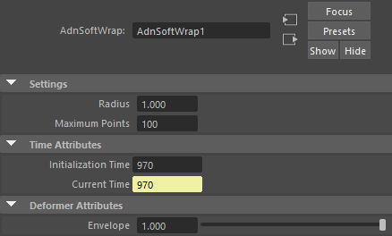

# AdnSoftWrap

AdnSoftWrap is a Maya deformer that transfers deformations from one or more target geometries to an input geometry using a proximity-based influence model.

For every point of the deformed geometry, the deformer searches for nearby points belonging to the connected target geometries. All target points found within a user-defined radius are considered as potential influences, up to a maximum number of neighboring points. The resulting deformation is then computed from the contribution of those neighboring targets points and applied to the affected point.

This deformer is particularly useful for transferring complex deformations between unrelated meshes, driving secondary geometry, or creating flexible deformation setups without requiring topological correspondence.

## How to use

The AdnSoftWrap is easy to create and configure in Maya. It requires the mesh to apply the deformation onto and the target(s) that will drive the deformation.

1. Select targets and then the mesh on which to apply the deformer.
2. Press {style="width:4%"} in the Adonis shelf or *Soft Wrap* in the Adonis menu, under the Create Deformers section.
3. A message in the terminal will notify that AdnSoftWrap has been created properly. Increase the number of iterations to see the effect of the deformation. Check the [Attributes](soft_wrap#attributes) section to customize their configuration.

## Attributes

### Settings
| Name | Type | Default | Animatable | Description |
| :--- | :--- | :------ | :--------- | :---------- |
| **Radius**         | Time | 1.0 | ✗ | Defines the maximum distance used to search for influencing target points. Only target points located within this radius can contribute to the deformation of a given point. Larger values increase the area of influence and produce smoother results at the cost of performance.|
| **Maximum Points** | Time | 100 | ✗ | Defines the maximum number of neighboring target points that can influence a point of the deformed geometry. Larger values will produce smoother results at the cost of performance.|

### Time Attributes
| Name | Type | Default | Animatable | Description |
| :--- | :--- | :------ | :--------- | :---------- |
| **Initialization Time** | Time | *Current frame* | ✗ | Sets the frame at which the deformer will be initialized. |
| **Current Time**        | Time | *Current frame* | ✓ | Current playback frame. |

### Deformer Attributes
| Name | Type | Default | Animatable | Description |
| :--- | :--- | :------ | :--------- | :---------- |
| **Envelope** | Float | 1.0 | ✓ | Specifies the deformation scale factor. Has a range of \[0.0, 1.0\]. The upper and lower limits are soft, values can be set in a range of \[-2.0, 2.0\]|

## Attribute Editor Template

<figure markdown>
  
  <figcaption><b>Figure 1</b>: AdnSoftWrap Attribute Editor.</figcaption>
</figure>

## Paintable Weights

The Maya paint tool must be used to paint the *Weights* map to ensure that the values satisfy the deformation needs.

| Name | Default | Description |
| :--- | :------ | :---------- |
| **Weights** | 1.0 | Maya standard weights map used to control the influence of the deformer at each vertex. |
