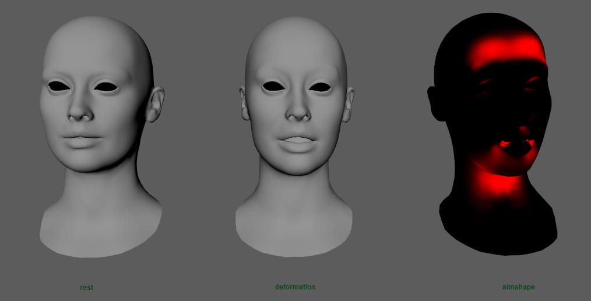

# AdnEdgeEvaluator

The AdnEdgeEvaluator node is a dependency node that computes deformation changes in edges. Based on two compatible input meshes it will output a compression map of the edges.

## How To Use

This node requires the following inputs to be provided:

  - **Rest Mesh (R)**: Mesh with no deformation or animation.
  - **Deform Mesh (D)**: Mesh with deformation.

> [!NOTE]
> All input geometries must have the same number of vertices and edges.

To create this node, follow these steps:

1. Select the deform mesh, then the rest mesh.
2. Go to the AdonisFX menu > Create Nodes > *Edge Evaluator*.

The evaluator node can be used to drive the activations of an AdnSimshape deformer by connecting the output map of this node to the activations plug of AdnSimshape deformer. The *Plug Values* mode (see this [section](simshape#muscle-activations)) must be enabled.

<figure markdown>
  
  <figcaption><b>Figure 1</b>: From left to right: rest mesh, deform mesh and simulated mesh with AdnSimshape deformer receiving the compression map from an AdnEdgeEvaluator node to drive activations (activations debugger is enabled).</figcaption>
</figure>

A menu option is provided to recreate these steps easily:

1. Select the Edge Evaluator Node, then the AdnSimshape deformer node.
2. Go to the AdonisFX Menu > Edit Simshape > *Connect Activations Plug*.

In order to disconnect the plug, repeat the selection and instead of pressing *Connect Activations Plug* press *Disconnect Activations Plug*.

## Attributes

### Time Attributes
| Name | Type | Default | Animatable | Description |
| :--- | :--- | :------ | :--------- | :---------- |
| **Initialization Time** | Time | *Current frame* | ✗ | Sets the frame at which the data will be initialized. |

### Compression Remap
| Name | Type | Default | Animatable | Description |
| :--- | :--- | :------ | :--------- | :---------- |
| **Compression Remap** | Ramp Attribute |  | ✓ | Curve to remap the output compression map. |

## Attribute Editor Template

<figure markdown>
  
  <figcaption><b>Figure 2</b>: Edge Evaluator Attribute Editor</figcaption>
</figure>
