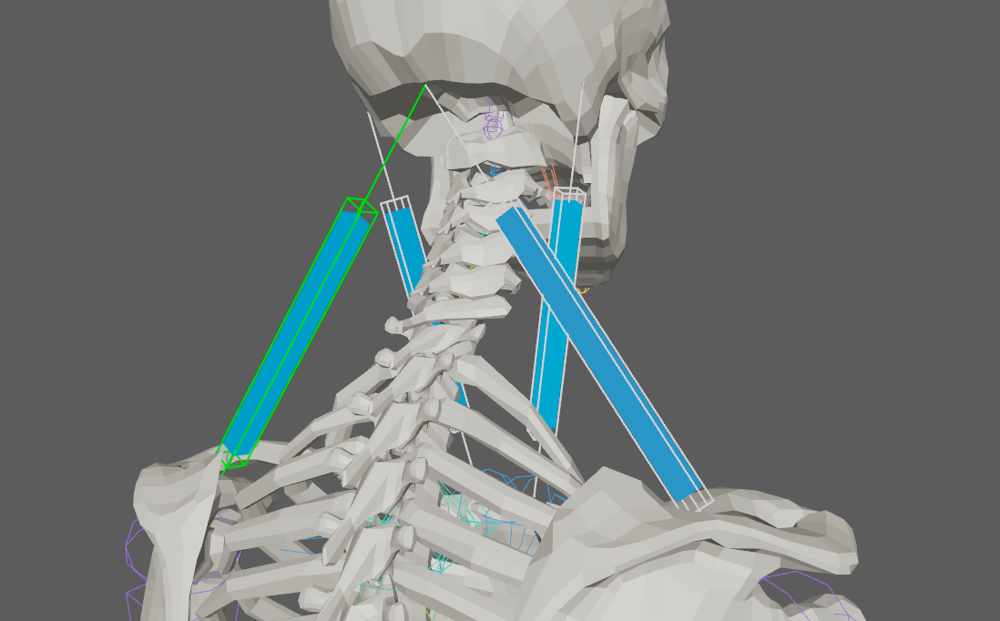
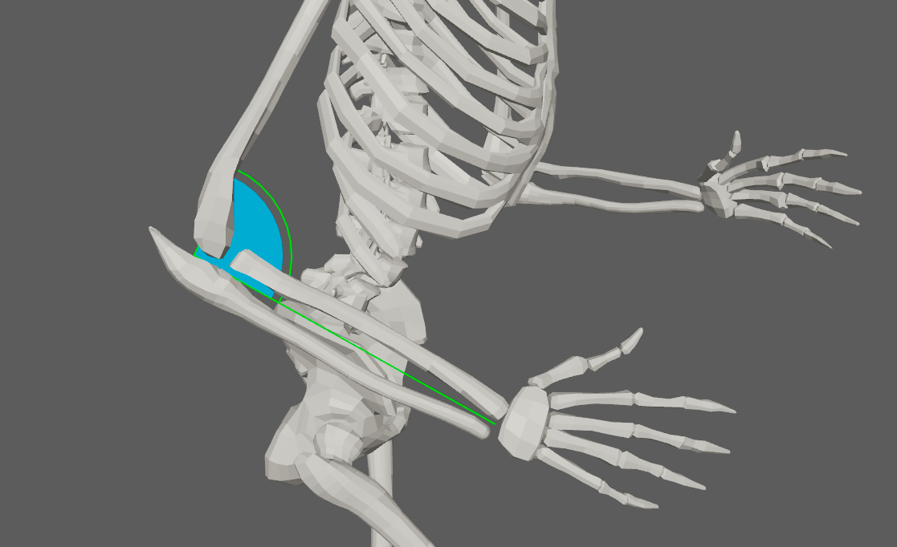

# Locators

AdnLocators are visualizers that are meant for visualizing and measuring transform nodes which provide valuable input information for setting up the deformers. They can visualize information representing position, distance, or angle as well as velocities or accelerations represented via coloring when used in combination with AdnSensors.

## AdnLocatorPosition

AdnLocatorPosition is the locator for visualizing the position of a single transform node. When connected to its corresponding AdnSensorPosition, velocity or acceleration can be visualized with a coloring code blue-to-red.

### How To Use

An AdnLocatorPosition will only visualize the information of the transform node to which it is applied. To be able to read, process and visualize information like the velocity or acceleration an [AdnSensorPosition](sensors#adnsensorposition) has to be applied.

<figure markdown>
  
  <figcaption><b>Figure 1</b>: AdnLocatorPosition used in a human model.</figcaption>
</figure>

Only one transform will be required to create the AdnLocatorPosition. The creation process is the following:

 1. Select a transform node in the scene.
 2. Press the {style="width:4%"} button in the AdonisFX shelf or press *Position* in the AdonisFX menu, under the *Locators* submenu. If the shelf button is double-clicked or the option box in the menu is selected a window will be displayed where a custom name and initial attribute values can be set.
 3. The AdnLocatorPosition is created and ready to be used.

### Attributes

#### Input
| Name | Type | Default | Animatable | Description |
| :--- | :--- | :------ | :--------- | :---------- |
| **Position** | Float3 | {0.0, 0.0, 0.0} | ✓ | Current transform node position. |

#### Activation Values
| Name | Type | Default | Animatable | Description |
| :--- | :--- | :------ | :--------- | :---------- |
| **Velocity**     | Float | 0.0 | ✓ | Magnitude of the velocity of the transform node. |
| **Acceleration** | Float | 0.0 | ✓ | Magnitude of the acceleration of the transform node. |

#### Draw
| Name | Type | Default | Animatable | Description |
| :--- | :--- | :------ | :--------- | :---------- |
| **Scale**       | Float      | 1.0      | ✓ | Sets the scaling factor applied to the position locator visualizer. Has a range of \[0.0, 10.0\]. The upper limit is soft, higher values can be used. |
| **Draw Output** | Enumerator | Velocity | ✓ | Selects the property of the locator to be visualized on the locator visualizer.<ul><li>**Velocity:** Color the visualizer of the locator according to the input velocity activation.</li><li>**Acceleration:** Color the visualizer of the locator according to the input acceleration activation.</li></ul> |

## AdnLocatorDistance

AdnLocatorDistance is the locator for visualizing the distance between two transform nodes. When connected to its corresponding AdnSensorDistance, distance, velocity or acceleration can be visualized with a coloring code blue-to-red.

### How To Use

An AdnLocatorDistance will only visualize the information of the distance between two transform nodes to which it is applied. To be able to read, process and visualize information like the distance magnitude, velocity or acceleration an [AdnSensorDistance](sensors#adnsensordistance) has to be applied.

<figure markdown>
  
  <figcaption><b>Figure 2</b>: AdnLocatorDistance used in a human model.</figcaption>
</figure>

Two transform nodes will be required to create an AdnLocatorDistance representing each extremity. The creation process is the following:

 1. Select two transform nodes in the scene.
 2. Press the {style="width:4%"} button in the AdonisFX shelf or press *Distance* in the AdonisFX menu, under the *Locators* submenu. If the shelf button is double-clicked or the option box in the menu is selected a window will be displayed where a custom name and initial attribute values can be set.
 3. The AdnLocatorDistance is created and ready to be used.

### Attributes

#### Input
| Name | Type | Default | Animatable | Description |
| :--- | :--- | :------ | :--------- | :---------- |
| **Start Position** | Float3 | {0.0, 0.0, 0.0} | ✓ | Start transform node position. |
| **End Position**   | Float3 | {0.0, 0.0, 0.0} | ✓ | End transform node position. |

#### Activation Values
| Name | Type | Default | Animatable | Description |
| :--- | :--- | :------ | :--------- | :---------- |
| **Distance**     | Float | 0.0 | ✓ | Magnitude of the distance between the transform nodes. |
| **Velocity**     | Float | 0.0 | ✓ | Magnitude of the velocity between the transform nodes. |
| **Acceleration** | Float | 0.0 | ✓ | Magnitude of the acceleration between the transform nodes. |

#### Draw
| Name | Type | Default | Animatable | Description |
| :--- | :--- | :------ | :--------- | :---------- |
| **Scale**       | Float      | 1.0      | ✓ | Sets the scaling factor applied to the distance locator visualizer. Has a range of \[0.0, 10.0\]. The upper limit is soft, higher values can be used. |
| **Draw Output** | Enumerator | Distance | ✓ | Selects the property of the locator to be visualized on the locator visualizer. <ul><li>**Distance:** Color the visualizer of the locator according to the input distance activation.</li><li>**Velocity:** Color the visualizer of the locator according to the input velocity activation.</li><li>**Acceleration:** Color the visualizer of the locator according to the input acceleration activation.</li></ul> |

## AdnLocatorRotation

AdnLocatorRotation is the locator for visualizing the angle between three transform nodes. When connected to its corresponding AdnSensorRotation, angle, angular velocity or angular acceleration can be visualized with a coloring code blue-to-red.

### How To Use

An AdnLocatorRotation will only visualize the information of the connections and angle between the three transform nodes. To be able to read, process and visualize information like the angle, angular velocity or angular acceleration an [AdnSensorRotation](sensors#adnsensorrotation) has to be applied.

<figure markdown>
  
  <figcaption><b>Figure 3</b>: AdnLocatorRotation locator used in a human model.</figcaption>
</figure>

Three transform nodes will be required to create the AdnLocatorRotation. The creation process is the following:

 1. Select three transform objects in the scene. The order in which the objects are selected is relevant, as the created angle will have the following arrangement:
    - First selected object: Start point of the angle.
    - Second selected object: Middle point of the angle.
    - Third selected object: End point of the angle.
 2. Press the {style="width:4%"} button in the AdonisFX shelf or press *Rotation* in the AdonisFX menu, under the *Locators* submenu. If the shelf button is double-clicked or the option box in the menu is selected a window will be displayed where a custom name and initial attribute values can be set.
 3. The AdnLocatorRotation is created and ready to be used.

### Attributes

#### Input
| Name | Type | Default | Animatable | Description |
| :--- | :--- | :------ | :--------- | :---------- |
| **Start Position** | Float3 | {0.0, 0.0, 0.0} | ✓ | Start transform node position. |
| **Mid Position**   | Float3 | {0.0, 0.0, 0.0} | ✓ | Mid transform node position. |
| **End Position**   | Float3 | {0.0, 0.0, 0.0} | ✓ | End transform node position. |

#### Activation Values
| Name | Type | Default | Animatable | Description |
| :--- | :--- | :------ | :--------- | :---------- |
| **Angle**        | Float | 0.0 | ✓ | Magnitude of the angle between the three transform nodes. |
| **Velocity**     | Float | 0.0 | ✓ | Magnitude of the angular velocity between the three transform nodes. |
| **Acceleration** | Float | 0.0 | ✓ | Magnitude of the angular acceleration between the three transform nodes. |

#### Draw
| Name | Type | Default | Animatable | Description |
| :--- | :--- | :------ | :--------- | :---------- |
| **Scale**       | Float      | 1.0   | ✓ | Sets the scaling factor applied to the rotation locator visualizer. Has a range of \[0.0, 10.0\]. The upper limit is soft, higher values can be used. |
| **Draw Output** | Enumerator | Angle | ✓ | Selects the property of the locator to be visualized on the locator visualizer.<ul><li>**Angle:** Color the visualizer of the locator according to the input angle activation.</li><li>**Velocity:** Color the visualizer of the locator according to the input velocity activation.</li><li>**Acceleration:** Color the visualizer of the locator according to the input acceleration activation.</li></ul> |

## AdnLocator

The AdnLocator is an native alternative to Maya locators. This locator can be used to visualize any kind of scene element with a transform node. For example they can be used as inputs to other AdonisFX locators presented in this page.

### How To Use

To create an AdnLocator just click on the {style="width:4%"} button in the AdonisFX shelf. The locator will be created at the origin of your scene.

<figure markdown>
  
  <figcaption><b>Figure 4</b>: AdnLocator used for distance constraints.</figcaption>
</figure>
