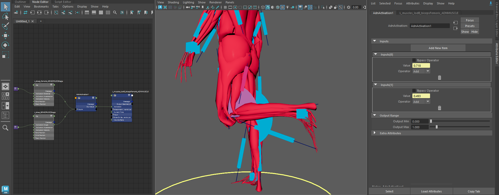
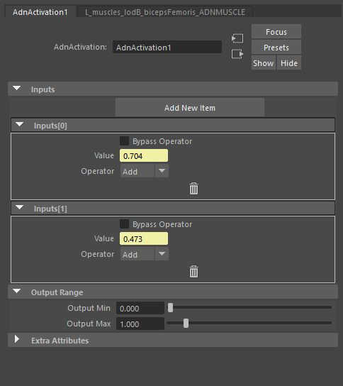

# AdnActivation

The AdnActivation node is a dependency node that allows operations on a set of input values for the computation of a final value that can be used to drive, for example, muscle activations. An example of its use case could be the merging of the output value of various sensors together to activate a muscle given multiple poses.

## How To Use

To create this node, follow these steps:

1. Open the Node Editor from Windows > Node Editor.
2. Press the Tab key, type *AdnActivation* and press Enter to create a new instance of this node.

Alternatively, press the option located in AdonisFX > Nodes > *Activation* to create a new AdnActivation node. Additional information about this option can be found in this [section](activation#advanced).

The activation node can now be used to override, add, subtract, multiply or divide the activations from different sources (sensors) into one final activation value.
For example, multiple distance sensors of a character can be merged together to produce different kinds of activations throughout the simulation.

<figure markdown>
  
  <figcaption><b>Figure 1</b>: Use case in which AdnActivation is created for merging two activations to drive a muscle's activation.</figcaption>
</figure>

To add new inputs to the AdnActivation node:

1. Go to the Attribute Editor and press *Add New Item*.
2. Set the desired *Operator*.
3. Type in a fixed value in *Value*, animate it or connect the plug with an AdonisFX sensor's output.

> [!NOTE]
> All operators will be evaluated from top to bottom (starting from index 0 and ending on the last index used).

## Operators

1. **Over (Override)**: Overrides the accumulated output activation value with Value. If the current accumulated activation value is 1.0 and Value is 2.0 then the new accumulated value will be 2.0.
2. **Add (Add)**: Adds the accumulated output activation value with Value. If the current accumulated activation value is 1.0 and Value is 2.0 then the new accumulated value will be 3.0.
3. **Sub (Subtract)**: Subtracts the accumulated output activation value with Value. If the current accumulated activation value is 1.0 and Value is 2.0 then the new accumulated value will be -1.0.
4. **Mult (Multiply)**: Multiplies the accumulated output activation value with Value. If the current accumulated activation value is 1.0 and Value is 2.0 then the new accumulated value will be 2.0.
5. **Div (Divide)**: Divides the accumulated output activation value with Value. If the current accumulated activation value is 1.0 and Value is 2.0 then the new accumulated value will be 0.5.

> [!NOTE]
> The final value can then be clamped using the output minimum and maximum sliders. For the example above this clamping has been disregarded.

## Example

<figure markdown>
  
  <figcaption><b>Figure 1</b>: Closeup use case in which AdnActivation is created for merging two activations to drive a muscle's activation.</figcaption>
</figure>

In the above setup we have the following characteristics:

1. One AdnSensorRotation.
2. One AdnSensorPosition.
3. One AdnActivation.
4. One AdnMuscle.
5. Two inputs added to AdnActivation.
6. Input 1 has an Over operator and is connected to the AdnSensorRotation.
7. Input 2 has an Add operator and is connected to the AdnSensorPosition.
8. The bypass option is unchecked for both inputs.
9. Out Value will be: AdnSensorRotation Activation + AdnSensorPosition Activation.

## Attributes

### Inputs Attributes
The *inputs* attribute is presented as an array of 3 attributes which can be found below.

| Name | Type | Default | Animatable | Description |
| :--- | :--- | :------ | :--------- | :---------- |
| **Bypass Operator** | Boolean | True            | ✓ | If enabled, it bypasses the current operator in the input list, which will not contribute to the final activation value. |
| **Value**           | Float   | 0.0             | ✓ | Activation value that will contribute, given the operator type, to the final activation. |
| **Operator**        | Enum    | 0 (Over)        | ✓ | Operator used to contribute to the final activation. This can be: (0) Over; (1) Add; (2) Sub; (3) Mult; (4) Divide. |

### Output Attributes
| Name | Type | Default | Animatable | Description |
| :--- | :--- | :------ | :--------- | :---------- |
| **Output Min** | Float | 0.0 | ✓ | Minimum supported output activation value. Has a range of \[0.0, 10.0\]. Lower and upper limit are soft, lower or higher values can be used. |
| **Output Max** | Float | 1.0 | ✓ | Maximum supported output activation value. Has a range of \[0.0, 10.0\]. Lower and upper limit are soft, lower or higher values can be used. |

## Attribute Editor Template

<figure markdown>
  
  <figcaption><b>Figure 3</b>: AdnActivation Attribute Editor.</figcaption>
</figure>

## Advanced

### Create AdnActivation

It is possible to create an AdnActivation node by using the utility provided in AdonisFX > Nodes > *Activation*. This utility will create a new AdnActivation node. If muscle deformers are provided in the selection, the new AdnActivation node will be connected to the activation plug of those deformers.

### Remove Inputs

Once an AdnActivation node is created, connected inputs can be removed by using the utility provided in AdonisFX > Activation > *Remove Inputs*.

- **Remove Inputs** by providing an AdnActivation node:
    1. Select the locators to remove from the AdnActivation node.
    2. Select the AdnActivation node.
    3. Press *Remove Inputs* in the AdonisFX menu from the Edit Activation submenu.
    4. Alternatively, if only the AdnActivation node is selected, when pressing *Remove Inputs*, all inputs will be removed.

- **Remove Inputs** by providing a muscle deformer:
    1. Select the locators to remove from the AdnActivation node.
    2. Select the mesh with a muscle deformer applied that is connected to an AdnActivation node.
    3. Press *Remove Inputs* in the AdonisFX menu from the Edit Activation submenu to remove the inputs from the AdnActivation node.
    4. Alternatively, if only the mesh with a muscle deformer applied is selected, when pressing *Remove Inputs*, all inputs will be removed from the AdnActivation node.

> [!NOTE]
> Removing inputs from an AdnActivation node with the *Remove Inputs* utility will not modify any existing connection between the AdnActivation node and the muscle deformer.
