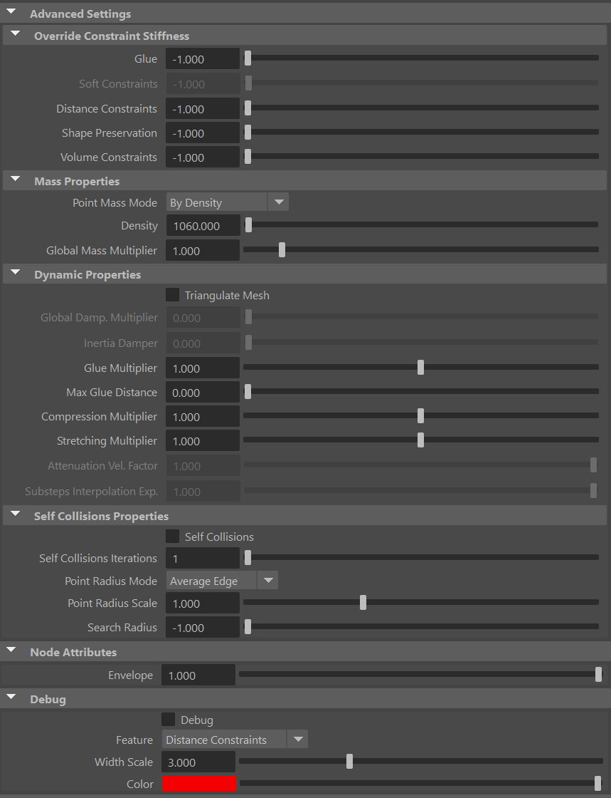
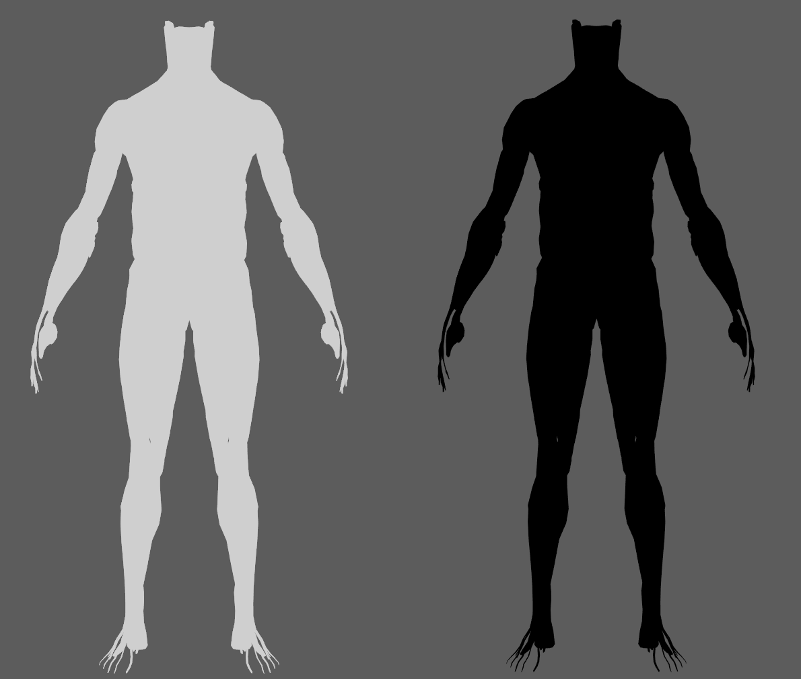

# AdnGlue

AdnGlue is a Maya node that can be used to attach multiple muscles together. This solver uses as input a series of simulated muscles and allows the user to define glue connections between those muscles by using a maximum glue distance value and painted maps.

There are two differentiated modes that this solver can run in:

- Static. The solver ingests the input geometry data at each simulated frame and computes the glue connections, as well as the distance, shape and volume constraints directly over the point positions of that input geometry data. There is no influence of the gravity nor inertia propagated from one frame to the next one.
- Dynamic. The solver behaves as a standard time-dependent simulation solver where the external forces (i.e. gravity) are integrated to introduce inertia to the system. The input geometries become a target geometry used by the solver to compute soft constraints against to. Glue, distance, shape and volume constraints are computed too. By default, the AdnGlue runs in static mode, but there is a boolean attribute exposed to allow switching to dynamic mode.

The maps required to control the AdnGlue solver can be painted using the standard Maya Paint tool.

### How To Use

The AdnGlue node can be applied to any set of geometries. For each geometry, their mesh at each frame is gathered and simulated to ensure the original distance between the neighboring geometries. This is achieved by creating attachments between each vertex of a geometry and the closest point on the surface of one of the other geometries (i.e. the closest one). More aspects are then computed to ensure that the simulated output preserves the original shape and edge-lengths of the simulated meshes. The output of the node is a mesh that combines all the input geometries together and adds the results of the solver.

To create an AdnGlue node within a Maya scene, the following inputs must be provided:

  - **Input Geometries** (IG): List of geometries to be simulated and attached together by the glue solver.

> [!NOTE]
> - Applying the AdnGlue node will automatically create a new mesh in your scene, which will display the results of the solver.
> - The naming of the new mesh created follows the format "AdnGlue1_GEO".
> - Deleting the AdnGlue node will not delete the created output mesh and vice versa.

The process to create an AdnGlue node is:

1. Select the Input Geometries.
2. Press {style="width:4%"} in the AdonisFX shelf or the Glue action in the AdonisFX’s Solvers menu, under the Create section. 
3. A message in the terminal will notify you that AdnGlue has been created properly, meaning that it is ready to simulate with default settings. Check the next section to customize their configuration.

> [!NOTE]
> - By default, no glue connections are created, resulting in the output geometry being identical to the input meshes combined.
> - Check the description of *Max Glue Distance* attribute and also the paintable maps to control the amount of glue connections to create and the areas where they have to be created.

## Attributes

### Solver Attributes
| Name | Type | Default | Animatable | Description |
| :--- | :--- | :------ | :--------- | :---------- |
| **Enable**                | Boolean    | True    | ✓ | Flag to enable or disable the node computation. |
| **Dynamic**               | Boolean    | False   | ✓ | Flag to switch the solver to run in dynamic mode. |
| **Substeps**              | Integer    | 1       | ✓ | Number of steps that the solver will execute per simulation frame. Greater values mean greater computational cost. Has a range of \[1, 10\]. The upper limit is soft, higher values can be used. Only available in dynamic mode. |
| **Iterations**            | Integer    | 3       | ✓ | Number of iterations that the solver will execute per simulation step. Greater values mean greater computational cost. Has a range of \[1, 10\]. The upper limit is soft, higher values can be used. |
| **Stiffness**             | Float      | 5000.0  | ✓ | Defines the overall stiffness of the material to be used for the simulation. This value can be later overridden for each different aspect of the solver to fit creative needs. |
| **Volume Preservation**   | Float      | 0.0     | ✓ | The amount of volume to preserve each simulated input muscle. Has a range of \[0.0, 1.0\]. The upper limit is soft, higher values can be used. |
| **Bypass**                | Boolean    | False   | ✓ | When set to True, this attribute makes the input geometry pass through the solver without any simulation being applied. The solver does only transfer the input geometries into the output combined mesh. This is very useful if you want to compare results between having and not having the glue simulation performed. |

### Time Attributes
| Name | Type | Default | Animatable | Description |
| :--- | :--- | :------ | :--------- | :---------- |
| **Preroll Start Time** | Time | *Current frame* | ✗ | Sets the frame at which the node initializes. |
| **Current Time**       | Time | *Current frame* | ✓ | Current playback frame. |

### Scale Attributes
| Name | Type | Default | Animatable | Description |
| :--- | :--- | :------ | :--------- | :---------- |
| **Time Scale**       | Float      | 1.0     | ✓ | Sets the scaling factor applied to the simulation time step. Has a range of \[0.0, 2.0\]. The upper limit is soft, higher values can be used. |
| **Space Scale**      | Float      | 1.0     | ✓ | Sets the scaling factor applied to the masses and/or the forces (e.g. gravity). AdonisFX interprets the scene units in centimeters. If modeling your creature you apply a scaling factor for whatever reason (e.g. to avoid precision issues in Maya), you will have to adjust for this scaling factor using this attribute. If your character is supposed to be 170 units tall, but you prefer to model it to be 17 units tall, then you will need to set the space scale to a value of 10. This will ensure that your 17 units creature will simulate as if it was 170 units tall. Has a range of \[0.0, 2.0\]. The upper limit is soft, higher values can be used. |
| **Space Scale Mode** | Enumerator | Forces  | ✓ | Determines if the spatial scaling affects the masses, the forces, or both. The available options are: <ul><li>Masses: The *Space Scale* only affects masses.</li><li>Forces: The *Space Scale* only affects forces.</li><li>Masses + Forces: The *Space Scale* affects masses and forces.</li><ul> |

### Gravity
| Name | Type | Default | Animatable | Description |
| :--- | :--- | :------ | :--------- | :---------- |
| **Gravity**           | Float  | 0.0              | ✓ | Sets the magnitude of the gravity acceleration in m/s2. The value is internally converted to cm/s2. Has a range of \[0.0, 100.0\]. The upper limit is soft, higher values can be used. Only available in dynamic mode. |
| **Gravity Direction** | Float3 | {0.0, -1.0, 0.0} | ✓ | Sets the direction of the gravity acceleration. Vectors introduced do not need to be normalized, but they will get normalized internally. Only available in dynamic mode. |

### Advanced Settings

#### Override Constraint Stiffness
| Name | Type | Default | Animatable | Description |
| :--- | :--- | :------ | :--------- | :---------- |
| **Glue**                 | Float | -1.0 | ✓ | Sets the stiffness override value for the glue constraints used to attach the muscles to one another. If the value is less than 0.0, the global stiffness will be used. Otherwise, this custom stiffness will override the global stiffness. Has a range of \[0.0, 1012\]. The upper limit is soft, higher values can be used. |
| **Soft Constraints**     | Float | -1.0 | ✓ | Sets the stiffness override value for soft constraints. If the value is less than 0.0, the global stiffness will be used. Otherwise, this custom stiffness will override the global stiffness. Has a range of \[0.0, 1012\]. The upper limit is soft, higher values can be used. Only available in dynamic mode. |
| **Distance Constraints** | Float | -1.0 | ✓ | Sets the stiffness override value for distance constraints. If the value is less than 0.0, the global stiffness will be used. Otherwise, this custom stiffness will override the global stiffness. Has a range of \[0.0, 1012\]. The upper limit is soft, higher values can be used. |
| **Shape Preservation**   | Float | -1.0 | ✓ | Sets the stiffness override value for the shape preservation constraints. If the value is less than 0.0, the global stiffness will be used. Otherwise, this custom stiffness will override the global stiffness. Has a range of \[0.0, 1012\]. The upper limit is soft, higher values can be used. |

> [!NOTE]
> Providing a stiffness override value of 0.0 will disable the computation of that constraint.

#### Mass Properties

| Name | Type | Default | Animatable | Description |
| :--- | :--- | :------ | :--------- | :---------- |
| **Point Mass Mode**        | Enumerator | By Density       | ✓ | Defines how masses should be used in the solver.<ul><li>*By Density* allows to estimate the mass value by multiplying Density * Area.</li><li>*By Uniform Value* allows to set a uniform mass value.</li></ul> |
| **Density**                | Float      | 900.0            | ✓ | Sets the density value in kg/m3 to be able to estimate mass values with *By Density* mode. The value is internally converted to g/cm3. Has a range of \[0.001, 106\]. Lower and upper limits are soft, lower and higher values can be used. |
| **Global Mass Multiplier** | Float      | 1.0              | ✓ | Sets the scaling factor applied to the mass of every point. Has a range of \[0.001, 10.0\]. Lower and upper limits are soft, lower and higher values can be used. |

#### Dynamic Properties
| Name | Type | Default | Animatable | Description |
| :--- | :--- | :------ | :--------- | :---------- |
| **Triangulate Mesh**       | Boolean  | False | ✗ | Use the internally triangulated mesh to build constraints. |
| **Global Damping Multiplier**   | Float      | 0.75   | ✓ | Sets the scaling factor applied to the global damping of every point. Has a range of \[0.0, 1.0\]. The upper limit is soft, higher values can be used. Only available in dynamic mode. |
| **Inertia Damper**              | Float      | 0.0    | ✓ | Sets the linear damping applied to the dynamics of every point. Has a range of \[0.0, 1.0\]. The upper limit is soft, higher values can be used. Only available in dynamic mode. |
| **Glue Multiplier**             | Float       | 1.0   | ✓ | Sets the multiplier factor for the weights of the glue constraint. Has a range of \[0.0, 2.0\]. The upper limit is soft, higher values can be used. |
| **Max Glue Distance**           | Float       | 0.0   | ✓ | Sets maximum distance at which a vertex has to be from neighbor surfaces to create a glue constraint. Depending on the scale of your creature, higher values might be required to guarantee dense glue connections to be created. Use the debugger to help you define the value that fits your creature the best. |
| **Compression Multiplier**      | Float       | 1.0   | ✓ | Sets the scaling factor applied to the compression resistance of every point. Has a range of \[0.0, 2.0\]. The upper limit is soft, higher values can be used. |
| **Stretching Multiplier**       | Float       | 1.0   | ✓ | Sets the scaling factor applied to the stretching resistance of every point. Has a range of \[0.0, 2.0\]. The upper limit is soft, higher values can be used. |
| **Attenuation Velocity Factor** | Float       | 1.0   | ✓ | Sets the weight of the attenuation applied to the velocities of the simulated vertices driven by the *Attenuation Matrix*. Has a range of \[0.0, 1.0\]. The upper limit is soft, higher values can be used. Only available in dynamic mode. |
| **Sliding Constraints Mode**    | Enumerator  | Fast  | ✓ | Defines the mode of execution for the sliding constraints.<ul><li>*Quality* is more accurate, recommended for final results.</li><li>*Fast* provides higher performance, recommended for preview.</li></ul>. Only available in dynamic mode. |

#### Self Collisions Properties
| Name | Type | Default | Animatable | Description |
| :--- | :--- | :------ | :--------- | :---------- |
| **Self Collisions**            | Boolean    | False        | ✓ | Toggles the self collisions on and off. |
| **Self Collisions Iterations** | Integer    | 1            | ✓ | Sets the number of iterations for the self-collision correction. Has a range of \[1, 10\]. The upper limit is soft, higher values can be used. |
| **Point Radius Mode**          | Enumerator | Average Edge | ✗ | Determines how the point radius is computed for self-collisions.<ul><li>Uniform Value: uses the uniform value to estimate the radius.</li><li>Average Edge: uses the average edge length of the connected edges per vertex.</li><li>Minimum Edge: uses the minimum edge length of the connected edges per vertex.</li></ul> |
| **Point Radius Scale**         | Float      | 1.0          | ✗ | Sets the scaling factor applied to the point radius. It uses the value directly if the *Point Radius Mode* is set to *Uniform Value*. Has a range of \[0.0, 3.0\]. The upper limit is soft, higher values can be used. |
| **Search Radius**              | Float      | -1.0         | ✓ | Sets the search radius for the self collision detection. It is used to determine the maximum distance to search for self collisions. If a value lower than 0.0 is used, the search radius will be estimated from the number of steps and the average edge length of the whole mesh. A value greater than 0.0 will represent a search radius in scene units. Has a range of \[-1.0, 1.0\]. The upper limit is soft, higher values can be used. |

### Node Attributes
| Name | Type | Default | Animatable | Description |
| :--- | :--- | :------ | :--------- | :---------- |
| **Envelope** | Float | 1.0 | ✓ | Specifies the deformation scale factor. Has a range of \[0.0, 1.0\]. The upper and lower limits are soft, values can be set in a range of \[-2.0, 2.0\]|

### Debug Attributes
| Name | Type | Default | Animatable | Description |
| :--- | :--- | :------ | :--------- | :---------- |
| **Debug**       | Boolean      | False                | ✓ | Enable or Disable the debug functionalities in the viewport for the AdnGlue node. |
| **Feature**     | Enumerator   | Distance Constraints | ✓ | A list of debuggable features for this node.<ul><li>Distance Constraints: Draw *Distance Constraint* connections representing the constrained pair of vertices in the simulated mesh.</li><li>Glue Constraints: Draw *Glue* connections between every vertex and its closest point on the closest neighbor surface.</li><li>Self Collisions Volume: For each vertex draw a sphere whose volume depends on the point radius that the vertex has.</li><li>Shape Preservation: Draw *Shape Preservation* connections between the vertices adjacent to the vertices with this constraint.</li><li>Soft Constraints: Draw *Soft Constraints* connections from the simulated mesh to the target mesh.</li></ul> |
| **Width Scale** | Float        | 3.0                  | ✓ | Modifies the width of all lines. |
| **Color**       | Color Picker | Red                  | ✓ | Selects the line color from a color wheel. Its saturation can be modified using the slider. |

## Attribute Editor Template

<figure style="width: 75%;" markdown>
   
  <figcaption><b>Figure 1</b>: AdnGlue Attribute Editor.</figcaption>
</figure>

<figure style="width: 75%;" markdown>
   
  <figcaption><b>Figure 2</b>: AdnGlue Attribute Editor (Advanced Settings and Debug menu).</figcaption>
</figure>

## Paintable Weights

In order to provide more artistic control, some key parameters of the AdnGlue solver are exposed as paintable attributes in the node. The Maya paint tool must be used to paint those parameters to ensure that the values satisfy the solver requirements.

| Name | Default | Description |
| :--- | :------ | :---------- |
| **Compression Resistance**                  | 1.0 | Force to correct the edge lengths if the current length is smaller than the rest length. A higher value represents higher correction.<ul><li>*Tip*: To optimize the painting of the weight, flood it to 1.0 as a starting point and tweak some areas later on.</li><li>*Tip*: Reducing the value of the weight in some areas will contribute to reduce wrinkling effect.</li></ul> |
| **Global Damping**                          | 1.0 | Set global damping per vertex in the simulated mesh. The greater the value per vertex is the more it will attempt to retain its previous position. Only available in dynamic mode. |
| **Glue Resistance**                         | 1.0 | Force to preserve the distance to the closest point on the closest neighbor surface. A higher value represents higher correction.<ul><li>*Tip*: Paint a value of 0.0 in those areas where the gluing effect is not needed and it will increase the performance.</li></ul> |
| **Mass**                                    | 1.0 | Multiplier to the individual mass values per vertex. |
| **Max Glue Distance Multiplier**            | 1.0 | Multiplier to the individual values of the max glue distance per vertex. <ul><li>*Tip*: Paint a value of 0.0 in those areas where the gluing effect is not needed and it will increase the performance.</li></ul> |
| **Self Collision Point Radius Multiplier**  | 1.0 | Multiply the point radius of each vertex.<ul><li>*Tip*: Paint with a value of 0.0 the areas that should not compute self collisions to reduce the computational impact.</li></ul> |
| **Self Collision Weights**                  | 1.0 | Amount of correction to apply to the current vertex when a collision with another vertex is detected.<ul><li>*Tip*: Paint with a value of 0.0 the areas that should not compute self collisions to reduce the computational impact.</li><li>*Tip*: Paint with higher value the areas that should receive more correction due to self-intersections, and with lower value the areas that should receive less correction.</li></ul> |
| **Shape Preservation**                      | 0.0 | Amount of correction to apply to a vertex to maintain the initial state of the shape formed with the surrounding vertices. |
| **Soft Constraints**                        | 1.0 | Weight to modulate the correction applied to the vertices to keep them at a constant distance to the correspondent vertex on the input geometries at initialization. These constraint weights will allow the glued geometry to follow the input geometries in dynamic mode. Only available in dynamic mode. |
| **Stretching Resistance**                   | 1.0 | Force to correct the edge lengths if the current length is greater than the rest length. A higher value represents higher correction.<ul><li>*Tip*: To optimize the painting of the weight, flood it to 1.0 as a starting point and tweak some areas later on.</li><li>*Tip*: Smooth the borders by using the Smooth and Flood combination to make sure that there are no discontinuities in the weights map. This will help the simulation to not produce sharp differences in the dynamics of every vertex compared to its connected vertices.</li></ul> |

<figure markdown>
  
  <figcaption><b>Figure 3</b>: Example of painted weights on the glue layer: on the left the map is flooded to 1.0 (compression, stretching, glue resistance, global damping, mass, max glue distance multiplier and soft constraints); on the right the map is flooded to 0.0 (shape preservation). </figcaption>
</figure>

<figure markdown>
  
  <figcaption><b>Figure 4</b>: Example of painted map for self-collisions point radius multiplier (left: front view; right: back view). It is flooded to 0.0 to reduce computational cost. Then, painted with value of 1.0 on the areas that intersections can appear during simulation when the arms and the legs flex.  </figcaption>
</figure>

<figure markdown>
  
  <figcaption><b>Figure 5</b>: Example of painted map for self-collisions weights (left: front view; right: back view). It is flooded to 0.0 to reduce computational cost. Then, painted with value of 1.0 on the legs (back) and on the upper part of the arms. Finally, painted with a value of 0.5 on the forearms. This difference on the arms is an example of how to make the solver apply more correction during self-collisions solving on the upper part (higher value). </figcaption>
</figure>

> [!NOTE]
> In case you are experiencing issues trying to paint weights on the AdnGlue output geometry, find in the [limitations section](glue#limitations) a proposed workaround.

## Debugger

In order to better visualize node constraints and attributes in the Maya viewport there is the option to enable the debugger, found in the dropdown menu labeled *Debug* in the Attribute Editor.

To enable the debugger the *Debug* checkbox must be marked. To select the specific feature you would like to visualize, choose it from the list provided in *Features*. The features that can be visualized with the debugger in the AdnGlue node are:

 - **Distance Constraints**: For each pair of vertices forming a constraint a line will be drawn. If the *Triangulate Mesh* option is disabled the debugged lines will align with the edges of the mesh polygons. If the *Triangulate Mesh* option is enabled the debugged lines will align with the edges of the underlying triangulation of the mesh.
 - **Glue Constraint**: A line will be drawn for every vertex to the closest point on the closest neighbor surface.
 - **Self Collisions Volume**: For each vertex, a sphere will be drawn representing the volume that will collide if its *Self Collision Point Radius Multiplier* weight and the *Point Radius Scale* are greater than 0.0.
 - **Shape Preservation**: For each vertex with a shape preservation weight greater than 0.0, a line will be drawn from each adjacent vertex to the opposite adjacent vertex.
  - **Soft Constraints**: For each vertex, a line will be drawn from the simulated mesh vertex to the corresponding point on the target mesh if its *Soft Constraints* weight is greater than 0.0.

<figure markdown>
  
  <figcaption><b>Figure 6</b>: AdnGlue debug features. From left to right: Glue Constraints, Distance Constraints and Self-Collisions Volumes.</figcaption>
</figure>

## Advanced

### Inputs

Once the AdnGlue node is created, it is possible to add new inputs and remove currently connected ones.

- **Add inputs**:
    1. Select one or more mesh nodes to be assigned as inputs to the AdnGlue.
    2. Select the AdnGlue output mesh.
    3. Press *Add Inputs* in the AdonisFX menu from the Edit Glue submenu.
- **Remove inputs**:
    1. Select one or more mesh nodes that are assigned as inputs to the AdnGlue.
    2. Select the AdnGlue output mesh.
    3. Press *Remove Inputs* in the AdonisFX menu from the Edit Glue submenu.
    4. Alternatively, if only the AdnGlue output mesh is selected, when pressing the *Remove Inputs* button, all inputs will be removed.

> [!NOTE]
> Adding and removing inputs will automatically update the painted maps.
> Undoing the removal of inputs does not restore the previously painted values for the restored inputs. The painted values are set to the default value.

## Limitations
After creating the AdnGlue node, it may be possible to smoothen out the resulting geometry (generally called *AdnGlue1_GEO*). This can be done using an AdnRelax node or any other deformer to reduce artifacts (like deltaMush).
In such cases, painting the AdnGlue weights on the output geometry using Maya's paint tool may not be possible.
Here is a workaround to enable painting AdnGlue weights again:
1. Create a cube from the Poly Modelling shelf (remove the *polyCube* node and keep only *pCubeShape1*).
2. Using a script or the node editor, connect *AdnGlue1.outputMesh* to *pCubeShape1.inMesh*
3. Using a script or the node editor, connect *pCubeShape1.outMesh* to *AdnGlue1_GEOShapeOrig.inMesh* (the original mesh created by Maya after applying AdnRelax, for example).
4. To paint AdnGlue weights, select the *pCube* and follow the standard Maya procedure for painting weights. To paint AdnRelax weights, select the *AdnGlue1_GEO* and follow the same procedure.
