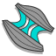

# AdnGlue

AdnGlue is a Maya node that can be used to attach multiple muscles together. This solver uses as input a series of simulated muscles and allows the user to define glue connections between those muscles by using a maximum glue distance value and painted maps.

The maps required to control the AdnGlue solver can be painted using the standard Maya Paint tool.

### How To Use

The AdnGlue node can be applied to any set of geometries. For each geometry, their mesh at each frame is gathered and simulated to ensure the original distance between the neighboring geometries. This is achieved by creating attachments between each vertex of a geometry and the closest point on the surface of one of the other geometries (i.e. the closest one). More aspects are then computed to ensure that the simulated output preserves the original shape and edge-lengths of the simulated meshes. The output of the node is a mesh that combines all the input geometries together and adds the results of the solver.

To create an AdnGlue node within a Maya scene, the following inputs must be provided:

  - **Input Geometries** (IG): List of geometries to be simulated and attached together by the glue solver.

> [!NOTE]
> - Applying the AdnGlue node will automatically create a new mesh in your scene, which will display the results of the solver.
> - The naming of the new mesh created follows the format "AdnGlue1_GEO".
> - Deleting the AdnGlue node will not delete the created output mesh and vice versa.

The process to create an AdnGlue node is:

1. Select the Input Geometries.
2. Press {style="width:4%"} in the AdonisFX shelf or the Glue action in the AdonisFX’s Solvers menu, under the Create section. 
3. A message in the terminal will notify you that AdnGlue has been created properly, meaning that it is ready to simulate with default settings. Check the next section to customize their configuration.

> [!NOTE]
> - By default, no glue connections are created, resulting in the output geometry being identical to the input meshes combined.
> - Check the description of *Max Glue Distance* attribute and also the paintable maps to control the amount of glue connections to create and the areas where they have to be created.

## Attributes

### Solver Attributes
| Name | Type | Default | Animatable | Description |
| :--- | :--- | :------ | :--------- | :---------- |
| **Enable**     | Boolean    | True    | ✓ | Flag to enable or disable the node computation. |
| **Iterations** | Integer    | 3       | ✓ | Number of iterations that the solver will execute per simulation step. Greater values mean greater computational cost. Has a range of \[1, 10\]. The upper limit is soft, higher values can be used. |
| **Stiffness**  | Float      | 5000.0  | ✓ | Defines the overall stiffness of the material to be used for the simulation. This value can be later overridden for each different aspect of the solver to fit creative needs. |
| **Bypass**     | Boolean    | False   | ✓ | When set to True, this attribute makes the input geometry pass through the solver without any simulation being applied. The solver does only transfer the input geometries into the output combined mesh. This is very useful if you want to compare results between having and not having the glue simulation performed. |

### Time Attributes
| Name | Type | Default | Animatable | Description |
| :--- | :--- | :------ | :--------- | :---------- |
| **Preroll Start Time** | Time | *Current frame* | ✗ | Sets the frame at which the node initializes. |
| **Current Time**       | Time | *Current frame* | ✓ | Current playback frame. |

### Scale Attributes
| Name | Type | Default | Animatable | Description |
| :--- | :--- | :------ | :--------- | :---------- |
| **Time Scale**       | Float | 1.0 | ✓ | Sets the scaling factor applied to the simulation time step. Has a range of \[0.0, 2.0\]. The upper limit is soft, higher values can be used. |
| **Space Scale**      | Float | 1.0 | ✓ | Sets the scaling factor applied to the masses and/or the forces (e.g. gravity). AdonisFX interprets the scene units in centimeters. If modeling your creature you apply a scaling factor for whatever reason (e.g. to avoid precision issues in Maya), you will have to adjust for this scaling factor using this attribute. If your character is supposed to be 170 units tall, but you prefer to model it to be 17 units tall, then you will need to set the space scale to a value of 10. This will ensure that your 17 units creature will simulate as if it was 170 units tall. Has a range of \[0.0, 2.0\]. The upper limit is soft, higher values can be used. |

### Advanced Settings

#### Override Constraint Stiffness
| Name | Type | Default | Animatable | Description |
| :--- | :--- | :------ | :--------- | :---------- |
| **Glue**                 | Float | -1.0 | ✓ | Sets the stiffness override value for the glue constraints used to attach the muscles to one another. If the value is less than 0.0, the global stiffness will be used. Otherwise, this custom stiffness will override the global stiffness. Has a range of \[0.0, 1012\]. The upper limit is soft, higher values can be used. |
| **Distance Constraints** | Float | -1.0 | ✓ | Sets the stiffness override value for distance constraints. If the value is less than 0.0, the global stiffness will be used. Otherwise, this custom stiffness will override the global stiffness. Has a range of \[0.0, 1012\]. The upper limit is soft, higher values can be used. |
| **Shape Preservation**   | Float | -1.0 | ✓ | Sets the stiffness override value for the shape preservation constraints. If the value is less than 0.0, the global stiffness will be used. Otherwise, this custom stiffness will override the global stiffness. Has a range of \[0.0, 1012\]. The upper limit is soft, higher values can be used. |

> [!NOTE]
> Providing a stiffness override value of 0.0 will disable the computation of that constraint.

#### Mass Properties

| Name | Type | Default | Animatable | Description |
| :--- | :--- | :------ | :--------- | :---------- |
| **Point Mass Mode**        | Enumerator | By Density       | ✓ | Defines how masses should be used in the solver.<ul><li>*By Density* allows to estimate the mass value by multiplying Density * Area.</li><li>*By Uniform Value* allows to set a uniform mass value.</li></ul> |
| **Density**                | Float      | 900.0            | ✓ | Sets the density value in kg/m3 to be able to estimate mass values with *By Density* mode. The value is internally converted to g/cm3. Has a range of \[0.001, 106\]. Lower and upper limits are soft, lower and higher values can be used. |
| **Global Mass Multiplier** | Float      | 1.0              | ✓ | Sets the scaling factor applied to the mass of every point. Has a range of \[0.001, 10.0\]. Lower and upper limits are soft, lower and higher values can be used. |

#### Dynamic Properties
| Name | Type | Default | Animatable | Description |
| :--- | :--- | :------ | :--------- | :---------- |
| **Triangulate Mesh**       | Boolean  | False | ✗ | Use the internally triangulated mesh to build constraints. |
| **Glue Multiplier**        | Float    | 1.0   | ✓ | Sets the multiplier factor for the weights of the glue constraint. Has a range of \[0.0, 2.0\]. The upper limit is soft, higher values can be used. |
| **Max Glue Distance**      | Float    | 0.0   | ✓ | Sets maximum distance at which a vertex has to be from neighbor surfaces to create a glue constraint. Depending on the scale of your creature, higher values might be required to guarantee dense glue connections to be created. Use the debugger to help you define the value that fits your creature the best. |
| **Compression Multiplier** | Float    | 1.0   | ✓ | Sets the scaling factor applied to the compression resistance of every point. Has a range of \[0.0, 2.0\]. The upper limit is soft, higher values can be used. |
| **Stretching Multiplier**  | Float    | 1.0   | ✓ | Sets the scaling factor applied to the stretching resistance of every point. Has a range of \[0.0, 2.0\]. The upper limit is soft, higher values can be used. |

### Node Attributes
| Name | Type | Default | Animatable | Description |
| :--- | :--- | :------ | :--------- | :---------- |
| **Envelope** | Float | 1.0 | ✓ | Specifies the deformation scale factor. Has a range of \[0.0, 1.0\]. The upper and lower limits are soft, values can be set in a range of \[-2.0, 2.0\]|

### Debug Attributes
| Name | Type | Default | Animatable | Description |
| :--- | :--- | :------ | :--------- | :---------- |
| **Debug**       | Boolean      | False                | ✓ | Enable or Disable the debug functionalities in the viewport for the AdnGlue node. |
| **Feature**     | Enumerator   | Distance Constraints | ✓ | A list of debuggable features for this node.<ul><li>Distance Constraints: Draw *Distance Constraint* connections representing the constrained pair of vertices in the simulated mesh.</li><li>Shape Preservation: Draw *Shape Preservation* connections between the vertices adjacent to the vertices with this constraint.</li><li>Glue Constraints: Draw *Glue* connections between every vertex and its closest point on the closest neighbor surface.</li></ul> |
| **Width Scale** | Float        | 3.0                  | ✓ | Modifies the width of all lines. |
| **Color**       | Color Picker | Red                  | ✓ | Selects the line color from a color wheel. Its saturation can be modified using the slider. |

## Attribute Editor Template

<figure markdown>
   
  <figcaption><b>Figure 1</b>: AdnGlue Attribute Editor.</figcaption>
</figure>

## Paintable Weights

In order to provide more artistic control, some key parameters of the AdnGlue solver are exposed as paintable attributes in the node. The Maya paint tool must be used to paint those parameters to ensure that the values satisfy the solver requirements.

| Name | Default | Description |
| :--- | :------ | :---------- |
| **Compression Resistance**       | 1.0 | Force to correct the edge lengths if the current length is smaller than the rest length. A higher value represents higher correction.<ul><li>*Tip*: To optimize the painting of the weight, flood it to 1.0 as a starting point and tweak some areas later on.</li><li>*Tip*: Reducing the value of the weight in some areas will contribute to reduce wrinkling effect.</li></ul> |
| **Glue Resistance**              | 1.0 | Force to preserve the distance to the closest point on the closest neighbor surface. A higher value represents higher correction.<ul><li>*Tip*: Paint a value of 0.0 in those areas where the gluing effect is not needed and it will increase the performance.</li></ul> |
| **Masses**                       | 1.0 | Multiplier to the individual mass values per vertex. |
| **Max Glue Distance Multiplier** | 1.0 | Multiplier to the individual values of the max glue distance per vertex. <ul><li>*Tip*: Paint a value of 0.0 in those areas where the gluing effect is not needed and it will increase the performance.</li></ul> |
| **Shape Preservation**           | 0.0 | Amount of correction to apply to a vertex to maintain the initial state of the shape formed with the surrounding vertices. |
| **Stretching Resistance**        | 1.0 | Force to correct the edge lengths if the current length is greater than the rest length. A higher value represents higher correction.<ul><li>*Tip*: To optimize the painting of the weight, flood it to 1.0 as a starting point and tweak some areas later on.</li><li>*Tip*: Smooth the borders by using the Smooth and Flood combination to make sure that there are no discontinuities in the weights map. This will help the simulation to not produce sharp differences in the dynamics of every vertex compared to its connected vertices.</li></ul> |

<figure markdown>
  
  <figcaption><b>Figure 2</b>: Example of painted weights on the glue layer, labeled as: <b>a)</b> Glue Resistance, <b>b)</b> Max Glue Distance Multiplier and <b>c)</b> Shape Preservation (Optional painting). </figcaption>
</figure>

> [!NOTE]
> In case you are experiencing issues trying to paint weights on the AdnGlue output geometry, find in this [simple setup section for AdnGlue](../simple_setup#AdnGlue) a proposed workaround.

## Debugger

In order to better visualize node constraints and attributes in the Maya viewport there is the option to enable the debugger, found in the dropdown menu labeled *Debug* in the Attribute Editor.

To enable the debugger the *Debug* checkbox must be marked. To select the specific feature you would like to visualize, choose it from the list provided in *Features*. The features that can be visualized with the debugger in the AdnGlue node are:

 - **Distance Constraints**: For each pair of vertices forming a constraint a line will be drawn. If the *Triangulate Mesh* option is disabled the debugged lines will align with the edges of the mesh polygons. If the *Triangulate Mesh* option is enabled the debugged lines will align with the edges of the underlying triangulation of the mesh.
 - **Shape Preservation**: For each vertex with a shape preservation weight greater than 0.0, a line will be drawn from each adjacent vertex to the opposite adjacent vertex.
 - **Glue Constraint**: A line will be drawn for every vertex to the closest point on the closest neighbor surface.

<figure markdown>
  
  <figcaption><b>Figure 3</b>: AdnGlue debug features. From left to right: Glue Constraints, Distance Constraints and Shape Preservation.</figcaption>
</figure>

## Advanced

### Inputs

Once the AdnGlue node is created, it is possible to add new inputs and remove currently connected ones.

- **Add inputs**:
    1. Select one or more mesh nodes to be assigned as inputs to the AdnGlue.
    2. Select the AdnGlue output mesh.
    3. Press *Add Inputs* in the AdonisFX menu from the Edit Glue submenu.
- **Remove inputs**:
    1. Select one or more mesh nodes that are assigned as inputs to the AdnGlue.
    2. Select the AdnGlue output mesh.
    3. Press *Remove Inputs* in the AdonisFX menu from the Edit Glue submenu.
    4. Alternatively, if only the AdnGlue output mesh is selected, when pressing the *Remove Inputs* button, all inputs will be removed.

> [!NOTE]
> Adding and removing inputs will automatically update the painted maps.
> Undoing the removal of inputs does not restore the previously painted values for the restored inputs. The painted values are set to the default value.
