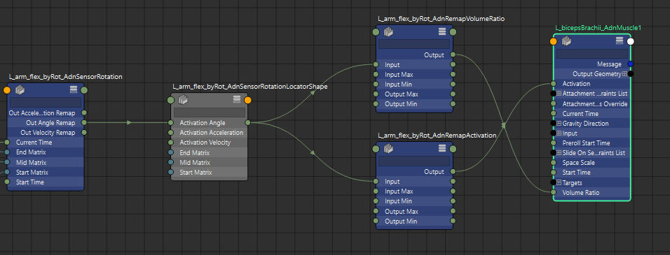
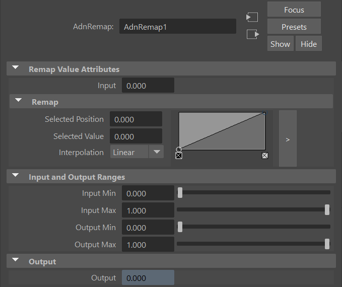

# AdnRemap

The AdnRemap node is an AdonisFX node that aims to provide the same key functionalities that a Maya remapValue node has. This node type is typically used in an AdonisFX rig, for example, to remap the output of a sensor into a value to drive muscle activation or volume ratio gain. The objective of using AdnRemap nodes instead of Maya remapValue nodes is to enhance the portability of the whole AdonisFX rig, including not only the input and output connections but also the configuration of the remap ramp attribute.

## How To Use

An instance of this node can be created from the Node Editor:

1. Open the Node Editor from Windows > Node Editor.
2. Press the Tab key, type *AdnRemap* and press Enter to create a new instance of this node.

Typically, this node will be used to remap the raw output values of AdonisFX sensors (i.e. distance, angle, velocity and acceleration) so that they are ingested into the AdonisFX locators within the desired normalized ranges. The remapped output can also be ingested directly in an AdnMuscle deformer to modulate, for example, the activation or the volume ratio.

Starting from a scene with an AdonisFX rig already configured using Maya remapValue nodes, it is possible to upgrade the entire node graph by replacing all those Maya nodes by AdnRemap nodes preserving their settings and connections. For that, run the following code in a Python Script Editor tab:

<pre><code style="white-space: pre; margin: 20px 0; padding: 10px; box-sizing: border-box;">from adn.utils.maya import graph
graph.upgrade_remap_nodes(delete=True)
</code></pre>

> [!NOTE]
> - The argument `delete` is optional and defaults to `True`.
> - If enabled, all the existing Maya remapValue nodes are deleted after being replaced by the new AdnRemap nodes.

## Example

<figure markdown>
  
  <figcaption><b>Figure 1</b>: Use case in which different AdnRemap nodes are used in the node history of an AdnMuscle to drive the muscle's activation and volume gain.</figcaption>
</figure>

In the above setup we have the following characteristics:

1. One AdnSensorDistance.
2. Three AdnRemap nodes to remap the raw output activation values of the AdnSensorDistance.
3. One AdnLocatorDistance to visualize the remapped activation values in the viewport.
4. One AdnActivation node to drive the muscle's activation (multiple inputs connected but hidden in this view).
5. Another AdnRemap node to remap the output activation from the range (0 - 1) into (1 - 1.2) to modulate the muscle's volume gain.
6. One AdnMuscle solver.

## Attributes

### Input
| Name | Type | Default | Animatable | Description |
| :--- | :--- | :------ | :--------- | :---------- |
| **Input**        | Float | 0.0 | ✓ | Input scalar value to remap. |

#### Remap

| Name | Type | Default | Animatable | Description |
| :--- | :--- | :------ | :--------- | :---------- |
| **Selected Position**   | Float      | 0.0    | ✓ | X-axis value of the ramp attribute. |
| **Selected Value**      | Float      | 0.0    | ✓ | Y-axis value of the ramp attribute. |
| **Interpolation**       | Enumerator | Linear | ✓ | Interpolation method to be used between every two consecutive points in the ramp. There are four options: None, Linear, Smooth and Spline. |

#### Input and Output Ranges

| Name | Type | Default | Animatable | Description |
| :--- | :--- | :------ | :--------- | :---------- |
| **Input Min**  | Float      | 0.0    | ✓ | Lower limit of the range used to normalize the input value before evaluating it on the ramp attribute. |
| **Input Max**  | Float      | 1.0    | ✓ | Upper limit of the range used to normalize the input value before evaluating it on the ramp attribute. |
| **Output Min** | Float      | 0.0    | ✓ | Lower limit of the range used to map the value returned by the ramp attribute and calculate the output. |
| **Output Max** | Float      | 1.0    | ✓ | Upper limit of the range used to map the value returned by the ramp attribute and calculate the output. |

### Output

| Name | Type | Default | Animatable | Description |
| :--- | :--- | :------ | :--------- | :---------- |
| **Output** | Float | 0.0 | ✗ | Output remapped value. |

## Attribute Editor Template

<figure style="width:75%;" markdown>
  
  <figcaption><b>Figure 2</b>: AdnRemap Attribute Editor.</figcaption>
</figure>
