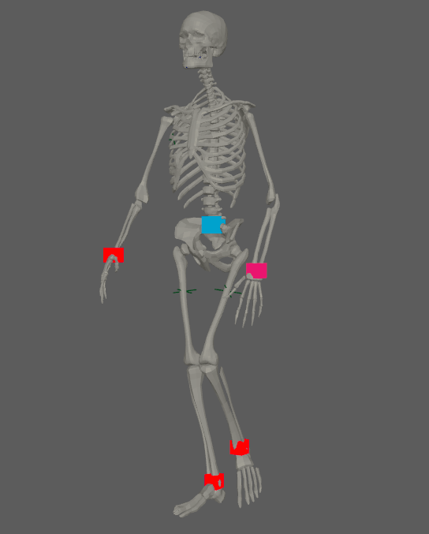
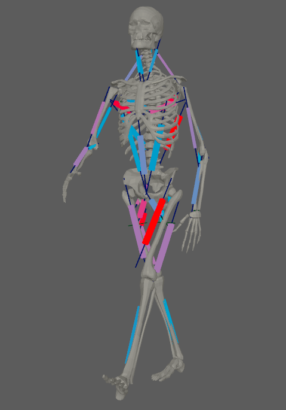
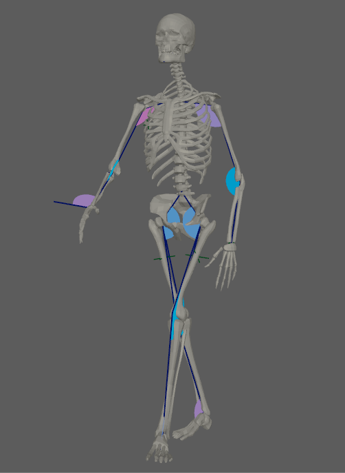

# Sensors

AdonisFX Sensors are nodes in charge of interpreting data extracted from transform nodes and compute information that can be fed into the deformers to alter their behavior. Sensors work in combination with [Locators](locators) to display the computed information in an intuitive way using coloring. The sensors produce the results in two separated outputs: the raw value result of the evaluation of the input transform nodes (e.g. *Out Angle*); and the remapped value result of the evaluation of the raw value into the existing remap ramp attributes (e.g. *Out Angle Remap*). Thanks to this, the remapped values are already adjusted within a custom range of activation that will drive the coloring of the locators and the activation of an AdnMuscle for example.

## AdnSensorPosition

AdnSensorPosition is the sensor for computing meaningful output raw values representing the velocity or acceleration of a transform node. Additionally, the sensor remaps the values of velocity and acceleration to produce desirable activation values within a certain range to drive the simulation of an AdonisFX deformer. This sensor has to work in combination with an AdnLocatorPosition both for setup and visualization. An example use case for this sensor would be applying it to the wrist connection of an arm outputting velocities while swinging.

### How To Use

An AdnSensorPosition will be in charge of computing, remapping and feeding activation (or other) values into the AdnLocatorPosition for visualization purposes, which in turn feeds the AdonisFX deformers to drive the simulation. The value of the sensor can be used, for example, to drive the activation of a muscle simulating contraction to increase its stiffness.

<figure markdown>
  
  <figcaption><b>Figure 1</b>: AdnSensorPosition used in a human model.</figcaption>
</figure>

There are two different methods of creating an AdnSensorPosition, depending if it is to be applied on an existing [AdnLocatorPosition](locators#adnlocatorposition) or creating it alongside the sensor.

 - If applying to an already existing AdnLocatorPosition:

    1. Select an AdnLocatorPosition from your scene.
    2. Press the {style="width:4%"} button in the AdonisFX shelf or press *Position* in the AdonisFX menu, under the *Sensor* submenu. If the shelf button is double-clicked or the option box in the menu is selected a window will be displayed where a custom name and initial attribute values can be set.
    3. The AdnSensorPosition is created, applied to the selected AdnLocatorPosition.

 - If creating the locator alongside the sensor:

    1. Select a transform node in the scene.
    2. Press the {style="width:4%"} button in the AdonisFX shelf or press *Position* in the AdonisFX menu, under the *Sensor* submenu. If the shelf button is double-clicked or the option box in the menu is selected a window will be displayed where a custom name and initial attribute values can be set.
    3. The AdnSensorPosition is created, alongside a new AdnLocatorPosition applied to the same transform node.

<figure markdown>
  
  <figcaption><b>Figure 2</b>: AdnSensorPosition and AdnLocatorPosition in the node graph .</figcaption>
</figure>

### Attributes

#### Input
| Name | Type | Default | Animatable | Description |
| :--- | :--- | :------ | :--------- | :---------- |
| **Position**        | Float3 | {0.0, 0.0, 0.0} | ✓ | Position in world space of the transform node. This plug is used if: 1) it has input connection; 2) it does not have input connection and *Position Matrix* does not have input connection either. Otherwise, *Position Matrix* is used instead.|
| **Position Matrix** | Matrix | Identity        | ✓ | Matrix containing the position in world space of the transform node. This plug is used if: 1) it has input connection and *Position* does not have input connections. Otherwise, *Position* is used instead. |

#### Output
| Name | Type | Default | Animatable | Description |
| :--- | :--- | :------ | :--------- | :---------- |
| **Out Velocity**     | Float | 0.0 | ✗ | Magnitude of the velocity of the transform node. It is the raw value calculated before the remapping. |
| **Out Acceleration** | Float | 0.0 | ✗ | Magnitude of the acceleration of the transform node. It is the raw value calculated before the remapping. |

#### Remapped Output
| Name | Type | Default | Animatable | Description |
| :--- | :--- | :------ | :--------- | :---------- |
| **Out Velocity Remap**     | Float | 0.0 | ✗ | Output remapped velocity. It is the result of remapping the *Out Velocity*. |
| **Out Acceleration Remap** | Float | 0.0 | ✗ | Output remapped acceleration. It is the result of remapping the *Out Acceleration*. |

#### Remap Settings

##### Velocity

###### Velocity Remap

| Name | Type | Default | Animatable | Description |
| :--- | :--- | :------ | :--------- | :---------- |
| **Selected Position** | Float      | 0.0    | ✓ | X-axis value of the ramp attribute. |
| **Selected Value**    | Float      | 0.0    | ✓ | Y-axis value of the ramp attribute. |
| **Interpolation**     | Enumerator | Linear | ✓ | Interpolation method to be used between every two consecutive points in the ramp. There are four options: None, Linear, Smooth and Spline. |

###### Input and Output Ranges

| Name | Type | Default | Animatable | Description |
| :--- | :--- | :------ | :--------- | :---------- |
| **Input Min Velocity**  | Float | 0.0  | ✓ | Lower limit of the range used to map the *Out Velocity* value before evaluating it on the ramp attribute. |
| **Input Max Velocity**  | Float | 10.0 | ✓ | Upper limit of the range used to map the *Out Velocity* value before evaluating it on the ramp attribute. |
| **Output Min Velocity** | Float | 0.0  | ✓ | Lower limit of the range used to map the value returned by the ramp attribute and calculate the final remapped velocity. |
| **Output Max Velocity** | Float | 1.0  | ✓ | Upper limit of the range used to map the value returned by the ramp attribute and calculate the final remapped velocity. |

##### Acceleration

###### Acceleration Remap

| Name | Type | Default | Animatable | Description |
| :--- | :--- | :------ | :--------- | :---------- |
| **Selected Position** | Float      | 0.0    | ✓ | X-axis value of the ramp attribute. |
| **Selected Value**    | Float      | 0.0    | ✓ | Y-axis value of the ramp attribute. |
| **Interpolation**     | Enumerator | Linear | ✓ | Interpolation method to be used between every two consecutive points in the ramp. There are four options: None, Linear, Smooth and Spline. |

###### Input and Output Ranges

| Name | Type | Default | Animatable | Description |
| :--- | :--- | :------ | :--------- | :---------- |
| **Input Min Acceleration**  | Float | -10.0 | ✓ | Lower limit of the range used to map the *Out Acceleration* value before evaluating it on the ramp attribute. |
| **Input Max Acceleration**  | Float | 10.0  | ✓ | Upper limit of the range used to map the *Out Acceleration* value before evaluating it on the ramp attribute. |
| **Output Min Acceleration** | Float | 0.0   | ✓ | Lower limit of the range used to map the value returned by the ramp attribute and calculate the final remapped acceleration. |
| **Output Max Acceleration** | Float | 1.0   | ✓ | Upper limit of the range used to map the value returned by the ramp attribute and calculate the final remapped acceleration. |

#### Time Attributes
| Name | Type | Default | Animatable | Description |
| :--- | :--- | :------ | :--------- | :---------- |
| **Start Time**   | Time | *Current frame* | ✗ | Determines the frame at which the playback/simulation starts. |
| **Current Time** | Time | *Current frame* | ✓ | Current playback frame. |

#### Scale Attributes
| Name | Type | Default | Animatable | Description |
| :--- | :--- | :------ | :--------- | :---------- |
| **Time Scale**  | Float | 1.0 | ✓ | Sets the scaling factor applied to the compute the velocity or acceleration. Has a range of \[0.001, 10.0\]. The upper limit is soft, higher values can be used. |
| **Space Scale** | Float | 1.0 | ✓ | Sets the scaling factor applied to velocity or acceleration. Has a range of \[0.001, 100.0\]. The upper limit is soft, higher values can be used. |

## AdnSensorDistance

AdnSensorDistance is the sensor for computing meaningful output raw values representing the distance, velocity or acceleration between two transform nodes. Additionally, the sensor remaps the values of distance, velocity and acceleration to produce desirable activation values within a certain range to drive the simulation of an AdonisFX deformer. This sensor has to work in combination with an AdnLocatorDistance both for setup and visualization. An example use case for this sensor would be applying it to the connection made between bones which would compute the distance between two bones moving together.

### How To Use

An AdnSensorDistance will be in charge of computing, remapping and feeding activation (or other) values into the AdnLocatorDistance for visualization purposes, which in turn feeds the AdonisFX deformers to drive the simulation. The value of the sensor can be used, for example, to drive the activation of a muscle simulating contraction to increase its stiffness.

<figure markdown>
  
  <figcaption><b>Figure 3</b>: AdnSensorDistance used in a human model.</figcaption>
</figure>

There are two different methods of creating an AdnSensorDistance, depending if it is to be applied on an existing [AdnLocatorDistance](locators) or creating it alongside the sensor.

 - If applying to an already existing AdnLocatorDistance:

    1. Select an AdnLocatorDistance from your scene.
    2. Press the {style="width:4%"} button in the AdonisFX shelf or press *Distance* in the AdonisFX menu, under the *Sensor* submenu. If the shelf button is double-clicked or the option box in the menu is selected a window will be displayed where a custom name and initial attribute values can be set.
    3. The AdnSensorDistance is created, applied to the selected AdnLocatorDistance.

 - If creating the locator alongside the sensor:

    1. Select two transform nodes in the scene.
    2. Press the {style="width:4%"} button in the AdonisFX shelf or press *Distance* in the AdonisFX menu, under the *Sensor* submenu. If the shelf button is double-clicked or the option box in the menu is selected a window will be displayed where a custom name and initial attribute values can be set.
    3. The AdnSensorDistance is created, alongside a new AdnLocatorDistance applied to the same transform nodes.

<figure markdown>
  
  <figcaption><b>Figure 4</b>: AdnSensorDistance and AdnLocatorDistance in the node graph .</figcaption>
</figure>

### Attributes

#### Input
| Name | Type | Default | Animatable | Description |
| :--- | :--- | :------ | :--------- | :---------- |
| **Start Position** | Float3 | {0.0, 0.0, 0.0} | ✓ | Position in world space of the first transform node. This plug is used if: 1) it has input connection; 2) it does not have input connection and *Start Matrix* does not have input connection either. Otherwise, *Start Matrix* is used instead.|
| **End Position**   | Float3 | {0.0, 0.0, 0.0} | ✓ | Position in world space of the second transform node. This plug is used if: 1) it has input connection; 2) it does not have input connection and *End Matrix* does not have input connection either. Otherwise, *End Matrix* is used instead.|
| **Start Matrix**   | Matrix | Identity        | ✓ | Matrix containing the position in world space of the first transform node. This plug is used if: 1) it has input connection and *Start Position* does not have input connections. Otherwise, *Start Position* is used instead. |
| **End Matrix**     | Matrix | Identity        | ✓ | Matrix containing the position in world space of the second transform node. This plug is used if: 1) it has input connection and *End Position* does not have input connections. Otherwise, *End Position* is used instead. |

#### Output
| Name | Type | Default | Animatable | Description |
| :--- | :--- | :------ | :--------- | :---------- |
| **Out Distance**     | Float | 0.0 | ✗ | Magnitude of the distance between the transform nodes. It is the raw value calculated before the remapping. |
| **Out Velocity**     | Float | 0.0 | ✗ | Magnitude of the velocity between the transform nodes. It is the raw value calculated before the remapping. |
| **Out Acceleration** | Float | 0.0 | ✗ | Magnitude of the acceleration between the transform nodes. It is the raw value calculated before the remapping. |

#### Remapped Output
| Name | Type | Default | Animatable | Description |
| :--- | :--- | :------ | :--------- | :---------- |
| **Out Distance Remap**     | Float | 0.0 | ✗ | Output remapped distance. It is the result of remapping the *Out Distance*. |
| **Out Velocity Remap**     | Float | 0.0 | ✗ | Output remapped velocity. It is the result of remapping the *Out Velocity*. |
| **Out Acceleration Remap** | Float | 0.0 | ✗ | Output remapped acceleration. It is the result of remapping the *Out Acceleration*. |

#### Remap Settings

##### Distance

###### Distance Remap

| Name | Type | Default | Animatable | Description |
| :--- | :--- | :------ | :--------- | :---------- |
| **Selected Position** | Float      | 0.0    | ✓ | X-axis value of the ramp attribute. |
| **Selected Value**    | Float      | 0.0    | ✓ | Y-axis value of the ramp attribute. |
| **Interpolation**     | Enumerator | Linear | ✓ | Interpolation method to be used between every two consecutive points in the ramp. There are four options: None, Linear, Smooth and Spline. |

###### Input and Output Ranges

| Name | Type | Default | Animatable | Description |
| :--- | :--- | :------ | :--------- | :---------- |
| **Input Min Distance**  | Float | 0.0 | ✓ | Lower limit of the range used to map the Distance value before evaluating it on the ramp attribute. |
| **Input Max Distance**  | Float | 0.0 | ✓ | Upper limit of the range used to map the Distance value before evaluating it on the ramp attribute. |
| **Output Min Distance** | Float | 0.0 | ✓ | Lower limit of the range used to map the value returned by the ramp attribute and calculate the final remapped Distance. |
| **Output Max Distance** | Float | 1.0 | ✓ | Upper limit of the range used to map the value returned by the ramp attribute and calculate the final remapped Distance. |

##### Velocity

###### Velocity Remap

| Name | Type | Default | Animatable | Description |
| :--- | :--- | :------ | :--------- | :---------- |
| **Selected Position** | Float      | 0.0    | ✓ | X-axis value of the ramp attribute. |
| **Selected Value**    | Float      | 0.0    | ✓ | Y-axis value of the ramp attribute. |
| **Interpolation**     | Enumerator | Linear | ✓ | Interpolation method to be used between every two consecutive points in the ramp. There are four options: None, Linear, Smooth and Spline. |

###### Input and Output Ranges

| Name | Type | Default | Animatable | Description |
| :--- | :--- | :------ | :--------- | :---------- |
| **Input Min Velocity**  | Float | -10.0 | ✓ | Lower limit of the range used to map the *Out Velocity* value before evaluating it on the ramp attribute. |
| **Input Max Velocity**  | Float | 10.0  | ✓ | Upper limit of the range used to map the *Out Velocity* value before evaluating it on the ramp attribute. |
| **Output Min Velocity** | Float | 0.0   | ✓ | Lower limit of the range used to map the value returned by the ramp attribute and calculate the final remapped velocity. |
| **Output Max Velocity** | Float | 1.0   | ✓ | Upper limit of the range used to map the value returned by the ramp attribute and calculate the final remapped velocity. |

##### Acceleration

###### Acceleration Remap

| Name | Type | Default | Animatable | Description |
| :--- | :--- | :------ | :--------- | :---------- |
| **Selected Position** | Float      | 0.0    | ✓ | X-axis value of the ramp attribute. |
| **Selected Value**    | Float      | 0.0    | ✓ | Y-axis value of the ramp attribute. |
| **Interpolation**     | Enumerator | Linear | ✓ | Interpolation method to be used between every two consecutive points in the ramp. There are four options: None, Linear, Smooth and Spline. |

###### Input and Output Ranges

| Name | Type | Default | Animatable | Description |
| :--- | :--- | :------ | :--------- | :---------- |
| **Input Min Acceleration**  | Float | -10.0 | ✓ | Lower limit of the range used to map the *Out Acceleration* value before evaluating it on the ramp attribute. |
| **Input Max Acceleration**  | Float | 10.0  | ✓ | Upper limit of the range used to map the *Out Acceleration* value before evaluating it on the ramp attribute. |
| **Output Min Acceleration** | Float | 0.0   | ✓ | Lower limit of the range used to map the value returned by the ramp attribute and calculate the final remapped acceleration. |
| **Output Max Acceleration** | Float | 1.0   | ✓ | Upper limit of the range used to map the value returned by the ramp attribute and calculate the final remapped acceleration. |

#### Time Attributes
| Name | Type | Default | Animatable | Description |
| :--- | :--- | :------ | :--------- | :---------- |
| **Start Time**   | Time | *Current frame* | ✗ | Determines the frame at which the playback/simulation starts. |
| **Current Time** | Time | *Current frame* | ✓ | Current playback frame. |

#### Scale Attributes
| Name | Type | Default | Animatable | Description |
| :--- | :--- | :------ | :--------- | :---------- |
| **Time Scale**  | Float | 1.0 | ✓ | Sets the scaling factor applied to the compute the velocity or acceleration. Has a range of \[0.001, 10.0\]. The upper limit is soft, higher values can be used. |
| **Space Scale** | Float | 1.0 | ✓ | Sets the scaling factor applied to velocity or acceleration. Has a range of \[0.001, 100.0\]. The upper limit is soft, higher values can be used. |

## AdnSensorRotation

AdnSensorRotation is the sensor for computing meaningful output raw values representing the angle, angular velocity or angular acceleration between three transform nodes. Additionally, the sensor remaps the values of angle, velocity and acceleration to produce desirable activation values within a certain range to drive the simulation of an AdonisFX deformer. This sensor has to work in combination with an AdnLocatorRotation both for setup and visualization. An example use case for this sensor would be applying it to the arc connection made between bones which would compute the angle between two bones rotating.

### How To Use

An AdnSensorRotation will be in charge of computing, remapping and feeding activation (or other) values into the AdnLocatorRotation for visualization purposes, which in turn feeds the AdonisFX deformers to drive the simulation. The value of the sensor can be used, for example, to drive the activation of a muscle simulating contraction to increase its stiffness.

<figure markdown>
  
  <figcaption><b>Figure 5</b>: AdnSensorRotation used in a human model.</figcaption>
</figure>

There are two different methods of creating an AdnSensorRotation, depending if it is to be applied on an existing [AdnLocatorRotation](locators) or creating it alongside the sensor.

 - If applying to an already existing AdnLocatorRotation:

    1. Select an AdnLocatorRotation from your scene.
    2. Press the {style="width:4%"} button in the AdonisFX shelf or press *Rotation* in the AdonisFX menu, under the *Sensor* submenu. If the shelf button is double-clicked or the option box in the menu is selected a window will be displayed where a custom name and initial attribute values can be set.
    3. The AdnLocatorRotation is created, applied to the selected AdnLocatorRotation.

 - If creating the locator alongside the sensor:

    1. Select three transform nodes in the scene.
    2. Press the {style="width:4%"} button in the AdonisFX shelf or press *Rotation* in the AdonisFX menu, under the *Sensor* submenu. If the shelf button is double-clicked or the option box in the menu is selected a window will be displayed where a custom name and initial attribute values can be set.
    3. The AdnSensorRotation is created, alongside a new AdnLocatorRotation applied to the same transform nodes.

<figure markdown>
  
  <figcaption><b>Figure 6</b>: AdnSensorRotation and AdnLocatorRotation in the node graph .</figcaption>
</figure>

### Attributes

#### Input
| Name | Type | Default | Animatable | Description |
| :--- | :--- | :------ | :--------- | :---------- |
| **Start Position** | Float3 | {0.0, 0.0, 0.0} | ✓ | Position in world space of the first transform node. This plug is used if: 1) it has input connection; 2) it does not have input connection and *Start Matrix* does not have input connection either. Otherwise, *Start Matrix* is used instead.|
| **Mid Position**   | Float3 | {0.0, 0.0, 0.0} | ✓ | Position in world space of the second transform node. This plug is used if: 1) it has input connection; 2) it does not have input connection and *Mid Matrix* does not have input connection either. Otherwise, *Mid Matrix* is used instead.|
| **End Position**   | Float3 | {0.0, 0.0, 0.0} | ✓ | Position in world space of the third transform node. This plug is used if: 1) it has input connection; 2) it does not have input connection and *End Matrix* does not have input connection either. Otherwise, *End Matrix* is used instead.|
| **Start Matrix**   | Matrix | Identity        | ✓ | Matrix containing the position in world space of the first transform node. This plug is used if: 1) it has input connection and *Start Position* does not have input connections. Otherwise, *Start Position* is used instead. |
| **Mid Matrix**     | Matrix | Identity        | ✓ | Matrix containing the position in world space of the second transform node. This plug is used if: 1) it has input connection and *Mid Position* does not have input connections. Otherwise, *Mid Position* is used instead. |
| **End Matrix**     | Matrix | Identity        | ✓ | Matrix containing the position in world space of the third transform node. This plug is used if: 1) it has input connection and *End Position* does not have input connections. Otherwise, *End Position* is used instead. |

#### Output
| Name | Type | Default | Animatable | Description |
| :--- | :--- | :------ | :--------- | :---------- |
| **Out Angle**        | Float | 0.0 | ✗ | Magnitude of the angle between the three transform nodes. It is the raw value calculated before the remapping. |
| **Out Velocity**     | Float | 0.0 | ✗ | Magnitude of the angular velocity between the three transform nodes. It is the raw value calculated before the remapping. |
| **Out Acceleration** | Float | 0.0 | ✗ | Magnitude of the angular acceleration between the three transform nodes. It is the raw value calculated before the remapping. |

#### Remapped Output
| Name | Type | Default | Animatable | Description |
| :--- | :--- | :------ | :--------- | :---------- |
| **Out Angle Remap**        | Float | 0.0 | ✗ | Output remapped angle. It is the result of remapping the *Out Angle*. |
| **Out Velocity Remap**     | Float | 0.0 | ✗ | Output remapped velocity. It is the result of remapping the *Out Velocity*. |
| **Out Acceleration Remap** | Float | 0.0 | ✗ | Output remapped acceleration. It is the result of remapping the *Out Acceleration*. |

#### Remap Settings

##### Angle

###### Angle Remap

| Name | Type | Default | Animatable | Description |
| :--- | :--- | :------ | :--------- | :---------- |
| **Selected Position** | Float      | 0.0    | ✓ | X-axis value of the ramp attribute. |
| **Selected Value**    | Float      | 0.0    | ✓ | Y-axis value of the ramp attribute. |
| **Interpolation**     | Enumerator | Linear | ✓ | Interpolation method to be used between every two consecutive points in the ramp. There are four options: None, Linear, Smooth and Spline. |

###### Input and Output Ranges

| Name | Type | Default | Animatable | Description |
| :--- | :--- | :------ | :--------- | :---------- |
| **Input Min Angle**  | Float | 3.14 | ✓ | Lower limit of the range used to map the *Out Angle* value before evaluating it on the ramp attribute. |
| **Input Max Angle**  | Float | 0.0  | ✓ | Upper limit of the range used to map the *Out Angle* value before evaluating it on the ramp attribute. |
| **Output Min Angle** | Float | 0.0  | ✓ | Lower limit of the range used to map the value returned by the ramp attribute and calculate the final remapped angle. |
| **Output Max Angle** | Float | 1.0  | ✓ | Upper limit of the range used to map the value returned by the ramp attribute and calculate the final remapped angle. |

##### Velocity

###### Velocity Remap

| Name | Type | Default | Animatable | Description |
| :--- | :--- | :------ | :--------- | :---------- |
| **Selected Position** | Float      | 0.0    | ✓ | X-axis value of the ramp attribute. |
| **Selected Value**    | Float      | 0.0    | ✓ | Y-axis value of the ramp attribute. |
| **Interpolation**     | Enumerator | Linear | ✓ | Interpolation method to be used between every two consecutive points in the ramp. There are four options: None, Linear, Smooth and Spline. |

###### Input and Output Ranges

| Name | Type | Default | Animatable | Description |
| :--- | :--- | :------ | :--------- | :---------- |
| **Input Min Velocity**  | Float | 10.0  | ✓ | Lower limit of the range used to map the *Out Velocity* value before evaluating it on the ramp attribute. |
| **Input Max Velocity**  | Float | -10.0 | ✓ | Upper limit of the range used to map the *Out Velocity* value before evaluating it on the ramp attribute. |
| **Output Min Velocity** | Float | 0.0   | ✓ | Lower limit of the range used to map the value returned by the ramp attribute and calculate the final remapped velocity. |
| **Output Max Velocity** | Float | 1.0   | ✓ | Upper limit of the range used to map the value returned by the ramp attribute and calculate the final remapped velocity. |

##### Acceleration

###### Acceleration Remap

| Name | Type | Default | Animatable | Description |
| :--- | :--- | :------ | :--------- | :---------- |
| **Selected Position** | Float      | 0.0    | ✓ | X-axis value of the ramp attribute. |
| **Selected Value**    | Float      | 0.0    | ✓ | Y-axis value of the ramp attribute. |
| **Interpolation**     | Enumerator | Linear | ✓ | Interpolation method to be used between every two consecutive points in the ramp. There are four options: None, Linear, Smooth and Spline. |

###### Input and Output Ranges

| Name | Type | Default | Animatable | Description |
| :--- | :--- | :------ | :--------- | :---------- |
| **Input Min Acceleration**  | Float | 10.0  | ✓ | Lower limit of the range used to map the *Out Acceleration* value before evaluating it on the ramp attribute. |
| **Input Max Acceleration**  | Float | -10.0 | ✓ | Upper limit of the range used to map the *Out Acceleration* value before evaluating it on the ramp attribute. |
| **Output Min Acceleration** | Float | 0.0   | ✓ | Lower limit of the range used to map the value returned by the ramp attribute and calculate the final remapped acceleration. |
| **Output Max Acceleration** | Float | 1.0   | ✓ | Upper limit of the range used to map the value returned by the ramp attribute and calculate the final remapped acceleration. |

#### Time Attributes
| Name | Type | Default | Animatable | Description |
| :--- | :--- | :------ | :--------- | :---------- |
| **Start Time**   | Time | *Current frame* | ✗ | Determines the frame at which the playback/simulation starts. |
| **Current Time** | Time | *Current frame* | ✓ | Current playback frame. |

#### Scale Attributes
| Name | Type | Default | Animatable | Description |
| :--- | :--- | :------ | :--------- | :---------- |
| **Time Scale** | Float | 1.0 | ✓ | Sets the scaling factor applied to the compute the velocity or acceleration. Has a range of \[0.001, 10.0\]. The upper limit is soft, higher values can be used. |
