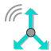

# Sensors

AdonisFX Sensors are nodes in charge of interpreting data extracted from transform nodes and compute information that can be fed into the deformers to alter their behavior. Sensors work in combination with [Locators](locators) to display the computed information in an intuitive way using coloring. To be able to display the information computed from the sensors, remappers are used to convert the computed data (e.g. angle) to a valid value in a given range of activation that will drive the coloring of the locators and the activation of an AdnMuscle for example.

## AdnSensorPosition

AdnSensorPosition is the sensor for computing meaningful output values representing the velocity or acceleration of a transform node. The values of velocity and acceleration can then be remapped to produce desirable activation values to drive the simulation of an AdonisFX deformer. This sensor has to work in combination with an AdnLocatorPosition both for setup and visualization. An example use case for this sensor would be applying it to the wrist connection of an arm outputting velocities while swinging.

### How To Use

An AdnSensorPosition will be in charge of feeding, after remapping, activation (or other) values into AdonisFX deformers for driving the simulation and the AdnLocatorPosition for visualization purposes. The value of the sensor can be used, for example, to drive the activation of a muscle simulating contraction to increase its stiffness. Find more information for connecting the sensor to the deformer in sections below.

<figure markdown>
  
  <figcaption><b>Figure 1</b>: AdnSensorPosition used in a human model.</figcaption>
</figure>

There are two different methods of creating an AdnSensorPosition, depending if it is to be applied on an existing [AdnLocatorPosition](locators#adnlocatorposition) or creating it alongside the sensor.

 - If applying to an already existing AdnLocatorPosition:

    1. Select an AdnLocatorPosition from your scene.
    2. Press the {style="width:4%"} button in the AdonisFX shelf or press *Position* in the AdonisFX menu, under the *Sensor* submenu. If the shelf button is double-clicked or the option box in the menu is selected a window will be displayed where a custom name and initial attribute values can be set.
    3. The AdnSensorPosition is created, applied to the selected AdnLocatorPosition.

 - If creating the locator alongside the sensor:

    1. Select a transform node in the scene.
    2. Press the {style="width:4%"} button in the AdonisFX shelf or press *Position* in the AdonisFX menu, under the *Sensor* submenu. If the shelf button is double-clicked or the option box in the menu is selected a window will be displayed where a custom name and initial attribute values can be set.
    3. The AdnSensorPosition is created, alongside a new AdnLocatorPosition applied to the same transform node.

### Attributes

#### Input
| Name | Type | Default | Animatable | Description |
| :--- | :--- | :------ | :--------- | :---------- |
| **Position** | Float3 | {0.0, 0.0, 0.0} | ✓ | Position in world space of the transform node. |

#### Output
| Name | Type | Default | Animatable | Description |
| :--- | :--- | :------ | :--------- | :---------- |
| **Velocity**     | Float | 0.0 | ✗ | Magnitude of the velocity of the transform node. |
| **Acceleration** | Float | 0.0 | ✗ | Magnitude of the acceleration of the transform node. |

#### Time Attributes
| Name | Type | Default | Animatable | Description |
| :--- | :--- | :------ | :--------- | :---------- |
| **Start Time**   | Time | *Current frame* | ✗ | Determines the frame at which the playback/simulation starts. |
| **Current Time** | Time | *Current frame* | ✓ | Current playback frame. |

#### Scale Attributes
| Name | Type | Default | Animatable | Description |
| :--- | :--- | :------ | :--------- | :---------- |
| **Time Scale**  | Float | 1.0 | ✓ | Sets the scaling factor applied to the compute the velocity or acceleration. Has a range of \[0.001, 10.0\]. The upper limit is soft, higher values can be used. |
| **Space Scale** | Float | 1.0 | ✓ | Sets the scaling factor applied to velocity or acceleration. Has a range of \[0.001, 100.0\]. The upper limit is soft, higher values can be used. |

## AdnSensorDistance

AdnSensorDistance is the sensor for computing meaningful output values representing the distance, velocity or acceleration between two transform nodes. The values of distance, velocity and acceleration can then be remapped to produce desirable activation values to drive the simulation of an AdonisFX deformer. This sensor has to work in combination with an AdnLocatorDistance both for setup and visualization. An example use case for this sensor would be applying it to the connection made between bones which would compute the distance between two bones moving together.

### How To Use

An AdnSensorDistance will be in charge of feeding, after remapping, activation (or other) values into the deformer for driving the simulation and the AdnLocatorDistance for visualization purposes. The value of the sensor can be used to drive the activation of a muscle simulating contraction to increase its stiffness. Find more information for connecting the sensor to the deformer in sections below.

<figure markdown>
  
  <figcaption><b>Figure 2</b>: AdnSensorDistance used in a human model.</figcaption>
</figure>

There are two different methods of creating an AdnSensorDistance, depending if it is to be applied on an existing [AdnLocatorDistance](locators) or creating it alongside the sensor.

 - If applying to an already existing AdnLocatorDistance:

    1. Select an AdnLocatorDistance from your scene.
    2. Press the {style="width:4%"} button in the AdonisFX shelf or press *Distance* in the AdonisFX menu, under the *Sensor* submenu. If the shelf button is double-clicked or the option box in the menu is selected a window will be displayed where a custom name and initial attribute values can be set.
    3. The AdnSensorDistance is created, applied to the selected AdnLocatorDistance.

 - If creating the locator alongside the sensor:

    1. Select two transform nodes in the scene.
    2. Press the {style="width:4%"} button in the AdonisFX shelf or press *Distance* in the AdonisFX menu, under the *Sensor* submenu. If the shelf button is double-clicked or the option box in the menu is selected a window will be displayed where a custom name and initial attribute values can be set.
    3. The AdnSensorDistance is created, alongside a new AdnLocatorDistance applied to the same transform nodes.

### Attributes

#### Input
| Name | Type | Default | Animatable | Description |
| :--- | :--- | :------ | :--------- | :---------- |
| **Start Position** | Float3 | {0.0, 0.0, 0.0} | ✓ | Position in world space of the first transform node. |
| **End Position**   | Float3 | {0.0, 0.0, 0.0} | ✓ | Position in world space of the second transform node. |

#### Output
| Name | Type | Default | Animatable | Description |
| :--- | :--- | :------ | :--------- | :---------- |
| **Distance**     | Float | 0.0 | ✗ | Magnitude of the distance between the transform nodes. |
| **Velocity**     | Float | 0.0 | ✗ | Magnitude of the velocity between the transform nodes. |
| **Acceleration** | Float | 0.0 | ✗ | Magnitude of the acceleration between the transform nodes. |

#### Time Attributes
| Name | Type | Default | Animatable | Description |
| :--- | :--- | :------ | :--------- | :---------- |
| **Start Time**   | Time | *Current frame* | ✗ | Determines the frame at which the playback/simulation starts. |
| **Current Time** | Time | *Current frame* | ✓ | Current playback frame. |

#### Scale Attributes
| Name | Type | Default | Animatable | Description |
| :--- | :--- | :------ | :--------- | :---------- |
| **Time Scale**  | Float | 1.0 | ✓ | Sets the scaling factor applied to the compute the velocity or acceleration. Has a range of \[0.001, 10.0\]. The upper limit is soft, higher values can be used. |
| **Space Scale** | Float | 1.0 | ✓ | Sets the scaling factor applied to velocity or acceleration. Has a range of \[0.001, 100.0\]. The upper limit is soft, higher values can be used. |

## AdnSensorRotation

AdnSensorRotation is the sensor for computing meaningful output values representing the angle, angular velocity or angular acceleration between three transform nodes. The values of velocity and acceleration can then be remapped to produce desirable activation values to drive the simulation of an AdonisFX deformer. This sensor has to work in combination with an AdnLocatorRotation both for setup and visualization. An example use case for this sensor would be applying it to the arc connection made between bones which would compute the angle between two bones rotating.

### How To Use

An AdnSensorRotation will be in charge of feeding, after remapping, activation (or other) values into the deformer for driving the simulation and the AdnLocatorRotation for visualization purposes. The value of the sensor can be used to drive the activation of a muscle simulating contraction to increase its stiffness. Find more information for connecting the sensor to the deformer in sections below.

<figure markdown>
  
  <figcaption><b>Figure 3</b>: AdnSensorRotation used in a human model.</figcaption>
</figure>

There are two different methods of creating an AdnSensorRotation, depending if it is to be applied on an existing [AdnLocatorRotation](locators) or creating it alongside the sensor.

 - If applying to an already existing AdnLocatorRotation:

    1. Select an AdnLocatorRotation from your scene.
    2. Press the {style="width:4%"} button in the AdonisFX shelf or press *Rotation* in the AdonisFX menu, under the *Sensor* submenu. If the shelf button is double-clicked or the option box in the menu is selected a window will be displayed where a custom name and initial attribute values can be set.
    3. The AdnLocatorRotation is created, applied to the selected AdnLocatorRotation.

 - If creating the locator alongside the sensor:

    1. Select three transform nodes in the scene.
    2. Press the {style="width:4%"} button in the AdonisFX shelf or press *Rotation* in the AdonisFX menu, under the *Sensor* submenu. If the shelf button is double-clicked or the option box in the menu is selected a window will be displayed where a custom name and initial attribute values can be set.
    3. The AdnSensorRotation is created, alongside a new AdnLocatorRotation applied to the same transform nodes.

### Attributes

#### Input
| Name | Type | Default | Animatable | Description |
| :--- | :--- | :------ | :--------- | :---------- |
| **Start Position** | Float3 | {0.0, 0.0, 0.0} | ✓ | Position in world space of the first transform node. |
| **Mid Position**   | Float3 | {0.0, 0.0, 0.0} | ✓ | Position in world space of the second transform node. |
| **End Position**   | Float3 | {0.0, 0.0, 0.0} | ✓ | Position in world space of the third transform node. |

#### Output
| Name | Type | Default | Animatable | Description |
| :--- | :--- | :------ | :--------- | :---------- |
| **Angle**        | Float | 0.0 | ✗ | Magnitude of the angle between the three transform nodes. |
| **Velocity**     | Float | 0.0 | ✗ | Magnitude of the angular velocity between the three transform nodes. |
| **Acceleration** | Float | 0.0 | ✗ | Magnitude of the angular acceleration between the three transform nodes. |

#### Time Attributes
| Name | Type | Default | Animatable | Description |
| :--- | :--- | :------ | :--------- | :---------- |
| **Start Time**   | Time | *Current frame* | ✗ | Determines the frame at which the playback/simulation starts. |
| **Current Time** | Time | *Current frame* | ✓ | Current playback frame. |

#### Scale Attributes
| Name | Type | Default | Animatable | Description |
| :--- | :--- | :------ | :--------- | :---------- |
| **Time Scale** | Float | 1.0 | ✓ | Sets the scaling factor applied to the compute the velocity or acceleration. Has a range of \[0.001, 10.0\]. The upper limit is soft, higher values can be used. |

## Connect To Deformers

Sensors are meant to be connected to a deformer, typically to a muscle deformer, so that they can automatically control attributes, enabling the deformer to react to external inputs from the scene.

When creating a sensor, a remap node for each output attribute is created. Through these remap nodes, and their output, it is possible to modulate and connect the information obtained by the sensor to a deformer and display its remapped value to its corresponding locator.

<figure markdown>
  
  <figcaption><b>Figure 4</b>: Nodes created by an AdnSensorPosition.</figcaption>
</figure>

<figure markdown>
  
  <figcaption><b>Figure 5</b>: Nodes created by an AdnSensorDistance.</figcaption>
</figure>

<figure markdown>
  
  <figcaption><b>Figure 6</b>: Nodes created by an AdnSensorRotation.</figcaption>
</figure>

Connecting the sensor to the target deformer can be done using the Node Editor in Maya:

<figure markdown>
  
  <figcaption><b>Figure 7</b>: AdnSensorDistance connected to the activation of an AdnMuscle.</figcaption>
</figure>

However, these connections are made in a much more user friendly way by making use of the Sensors Connection Editor presented [here](../tools#sensors-connection-editor).
