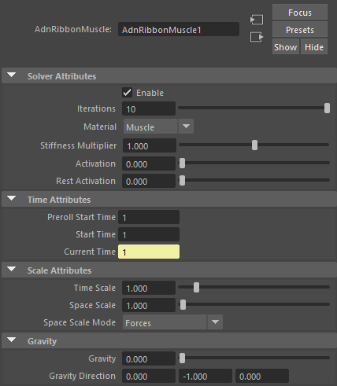
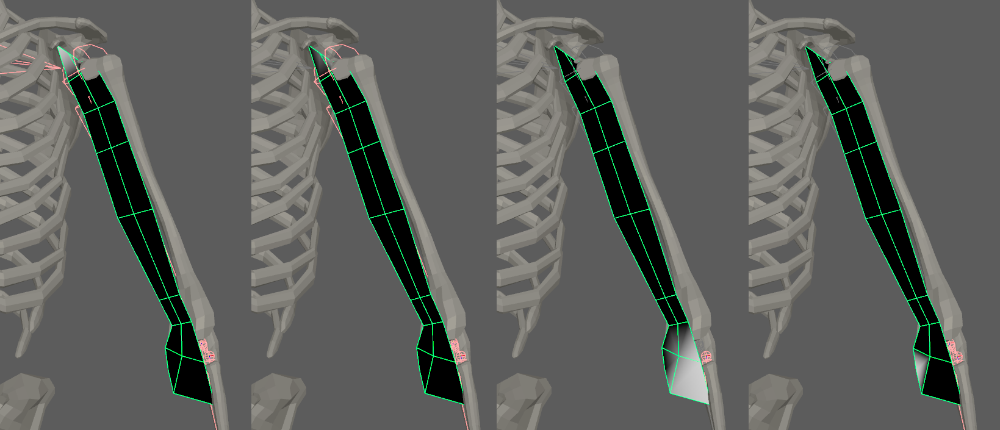
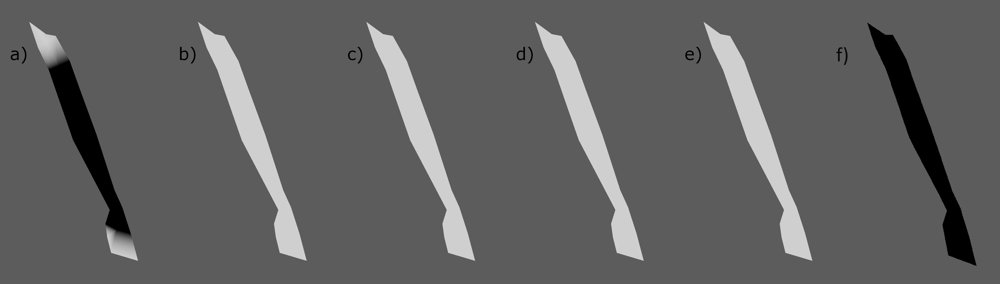
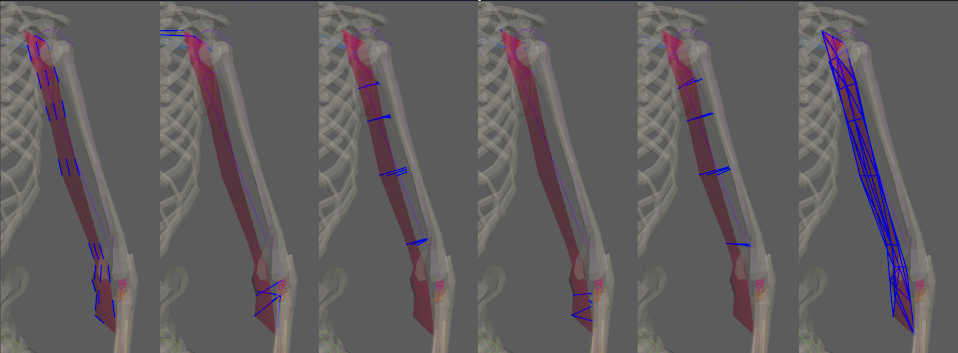

# AdnRibbonMuscle

AdnRibbonMuscle is a Maya deformer for fast, robust and easy-to-configure tissue muscle simulation for digital assets. Thanks to the combination of internal (structural) and external (attachments and slide on segment) constraints, this deformer can produce dynamics that allow the mesh to acquire the simulated characteristics of a ribbon with fibers activations to modulate the rigidity, and attachments to external objects to follow the global kinematics of the character.

The influence these constraints have on the simulated mesh can be freely modified by painting them via the [AdonisFX Paint Tool](tools.md#adonisfx-paint-tool) or by uniformly regulating their influence via multipliers in the Attribute Editor. Besides the maps and multipliers there are many other parameters to regulate the muscle's dynamics and behaviour to a wide array of options.

### How To Use

The AdnRibbonMuscle deformer is of great simplicity to set up and apply to a mesh within a Maya scene. The way this deformer works is by applying simulation on top a mesh emulating a ribbon muscle which follows the dynamics of attachment points set as anchors. Those attachments mark the anchor points for the muscle, prepared to act as tendons, and will introduce great part of the dynamics to the deformer.

To create an AdnRibbonMuscle deformer within a Maya scene, the following inputs must be provided:

- **Attachments (A)**: Attachment anchors to which the simulated muscle will be attached to. Any transform node can be used (e.g. joints, locators, meshes, etc). This input is optional and unlimited.
- **Muscle Geometry (M)**: Mesh that the AdnRibbonMuscle deformer will be applied to.

> [!NOTE]
> It is not mandatory to select the attachments on creation of the AdnRibbonMuscle deformer. Attachments can be added and remove after creating the deformer. For more information check the [advanced section](#attachments).

Follow this steps to create an AndRibbonMuscle deformer:

1. Select the **Attachments** (if any) and the **Muscle Geometry** in that order.
2. Press the {style="width:4%"} button in the AdonisFX shelf or press *Ribbon Muscle* in the AdonisFX menu. If the shelf button is double-clicked or the option box in the menu is selected a window will be displayed where a custom name and initial attribute values can be set.
3. AdnRibbonMuscle is ready to simulate with default settings. Check the [attributes section](#attributes) to customize the configuration.

## Attributes

### Solver Attributes
| Name | Type | Default | Animatable | Description |
| :--- | :--- | :------ | :--------- | :---------- |
| **Enable**               | Boolean    | True   | ✓ | Flag to enable or disable the deformer computation. |
| **Iterations**           | Integer    | 10     | ✓ | Number of iterations that the solver will execute per simulation step. Greater values mean greater computational cost. Has a range of \[1, 10\]. Upper limit is soft, higher values can be used. |
| **Material**             | Enumerator | Muscle | ✓ | Solver stiffness presets per material. The materials are listed from lowest to highest stiffness. There are 7 different presets: Fat: 103, Muscle: 5e3, Rubber: 106, Tendon: 5e7, Leather: 106, Wood: 6e9, Concrete: 2.5e10. |
| **Stiffness Multiplier** | Float      | 1.0    | ✓ | Multiplier factor to scale up or down the material stiffness. Has a range of \[0.0, 2.0\]. Upper limit is soft, higher values can be used. |
| **Activation**           | Float      | 0.0    | ✓ | Current activation of the deformed ribbon muscle. The activation modifies the stiffness of the muscle depending on the fibers direction of the muscle. Has a range of \[0.0, 1.0\]. |
| **Rest Activation**      | Float      | 0.0    | ✓ | Value representing the amount of rest activation to apply to the muscle. Has a range of \[0.0, 1.0\]. |

### Time Attributes
| Name | Type | Default | Animatable | Description |
| :--- | :--- | :------ | :--------- | :---------- |
| **Preroll Start Time** | Time | *Current frame* | ✗ | Sets the frame at which the preroll begins. The preroll ends at *Start Time*. |
| **Start Time**         | Time | *Current frame* | ✗ | Determines the frame at which the simulation starts. |
| **Current Time**       | Time | *Current frame* | ✓ | Current playback frame. |

### Scale Attributes
| Name | Type | Default | Animatable | Description |
| :--- | :--- | :------ | :--------- | :---------- |
| **Time Scale**  | Float | 1.0 | ✓ | Sets the scaling factor applied to the simulation time step. Has a range of \[0.0, 2.0\]. Upper limit is soft, higher values can be used. |
| **Space Scale** | Float | 1.0 | ✓ | Sets the scaling factor applied to the masses and/or the forces. Adonis interprets the scene units in meters. Because of that, to simulate external forces in the right scale, the *Space Scale* may need to be adjusted. For example, to apply *Gravity* with a value of 9.8 m/s^2^, the *Space Scale* should be set to 0.01. Has a range of \[0.0, 2.0\]. Upper limit is soft, higher values can be used. |

### Gravity
| Name | Type | Default | Animatable | Description |
| :--- | :--- | :------ | :--------- | :---------- |
| **Gravity**           | Float  | 0.0              | ✓ | Sets the magnitude of the gravity acceleration. Has a range of \[0.0, 100.0\]. Upper limit is soft, higher values can be used. |
| **Gravity Direction** | Float3 | {0.0, -1.0, 0.0} | ✓ | Sets the direction of the gravity acceleration. Vectors introduced do not need to be normalized, but they will get normalized internally. |

### Advanced Settings

#### Stiffness Settings
| Name | Type | Default | Animatable | Description |
| :--- | :--- | :------ | :--------- | :---------- |
| **Use Custom Stiffness** | Boolean | False          | ✓ | Toggles the use of a custom stiffness value. If custom stiffness is used, *Material* and *Stiffness Multiplier* will be disabled and *Stiffness* will be used instead. |
| **Stiffness**            | Float   | 105 | ✓ | Sets the custom stiffness value. Its value must be greater than 0.0. |

#### Dynamic Properties
| Name | Type | Default | Animatable | Description |
| :--- | :--- | :------ | :--------- | :---------- |
| **Global Damping Multiplier**   | Float   | 0.75 | ✓ | Sets the scaling factor applied to the global damping of every point. Has a range of \[0.0, 1.0\]. Upper limit is soft, higher values can be used. |
| **Inertia Damper**              | Float   | 0.0  | ✓ | Sets the linear damping applied to the dynamics of every point. Has a range of \[0.0, 1.0\]. Upper limit is soft, higher values can be used. |
| **Rest Length Multiplier**      | Float   | 1.0  | ✓ | Sets the scaling factor applied to the edge lengths at rest. Has a range of \[0.0, 2.0\]. Upper limit is soft, higher values can be used. |
| **Compression Multiplier**      | Float   | 1.0  | ✓ | Sets the scaling factor applied to the compression resistance of every point. Has a range of \[0.0, 2.0\]. Upper limit is soft, higher values can be used. |
| **Stretching Multiplier**       | Float   | 1.0  | ✓ | Sets the scaling factor applied to the stretching resistance of every point. Has a range of \[0.0, 2.0\]. Upper limit is soft, higher values can be used. |
| **Attenuation Velocity Factor** | Float   | 1.0  | ✓ | Sets the weight of the attenuation applied to the velocities of the simulated vertices driven by the *Attenuation Matrix*. Has a range of \[0.0, 1.0\]. Upper limit is soft, higher values can be used. |
| **Hard Attachments**            | Boolean | True | ✓ | If enabled, attachment constraints will force the vertices to stick to target transformation completely. |

### Debug Attributes
| Name | Type | Default | Animatable | Description |
| :--- | :--- | :------ | :--------- | :---------- |
| **Debug**       | Boolean      | False         | ✓ | Enable or Disable the debug functionalities in the viewport for the AdnRibbonMuscle deformer. |
| **Feature**     | Enumerator   | Muscle Fibers | ✓ | A list of debuggable features for this deformer. <ul><li>Muscle Fibers: Draw *Muscle Fibers* fiber directions on the simulated mesh's surface.</li><li>Attachment Constraints: Draw *Attachment Constraints* connections from the simulated mesh to the attachments.</li><li>Slide On Segment: Draw *Slide On Segment* connections from the simulated mesh to the segment the simulated mesh is sliding on.</li> |
| **Width Scale** | Float        | 1.0           | ✓ | Modifies the width of all lines. |
| **Color**       | Color Picker |               | ✓ | Selects the line color from a color wheel. Its saturation can be modified using the slider. |
| **Fiber Scale** | Float        | 3.0           | ✓ | The scale can be modified to set a custom fiber length. |

### Connectable Attributes
| Name | Type | Default | Animatable | Description |
| :--- | :--- | :------ | :--------- | :---------- |
| **Attenuation Matrix**           | Matrix | Identity | ✓ | Transformation matrix to drive the attenuation. |
| **Attachment Matrix**            | Matrix | Identity | ✓ | List of attachment matrices  (from a compound attribute) used for setting up attachments. |
| **Slide On Segment Root Matrix** | Matrix | Identity | ✓ | List of root matrices (from a compound attribute) used for setting up segments of slide on segment constraints. |
| **Slide On Segment Tip Matrix**  | Matrix | Identity | ✓ | List of tip matrices (from a compound attribute) used for setting up segments of slide on segment constraints. |

## Attribute Editor Template

<figure markdown>
   
  <figcaption><b>Figure 1</b>: AdnRibbonMuscle Attribute Editor</figcaption>
</figure>

<figure markdown>
  
  <figcaption><b>Figure 2</b>: AdnRibbonMuscle Attribute Editor (Advanced Settings)</figcaption>
</figure>

<figure markdown>
  
  <figcaption><b>Figure 3</b>: AdnRibbonMuscle Attribute Editor (Debug menu)</figcaption>
</figure>

## Paintable Weights

In order to provide more artistic control, some key parameters of the AdnRibbonMuscle solver are exposed as paintable attributes in the deformer. The [AdonisFX Paint Tool](tools.md#adonisfx-paint-tool) must be used to paint those parameters to ensure that the values satisfy the solver requirements.

| Name | Default | Description |
| :--- | :------ | :---------- |
| **Attachment Constraints**       | 0.0             | Weight to indicate the influence of each attachment at each vertex of the muscle. |
| **Tendons**                      | 0.0             | Floating values to indicate the source of the muscle fibers. The solver will use that information to make an estimation of the fiber direction at each vertex. It is recommended to set a value of 1.0 wherever the tendinous tissue would be in an anatomically realistic muscle and a value of 0.0 in the rest of the mesh. |
| **Fibers**                       | {0.0, 0.0, 0.0} | The deformer estimates the fiber directions at each vertex based on the tendon weights. In case that the estimated fibers do not fit well to the desired directions, the paint tool can be used to comb the fibers manually. The fibers can be displayed using the [Draw Fibers](#debug-features) option in the deformer. |
| **Compression Resistance**       | 1.0             | Force to correct the edge lengths if the current length is smaller than the rest length. A higher value represents higher correction. |
| **Stretching Resistance**        | 1.0             | Force to correct the edge lengths if the current length is greater than the rest length. A higher value represents higher correction. |
| **Global Damping**               | 1.0             | Set global damping per vertex in the simulated mesh. The greater the value per vertex is the more it will attempt to retain its previous position. |
| **Slide on Segment Constraints** | 0.0             | Weight to force vertices to displace only in the direction of a user-specified group of segments. |

<figure>
   
  <figcaption><b>Figure 4</b>: Example of attachment weights painted on a planar biceps.</figcaption>
</figure>

<figure>
   
  <figcaption><b>Figure 5</b>: Example of painted weights on a planar biceps, labeled as: <b>a)</b> Tendons, <b>b)</b> Compression Resistance, <b>c)</b> Stretching Resistance, <b>d)</b> Global Damping, <b>e)</b> Slide on Segment Constraints.</figcaption>
</figure>

> [!NOTE]
> - The *Attachment* and *Slide On Segment* weights are normalized at each vertex. This normalization is applied when a stroke is finished. The use of the AdonisFX painting tool is mandatory for that. The basics of the paint tool are explained in [the AdonisFX paint tool section](tools.md#adonisfx-paint-tool).
> - It is recommended to paint the values for the most influent attractors at the end in order to avoid the internal normalization override them in further strokes.

## Debugger

In order to better visualize deformer constraints and attributes in the Maya viewport there is the option to enable the debugger, found in the dropdown menu labeled *Debug* in the Attribute Editor.

To enable the debugger the *Debug* checkbox must be marked. To select the specific feature to visualize, choose it from the list provided in *Features*. The features that can be visualized with the debugger in the AdnRibbonMuscle deformer are:

 - **Muscle Fibers**: For each vertex, a line will be drawn showing the direction of the muscle fibers.
 - **Attachments Constraints**: For each vertex with an attachment constraint weight greater than 0.0, a line will be drawn from the mesh vertex to its respective attachment.
 - **Slide on Segment Constraints**: For each vertex with a slide on segment weight greater than 0.0, a line will be drawn from the mesh vertex to the closest point to its respective segment.

Enabling the debugger and selecting one of these constraints will draw lines from the influenced vertices in the simulated mesh to their corresponding reference vertices.

<figure markdown>
  
  <figcaption><b>Figure 6</b>: AdnRibbonMuscle debug features. Ffrom left to right: Muscle Fibers, Attachment Constraints and Slide On Segment Constraints.</figcaption>
</figure>

## Advanced

### Attachments

Once the AdnRibbonMuscle deformer is created, it is possible to add and remove new attachments to the system. 

- **Add attachments**:  
    1. Select the transform nodes (one or more) to be assigned as attachments to the AdnRibbonMuscle.
    2. Select the mesh that has the AdnRibbonMuscle deformer applied.
    3. Press the {style="width:4%"} button in the AdonisFX shelf or press *Add Attachments* in the AdonisFX menu from the Edit Muscle submenu.
- **Remove attachments**:
    1. Select one or more transform nodes that are assigned as attachments to the AdnRibbonMuscle.
    2. Select the mesh that has the AdnRibbonMuscle deformer applied.
    3. Press the {style="width:4%"} button in the AdonisFX shelf or press *Remove Attachments* in the AdonisFX menu from the Edit Muscle submenu.
    4. Alternatively, if only the mesh with the AdnRibbonMuscle deformer is selected, when pressing the {style="width:4%"} button, all attachments will get removed.

### Slide On Segment Constraint

Additionally to all previously mentioned constraints, ribbon muscles can have an additional, optional constraint that can define a segment over which the muscle will slide.

- **Add Segment**:
    1. Select the transform nodes from which a segment would be created for the muscle to slide on.
    2. Select the mesh that has the AdnRibbonMuscle deformer applied.
    3. Press *Add Slide On Segment Constraint* in the AdonisFX menu from the *Edit* Muscle submenu.

> [!NOTE]
> - The transform nodes selection must follow a parent to child relationship in the hierarchy (like rig joints do).
> - Slide On Segment constraints are recommended especially for muscles on the limbs.

- **Remove Segment**:  
    1. Select one or more transform nodes that are assigned as segment anchors to the AdnRibbonMuscle.
    2. Select the mesh that has the AdnRibbonMuscle deformer applied.
    3. Press *Remove Slide On Segment Constraint* in the AdonisFX menu from the *Edit* Muscle submenu.
    4. Alternatively, if only the mesh with the AdnRibbonMuscle deformer is selected, when pressing *Remove Slide On Segment Constraint* in the AdonisFX menu, all segments will be removed.

