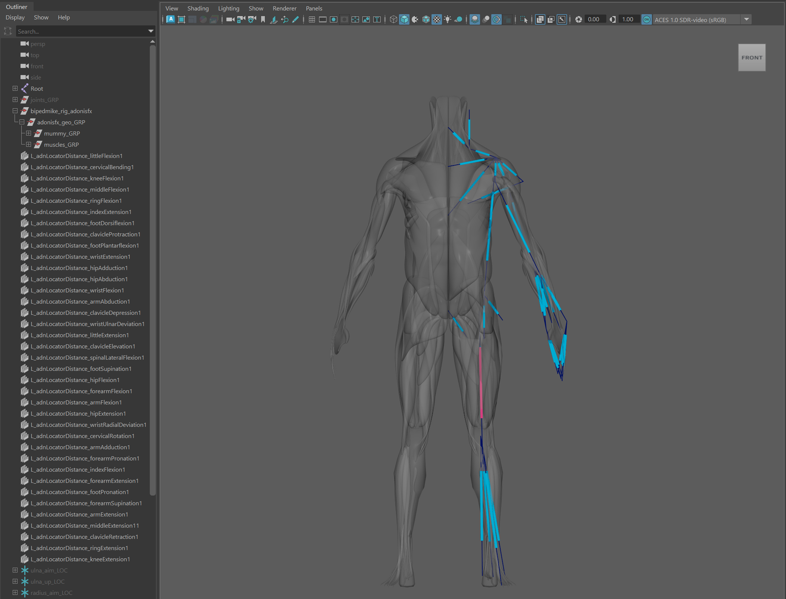
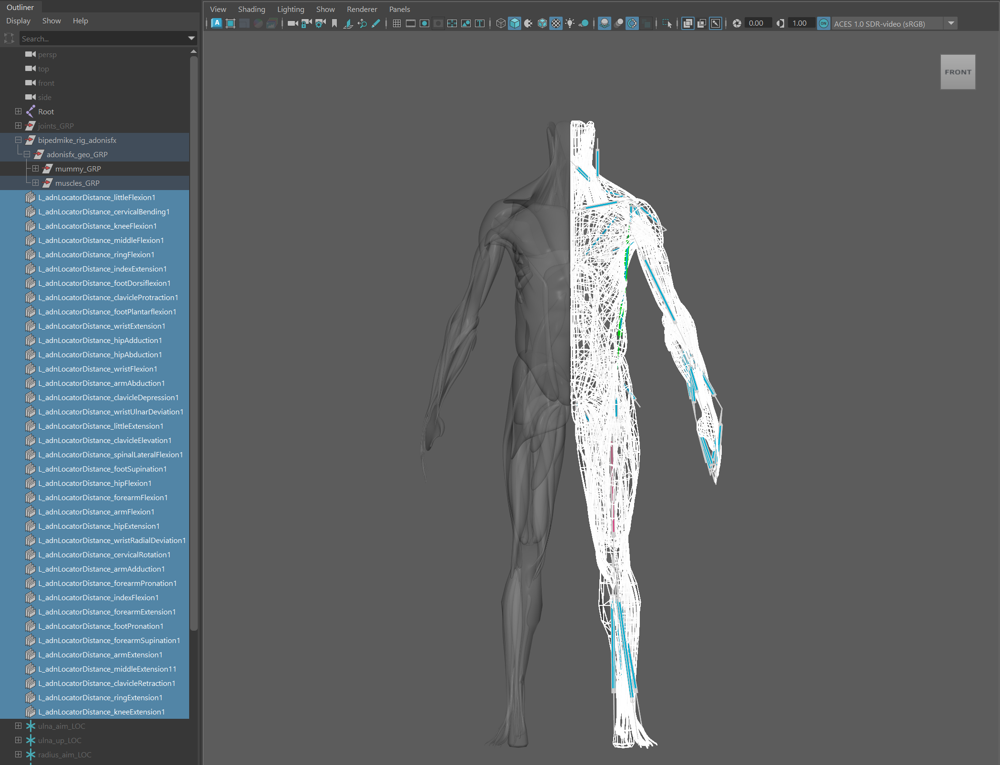
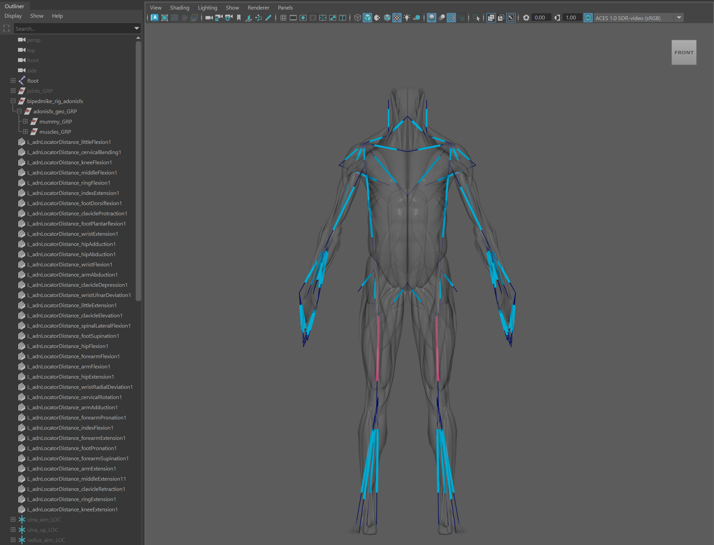

# Scripts

## Mirror

The mirroring script is a Python script that allows to transfer the AdonisFX muscle setup of an asset from one side to the other. For example, a user can complete the muscle rig for the left side of an asset and thanks to this script mirror the setup quickly and efficiently to the right side. 

Currently, the script allows to mirror:

- AdnMuscle (settings, paintable maps, geometry targets, connections to sensors).
- AdnLocators (position, distance, rotation).
- AdnSensors (position, distance, rotation).

Please, check this [section](#limitations) to know more about the current limitations.

### How To Use

The character rig to apply the mirroring onto needs to satisfy some requirements for this script to work:

- One completed side of the rig (i.e. left or right). This side will work as source, while the other will work as destination.
- Apply a naming convention to all the objects involved in the mirroring (geometries, muscle deformers, locators and sensors) to allow the script to differentiate between left and right side objects. For example, use a "l_" and "r_", or "L_" and "R_" prefix, or "\_l" and "\_r", or "\_L" and "\_R" suffix.
- The left and right muscles must be symmetric in topology. This means that both the number of vertices and the vertex IDs of a muscle (e.g. "L_biceps") must match those of its counterpart muscle (e.g. "R_biceps") to ensure the paintable maps are mirrored correctly.
- It is recommended to save the scene before executing the script.

<figure style="width:90%; margin-left:5%" markdown>
  
  <figcaption><b>Figure 1</b>: Starting point to execute the mirroring script onto a biped asset. The left side is fully configured with muscle deformers, locators and sensors following the prefix naming convention "L_*".</figcaption>
</figure>

Once the scene fulfills the requirements, then the procedure to follow is:

1. Select all geometries from the source side with an AdnMuscle applied that need to be mirrored.

2. Add to the selection all the AdonisFX Locators from the same source side that need to be mirrored. Note that sensors (as not being DAG objects) do not need to be added to the selection. The script will take care of mirroring them too.

<figure style="width:90%; margin-left:5%" markdown>
  
  <figcaption><b>Figure 2</b>: All geometry muscles and locators on the left side selected.</figcaption>
</figure>

3. Run the following command in a Python Script tab.

<pre><code style="white-space: pre; margin: 20px 0; padding: 10px; box-sizing: border-box;">from adn.scripts.maya import mirror
mirror.apply_mirror(left_convention="L_*", right_convention="R_*")
</code></pre>

4. A confirmation dialog will be displayed, reminding the user that it is recommended to have a saved version of the scene, as the mirroring process cannot be undone.

<figure style="width:60%; margin-left:20%" markdown>
  
  <figcaption><b>Figure 3</b>: Question dialog displayed to ask for confirmation before executing.</figcaption>
</figure>

5. Click *Yes* in the question dialog to proceed with the mirroring.

Depending on the complexity of the rig, this process might take a few seconds to compute. If something goes wrong during the execution, an error dialog will be displayed informing about the problem to help with the troubleshooting.

<figure style="width:90%; margin-left:5%" markdown>
  
  <figcaption><b>Figure 4</b>: Result of the execution: all AdnMuscle from the left side are replicated on the right side. Also, all the locators and sensors from the left side are created and connected on the right side.</figcaption>
</figure>

> [!NOTE]
> Depending on the need, the script can mirror only the muscles (selection from step 1), only the locators and sensors (selection from step 2), or everything at once (including both selections from step 1 and 2).

### Limitations

- Node types that are not supported: AdnRibbonMuscle deformer, AdnActivation nodes.
- Settings in AdnMuscle that are not included in the mirroring: Attachments To Transform, Slide On Segment.
- The naming convention does not allow to place the side identifier at the middle of the name (e.g. biceps_L_muscle).

## I/O
### Gather AdonisFX data from scene
Gather AdonisFX nodes from a scene into a dictionary that can then be stored into a JSON file.
<pre><code style="white-space: pre; margin: 20px 0; padding: 10px; box-sizing: border-box;">from adn.scripts.maya import adnio
adnio.gather_from_scene(enabled_features=None)
</code></pre>

- `enabled_features`: A dictionary where keys are feature names and values are flags to determine if a feature has to be gathered or bypassed. If this is not provided, all features will be gathered. An example of a feature could be AdnSkin nodes.

### Clean all AdonisFX data from scene
Clears all AdonisFX related nodes from the scene. This is useful for when AdonisFX data has to be imported on a clean version of the rig.
<pre><code style="white-space: pre; margin: 20px 0; padding: 10px; box-sizing: border-box;">from adn.scripts.maya import adnio
adnio.clear_scene()
</code></pre>

### Rebuild AdonisFX data into scene
Builds the AdonisFX data from a dictionary into the scene, using data generated by `gather_from_scene` and stored in a JSON file.
<pre><code style="white-space: pre; margin: 20px 0; padding: 10px; box-sizing: border-box;">from adn.scripts.maya import adnio
adnio.build_from_data(in_data, enabled_features=None)
</code></pre>

- `in_data`: AdonisFX dictionary with the mapped data.
- `enabled_features`: A dictionary where keys are feature names and values are flags to determine if a feature has to be built or bypassed. An example of a feature could be AdnSkin nodes.

### Import AdonisFX data
Reads the content of a JSON file provided by the `file_path` and calls `build_from_data`to rebuild the AdonisFX data in the scene.
<pre><code style="white-space: pre; margin: 20px 0; padding: 10px; box-sizing: border-box;">from adn.scripts.maya import adnio
adnio.import_data(file_path, enabled_features=None)
</code></pre>

- `file_path`: Path to the JSON file with the AdonisFX setup.
- `enabled_features`: A dictionary where keys are feature names and values are flags to determine if a feature has to be imported or not. If this is not provided, all features will be imported. An example of a feature could be AdnSkin nodes.

<!-- TODO: Add reference to import section-->

### Export AdonisFX data
Calls `gather_from_scene` gathering all AdonisFX scene data into a file and stores it as a JSON
in the file provided by `file_path`.
<pre><code style="white-space: pre; margin: 20px 0; padding: 10px; box-sizing: border-box;">from adn.scripts.maya import adnio
adnio.export_data(file_path, enabled_features=None)
</code></pre>

- `file_path`: Path to the JSON file with the AdonisFX setup.
- `enabled_features`: A dictionary where keys are feature names and values are flags to determine if a feature has to be exported or not. If this is not provided, all features will be exported.

<!-- TODO: Add reference to export section-->
