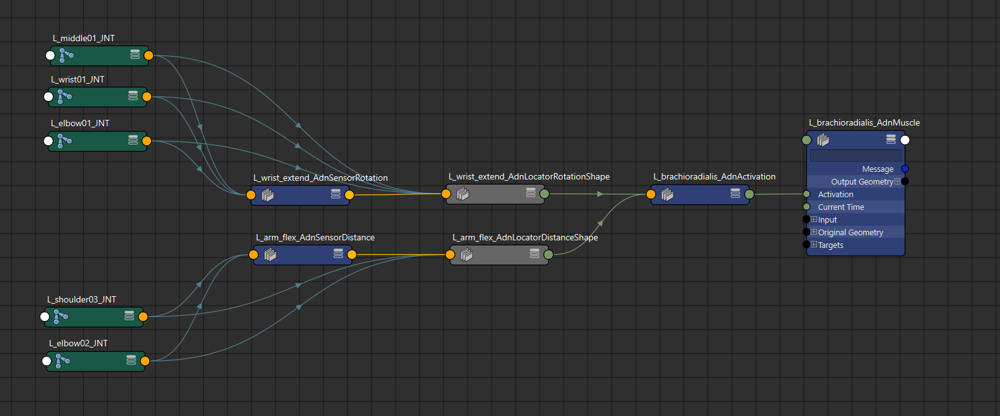

# Scripts

## Mirror

The mirroring script is a Python script that allows to transfer the AdonisFX muscle setup of an asset from one side to the other. For example, a user can complete the muscle rig for the left side of an asset and thanks to this script mirror the setup quickly and efficiently to the right side. 

Currently, the script allows to mirror:

- **AdnMuscle deformers**, including their configurations, paintable maps, geometry targets, and connections to locators.​
- The three types of **AdonisFX locators** (i.e. AdnLocatorPosition, AdnLocatorDistance, and AdnLocatorRotation).
- The three types of **AdonisFX sensors** (i.e. AdnSensorPosition, AdnSensorDistance, and AdnSensorRotation).
- **AdnActivation nodes**, including their input and output connections.

Please, check this [section](#limitations) to know more about the current limitations.

### Requirements

In order to use the mirroring script, the rig must meet the following requirements to ensure a successful transfer of the muscle setup:

- **A completed setup on one side**: One side of the rig (either left or right) must be fully configured. This completed side will serve as the **source**, while the opposite side will be the **destination** for the mirrored setup.

- **Consistent naming convention**: All objects involved in the mirroring process (including geometries, muscle deformers, locators, sensors, activation nodes and any other attachment nodes like rig joints) must follow a naming convention based on prefixes or suffixes (see Figure 1). This allows the tool to differentiate between left and right-side entities. Naming conventions can use:
    - **Prefixes**: e.g., "L_" and "R_" or "l_" and "r_".
    - **Suffixes**: e.g., "_L" and "_R" or "_l" and "_r".

- **Symmetric muscle topology**: The left and right muscles must have identical topology. This means that:
    - The **vertex count** must be the same on both sides.
    - The **vertex IDs** of a muscle (e.g., "L_biceps") must match those of its counterpart (e.g., "R_biceps").

    This ensures that paintable maps and deformer weights are transferred accurately during the mirroring process.

<figure style="width:90%; margin-left:5%" markdown>
  
  <figcaption><b>Figure 1</b>: Example of the naming convention (using "L_" prefix) applied to muscles, joints, sensors, locators and activation nodes.</figcaption>
</figure>

### How To Use

Open a scene that fulfills the requirements listed previously and follow the next steps:

<figure style="width:90%; margin-left:5%" markdown>
  
  <figcaption><b>Figure 2</b>: Starting point to execute the mirroring onto a biped asset. The left side is fully configured with muscle deformers, locators, sensors and activation nodes following the prefix naming convention "L_".</figcaption>
</figure>

1. Select all geometries from the source side that have an AdnMuscle deformer applied and need to be mirrored.

2. Add to the selection all the AdonisFX locators from the same source side that need to be mirrored. Note that sensors and activation nodes (as not being DAG objects) do not need to be added to the selection. The Mirror Tool will automatically handle their mirroring.

<figure style="width:90%; margin-left:5%" markdown>
  
  <figcaption><b>Figure 3</b>: All geometry muscles and locators on the left side selected.</figcaption>
</figure>

3. Run the following command in a Python Script tab.

<pre><code style="white-space: pre; margin: 20px 0; padding: 10px; box-sizing: border-box;">from adn.scripts.maya import mirror
mirror.apply_mirror(left_convention="L_*", right_convention="R_*")
</code></pre>

4. A confirmation dialog will appear, recommending the user to save a version of the scene before proceeding, since the mirroring process cannot be undone.

<figure style="width:60%; margin-left:20%" markdown>
  
  <figcaption><b>Figure 4</b>: Question dialog displayed to ask for confirmation before executing.</figcaption>
</figure>

5. Click *Yes* in the question dialog to proceed with the mirroring.

Depending on the complexity of the rig, this process might take a few seconds to compute. If something goes wrong during the execution, an error dialog will be displayed informing about the problem to help with the troubleshooting.

<figure style="width:90%; margin-left:5%" markdown>
  
  <figcaption><b>Figure 5</b>: Result of the execution: all AdnMuscle from the left side are replicated on the right side. Additionally, all the locators, sensors and activation nodes from the left side are created and connected on the right side.</figcaption>
</figure>

> [!NOTE]
> Depending on the need, the script can mirror only the muscles (selection from step 1), only the locators and sensors (selection from step 2), or everything at once (including both selections from step 1 and 2).

> [!NOTE]
> The mirroring process can also be executed with the **Mirror Tool**. For more details, please refer to the [Mirror Tool page](tools/mirror_tool).

### Limitations

- The naming convention does not allow to place the side identifier at the middle of the name (e.g. biceps_L_muscle).
- The mirroring logic does not allow to mirror intermediate nodes between the AdnActivation and the AdnMuscle deformer.

## I/O
### Gather AdonisFX data from scene
Gather AdonisFX nodes from a scene into a dictionary that can then be stored into a JSON file.
<pre><code style="white-space: pre; margin: 20px 0; padding: 10px; box-sizing: border-box;">from adn.scripts.maya import adnio
adnio.gather_from_scene(enabled_features=None)
</code></pre>

- `enabled_features`: A dictionary where keys are feature names and values are flags to determine if a feature has to be gathered or bypassed. If this is not provided, all features will be gathered. An example of a feature could be AdnSkin nodes.
  <pre><code style="white-space: pre; margin: 20px 0; padding: 10px; box-sizing: border-box;">enabled_features = {'MUSCLE_DATA': True, 'GLUE_DATA': True, 'FAT_DATA': True, 'SKIN_DATA': True, 'SKIN_MERGE_DATA': True, 'RELAX_DATA': True, 'SENSOR_DATA': True, 'ACTIVATION_DATA': True}</code></pre>

### Clean all AdonisFX data from scene
Clears all AdonisFX related nodes from the scene. This is useful for when AdonisFX data has to be imported on a clean version of the rig.
<pre><code style="white-space: pre; margin: 20px 0; padding: 10px; box-sizing: border-box;">from adn.scripts.maya import adnio
adnio.clear_scene()
</code></pre>

### Rebuild AdonisFX data into scene
Builds the AdonisFX data from a dictionary into the scene, using data generated by `gather_from_scene` and stored in a JSON file.
<pre><code style="white-space: pre; margin: 20px 0; padding: 10px; box-sizing: border-box;">from adn.scripts.maya import adnio
adnio.build_from_data(in_data, enabled_features=None)
</code></pre>

- `in_data`: AdonisFX dictionary with the mapped data.
- `enabled_features`: A dictionary where keys are feature names and values are flags to determine if a feature has to be built or bypassed. An example of a feature could be AdnSkin nodes.
  <pre><code style="white-space: pre; margin: 20px 0; padding: 10px; box-sizing: border-box;">enabled_features = {'MUSCLE_DATA': True, 'GLUE_DATA': True, 'FAT_DATA': True, 'SKIN_DATA': True, 'SKIN_MERGE_DATA': True, 'RELAX_DATA': True, 'SENSOR_DATA': True, 'ACTIVATION_DATA': True}</code></pre>

### Import AdonisFX data
Reads the content of a JSON file provided by the `file_path` and calls `build_from_data`to rebuild the AdonisFX data in the scene.
<pre><code style="white-space: pre; margin: 20px 0; padding: 10px; box-sizing: border-box;">from adn.scripts.maya import adnio
adnio.import_data(file_path, enabled_features=None)
</code></pre>

- `file_path`: Path to the JSON file with the AdonisFX setup.
- `enabled_features`: A dictionary where keys are feature names and values are flags to determine if a feature has to be imported or not. If this is not provided, all features will be imported. An example of a feature could be AdnSkin nodes.
  <pre><code style="white-space: pre; margin: 20px 0; padding: 10px; box-sizing: border-box;">enabled_features = {'MUSCLE_DATA': True, 'GLUE_DATA': True, 'FAT_DATA': True, 'SKIN_DATA': True, 'SKIN_MERGE_DATA': True, 'RELAX_DATA': True, 'SENSOR_DATA': True, 'ACTIVATION_DATA': True}</code></pre>

Find more information about the use of the import feature in the [Importer](maya/tools/importer#importer) page.

### Export AdonisFX data
Calls `gather_from_scene` gathering all AdonisFX scene data into a file and stores it as a JSON
in the file provided by `file_path`.
<pre><code style="white-space: pre; margin: 20px 0; padding: 10px; box-sizing: border-box;">from adn.scripts.maya import adnio
adnio.export_data(file_path, enabled_features=None)
</code></pre>

- `file_path`: Path to the JSON file with the AdonisFX setup.
- `enabled_features`: A dictionary where keys are feature names and values are flags to determine if a feature has to be exported or not. If this is not provided, all features will be exported. Example: 
  <pre><code style="white-space: pre; margin: 20px 0; padding: 10px; box-sizing: border-box;">enabled_features = {'MUSCLE_DATA': True, 'GLUE_DATA': True, 'FAT_DATA': True, 'SKIN_DATA': True, 'SKIN_MERGE_DATA': True, 'RELAX_DATA': True, 'SENSOR_DATA': True, 'ACTIVATION_DATA': True}</code></pre>

Find more information about the use of the export feature in the [Exporter](maya/tools/exporter#exporter) page.
