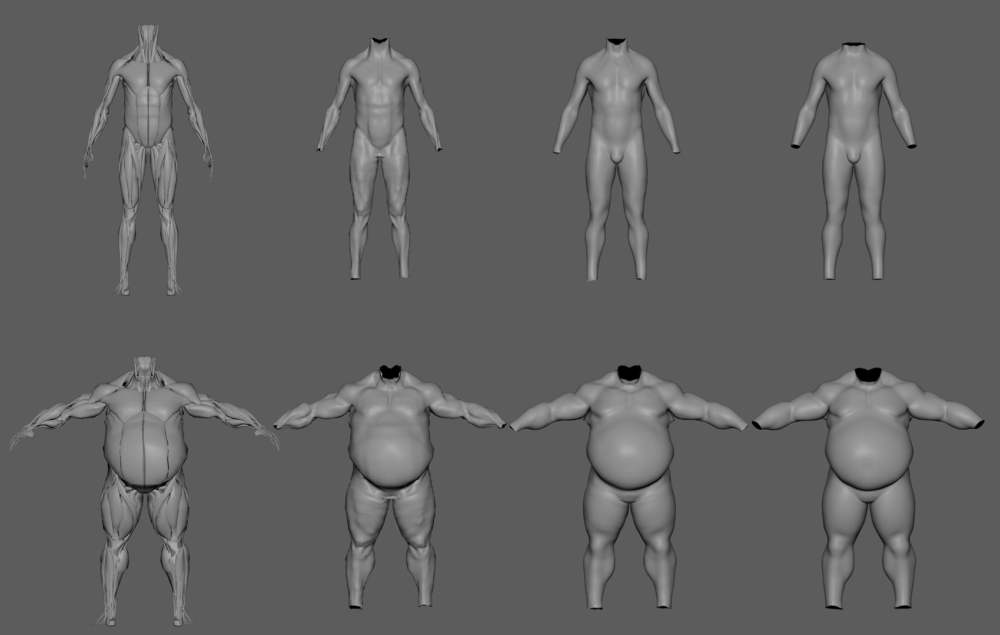

# AdnTransfer

The AdnTransfer script is a Python Script designed to automate the transfer of anatomy layers after the primary anatomy transfer has been completed using [AdnRadialWrap](../deformers/radial_wrap) and the [Landmark Tool](../tools/landmark_tool.md).

In the anatomy transfer workflow, AdnRadialWrap is first used to reshape and repose the **skin** and **mummy** geometries. Once these geometries have been transferred, the AdnTransfer propagates the resulting deformation to the remaining anatomy layers by automatically creating and configuring the required [AdnSoftWrap](../deformers/soft_wrap) and [AdnRigidWrap](../deformers/rigid_wrap) deformers.

This allows the complete anatomy hierarchy to be transferred from one character to another while preserving the spatial relationships between the different anatomical layers.

After completing the anatomy transfer workflow, an existing Adonis simulation rig created for the source character can also be reused and imported on the transferred anatomy. This allows simulation setups authored for a template character to be adapted to new characters after the anatomy transfer process.

The main function to run AdnTransfer is `apply_transfer`, which is defined as follows:

<pre><code style="white-space: pre; margin: 20px 0; padding: 10px; box-sizing: border-box;">from adn.scripts.maya.transfer import apply_transfer

def apply_transfer(
    morphed_skin,       # str: morphed skin geometry (e.g. the result of AdnRadialWrap)
    morphed_mummy,      # str: morphed mummy geometry (e.g. the result of AdnRadialWrap)
    sim_skin,           # str: name of the skin cut to be transferred.
    fat,                # str: name of the fat geometry to be transferred.
    muscles,            # str or list: name of the muscle geometries to be transferred.
    fascia,             # str: name of the fascia geometry to be transferred.
    radius=None,        # float: radius value for the AdnSoftWrap nodes created.
    max_points=False,   # int: number of maximum points for the AdnSoftWrap nodes created.
    force=False,        # bool: whether to force the transfer process even if existing deformers are present.
    report_data=None    # dict: collects errors and warnings
)
</code></pre>

## Requirements

To use the AdnTransfer script, the following inputs must be provided:

- **morphed_skin**: skin geometry already deformed using AdnRadialWrap.
- **morphed_mummy**: mummy geometry already deformed using AdnRadialWrap.
- **sim_skin**: skin cut geometry to be transferred.
- **fat**: fat geometry to be transferred.
- **muscles**: one or more muscle geometries to be transferred.
- **fascia**: fascia geometry to be transferred.

The following parameters are also available:

- **radius**: Search radius used by the generated AdnSoftWrap deformers.
- **max_points**: Maximum number of neighboring points considered by the generated AdnSoftWrap deformers.

> [!NOTE]
> - The *morphed_skin* and *morphed_mummy* geometries are expected to already contain the desired anatomy transfer deformation, typically generated using AdnRadialWrap. Refer to the [AdnRadialWrap](../deformers/radial_wrap) page for more information.
> - Additionally, the AdnRigidWrap and AdnSoftWrap deformers created by AdnTransfer require their target geometries to be in their rest pose during initialization. To achieve this, we recommend setting two keyframes on the *envelope* attribute of both AdnRadialWrap deformers: a value of `0` on the initialization frame and a value of `1` on the following frame. This allows the generated AdnRigidWrap and AdnSoftWrap deformers to initialize using the non-deformed target geometries and subsequently transfer the deformation once the AdnRadialWrap deformers become active.

## Arguments

In this section we provide a brief overview of the arguments of the `apply_transfer` function.

| Argument | Required | Type | Default | Description |
| :------- | :------- | :--- | :------ | :---------- |
| **morphed_skin**  | Yes      | string         |       | Skin mesh already deformed using AdnRadialWrap. It can be: 1) name of the geometry; 2) group containing the geometry. |
| **morphed_mummy** | Yes      | string         |       | Mummy mesh already deformed using AdnRadialWrap. It can be: 1) name of the geometry; 2) group containing the geometry. |
| **sim_skin**      | Yes      | string         |       | Skin cut mesh to be transferred. It can be: 1) name of the geometry; 2) group containing the geometry. |
| **fat**           | Yes      | string         |       | Fat mesh to be transferred. It can be: 1) name of the geometry; 2) group containing the geometry. |
| **muscles**       | Yes      | string or list |       | Muscle meshes to be transferred. It can be: 1) name of one single geometry; 2) a transform group containing multiple geometries; 3) a list of geometry names; 4) a list of groups containing multiple geometries. |
| **fascia**        | Yes      | string         |       | Fascia mesh to be transferred. It can be: 1) name of the geometry; 2) group containing the geometry. |
| **radius**        | Optional | float          | None  | Radius attribute that will be set to the AdnSoftWrap deformers created. |
| **max_points**    | Optional | integer        | None  | Maximum points attribute that will be set to the AdnSoftWrap deformers created. |
| **report_data**   | Optional | dictionary     | None  | A dictionary (`{"errors": [], "warnings": []}`) to capture any issues during execution. |

## How To Use

1. Open a scene containing all the geometries to be provided to AdnTransfer.

2. Create the arguments for the `apply_transfer` function.

<pre><code style="white-space: pre; margin: 20px 0; padding: 10px; box-sizing: border-box;">morphed_skin = "skin_GEO"
morphed_mummy = "mummy_GEO"
sim_skin = "simSkin_GEO"
fat = "fat_GEO"
muscles = "muscles_GRP"
fascia = "fascia_GEO"
radius = 7.0
max_points = 20
report_data = {"errors": [], "warnings": []}
</code></pre>

3. Run the following command in a Python Script tab by providing the previous arguments.

<pre><code style="white-space: pre; margin: 20px 0; padding: 10px; box-sizing: border-box;">from adn.scripts.maya.transfer import apply_transfer
apply_transfer(
    morphed_skin,
    morphed_mummy,
    sim_skin,
    fat,
    muscles,
    fascia,
    radius=radius,
    max_points=max_points,
    report_data=report_data
)
</code></pre>

<figure style="width:90%; margin-left:5%" markdown>
  
  <figcaption><b>Figure 1</b>: Result of the AdnTransfer process. From left to right: muscles, fascia, fat, and skin. Original geometries are shown on top and transferred geometries on the bottom. </figcaption>
</figure>

4. If something goes wrong during the execution, error and warning messages will be added to the `report_data` dictionary. Execute the following code to log all the information in the terminal for troubleshooting.

<pre><code style="white-space: pre; margin: 20px 0; padding: 10px; box-sizing: border-box;">import logging
for err in report_data["errors"]:
    logging.error(err)
for warn in report_data["warnings"]:
    logging.warning(warn)
</code></pre>

The script automatically creates and configures the required AdnSoftWrap and AdnRigidWrap deformers to propagate the deformation through the anatomy hierarchy.

If the *Radius* value used by the generated AdnSoftWrap deformers is too small, some points may fail to find any valid neighbor points within the search area. In such cases, no deformation will be transferred to those points. Make sure the radius is large enough relative to the character dimensions to guarantee that all points can find suitable neighbors.

> [!NOTE]
> - Note that the whole AdnTransfer can be undone.
> - AdnTransfer can also be executed with the **AdnTransfer Tool**. For more details, please refer to the [AdnTransfer Tool page](../tools/transfer_tool).

## Result

As a result of executing the script, the following nodes will be created:

- An AdnRigidWrap applied to the *Skin Cut* geometry using the *Morphed Skin* as target.
- An AdnSoftWrap applied to the *Fat* geometry using the transferred *Skin Cut* as target.
- An AdnSoftWrap applied to each muscle geometry using both the transferred *Fat* and the *Morphed Mummy* as targets.
- An AdnRigidWrap applied to the *Fascia* geometry using all transferred muscles as targets.

Once all deformers have been created, the deformation is propagated from the *Morphed Skin* and *Morphed Mummy* through all anatomy layers, completing the anatomy transfer workflow.

## Limitations
- All anatomy layers must be provided. The script does not support transferring only a subset of the required geometries.
