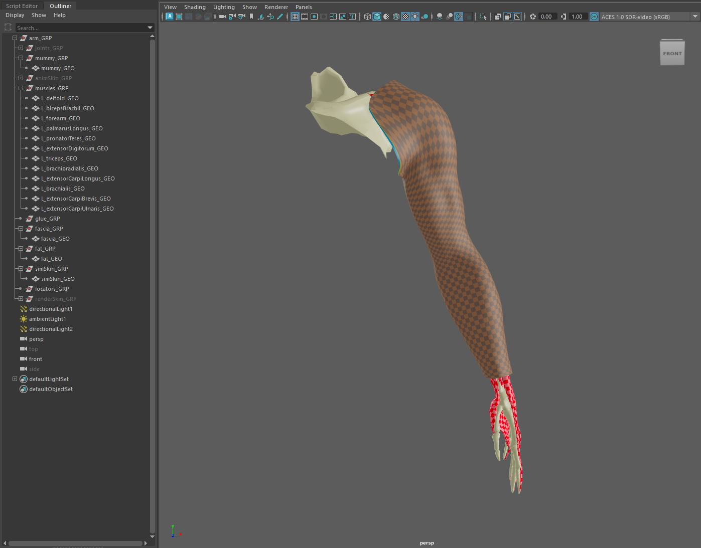
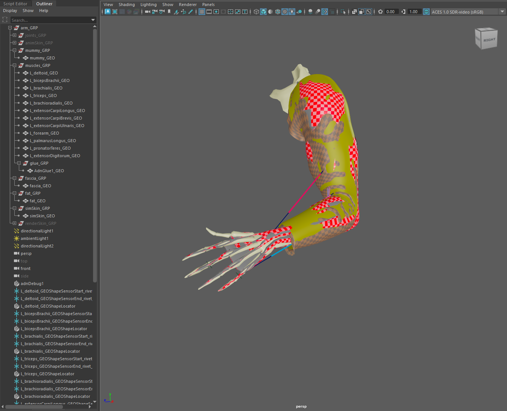

# AdnTurbo

The AdnTurbo script is a Python script that automates the setup of an AdonisFX rig on a clean asset. It configures the following layers in sequence:

- **Muscle layer**  
- **Locators and Sensors**
- **Glue layer**  
- **Fascia layer**  
- **Fat layer**  
- **Skin layer** 

Please, check this [section](#limitations) to know more about the current limitations.

The main function to run AdnTurbo is `apply_turbo`, which is defined as follows:

<pre><code style="white-space: pre; margin: 20px 0; padding: 10px; box-sizing: border-box;">from adn.scripts.maya.turbo import apply_turbo

def apply_turbo(
    mummy,                          # str: name or path of the skeletal mesh
    muscles,                        # str or list: muscle geometry names
    fascia=None,                    # str: fascia geometry name
    fat=None,                       # str: fat geometry name
    skin=None,                      # str: skin geometry name
    glue=True,                      # bool: enable glue layer
    glue_group_name=None,           # str: group name for glue output geometry
    create_glue_group=False,        # bool: auto-create glue_group_name if it does not exist
    locators=True,                  # bool: enable creation of locators and sensors
    locators_group_name=None,       # str: group name for locators and rivet nodes
    create_locators_group=False,    # bool: auto-create locators_group_name if it does not exist
    space_scale=1.0,                # float: simulation scale factor
    force=False,                    # bool: remove existing AdonisFX nodes
    report_data=None                # dict: collects errors and warnings
)
</code></pre>

## Requirements

Each layer builds upon the previous one, this means that a specific layer cannot be created unless all the previous layer inputs have been provided. This rule applies to all the layers except for **Locators and Sensors**, which can be enabled or disabled without affecting the building of other layers.

To configure at least the muscle layer, the following inputs are required:

- **mummy**: the skeletal mesh that drives the muscle simulation.
- **muscles**: one or more meshes representing muscles.

When these two inputs are provided, the muscle layer will be completely configured including AdonisFX locators and sensors.

To configure the downstream layers, the following inputs have to be provided:

- **locators**: flag indicating if locators and sensors have to be built.
- **glue**: flag indicating if the glue layer has to be built.
- **fascia**: the fascia mesh to which AdnSkin is applied. The **glue** input must be `True` for the fascia layer to be built.
- **fat**: the fat mesh to which AdnFat is applied. The **fascia** input must be provided for the fat layer to be built.
- **skin**: the skin mesh to which AdnSkin is applied. The **fat** input must be provided for the skin layer to be built.

## Arguments

In this section we provide a brief overview of the arguments of the `apply_turbo` function.

| Argument | Required | Type | Default | Description |
| :------- | :------- | :--- | :------ | :---------- |
| **mummy**                 | Yes      | string         |       | Skeletal mesh that drives the muscle simulation. It can be: 1) the name of the geometry (short name or full path); 2) a group containing the geometry. |
| **muscles**               | Yes      | string or list |       | Geometries to apply a muscle deformer to. It can be: 1) name of one single geometry; 2) a transform group containing multiple geometries; 3) a list of geometry names; 4) a list of groups containing multiple geometries. |
| **fascia**                | Optional | string         | None  | Geometry to apply the skin deformer to. It can be: 1) name of the fascia geometry; 2) group containing the fascia geometry. Requires `glue=True`. |
| **fat**                   | Optional | string         | None  | Geometry to apply the fat deformer to. It can be: 1) name of the fat geometry; 2) group containing the fat geometry. Requires fascia to be provided first. |
| **skin**                  | Optional | string         | None  | Geometry to apply the skin deformer to. It can be: 1) name of the skin geometry; 2) group containing the skin geometry. Requires fat to be provided first. |
| **glue**                  | Optional | bool           | True  | If True, creates an AdnGlue node using all muscles as inputs. |
| **glue_group_name**       | Optional | string         | None  | Name of the group where the glue geometry will be placed. |
| **create_glue_group**     | Optional | bool           | False | If True and `glue_group_name` is provided, the group is created if it does not exist. |
| **locators**              | Optional | bool           | True  | If True, creates rivets, sensors and locators for each muscle. |
| **locators_group_name**   | Optional | string         | None  | Name of the group where the locators and rivets will be placed. |
| **create_locators_group** | Optional | bool           | False | If True and `locators_group_name` is provided, the group is created if it does not exist. |
| **space_scale**           | Optional | float          | 1.0   | Factor to scale simulation space. It will be set to the space scale attribute of all the solvers created. |
| **force**                 | Optional | bool           | False | If True, deletes all existing AdonisFX nodes before executing to create the new nodes from a clean scene. Note that auxiliary nodes (e.g. rivets) or meshes created by an existing AdnGlue node will not be deleted. |
| **report_data**           | Optional | dictionary     | None  | A dictionary (`{"errors": [], "warnings": []}`) to capture any issues during execution. |

## How to use

1. Open a scene containing the geometries for all the layers to be built.

<figure style="width:90%; margin-left:5%" markdown>
  
  <figcaption><b>Figure 1</b>: Starting point to execute the AdnTurbo script onto an arm asset. The scene contains the geometries for: mummy, muscles, fascia, fat and skin. Additionally the groups for the glue geometry and the locators are present in the scene.</figcaption>
</figure>

2. Create the arguments for the `apply_turbo` function.

<pre><code style="white-space: pre; margin: 20px 0; padding: 10px; box-sizing: border-box;">mummy       = "mummy_GEO"
muscles     = ["L_deltoid_GEO", "L_bicepsBrachii_GEO", "L_brachialis_GEO", "L_triceps_GEO", ...]
locators    = True
glue        = True
fascia      = "fascia_GEO"
fat         = "fat_GEO"
skin        = "simSkin_GEO"
report_data = {"errors": [], "warnings": []}
</code></pre>

3. Run the following command in a Python Script tab by providing the previous arguments.

<pre><code style="white-space: pre; margin: 20px 0; padding: 10px; box-sizing: border-box;">from adn.scripts.maya.turbo import apply_turbo
apply_turbo(
    mummy,
    muscles,
    fascia=fascia,
    fat=fat,
    skin=skin,
    glue=glue,
    locators=locators,
    report_data=report_data
)
</code></pre>

4. Additionally, to place the glue geometry in a specific group, specify its name via the `glue_group_name` argument. Likewise, to place locator and rivet nodes into their own group, use the `locators_group_name` argument. If the named group (for either glue or locators) does not exist, simply set the corresponding flag (i.e. `create_glue_group` or `create_locators_group` respectively) to `True`, and the AdnTurbo script will create it automatically.

<pre><code style="white-space: pre; margin: 20px 0; padding: 10px; box-sizing: border-box;">from adn.scripts.maya.turbo import apply_turbo

mummy                 = "mummy_GEO"
muscles               = ["L_deltoid_GEO", "L_bicepsBrachii_GEO", "L_brachialis_GEO", "L_triceps_GEO", ...]
glue                  = True
glue_group_name       = "glue_GRP"
create_glue_group     = True
locators              = True
locators_group_name   = "locators_GRP"
create_locators_group = True
fascia                = "fascia_GEO"
fat                   = "fat_GEO"
skin                  = "simSkin_GEO"
report_data           = {"errors": [], "warnings": []}

apply_turbo(
    mummy,
    muscles,
    fascia=fascia,
    fat=fat,
    skin=skin,
    glue=glue,
    glue_group_name=glue_group_name,
    create_glue_group=create_glue_group,
    locators=locators,
    locators_group_name=locators_group_name,
    create_locators_group=create_locators_group,
    report_data=report_data
)
</code></pre>

<figure style="width:90%; margin-left:5%" markdown>
  
  <figcaption><b>Figure 2</b>: All simulation layers configured after the execution: muscles, glue, fascia, fat and skin (including locators and sensors).</figcaption>
</figure>

5. If something goes wrong during the execution, error and warning messages will be added to the `report_data` dictionary. Execute the following code to log all the information in the terminal for troubleshooting.

<pre><code style="white-space: pre; margin: 20px 0; padding: 10px; box-sizing: border-box;">import logging
for err in report_data["errors"]:
    logging.error(err)
for warn in report_data["warnings"]:
    logging.warning(warn)
</code></pre>

> [!NOTE]
> - Note that the whole AdnTurbo can be undone.
> - If multiple geometries or groups share the same name in different groups (e.g. group1|geo and group2|geo, group1|group3 and group2|group3), providing the full DAG path will be required.
> - If there are AdonisFX nodes in the scene and the `force` argument is set to `False` the AdnTurbo script will generate an error in `report_data` indicating to clear the scene or to run the script again with `force=True` to automatically delete all the AdonisFX nodes.
> - Fascia and fat meshes must have the same topology for the AdnFat deformer to be created by AdnTurbo.
> - AdnTurbo can also be executed with the **AdnTurbo Tool**. For more details, please refer to the [AdnTurbo Tool page](../tools/turbo_tool).

## Result

As a result of executing the script by providing the geometries for all the layers, the following nodes will be created:

- An AdnMuscle for each muscle geometry with the mummy geometry as target.
- An AdonisFX locator and sensor for each AdnMuscle to drive the muscle activation.
- An AdnGlue node (including its glue output geometry) with all the muscles as inputs.
- An AdnSkin node for the fascia geometry with the mummy and glue geometries as targets.
- An AdnRelax node applied on top of the fascia AdnSkin.
- An AdnFat node for the fat geometry with the fascia geometry as base mesh.
- An AdnRelax node applied on top of the AdnFat.
- An AdnSkin node for the skin geometry.

## Limitations

- The glue layer cannot be bypassed. This means that if the `fascia` argument is provided, the `glue` flag must be `True` for the script to complete successfully.
- If the `force` flag is set to `True` the script will automatically remove all the AdonisFX nodes from the scene (if any). However, other auxiliary nodes created in previous executions of the script will not be removed (i.e. glue output geometry, rivet nodes).
- The default values that the AdnTurbo script will use to configure each deformer cannot be customized.
- AdnTurbo does not support namespaces in object paths.
