# A Simple Setup

This page is dedicated to explain, step by step, a simple process of creating and setting every AdonisFX deformer in Maya. The scenarios presented here are intended to provide the minimum required configurations to obtain plausible results.

## AdnSkin

To create a basic scenario using the AdnSkin deformer, start with a scene with the following elements:

  - A target mesh with deformation.
  - A skin mesh without animation or deformation.

The AdnSkin deformer will get applied to the second mesh which will become the simulated mesh.

<figure>
   
  <figcaption><b>Figure 1</b>: Basic setup for skin simulations.</figcaption>
</figure>

### Create Deformer

To create the AdnSkin deformer select the target mesh and then the skin mesh. Then press the 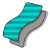{style="width:4%"} shelf button or go to AdonisFX Menu > *Skin*.

To create the AdnSkin deformer with some initial customization, double-click the shelf button or press the option box in the menu item. This will display a pop-up window that will allow to do some initial customization, as well as creating the deformer with a custom name. Once all data has been provided press the *Create* button and the deformer will get created.

<figure>
  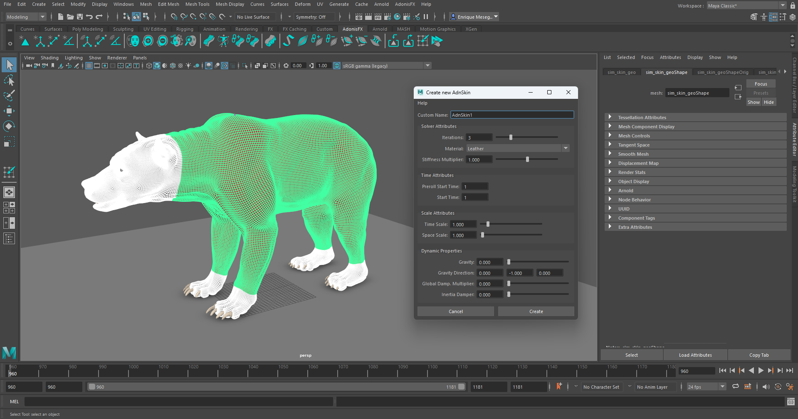 
  <figcaption><b>Figure 2</b>: AdnSkin deformer creation scenario.</figcaption>
</figure>

### Paint Weights

Once the AdnSkin deformer is properly created it is possible now to paint its weights to correctly setup the deformer properties. To do so, select the simulated mesh and press the 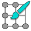{style="width:4%"} shelf button or go to AdonisFX Menu > *Paint Tool*.

Start by painting *Soft Constraints* by selecting the option from the attribute enumerator. Flood this weight to a low value of 0.2 to have a uniform distribution of soft constraints. This will help the skin to follow the reference mesh.

<figure>
  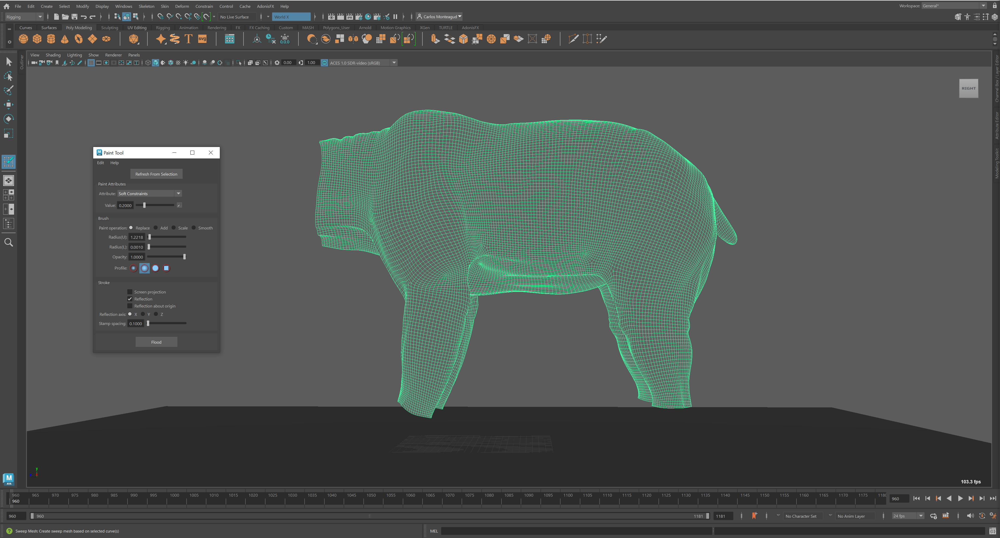 
  <figcaption><b>Figure 3</b>: Soft Constraints weights paint.</figcaption>
</figure>

Now paint *Hard Constraints* in two steps. First, flood this weight to a value of 0.1 to help the skin (together with the soft weights) to follow the reference mesh. Then, set the edges to 1.0 to attach them strongly to the reference mesh.  

<figure>
  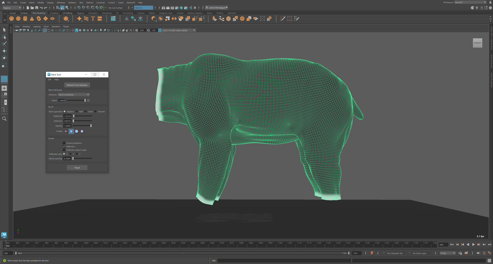 
  <figcaption><b>Figure 4</b>: Hard Constraints weights paint.</figcaption>
</figure>

Then select the *Slide Constraints* attribute and paint weights only in those areas where the skin is supposed to slide over the reference mesh. In this case, focus these weights over the scapulas and the joints of the limbs.

<figure>
  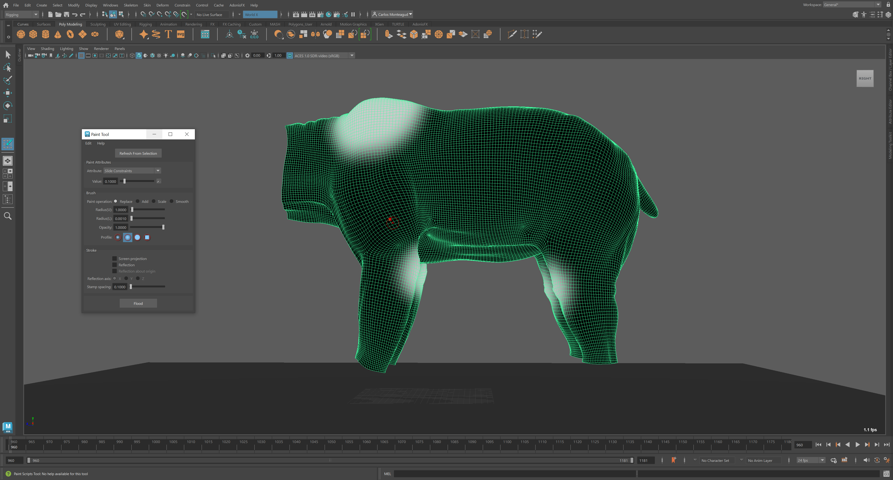 
  <figcaption><b>Figure 5</b>: Slide Constraints weights paint.</figcaption>
</figure>

Finally, select the *Sliding Distance Multiplier* attribute and paint weights to 1.0 only in the sliding areas. This will ensure that the vertices with sliding properties will get assigned with the maximum sliding distance (defined by the *Max Sliding Distance* attribute), while the non-sliding vertices will get assigned with 0.0 sliding distance, which will improve the performance of the simulation.

<figure>
  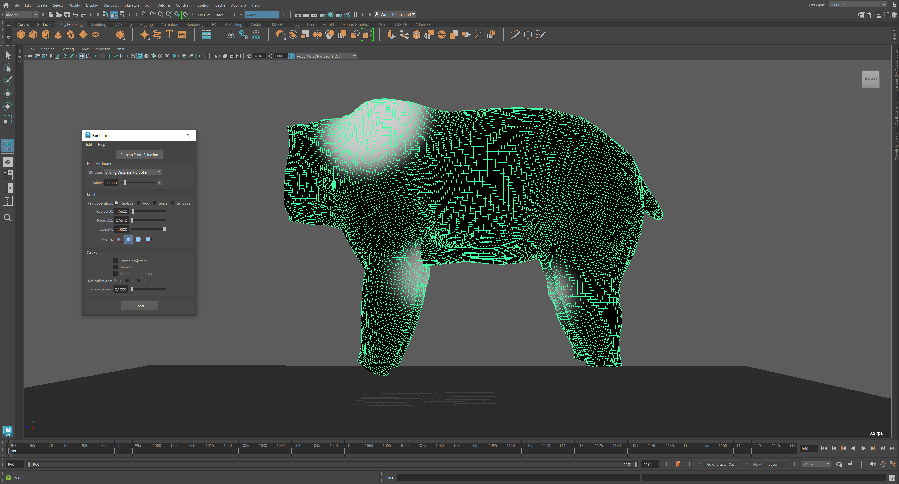 
  <figcaption><b>Figure 6</b>: Sliding Distance Multiplier weights paint.</figcaption>
</figure>

The order of painting is important because after every stroke a normalization of weights soft, hard and slide is performed to ensure that the sum is less or equal to 1.0. In this example, after painting *Slide Constraints*, both *Hard Constraints* and *Soft Constraints* will update reducing their respective values in the areas painted with maximum sliding.

With this basic paint setup the AdnSkin deformer will already show plausible results, expected of the skin to the reference target mesh. However, the possible parameters and tweaks to dis☻play high fidelity dynamics can be seen in the documentation for [AdnSkin](skin).

## AdnMuscle

To create a basic scenario using the AdnMuscle deformer, start with a scene with the following elements:

 - An animation rig.
 - A geometry representing the muscle to simulate.

In this case the proposed example is to simulate a biceps in an animated full body rig. The AdnMuscle deformer will be applied to the mesh of the biceps.

<figure>
  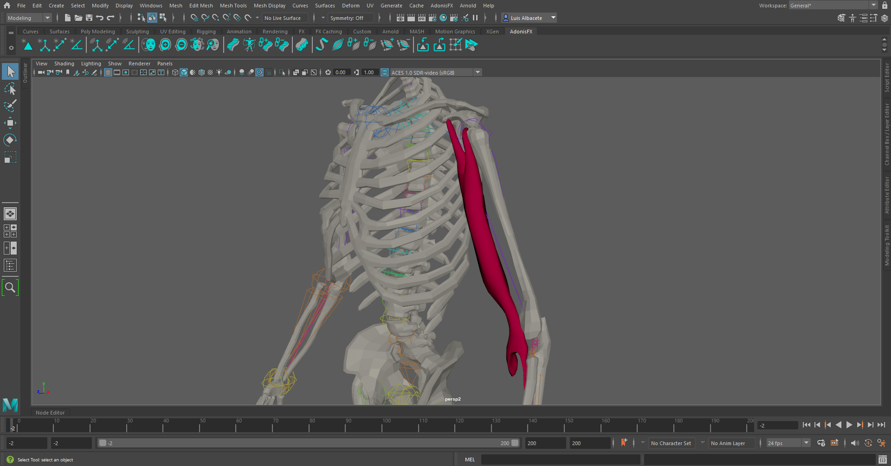 
  <figcaption><b>Figure 7</b>: Basic setup for biceps simulations.</figcaption>
</figure>

### Create Deformer

To create the AdnMuscle deformer select the mesh of the muscle, then press the {style="width:4%"} shelf button or go to AdonisFX Menu > *Solvers* > *Muscle*. This will assign the AdnMuscle deformer to the selected muscle.

<figure>
  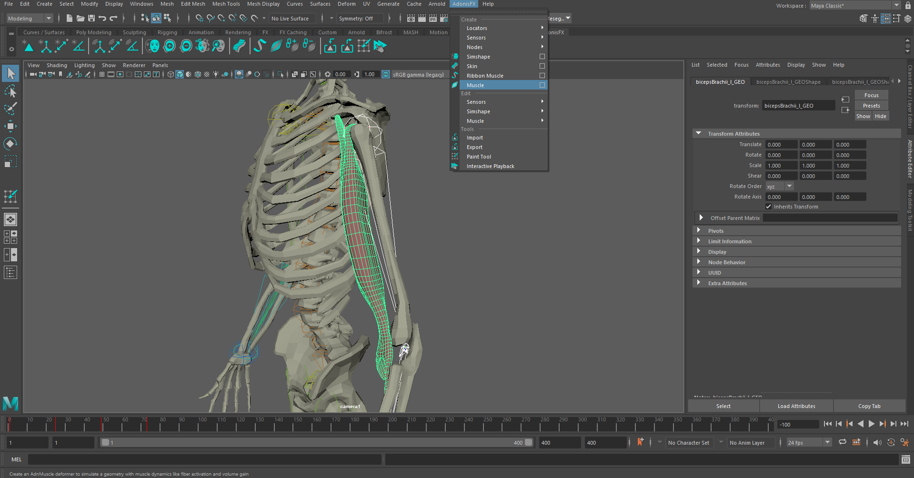 
  <figcaption><b>Figure 8</b>: AdnMuscle deformer creation scenario.</figcaption>
</figure>

To create the AdnMuscle deformer with some initial customization, double-click the shelf button or press the option box in the menu item. This will display a pop-up window that will allow to do some initial customization, as well as creating the deformer with a custom name. Once all data has been provided press the *Create* button and the deformer will get created.

<figure>
  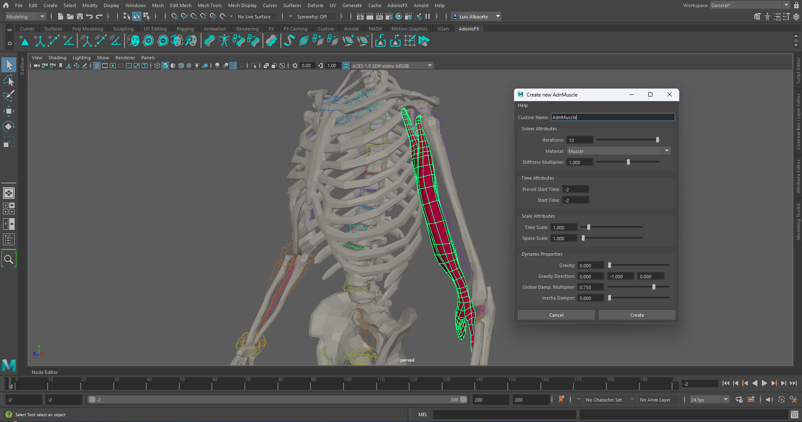 
  <figcaption><b>Figure 9</b>: AdnMuscle custom creation UI.</figcaption>
</figure>

In order to add attachments constraints to the muscle we will select the targets (joints, geometries or both), then the muscle with the AdnMuscle applied and finally press the {style="width:4%"} button or *Add Targets* in the AdonisFX menu from the Edit Muscle submenu.

<figure>
  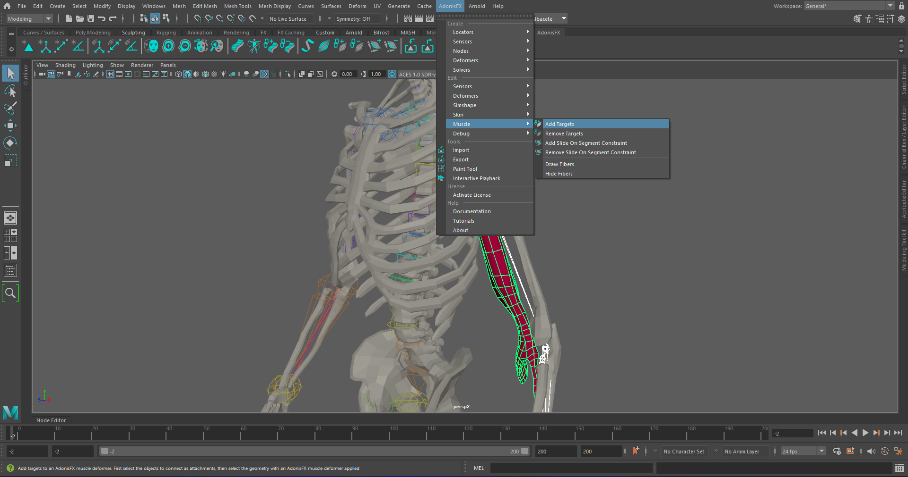
  <figcaption><b>Figure 10</b>: Addition of transform targets to AdnMuscle.</figcaption>
</figure>

<figure>
  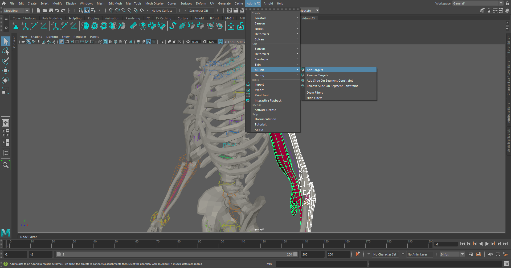
  <figcaption><b>Figure 11</b>: Addition of geometry targets to AdnMuscle.</figcaption>
</figure>

Optionally, add Slide On Segment Constraints. This constraint type is recommended for muscles in the limbs of the character to follow better the animation. With the same selection, first the two joints of the rig (shoulder and elbow) and then the muscle geometry, go to AdonisFX Menu > Muscle > *Add Slide On Segment Constraint*.

### Paint Weights

Once the AdnMuscle deformer is properly created it is possible now to paint its weights to correctly setup the deformer properties. To do so, select the simulated mesh and press the {style="width:4%"} shelf button or go to AdonisFX Menu > *Paint Tool*.

Start by painting attachment weights, painting the influence for each target by selecting the corresponding target from the list and painting its desired influence.

> [!NOTE]
> In this example the influence painting for both types of attachment constraint is shown. The different types of attachments can be used together or not depending on the needs of the simulation and the rig setup.

<figure>
  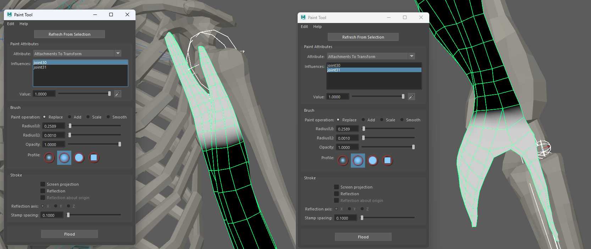
  <figcaption><b>Figure 12</b>: Transform Attachment influences.</figcaption>
</figure>

<figure>
  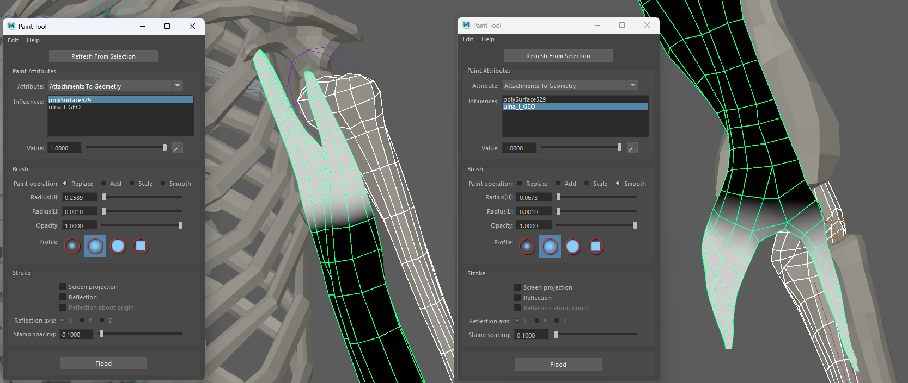
  <figcaption><b>Figure 13</b>: Geometry Attachment influences.</figcaption>
</figure>

Then, paint the muscle tendon weights, by selecting the *Tendon* attribute from the *Attribute* enumerator and paint over the parts of the muscle that should have tendon tissue.

<figure>
  
  <figcaption><b>Figure 14</b>: Tendon weights for biceps.</figcaption>
</figure>

Once tendons are painted, when selecting the *Fibers* attribute from the *Attribute* enumerator, painted fibers will be displayed, with a default direction set by the painted tendons. It is now possible to freely comb these fibers if it is desired.

To change the fiber size or its color, go to the Attribute Editor, in the debug submenu, and customize the color, width and length of the drawn lines.

<figure>
  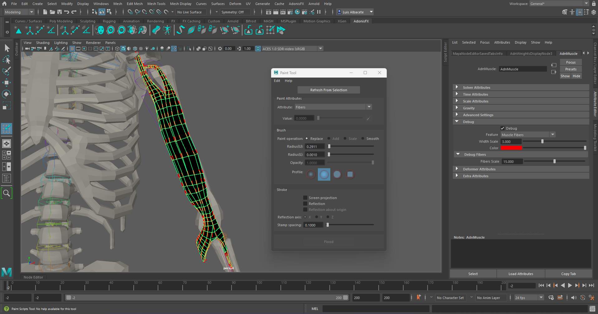
  <figcaption><b>Figure 15</b>: Muscle fibers combing.</figcaption>
</figure>

Finally, paint Slide On Segment Constraints (if added). It is recommended to paint only the vertices that are not attached to the rig. In this example, the tendons are painted with a value of 0.0, while the rest of the shape is painted to 1.0.

<figure>
  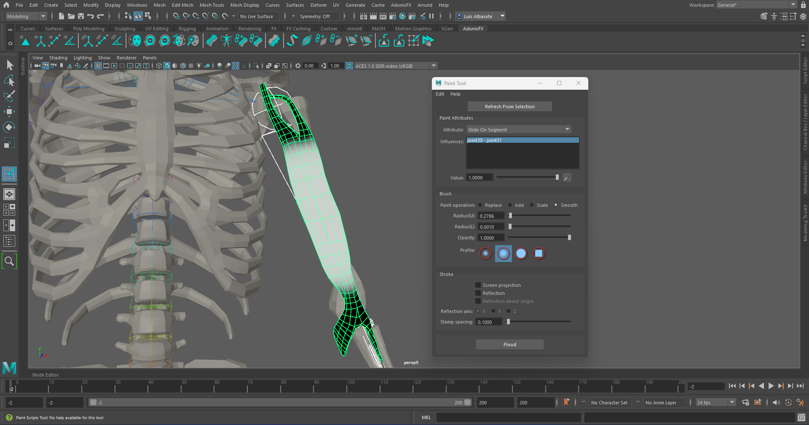
  <figcaption><b>Figure 16</b>: Slide on segment weights for biceps.</figcaption>
</figure>

### Connect Sensors

To have the muscle changing and responding to external inputs (i.e. the flexion of the arm), AdnSensorRotation can be added to drive the activation of the muscle. 

To do this, first create a rotation locator and sensor to compute the elbow angle. Both elements can be created by selecting the three joints from which to create the rotation locator and sensor (shoulder, elbow and wrist joints) and directly click on the {style="width:4%"} shelf button or go to AdonisFX Menu > Sensors (on the *Create* group) > *Rotation*. With this, both a locator and its corresponding sensor will get created at the same time.

<figure>
  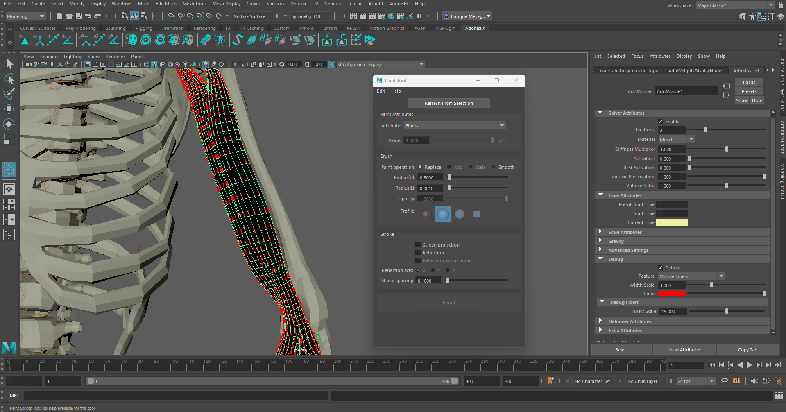
  <figcaption><b>Figure 17</b>: Rotation locator and sensor setup in elbow.</figcaption>
</figure>

Now that the sensor is created it has to be connected to the deformer. To do so, make use of the Connection Editor, which must be opened from the AdonisFX Menu > Sensors (on the *Edit* group) > *Connection Editor*.

With the Connection Editor opened, select the locator from the scene and press the *Reload Left* button, then select the simulated mesh and press the *Reload Right* button. The list widgets will refresh with the respective connectable attributes. Select the *activationAngle* attribute from the locator and the *activation* attribute from the deformer, and click *Make Connection*.

<figure>
  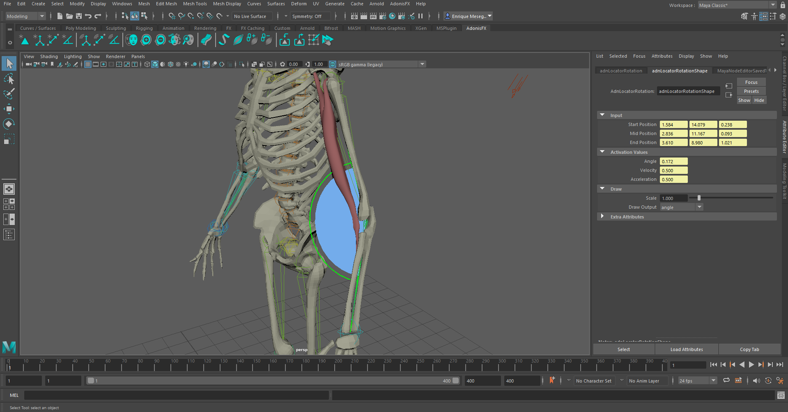
  <figcaption><b>Figure 18</b>: Connection Editor tool.</figcaption>
</figure>

When the elbow is flexed (and therefore the angle from the locator gets smaller) the muscle activation will get higher, simulating a much more realistic scenario.

To tweak additional parameters of the AdnMuscle deformer, check this [page](muscle).

## AdnRibbonMuscle

The process to setup an AdnRibbonMuscle is very similar to the one of setting up and AdnMuscle. It essentially follows the same steps. Start with the following elements:

 - An animation rig.
 - A geometry representing the muscle to simulate.

In this case a planar muscle will be simulated corresponding to a biceps, which will yield similar results to the case of the AdnMuscle deformer previously shown.

<figure>
  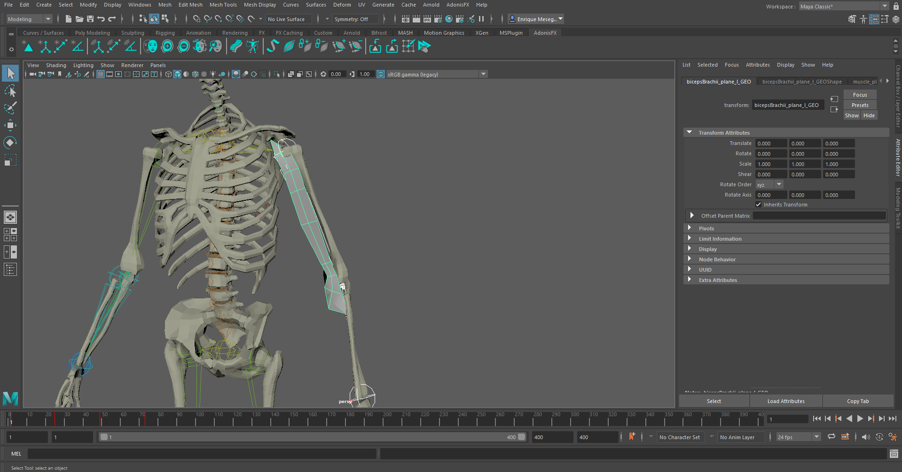
  <figcaption><b>Figure 19</b>: Basic setup for planar biceps simulations.</figcaption>
</figure>

### Create Deformer

Similar to AdnMuscle, create the AdnRibbonMuscle deformer by selecting the mesh to deform (the biceps muscle) and then pressing the {style="width:4%"} shelf button or go to AdonisFX Menu > *Solvers* > *Ribbon Muscle*.

<figure>
  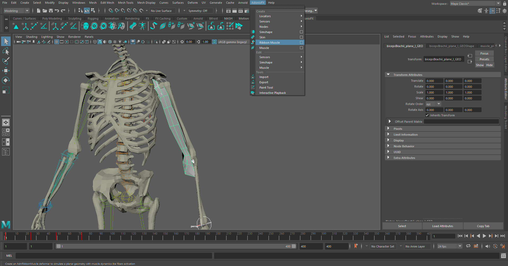
  <figcaption><b>Figure 20</b>: AdnRibbonMuscle deformer creation scenario.</figcaption>
</figure>

To create the AdnRibbonMuscle deformer with some initial customization, double-click the shelf button or press the option box in the menu item. This will display a pop-up window that will allow to do some initial customization, as well as creating the deformer with a custom name. Once all data has been provided press the *Create* button and the deformer will get created.

<figure>
  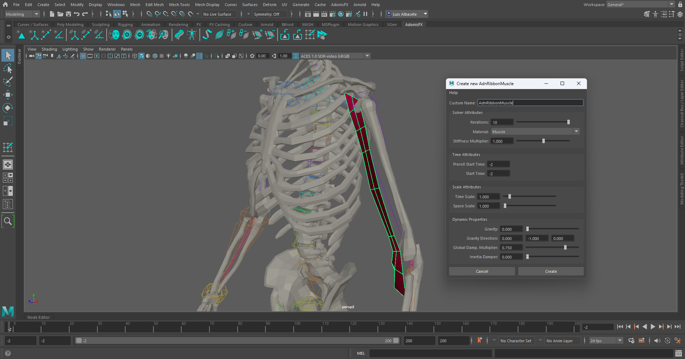
  <figcaption><b>Figure 21</b>: AdnRibbonMuscle custom creation UI.</figcaption>
</figure>

In order to add attachments constraints to the ribbon muscle we will select the targets (joints, geometries or both), then the muscle with the AdnMuscle applied and finally press the {style="width:4%"} button or *Add Targets* in the AdonisFX menu from the Edit Muscle submenu.

<figure>
  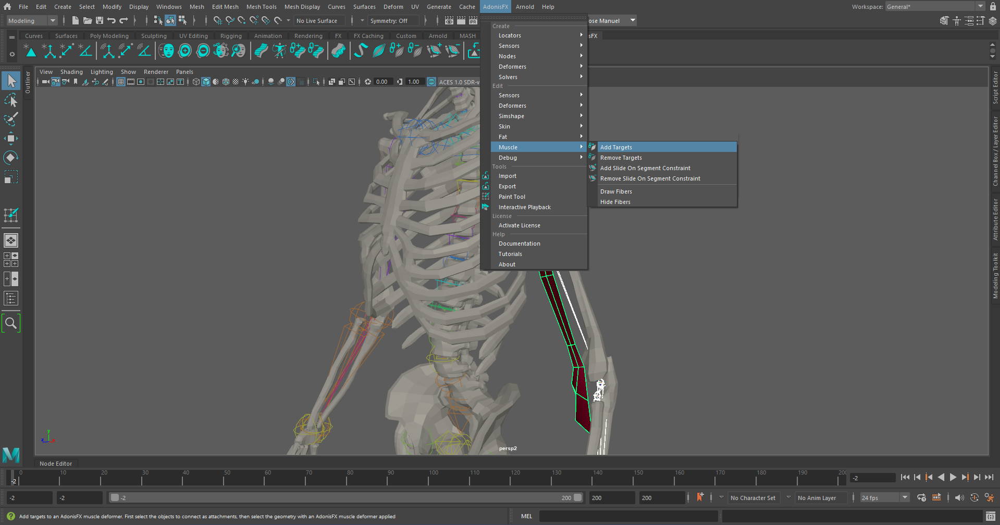
  <figcaption><b>Figure 22</b>: Addition of transform targets to AdnRibbonMuscle.</figcaption>
</figure>

<figure>
  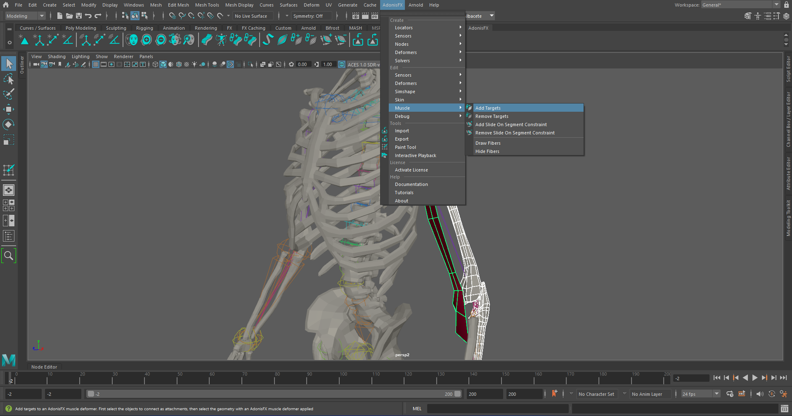
  <figcaption><b>Figure 23</b>: Addition of geometry targets to AdnRibbonMuscle.</figcaption>
</figure>

Optionally, add Slide On Segment Constraints. This constraint type is recommended for muscles in the limbs of the character to follow better the animation. With the same selection, first the two joints of the rig (shoulder and elbow) and then the muscle geometry, go to AdonisFX Menu > Muscle > *Add Slide On Segment Constraint*.

### Paint Weights

Once the ribbon muscle deformer is properly created it is possible now to paint its weights to correctly setup the deformer properties. To do so, select the simulated mesh and press the {style="width:4%"} shelf button or go to AdonisFX Menu > *Paint Tool*.

Start by painting attachment weights, painting the influence for each target by selecting the corresponding target from the list and painting its desired influence.

> [!NOTE]
> In this example the influence painting for both types of attachment constraint is shown. The different types of attachments can be used together or not depending on the needs of the simulation and the rig setup.

<figure>
  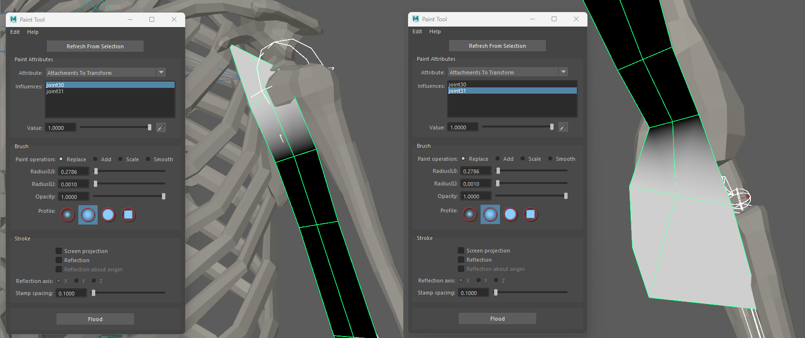
  <figcaption><b>Figure 22</b>: Transform Attachment influences.</figcaption>
</figure>

<figure>
  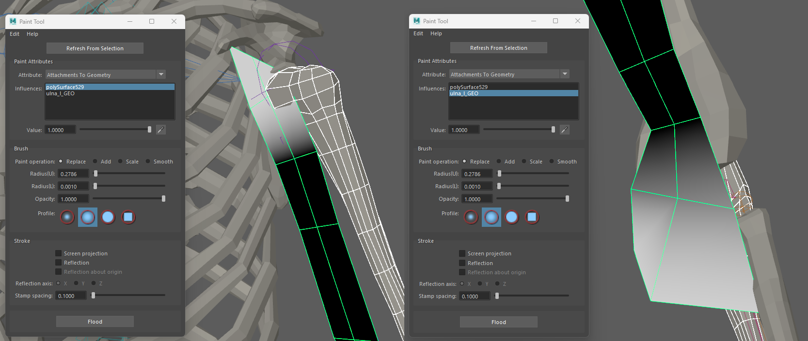
  <figcaption><b>Figure 23</b>: Geometry Attachment influences.</figcaption>
</figure>

Then, paint the muscle tendon weights, by selecting the *Tendon* attribute from the *Attribute* enumerator and painting over the parts of the muscle to represent tendon tissue.

<figure>
  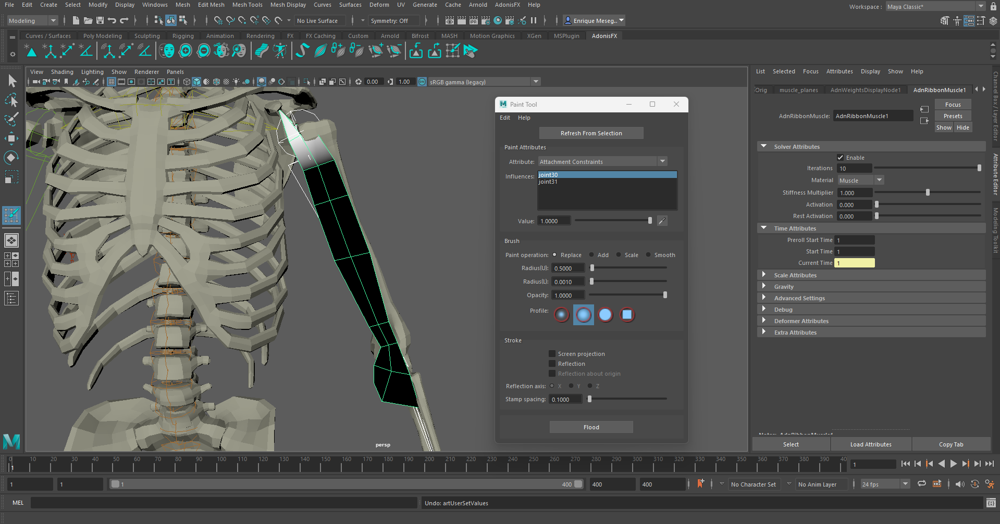
  <figcaption><b>Figure 24</b>: Tendon weights for planar biceps.</figcaption>
</figure>

Now that tendons are painted, when selecting the *Fibers* attribute from the *Attribute* enumerator, painted fibers will be displayed, with a default direction set by the painted tendons. It is now possible to freely comb these fibers if it is desired.

In case the fiber or its color has to be manipulated, go to the Attribute Editor, in the debug submenu, and customize the color, width and length of the drawn lines.

<figure>
  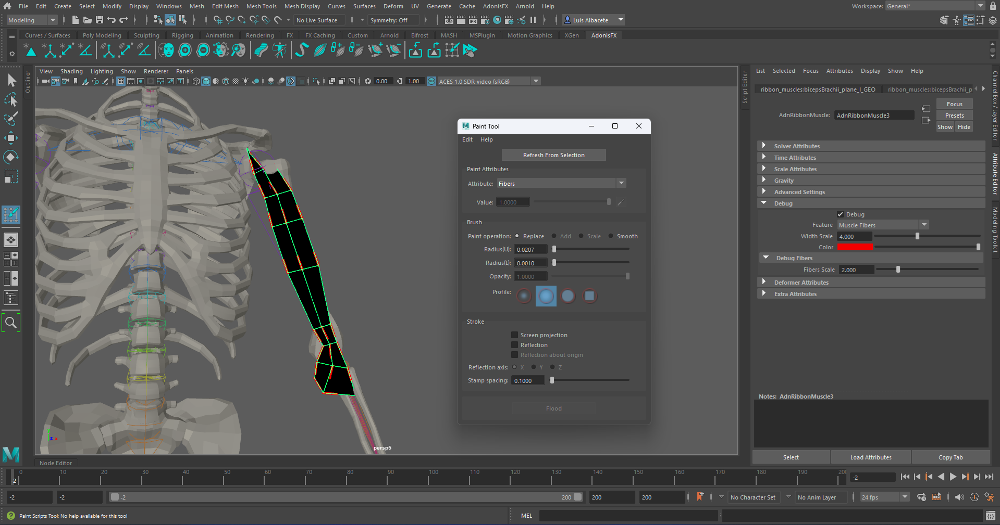
  <figcaption><b>Figure 25</b>: Muscle fibers combing.</figcaption>
</figure>

Finally, paint Slide On Segment Constraints (if added). It is recommended to paint only the vertices that are not attached to the rig. In this example, the tendons are painted with a value of 0.0, while the rest of the shape is painted to 1.0.

<figure>
  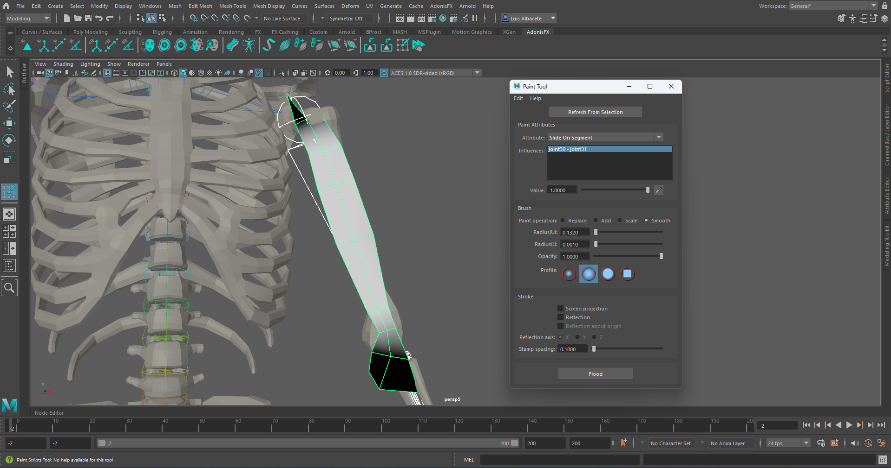
  <figcaption><b>Figure 26</b>: Slide on segment weights for planar biceps.</figcaption>
</figure>

### Connect Sensors

The process to connect and AdnSensor to an AdnRibbonMuscle is the exact same to the one followed [here](#connect-sensors).

<figure>
  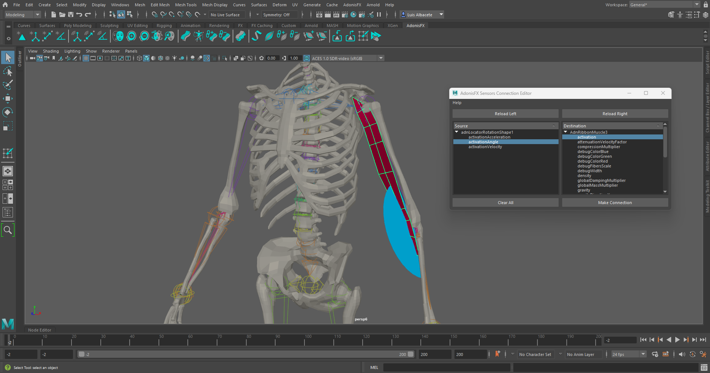
  <figcaption><b>Figure 27</b>: Connection Editor tool with AdnRotation sensor connected to AdnRibbonMuscle.</figcaption>
</figure>

To tweak additional parameters of the AdnRibbonMuscle deformer, check this [page](ribbon).

## AdnSimshape

To create a basic scenario using the AdnSimshape deformer, start with a scene with the following elements:

 - An animated facial mesh to which to apply the deformer.
 - A rest mesh.
 - Optionally, a deformation mesh with only the facial deformation (no animation) to allow muscle activations.

All these meshes must have the same number of vertices and correspond to the same facial model.

<figure>
  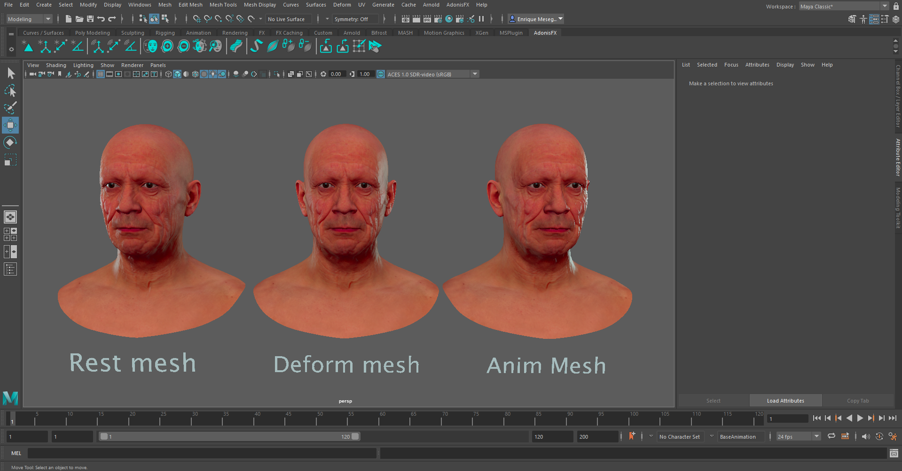 
  <figcaption><b>Figure 28</b>: Basic setup for facial simulations.</figcaption>
</figure>

### Create Deformer

To create the AdnSimshape deformer it is required to select first the rest mesh and then the animated mesh. In this scenario, the animated mesh will be used as the simulated mesh.

Press the {style="width:4%"} shelf button or go to AdonisFX Menu > *Simshape*.

To create the AdnSimshape deformer with some initial customization, double-click the shelf button or press the option box in the menu item. This will display a pop-up window that will allow to do some initial customization, as well as creating the deformer with a custom name. Once all data has been provided press the *Create* button and the deformer will get created.

<figure>
  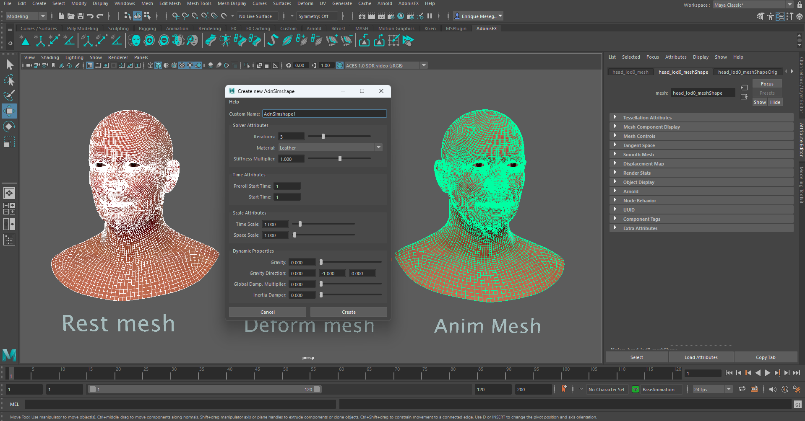 
  <figcaption><b>Figure 29</b>: AdnSimshape deformer creation scenario.</figcaption>
</figure>

To add the deformation mesh to the deformer first select the deformation mesh, then the simulated mesh (it is the animation mesh), and then go to AdonisFX Menu > Simshape (on the *Edit* group) > Add *Deform Mesh*. A message will notify is that the addition of the rest mesh has been done correctly.

<figure>
  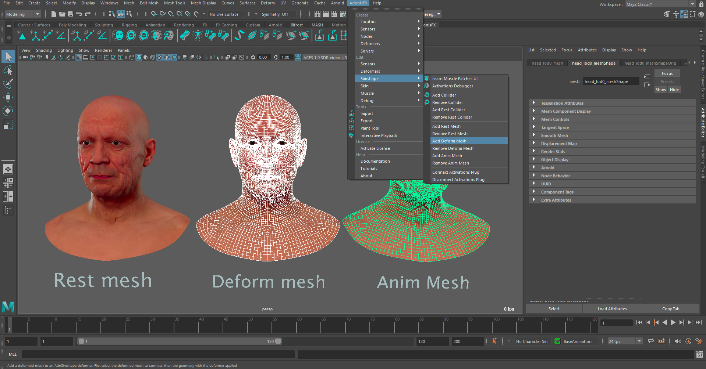 
  <figcaption><b>Figure 30</b>: Addition of deform mesh to AdnSimshape deformer.</figcaption>
</figure>

### Paint Weights

In the case of the AdnSimshape use the Maya Paint tool to setup and paint its paintable weight attributes. The most important paintable map is the *Attraction Force* as this is the value that dictates how much of each simulated vertex should follow the animation. This value is flooded by default to 1.0, meaning that by default the simulated mesh will follow completely the animation, without displaying dynamics.

In high deformation areas, such as around the mouth or under the eyes, add medium to low values (in this case painting with a value of 0.4).

<figure>
  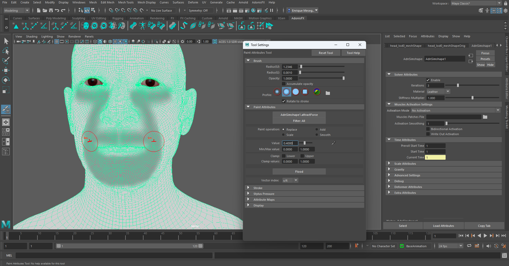 
  <figcaption><b>Figure 31</b>: Attraction Force weights for medium dynamics areas.</figcaption>
</figure>

Painting lower Attraction Force weights in meatier areas of the face, such as under the neck or in the cheecks to show more dynamics in these regions. In this case a value of 0.15 will be applied.

<figure>
  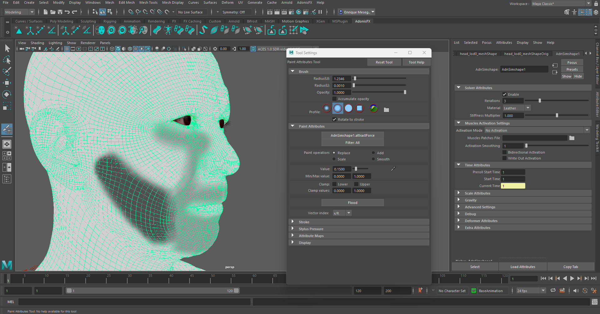 
  <figcaption><b>Figure 32</b>: Attraction Force weights for high dynamics areas.</figcaption>
</figure>

The lowest values (0.1 in this case) will be applied to the area under the jaw where dynamics will appear the most. 

<figure>
  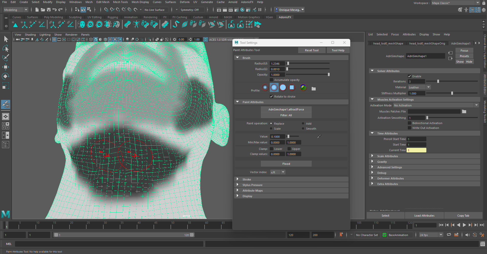 
  <figcaption><b>Figure 33</b>: Attraction Force weights for highest dynamics areas.</figcaption>
</figure>

After painting similar weights to the ones displayed and pressing playback to check the animation,  realistic dynamics should be simulated in the face. Many more paintable weights to better customize and tweak face dynamics are avaliable and fully explained in the documentation for [AdnSimshape](simshape).

### Add muscle activations

To further have a realistic depiction of facial dynamics, facial muscle activations can be simulated. The AdnSimshape deformer has two methods of handling muscle activations:

 - AdonisFX Muscle Patches file.
 - Edge Evaluator Node.

Refer to this [section](simshape#muscle-activations) to see how to use Muscle Patches files. However, in this example, we take advantage of the AdnEdgeEvaluator Node. To create this node, select the rest mesh, then the deformation mesh, and then go to AdonisFX Menu > Nodes > *Edge Evaluator*. Then, once created, connect it to the AdnSimshape deformer via AdonisFX Menu > Simshape (on the *Edit* group) > *Connect Activations Plug*. 

<figure>
  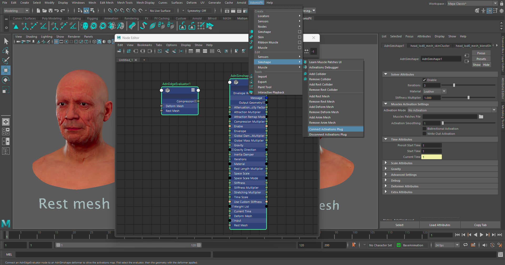 
  <figcaption><b>Figure 34</b>: Connecting Edge Evaluator Node to AdnSimshape Deformer.</figcaption>
</figure>

In the attribute editor of the AdnSimshape deformer, under the *Muscles Activation* section, the *Plug Values* will be enabled as a new valid *Activation Mode* option. To better visualize activations, press the {style="width:4%"} shelf button or go to AdonisFX Menu > Simshape (on the *Edit* group) > *Activations Debugger*.
