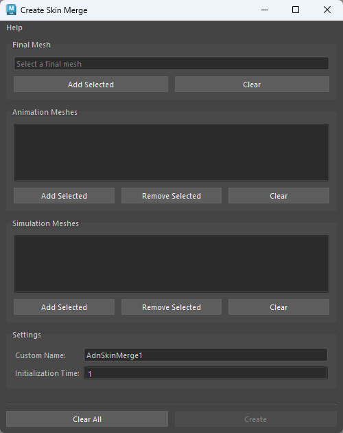
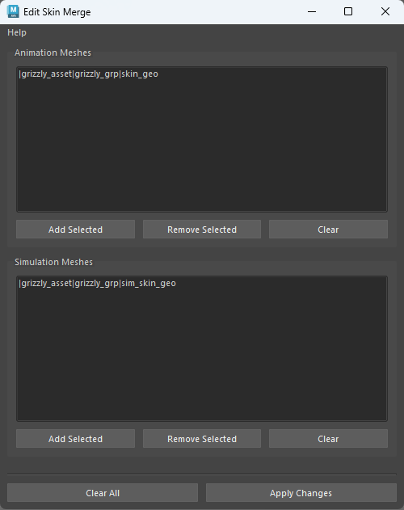
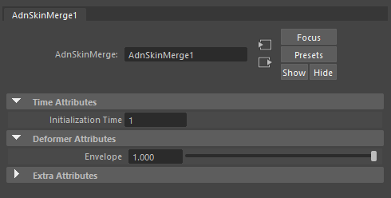
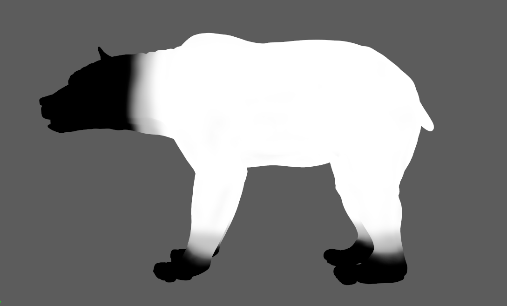

# AdnSkinMerge

AdnSkinDeformer is a Maya deformer to merge animation geometries with the results provided by AdnSkin. This deformer allows for the merging of several animation and simulation meshes into a single final mesh.

The influence simulation or animation meshes will have on the final mesh can be freely painted and modified by painting a blends weight map.

### How To Use

AdnSkinMerge makes use of its own User Interface to create and modify the deformer.

To create an AdnSkinMerge deformer within a Maya scene, the following inputs must be provided:

  - **Final Mesh (F)**: Mesh to apply the merge results.
  - **Animation Mesh List (Al)**: Mesh(es) to drive the simulation skin.
  - **Simulation Mesh List (Sl)**: Mesh(es) with AdnSkin deformer applied.

The process to create an AdnSkinMerge deformer is:

1. Press {style="width:4%"} in the AdonisFX shelf or *Skin Merge* in the AdonisFX menu, under the *Deformers* submenu in the *Create* section.
2. The following UI will get displayed. From here the required meshes for the deformer will be selected and added. At least one mesh must be added in each field to be able to create the deformer. A custom name and initialization time can also be set in this UI.
    - To add meshes to any list, select the meshes in the scene and click the respecitve "Add Selected" button.
    - If you wish to remove a single element from the list, select it in the Skin Merge UI and press the "Remove Selected" button.
    - You may also clear any list fully by pressing the respective "Clear" button.

<figure markdown>
   
  <figcaption><b>Figure 1</b>: Create Skin Merge UI.</figcaption>
</figure>

3. Once everything has been set up, press the "Create" button. A message box will notify you that AdnSkinMerge has been created properly, meaning that the meshes have been merged into the final mesh. However, the final mesh will follow only the animation meshes by default, go to the[paintable weights](#paintable-weights) section to see how to add influence from the simulated meshes.

Once we have an AdnSkinMerge deformer created, if we wish to modify its input meshes (be it the Animation Mesh List, the Simulation Mesh List or both) we may follow this process:

1. Go to *Deformers > Skin Merge* in the AdonisFX menu, under the *Edit* section.
2. The following UI will get displayed. Here you will see listed the current animation and simulation meshes the deformer has connected. From this UI you may freely add or remove from either list (at least one element must be present in each list to be able to apply the changes). 

<figure markdown>
   
  <figcaption><b>Figure 2</b>: Edit Skin Merge UI.</figcaption>
</figure>

3. Once everything has been set up, press the "Apply changes" button. A message box will notify you that AdnSkinMerge has been edited properly.

## Attributes

### Time Attributes
| Name | Type | Default | Animatable | Description |
| :--- | :--- | :------ | :--------- | :---------- |
| **Initialization Time** | Time | *Current frame* | ✓ | Sets the frame at which the deformer will be initialized. |

## Attribute Editor Template

<figure markdown>
  
  <figcaption><b>Figure 3</b>: AdnSkinMerge Attribute Editor</figcaption>
</figure>

## Paintable Weights
| Name | Default | Description |
| :--- | :------ | :---------- |
| **Blend**       | 0.0 | Weight to modulate the influence the simulation meshes have over the animation meshes. Hiher values will add more influence of the simulation meshes over the final mesh.<ul><li>*Tip*: Paint only over areas where animation and simulation meshes overlap.</li></ul> |

<figure markdown>
  
  <figcaption><b>Figure 4</b>: Example of Blend weights painted.</figcaption>
</figure>
