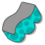
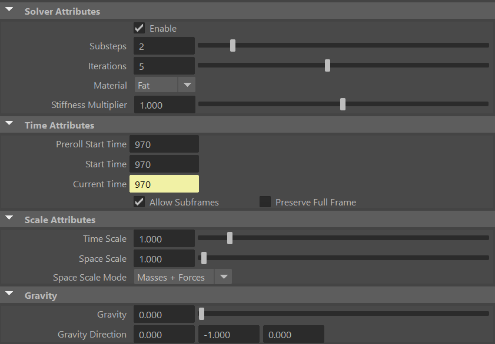
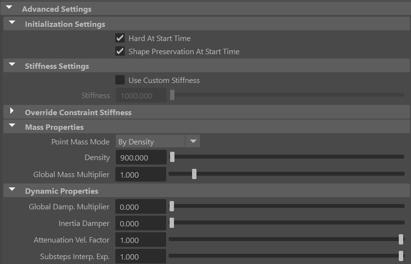
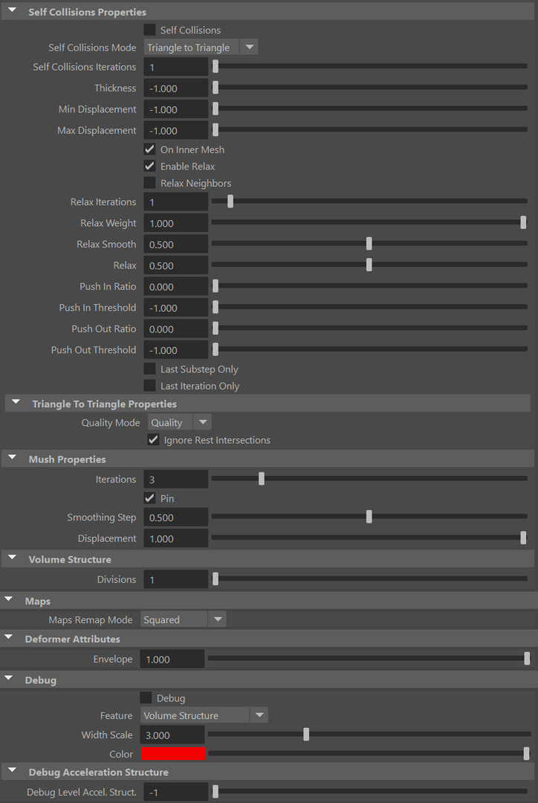
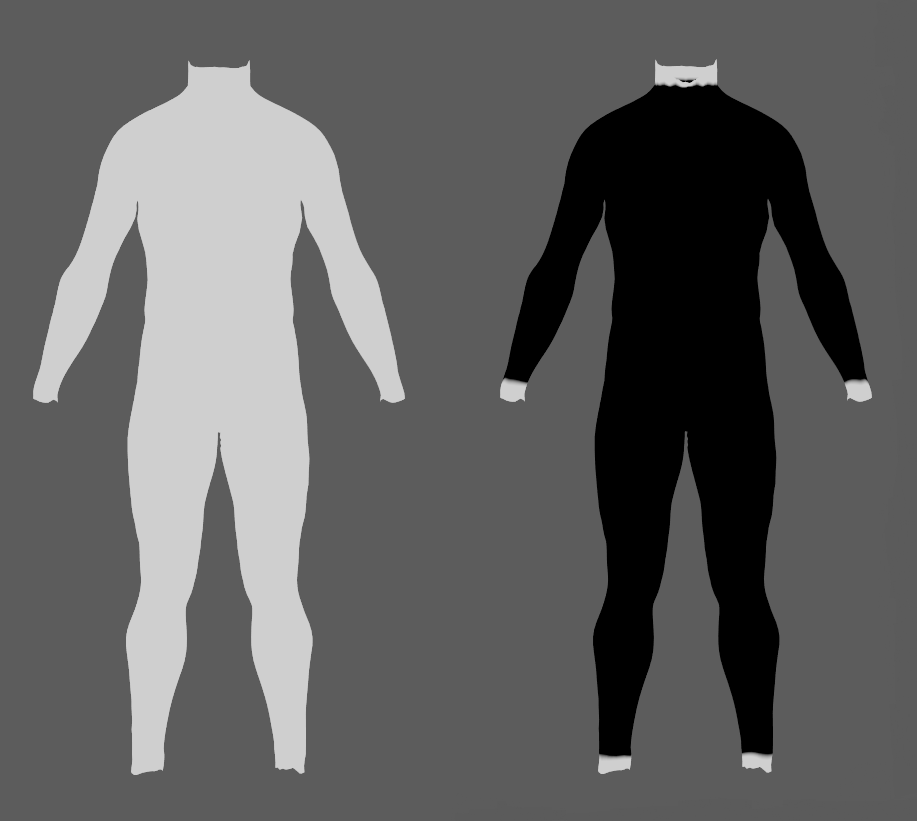
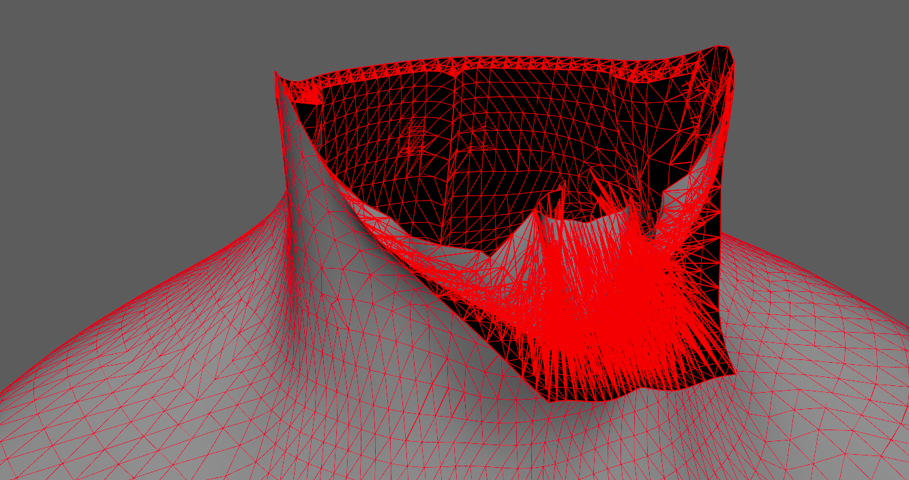
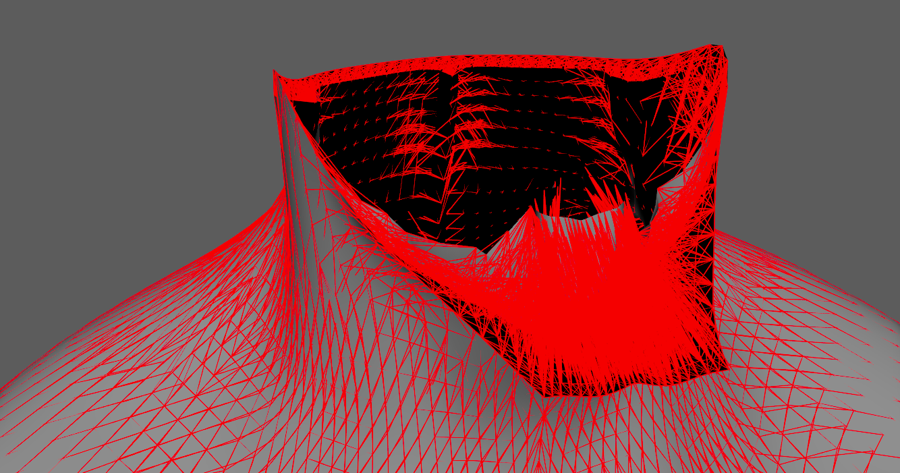
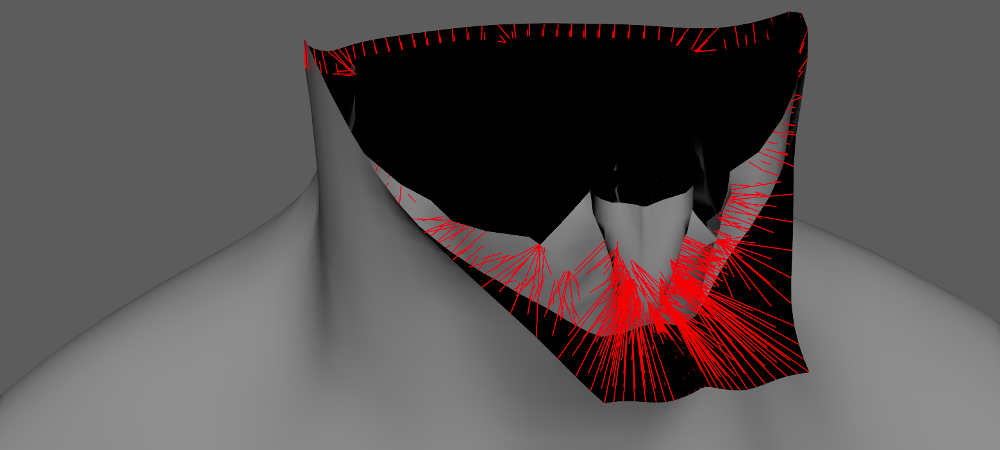

# AdnFat

AdnFat is a Maya deformer for fat tissue simulation. Thanks to a combination of volume, shape preservation and hard constraints, the deformer can produce dynamics that allow the fat geometry to produce realistic jiggle-like dynamics.

The inputs to the deformer are two geometries coherent in terms of number of vertices and triangulation. One geometry is a deformed geometry which works as base mesh to drive the simulation (e.g. the simulated fascia), while the second geometry is the one to be simulated (i.e. the fat geometry to simulate). Given these two compatible surfaces, the solver procedurally constructs a volumetric internal structure between them. This structure is then simulated by computing: 1) volume constraints to make it resistant to compression and expansion; 2) volume shape preservation constraints to make the internal volume resistant to deformation; 3) hard constraints to attach the borders of the mesh to the base mesh; and 4) shape preservation constraints to preserve the original shape between connected vertices.

### How To Use

The AdnFat deformer is easy to create and configure in Maya. The deformer requires two input geometries that represent the inner and outer layers of the fat tissue. Typically, the inner layer corresponds to the simulated fascia, while the outer layer corresponds to the actual fat mesh to simulate. The inner layer works as a base mesh that the outer fat layer has to follow.

To create an AdnFat deformer within a Maya scene, the following inputs must be provided:

  - **Base Mesh (B)**: Mesh to drive the simulation mesh (e.g. the simulated fascia geometry).
  - **Fat Mesh (F)**: Mesh to apply the deformer onto (e.g. the fat geometry).

> [!NOTE]
> - **B** and **F** must have the same vertex count and triangulation.
> - **B** must be provided, otherwise the Fat solver will abort the simulation.

The process to create an AdnFat deformer is:

1. Select the **Base Mesh**, then the **Fat Mesh**.
2. Press {style="width:4%"} in the Adonis shelf or *Fat* in the Adonis menu, under the Create Solvers section. If the shelf button is double-clicked or the option box in the menu is selected a window will be displayed where a custom name and initial attribute values can be set.
3. A message in the console will notify you that AdnFat has been created properly, meaning that it is ready to simulate. If an error occurs, a dialog will be prompted. Check the next section to customize its configuration.

## Attributes

### Solver Attributes
| Name | Type | Default | Animatable | Description |
| :--- | :--- | :------ | :--------- | :---------- |
| **Enable**               | Boolean    | True    | ✓ | Flag to enable or disable the deformer computation. |
| **Substeps**             | Integer    | 2       | ✓ | Number of steps that the solver will execute per simulation frame. Greater values mean greater computational cost. Has a range of \[1, 10\]. The upper limit is soft, higher values can be used. |
| **Iterations**           | Integer    | 5       | ✓ | Number of iterations that the solver will execute per simulation step. Greater values mean greater computational cost. Has a range of \[1, 10\]. The upper limit is soft, higher values can be used. |
| **Material**             | Enumerator | Fat     | ✓ | Solver stiffness presets per material. The materials are listed from lowest to highest stiffness. There are 8 different presets: Fat: 103, Muscle: 5e3, Rubber: 106, Tendon: 5e7, Leather: 108, Wood: 6e9, Skin: 12e3. |
| **Stiffness Multiplier** | Float      | 1.0     | ✓ | Multiplier factor to scale up or down the material stiffness. Has a range of \[0.0, 2.0\]. The upper limit is soft, higher values can be used. |

### Time Attributes
| Name | Type | Default | Animatable | Description |
| :--- | :--- | :------ | :--------- | :---------- |
| **Preroll Start Time**  | Time    | *Current frame* | ✗ | Sets the frame at which the preroll begins. The preroll ends at *Start Time*. |
| **Start Time**          | Time    | *Current frame* | ✗ | Determines the frame at which the simulation starts. |
| **Current Time**        | Time    | *Current frame* | ✓ | Current playback frame. |
| **Allow Subframes**     | Boolean | True            | ✓ | If True, allows subframe evaluation for delta time computation when the time step is smaller than one single frame. |
| **Preserve Full Frame** | Boolean | False           | ✓ | Preserves matching results at integer frames when evaluating subframes, providing simulation-driven interpolation between frames. For example, evaluating in steps of 0.1 frames produces the same result at frame 2 as evaluating directly from frame 1 to frame 2 with the same solver settings. It does not require *Allow Subframes* to be enabled and can be changed without restarting the simulation. |

### Scale Attributes
| Name | Type | Default | Animatable | Description |
| :--- | :--- | :------ | :--------- | :---------- |
| **Time Scale**       | Float      | 1.0             | ✓ | Sets the scaling factor applied to the simulation time step. Has a range of \[0.001, 10.0\]. The upper limit is soft, higher values can be used. |
| **Space Scale**      | Float      | 1.0             | ✓ | Sets the scaling factor applied to the masses and/or the forces (e.g. gravity). Adonis interprets the scene units in centimeters. If modeling your creature you apply a scaling factor for whatever reason (e.g. to avoid precision issues in Maya), you will have to adjust for this scaling factor using this attribute. If your character is supposed to be 170 units tall, but you prefer to model it to be 17 units tall, then you will need to set the space scale to a value of 10. This will ensure that your 17 units creature will simulate as if it was 170 units tall. Has a range of \[0.001, 100.0\]. The upper limit is soft, higher values can be used. |
| **Space Scale Mode** | Enumerator | Masses + Forces | ✓ | Determines if the spatial scaling affects the masses, the forces, or both. The available options are: <ul><li>Masses: The *Space Scale* only affects masses.</li><li>Forces: The *Space Scale* only affects forces.</li><li>Masses + Forces: The *Space Scale* affects masses and forces.</li></ul> |

### Gravity
| Name | Type | Default | Animatable | Description |
| :--- | :--- | :------ | :--------- | :---------- |
| **Gravity**           | Float  | 0.0              | ✓ | Sets the magnitude of the gravity acceleration in m/s2. The value is internally converted to cm/s2. Has a range of \[0.0, 100.0\]. The upper limit is soft, higher values can be used. |
| **Gravity Direction** | Float3 | {0.0, -1.0, 0.0} | ✓ | Sets the direction of the gravity acceleration. Vectors introduced do not need to be normalized, but they will get normalized internally. |

### Advanced Settings

#### Initialization Settings
| Name | Type | Default | Animatable | Description |
| :--- | :--- | :------ | :--------- | :---------- |
| **Hard At Start Time**               | Boolean | True  | ✗ | Flag that forces the hard constraints to reinitialize at start time. This attribute has effect only if preroll start time is lower than start time. |
| **Shape Preservation At Start Time** | Boolean | True  | ✗ | Flag that forces the shape preservation constraints to reinitialize at start time. This attribute has effect only if preroll start time is lower than start time. |

#### Stiffness Settings
| Name | Type | Default | Animatable | Description |
| :--- | :--- | :------ | :--------- | :---------- |
| **Use Custom Stiffness**                  | Boolean | False          | ✓ | Toggles the use of a custom stiffness value. If custom stiffness is used, *Material* and *Stiffness Multiplier* will be disabled and *Stiffness* will be used instead. |
| **Stiffness**                             | Float   | 105 | ✓ | Sets the custom stiffness value. Its value must be greater than 0.0. |

#### Override Constraint Stiffness
| Name | Type | Default | Animatable | Description |
| :--- | :--- | :------ | :--------- | :---------- |
| **Solver Stiffness**            | Float |  0.0 | ✗ | Shows the global stiffness value currently used by the solver. |
| **Hard Constraints**            | Float | -1.0 | ✓ | Sets the stiffness override value for hard constraints. If the value is less than 0.0, the global stiffness will be used. Otherwise, this custom stiffness will override the global stiffness. Has a range of \[-1.0, 1012\]. The upper limit is soft, higher values can be used. |
| **Volume Shape Preservation**   | Float | -1.0 | ✓ | Sets the stiffness override value for the volume shape preservation constraints. If the value is less than 0.0, the global stiffness will be used. Otherwise, this custom stiffness will override the global stiffness. Has a range of \[-1.0, 1012\]. The upper limit is soft, higher values can be used. |
| **Shape Preservation**          | Float | -1.0 | ✓ | Sets the stiffness override value for the shape preservation constraints. If the value is less than 0.0, the global stiffness will be used. Otherwise, this custom stiffness will override the global stiffness. Has a range of \[-1.0, 1012\]. The upper limit is soft, higher values can be used. |

> [!NOTE]
> Providing a stiffness override value of 0.0 will disable the computation of that constraint.

#### Mass Properties

| Name | Type | Default | Animatable | Description |
| :--- | :--- | :------ | :--------- | :---------- |
| **Point Mass Mode**        | Enumerator | By Density       | ✓ | Defines how masses should be used in the solver.<ul><li>*By Density* allows to estimate the mass value by multiplying Density * Area.</li><li>*By Uniform Value* allows to set a uniform mass value.</li></ul> |
| **Density**                | Float      | 900.0            | ✓ | Sets the density value in kg/m3 to be able to estimate mass values with *By Density* mode. The value is internally converted to g/cm3. Has a range of \[0.001, 106\]. Lower and upper limits are soft, lower and higher values can be used. |
| **Global Mass Multiplier** | Float      | 1.0              | ✓ | Sets the scaling factor applied to the mass of every point. Has a range of \[0.001, 10.0\]. Lower and upper limits are soft, lower and higher values can be used. |

#### Dynamic Properties
| Name | Type | Default | Animatable | Description |
| :--- | :--- | :------ | :--------- | :---------- |
| **Global Damping Multiplier**   | Float      | 0.1  | ✓ | Sets the scaling factor applied to the global damping of every point. Has a range of \[0.0, 1.0\]. The upper limit is soft, higher values can be used. |
| **Inertia Damper**              | Float      | 0.0  | ✓ | Sets the linear damping applied to the dynamics of every point. Has a range of \[0.0, 1.0\]. The upper limit is soft, higher values can be used. |
| **Attenuation Velocity Factor** | Float      | 1.0  | ✓ | Sets the weight of the attenuation applied to the velocities of the simulated vertices driven by the *Attenuation Matrix*. Has a range of \[0.0, 1.0\]. The upper limit is soft, higher values can be used. |
| **Substeps Interp. Exp.**       | Float      | 1.0  | ✓ | Sets the exponential factor to weight the interpolation at each substep. Has a range of \[0.0, 1.0\]. The upper limit is soft, higher values can be used. A value of 0.0 disables the interpolation: base geometry and attenuation matrix are not interpolated. A value of 1.0 applies linear interpolation (base geometry and attenuation matrix) between previous and current frame based on a linear weight, i.e. `weight = substep / num_substeps`. A value between 0.0 and 1.0 applies exponential interpolation (base geometry and attenuation matrix) between previous and current frame based on an exponential weight, i.e. `weight = (substep / num_substeps) ^ exponent`. |

#### Self Collisions Properties
| Name | Type | Default | Animatable | Description |
| :--- | :--- | :------ | :--------- | :---------- |
| **Self Collisions**             | Boolean     | False                 | ✓ | Toggles the self collisions on and off. |
| **Self Collisions Mode**        | Enumerator  | Triangle to Triangle  | ✓ | Determines the method used for self-collision detection and response.<ul><li>Triangle to Triangle: detects and resolves collisions between triangles, providing more accurate results for thin meshes but at a higher computational cost.</li></ul> |
| **Self Collisions Iterations**  | Integer     | 1                     | ✓ | Sets the number of iterations for the self-collision correction. Has a range of \[1, 10\]. The upper limit is soft, higher values can be used. |
| **Thickness**                   | Float      | -1.0                   | ✓ | Sets the thickness value for self-collision detection. Points closer than this distance will be considered in self-collision. A value of -1.0 disables thickness for self-collisions. Has a range of \[-1.0, 3.0\]. The upper limit is soft, higher values can be used. |
| **Min Displacement**            | Float      | -1.0                   | ✓ | Sets the minimum displacement a point must have to be considered for self-collision correction. Below this value, no correction will be applied. A value of -1.0 disables this check. Has a range of \[-1.0, 1000.0\]. The upper limit is soft, higher values can be used. |
| **Max Displacement**            | Float      | -1.0                   | ✓ | Sets the maximum displacement a point can have to be considered for self-collision correction. Above this value, no correction will be applied. A value of -1.0 disables this check. Has a range of \[-1.0, 1000.0\]. The upper limit is soft, higher values can be used. |
| **On Inner Mesh**               | Boolean     | True                  | ✓ | Toggles the solving of self-collisions in the base mesh. If disabled, self-collisions corrections are applied on the outer simulated mesh only. |
| **Enable Relax**                | Boolean     | True                  | ✓ | Toggles the relaxation process for self collision affected points. |
| **Relax Neighbors**             | Boolean     | False                 | ✓ | Sets if the relaxation process for self collisions should also consider the neighboring points that were detected in the self collision corrections. |
| **Relax Iterations**            | Integer     | 1                     | ✓ | Sets the number of iterations to compute for self collision affected points. Smoothing and relaxation are applied in each iteration, while pushing in and pushing out are applied only in the last iteration. Has a range of \[0, 20\]. The upper limit is soft, higher values can be used. |
| **Relax Weight**                | Float       | 1.0                   | ✓ | Influence of the smoothing and relaxation for self collision affected points. Has a range of \[0.0, 1.0\]. |
| **Relax Smooth**                | Float       | 0.5                   | ✓ | Amount of smoothing to apply for self collision affected points. Has a range of \[0.0, 1.0\]. |
| **Relax**                       | Float       | 0.5                   | ✓ | Amount of relaxation to apply for self collision affected points. Has a range of \[0.0, 1.0\]. |
| **Push In Ratio**               | Float       | 0.0                   | ✓ | Amount of correction applied by the push in adjustment for self collision affected points. Has a range of \[0.0, 2.0\]. The upper limit is soft, higher values can be used. |
| **Push In Threshold**           | Float       | -1.0                  | ✓ | Maximum correction applied by the push in adjustment for self collision affected points. The threshold will be ignored if its value is 0.0 or less. Has a range of \[-1.0, 2.0\]. The upper limit is soft, higher values can be used. |
| **Push Out Ratio**              | Float       | 0.0                   | ✓ | Amount of correction applied by the push out adjustment for self collision affected points. Has a range of \[0.0, 2.0\]. The upper limit is soft, higher values can be used. |
| **Push Out Threshold**          | Float       | -1.0                  | ✓ | Maximum correction applied by the push out adjustment for self collision affected points. The threshold will be ignored if its value is 0.0 or less. Has a range of \[-1.0, 2.0\]. The upper limit is soft, higher values can be used. |
| **Last Substep Only**           | Boolean     | False                 | ✗ | If enabled, self-collisions are only computed in the last substep of the simulation. |
| **Last Iteration Only**         | Boolean     | False                 | ✗ | If enabled, self-collisions are only computed in the last iteration of each substep. |
| **Quality Mode**                | Enumerator | Quality                | ✓ | Sets the quality mode for self-collision detection. <ul><li>*Quality* is more accurate, recommended for final results.</li><li>*Fast* provides higher performance, recommended for preview.</li></ul> |
| **Ignore Rest Intersections**   | Boolean    | True                   | ✗ | Ignore self-collision detection and correction for primitives that are intersecting in the rest pose. |

#### Mush Properties
| Name | Type | Default | Animatable | Description |
| :--- | :--- | :------ | :--------- | :---------- |
| **Iterations**     | Integer | 0    | ✓ | Number of smoothing iterations applied by the algorithm. Greater values produce smoother results at the expense of additional computational cost. Has a range of \[0, 20\]. The upper limit is soft, higher values can be used. |
| **Pin**            | Boolean | True | ✓ | Flag to pin the vertices on the boundaries. |
| **Smoothing Step** | Float   | 0.5  | ✓ | Amount of smoothing applied at each iteration. Has a range of \[0.0, 1.0\]. |
| **Displacement**   | Float   | 1.0  | ✓ | Controls how much of the computed displacement is applied to the geometry. Has a range of \[0.0, 1.0\]. |

#### Volume Structure
| Name | Type | Default | Animatable | Description |
| :--- | :--- | :------ | :--------- | :---------- |
| **Divisions**   | Integer      | 1  | ✗ | Sets the number of divisions to create in the internal volume. The lower this value is, the faster the solver computes. Has a range of \[1, 10\]. The upper limit is soft, higher values can be used. |

#### Maps
| Name | Type | Default | Animatable | Description |
| :--- | :--- | :------ | :--------- | :---------- |
| **Maps Remap Mode** | Enumerator | Squared | ✗ | Defines the mode of remapping the painted values of volume shape preservation, shape preservation and hard constraints. The other paintable maps remain unmodified. Each remap mode applies a function to the input painted values (x) to get the final value used for the simulation (y).<ul><li>Linear: `y = x`</li><li>Squared: `y = x^2`</li><li>Cubic: `y = x^3`</li><li>Square Root: `y = x^(1/2)`</li><li>Cube Root: `y = x^(1/3)`</li><li>Logarithmic: `y = log((exp(1) - 1) * x + 1)`</li></ul> |

### Debug Attributes
| Name | Type | Default | Animatable | Description |
| :--- | :--- | :------ | :--------- | :---------- |
| **Debug**       | Boolean      | False            | ✓ | Enable or Disable the debug functionalities in the viewport for the AdnFat deformer. |
| **Feature**     | Enumerator   | Volume Structure | ✓ | A list of debuggable features for this deformer.<ul><li>Acceleration Structure: For each level in the acceleration structure used to solve self-collisions, display a box representing the bounding box encapsulating all the collision primitives in that level. If the value of *Debug Level Acceleration Structure* is -1, then all levels are displayed. Otherwise, only the specified level is displayed. If the value is greater than the number of levels, then no levels are displayed.</li><li>Hard Constraints: Draw *Hard Constraints* connections from the simulated mesh points and the internal virtual points to the base mesh.</li><li>Rest Self Collisions: For each triangle intersecting with the mesh at rest, the 3 edges of the triangle are displayed.</li><li>Self Collisions Volume: For each vertex, a sphere will be drawn representing the volume that will collide if its *Self Collision Thickness Multiplier* weight and the *Thickness* are greater than 0.0.</li><li>Shape Preservation: Draw *Shape Preservation* connections between the vertices adjacent to the vertices with this constraint.</li><li>Volume Structure: A line will be drawn for every connection between two points in the volume. A point can be either a vertex on the base mesh, a vertex on the simulated fat mesh or a virtual point that belongs to an internal layer generated by the procedural construction based on the *Divisions* attribute.</li></ul> |
| **Width Scale** | Float        | 3.0              | ✓ | Modifies the width of all lines. |
| **Color**       | Color Picker | Red              | ✓ | Selects the line color from a color wheel. Its saturation can be modified using the slider. |

### Deformer Attributes
| Name | Type | Default | Animatable | Description |
| :--- | :--- | :------ | :--------- | :---------- |
| **Envelope** | Float | 1.0 | ✓ | Specifies the deformation scale factor. Has a range of \[0.0, 1.0\]. The upper and lower limits are soft, values can be set in a range of \[-2.0, 2.0\]|

### Connectable Attributes
| Name | Type | Default | Animatable | Description |
| :--- | :--- | :------ | :--------- | :---------- |
| **Attenuation Matrix**  | Matrix | Identity | ✓ | Transformation matrix to drive the attenuation. |
| **Base Mesh**           | Mesh   |          | ✓ | Mesh taken as base to create the fat volume and drive the simulation. |
| **Base Matrix**         | Matrix | Identity | ✓ | World matrix of the base mesh. |

## Attribute Editor Template

<figure style="width: 75%;" markdown>
  
  <figcaption><b>Figure 1</b>: AdnFat Attribute Editor.</figcaption>
</figure>

<figure style="width: 75%;" markdown>
  
  <figcaption><b>Figure 2</b>: AdnFat Attribute Editor (Advanced Settings).</figcaption>
</figure>

<figure style="width: 75%;" markdown>
  
  <figcaption><b>Figure 3</b>: AdnFat Attribute Editor (Advanced Settings (Self-Collisions), Maps, Deformer Attributes and Debug menu).</figcaption>
</figure>

## Paintable Weights

In order to provide more artistic control, some key parameters of the AdnFat solver are exposed as paintable attributes in the deformer. The Maya paint tool must be used to paint those parameters to ensure that the values satisfy the solver requirements.

| Name | Default | Description |
| :--- | :------ | :---------- |
| **Global Damping**                         | 1.0 | Set global damping per vertex in the simulated mesh. The greater the value per vertex is the more damping of velocities. |
| **Hard Constraints**                       | 0.0 | Weight to modulate the correction applied to the vertices and the internal virtual points to keep them at a constant transformation, local to the closest point on the base mesh at initialization. Hard Constraint maps will force the points to keep the original position.<ul><li>*Tip*: In most of the cases this map is flooded to 0.0.</li><li>*Tip*: Only if the volume between the fat mesh and the base mesh on the edges is big (e.g. wrists, ankle, neck) then it might be useful to paint a value of 1.0 in those areas.</li><li>*Tip*: Smooth the borders by using the Smooth and Flood combination to make sure that there are no discontinuities in the weights map. This will help the simulation to not produce sharp differences in the dynamics of every vertex compared to its connected vertices.</li></ul> |
| **Masses**                                 | 1.0 | Multiplier to the individual mass values per vertex in the simulated volume. |
| **Mush Weights**                           | 1.0 | Weights map used to control the influence of the mush deformation at each vertex.     |
| **Self Collision Thickness Multiplier**    | 1.0 | Multiply the *Thickness* of each vertex.<ul><li>*Tip*: Paint with a value of 0.0 the areas to ignore the thickness for the intersections detection process; and with a value greater than 0.0 the areas to push along the direction of the normals for the intersections detection process.</li></ul> |
| **Self Collision Weights**                 | 1.0 | Amount of correction to apply to the current vertex when a collision with another vertex is detected.<ul><li>*Tip*: Paint with a value of 0.0 the areas that should not compute self collisions to reduce the computational impact.</li><li>*Tip*: Paint with a higher value the areas that should receive more correction due to self-intersections, and with a lower value the areas that should receive less correction.</li></ul> |
| **Shape Preservation**                     | 1.0 | Amount of correction to apply to a vertex to maintain the initial state of the shape formed with the surrounding vertices. |
| **Volume Shape Preservation**              | 1.0 | Amount of correction to apply to the volume structure to preserve the initial volumetric shape and prevent it from distortion. |

<figure markdown>
  
  <figcaption><b>Figure 4</b>: Example of painted weights on the fat layer: on the left the map is flooded to 1.0 for global damping, mass, volume shape preservation and shape preservation; on the right the hard constraints map is painted to 1.0 on the extremities.</figcaption>
</figure>

## Debugger

In order to better visualize deformer constraints and attributes in the Maya viewport there is the option to enable the debugger, found in the dropdown menu labeled *Debug* in the Attribute Editor.

To enable the debugger the *Debug* checkbox must be marked. To select the specific feature you would like to visualize, choose it from the list provided in *Features*. The features that can be visualized with the debugger in the AdnFat deformer are:

 - **Acceleration Structure**: For each level in the acceleration structure used to solve self-collisions, display a box representing the bounding box encapsulating all the collision primitives in that level. If the value of *Debug Level Acceleration Structure* is -1, then all levels are displayed. Otherwise, only the specified level is displayed. If the value is greater than the number of levels, then no levels are displayed.
 - **Hard Constraints**: For each vertex on the simulated mesh and each virtual point that belongs to an internal layer, a line will be drawn from the point to the corresponding closest point on the base mesh if its *Hard Constraints* weight is greater than 0.0.
 - **Rest Self Collisions**: For each triangle intersecting with the mesh at rest, the 3 edges of the triangle are displayed.
 - **Self Collisions Volume**: For each vertex, a sphere will be drawn representing the volume that will collide if its *Self Collision Thickness Multiplier* weight and the *Thickness* are greater than 0.0.
 - **Shape Preservation**: For each vertex with a shape preservation weight greater than 0.0, a line will be drawn from each adjacent vertex to the opposite adjacent vertex.
 - **Volume Structure**: A line will be drawn for every connection between two points in the volume. A point can be either a vertex on the base mesh, a vertex on the simulated fat mesh or a virtual point that belongs to an internal layer generated by the procedural construction based on the *Divisions* attribute.

<figure markdown>
  
  <figcaption><b>Figure 5</b>: Volume Structure debugging.</figcaption>
</figure>

<figure markdown>
  
  <figcaption><b>Figure 6</b>: Shape Preservation debugging.</figcaption>
</figure>

<figure markdown>
  
  <figcaption><b>Figure 7</b>: Hard Constraints debugging.</figcaption>
</figure>

## Advanced

### Base Mesh

Once the AdnFat deformer is created, it is possible to add and remove the base mesh thanks to some utilities available in the Adonis menu.

- **Add Base Mesh**:
    1. Select the geometry to be assigned as base mesh to the AdnFat.
    2. Select the geometry that has the AdnFat deformer applied.
    3. Press the *Add Base Mesh* item in the Adonis menu from the Edit Fat submenu.
- **Remove Base Mesh**:
    1. Select the geometry currently assigned as base mesh to the AdnFat. This step is optional.
    2. Select the geometry that has the AdnFat deformer applied.
    3. Press the *Remove Base Mesh* item in the Adonis menu from the Edit Fat submenu.
