# AdnSmartTissue

AdnSmartTissue is a Maya solver designed to generate skin dynamics and soft tissue effects without requiring the creation and simulation of complex anatomical structures such as muscles, fascia, or fat layers.

Instead of relying on pre-built internal anatomy, AdnSmartTissue automatically generates a procedural volumetric structure beneath the input surface. This structure is created from an inner mesh, whose shape and depth can be controlled through the push attributes and further refined by applying relaxation. The resulting volume is then simulated by computing: 1) volume constraints to make it resistant to compression and expansion; 2) volume shape preservation constraints to make the internal volume resistant to deformation; 3) hard constraints to attach the borders of the mesh to the base mesh; and 4) shape preservation constraints to preserve the original shape between connected vertices.

AdnSmartTissue can also leverage an Adonis ML model trained with muscle activation data to dynamically modulate tissue stiffness across the surface. During evaluation, the solver infers an activation value for each skin vertex that is then remapped between the user-defined *Min Stiffness* and *Max Stiffness* limits and applied to the solver constraints. This allows the simulated tissue to locally vary its resistance to deformation, emulating the effect of underlying muscles beneath the skin.

AdnSmartTissue can be used as a standalone skin dynamics solution on top of any animated mesh, or as a complementary simulation layer on top of an AdnMLDeformer setup to enhance the visual richness and realism of the final deformation.

To learn more about how to train an Adonis ML model, please check the [Adonis ML Neural Training Tool](../tools/neural_training_tool) page.

> [!IMPORTANT]
> - The AdnSmartTissue can be used with an FX license. However, an Adonis ML license is required to generate the Adonis ML model required by this deformer.

## How To Use

The AdnSmartTissue deformer is easy to create and configure in Maya. The deformer requires an input mesh, typically the animated skin, output of a Skin Cluster. This mesh may already have an AdnMLDeformer applied, although this is not required.

Apart from the inputs required, there are also other aspects to be satisfied for this deformer to produce the expected results:

- The skinCluster node must exist in the deformable chain of the geometry to apply the AdnSmartTissue to.
- The input geometry and the skinCluster node must be the same used in the data extraction process when a ML Model and Joints file are provided to AdnSmartTissue.

To create and configure the deformer:

1. Select the input mesh.
2. Press 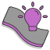{style="width:4%"} in the Adonis shelf or *Smart Tissue* in the Adonis menu, under the Create Solvers section to open the Create Smart Tissue UI.

<figure markdown>
  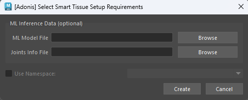
  <figcaption><b>Figure 1</b>: Simple UI to ease the creation and configuration of AdnSmartTissue.</figcaption>
</figure>

3. Optionally, provide the following inputs in the UI to enable the ML features:
    - The path to an ML Model file (`.adnm`) trained with muscle activation generated by the Neural Training Tool.
    - The path to a Joints Info file (`.json`) generated by the Data Extraction Tool.

<figure markdown>
  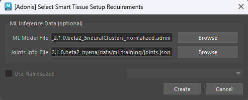
  <figcaption><b>Figure 2</b>: UI to create AdnSmartTissue with the model and joints files provided.</figcaption>
</figure>

4. Press *Create* to apply AdnSmartTissue to the mesh selected.

> [!NOTE]
> - If the ML Model provided was not trained with muscle activation data, the inferred activation for all vertices will be 0 and the effective stiffness applied to the constraints will be the value specified in *Min Stiffness*.
> - Creating the node manually is also possible through Python script or from the Node Editor.
> - In that case, the ML Model path and the connections to the input joints can also be populated afterwards from the same UI by selecting the geometry and launching Adonis > Deformers > Smart Tissue.
> - The use of this UI is recommended to ensure that the list of ML Inputs is consistent with the Adonis ML Model.
> - Machine learning dependencies are installed inside the Adonis installation directory rather than system-wide. As a result, the system environment remains unchanged and no global Python packages are installed.
> - (Windows Only) ML inference will run on the GPU if the ML Dependencies have been previously installed. If not, the ML inference is performed on the CPU. Please, learn how to install the dependencies in this [section](../../installation#ml-dependencies) on the Installation page.

## Attributes

### Solver Attributes
| Name | Type | Default | Animatable | Description |
| :--- | :--- | :------ | :--------- | :---------- |
| **Enable**               | Boolean    | True    | ✓ | Flag to enable or disable the deformer computation. |
| **Substeps**             | Integer    | 2       | ✓ | Number of steps that the solver will execute per simulation frame. Greater values mean greater computational cost. Has a range of \[1, 10\]. The upper limit is soft, higher values can be used. |
| **Iterations**           | Integer    | 5       | ✓ | Number of iterations that the solver will execute per simulation step. Greater values mean greater computational cost. Has a range of \[1, 10\]. The upper limit is soft, higher values can be used. |
| **Material**             | Enumerator | Fat     | ✓ | Solver stiffness presets per material. The materials are listed from lowest to highest stiffness. There are 8 different presets: Fat: 103, Muscle: 5e3, Rubber: 106, Tendon: 5e7, Leather: 108, Wood: 6e9, Skin: 12e3. |
| **Stiffness Multiplier** | Float      | 1.0     | ✓ | Multiplier factor to scale up or down the material stiffness. Has a range of \[0.0, 2.0\]. The upper limit is soft, higher values can be used. |

### ML Inference Attributes
| Name | Type | Default | Animatable | Description |
| :--- | :--- | :------ | :--------- | :---------- |
| **Enable Inference**     | Boolean | True    | ✓ | Flag to enable or disable the inference. |
| **ML Model Path**        | String  |         | ✗ | Path to the ML Model used for inference. |
| **ML Min Stiffness**        | Float   | 1000.0  | ✓ | Stiffness value to apply to vertices with zero inferred activation. Has a range of \[0.0, 1e12\]. The upper limit is soft, higher values can be used. |
| **ML Max Stiffness**        | Float   | 12000.0 | ✓ | Stiffness value to apply to vertices with maximum inferred activation. Has a range of \[0.0, 1e12\]. The upper limit is soft, higher values can be used. |
| **ML Activation Smoothing** | Integer | 0       | ✗ | Number of iterations for the activation smoothing algorithm. The greater the number, the smoother the activations will be. Has a range of \[0, 10\]. The maximum value allowed is 20. |
| **Write Out ML Activation** | Boolean | False | ✓ | If enabled, it writes the per-point ML inferred activation to the output plug `mlOutActivation`. The values written have the ML activation smoothing and the activation paintable weights applied. |

### Push Attributes
| Name | Type | Default | Animatable | Description |
| :--- | :--- | :------ | :--------- | :---------- |
| **Push Length** | Float | 0.0 | ✓ | Length of the push to apply to build the inner mesh. A positive value pushes the vertices along the direction of the normal, while a negative value pushes them in the opposite direction. Has a range of \[-1.0, 1.0\]. The upper and lower limits are soft; higher or lower values can be used. |

### Relax Attributes
| Name | Type | Default | Animatable | Description |
| :--- | :--- | :------ | :--------- | :---------- |
| **Iterations**         | Integer | 1      | ✗ | Number of iterations of the relaxation algorithm. Greater values mean greater computational cost. Has a range of \[1, 10\]. The upper limit is soft, higher values can be used. |
| **Pin**                | Boolean | False  | ✓ | Flag to pin the vertices on the boundaries. |
| **Smooth**             | Float   | 0.5    | ✓ | Amount of smoothing to apply. Has a range of \[0.0, 1.0\]. |
| **Relax**              | Float   | 0.5    | ✓ | Amount of relaxation to apply. Has a range of \[0.0, 1.0\]. |
| **Push In Ratio**      | Float   | 0.0    | ✓ | Amount of correction applied by the push in adjustment. Has a range of \[0.0, 2.0\]. The upper limit is soft, higher values can be used. |
| **Push In Threshold**  | Float   | -1.0   | ✓ | Maximum correction applied by the push in adjustment. The threshold will be ignored if its value is 0.0 or less. Has a range of \[-1.0, 2.0\]. The upper limit is soft, higher values can be used. |
| **Push Out Ratio**     | Float   | 0.0    | ✓ | Amount of correction applied by the push out adjustment. Has a range of \[0.0, 2.0\]. The upper limit is soft, higher values can be used. |
| **Push Out Threshold** | Float   | -1.0   | ✓ | Maximum correction applied by the push out adjustment. The threshold will be ignored if its value is 0.0 or less. Has a range of \[-1.0, 2.0\]. The upper limit is soft, higher values can be used. |

### Time Attributes
| Name | Type | Default | Animatable | Description |
| :--- | :--- | :------ | :--------- | :---------- |
| **Preroll Start Time** | Time    | *Current frame* | ✗ | Sets the frame at which the preroll begins. The preroll ends at *Start Time*. |
| **Start Time**         | Time    | *Current frame* | ✗ | Determines the frame at which the simulation starts. |
| **Current Time**       | Time    | *Current frame* | ✓ | Current playback frame. |
| **Allow Subframes**    | Boolean | True            | ✓ | If True, allows subframe evaluation for delta time computation when the time step is smaller than one single frame. |

### Scale Attributes
| Name | Type | Default | Animatable | Description |
| :--- | :--- | :------ | :--------- | :---------- |
| **Time Scale**       | Float      | 1.0             | ✓ | Sets the scaling factor applied to the simulation time step. Has a range of \[0.0, 2.0\]. The upper limit is soft, higher values can be used. |
| **Space Scale**      | Float      | 1.0             | ✓ | Sets the scaling factor applied to the masses and/or the forces (e.g. gravity). Adonis interprets the scene units in centimeters. If modeling your creature you apply a scaling factor for whatever reason (e.g. to avoid precision issues in Maya), you will have to adjust for this scaling factor using this attribute. If your character is supposed to be 170 units tall, but you prefer to model it to be 17 units tall, then you will need to set the space scale to a value of 10. This will ensure that your 17 units creature will simulate as if it was 170 units tall. Has a range of \[0.0, 2.0\]. The upper limit is soft, higher values can be used. |
| **Space Scale Mode** | Enumerator | Masses + Forces | ✓ | Determines if the spatial scaling affects the masses, the forces, or both. The available options are: <ul><li>Masses: The *Space Scale* only affects masses.</li><li>Forces: The *Space Scale* only affects forces.</li><li>Masses + Forces: The *Space Scale* affects masses and forces.</li></ul> |

### Gravity
| Name | Type | Default | Animatable | Description |
| :--- | :--- | :------ | :--------- | :---------- |
| **Gravity**           | Float  | 0.0              | ✓ | Sets the magnitude of the gravity acceleration in m/s2. The value is internally converted to cm/s2. Has a range of \[0.0, 100.0\]. The upper limit is soft, higher values can be used. |
| **Gravity Direction** | Float3 | {0.0, -1.0, 0.0} | ✓ | Sets the direction of the gravity acceleration. Vectors introduced do not need to be normalized, but they will get normalized internally. |

### Advanced Settings

#### Initialization Settings
| Name | Type | Default | Animatable | Description |
| :--- | :--- | :------ | :--------- | :---------- |
| **Hard At Start Time**               | Boolean | True  | ✗ | Flag that forces the hard constraints to reinitialize at start time. This attribute has effect only if preroll start time is lower than start time. |
| **Shape Preservation At Start Time** | Boolean | True  | ✗ | Flag that forces the shape preservation constraints to reinitialize at start time. This attribute has effect only if preroll start time is lower than start time. |

#### Stiffness Settings
| Name | Type | Default | Animatable | Description |
| :--- | :--- | :------ | :--------- | :---------- |
| **Use Custom Stiffness**                  | Boolean | False          | ✓ | Toggles the use of a custom stiffness value. If custom stiffness is used, *Material* and *Stiffness Multiplier* will be disabled and *Stiffness* will be used instead. |
| **Stiffness**                             | Float   | 105 | ✓ | Sets the custom stiffness value. Its value must be greater than 0.0. |

#### Override Constraint Stiffness
| Name | Type | Default | Animatable | Description |
| :--- | :--- | :------ | :--------- | :---------- |
| **Solver Stiffness**            | Float |  0.0 | ✗ | Shows the global stiffness value currently used by the solver. |
| **Hard Constraints**            | Float | -1.0 | ✓ | Sets the stiffness override value for hard constraints. If the value is less than 0.0, the global stiffness will be used. Otherwise, this custom stiffness will override the global stiffness. Has a range of \[0.0, 1012\]. The upper limit is soft, higher values can be used. |
| **Volume Shape Preservation**   | Float | -1.0 | ✓ | Sets the stiffness override value for the volume shape preservation constraints. If the value is less than 0.0, the global stiffness will be used. Otherwise, this custom stiffness will override the global stiffness. Has a range of \[0.0, 1012\]. The upper limit is soft, higher values can be used. |
| **Shape Preservation**          | Float | -1.0 | ✓ | Sets the stiffness override value for the shape preservation constraints. If the value is less than 0.0, the global stiffness will be used. Otherwise, this custom stiffness will override the global stiffness. Has a range of \[0.0, 1012\]. The upper limit is soft, higher values can be used. |

> [!NOTE]
> Providing a stiffness override value of 0.0 will disable the computation of that constraint.

#### Mass Properties

| Name | Type | Default | Animatable | Description |
| :--- | :--- | :------ | :--------- | :---------- |
| **Point Mass Mode**        | Enumerator | By Density | ✓ | Defines how masses should be used in the solver.<ul><li>*By Density* allows to estimate the mass value by multiplying Density * Area.</li><li>*By Uniform Value* allows to set a uniform mass value.</li></ul> |
| **Density**                | Float      | 900.0      | ✓ | Sets the density value in kg/m3 to be able to estimate mass values with *By Density* mode. The value is internally converted to g/cm3. Has a range of \[0.001, 106\]. Lower and upper limits are soft, lower and higher values can be used. |
| **Global Mass Multiplier** | Float      | 1.0        | ✓ | Sets the scaling factor applied to the mass of every point. Has a range of \[0.001, 10.0\]. Lower and upper limits are soft, lower and higher values can be used. |

#### Dynamic Properties
| Name | Type | Default | Animatable | Description |
| :--- | :--- | :------ | :--------- | :---------- |
| **Global Damping Multiplier**   | Float | 0.1  | ✓ | Sets the scaling factor applied to the global damping of every point. Has a range of \[0.0, 1.0\]. The upper limit is soft, higher values can be used. |
| **Inertia Damper**              | Float | 0.0  | ✓ | Sets the linear damping applied to the dynamics of every point. Has a range of \[0.0, 1.0\]. The upper limit is soft, higher values can be used. |
| **Attenuation Velocity Factor** | Float | 1.0  | ✓ | Sets the weight of the attenuation applied to the velocities of the simulated vertices driven by the *Attenuation Matrix*. Has a range of \[0.0, 1.0\]. The upper limit is soft, higher values can be used. |

#### Volume Structure
| Name | Type | Default | Animatable | Description |
| :--- | :--- | :------ | :--------- | :---------- |
| **Divisions** | Integer | 1  | ✗ | Sets the number of divisions to create in the internal volume. The lower this value is, the faster the solver computes. Has a range of \[1, 10\]. The upper limit is soft, higher values can be used. |

#### Self Collisions Properties
| Name | Type | Default | Animatable | Description |
| :--- | :--- | :------ | :--------- | :---------- |
| **Self Collisions**             | Boolean    | False                 | ✓ | Toggles the self collisions on and off. |
| **Self Collisions Mode**        | Enumerator | Triangle to Triangle  | ✓ | Determines the method used for self-collision detection and response. Only *Triangle to Triangle* mode is available. |
| **Self Collisions Iterations**  | Integer    | 1                     | ✓ | Sets the number of iterations for the self-collision correction. Has a range of \[1, 10\]. The upper limit is soft, higher values can be used. |
| **Min Displacement**            | Float      | -1.0                  | ✓ | Sets the minimum displacement a point must have to be considered for self-collision correction. Below this value, no correction will be applied. A value of -1.0 disables this check. Has a range of \[-1.0, 1000.0\]. The upper limit is soft, higher values can be used. |
| **Max Displacement**            | Float      | -1.0                  | ✓ | Sets the maximum displacement a point can have to be considered for self-collision correction. Above this value, no correction will be applied. A value of -1.0 disables this check. Has a range of \[-1.0, 1000.0\]. The upper limit is soft, higher values can be used. |
| **On Inner Mesh**               | Boolean    | True                  | ✓ | Toggles the solving of self-collisions in the inner mesh. If disabled, self-collision corrections are applied on the outer simulated mesh only. |
| **Enable Relax**                | Boolean    | False                 | ✓ | Toggles the relaxation process for self collision affected points. |
| **Relax Neighbors**             | Boolean    | False                 | ✓ | Sets if the relaxation process for self collisions should also consider the neighboring points that were detected in the self collision corrections. |
| **Relax Iterations**            | Integer    | 1                     | ✓ | Sets the number of iterations to compute for self collision affected points. Smoothing and relaxation are applied in each iteration, while pushing in and pushing out are applied only in the last iteration. Has a range of \[0, 20\]. The upper limit is soft, higher values can be used. |
| **Relax Weight**                | Float      | 1.0                   | ✓ | Influence of the smoothing and relaxation for self collision affected points. Has a range of \[0.0, 1.0\]. |
| **Relax Smooth**                | Float      | 0.5                   | ✓ | Amount of smoothing to apply for self collision affected points. Has a range of \[0.0, 1.0\]. |
| **Relax**                       | Float      | 0.5                   | ✓ | Amount of relaxation to apply for self collision affected points. Has a range of \[0.0, 1.0\]. |
| **Push In Ratio**               | Float      | 0.0                   | ✓ | Amount of correction applied by the push in adjustment for self collision affected points. Has a range of \[0.0, 2.0\]. The upper limit is soft, higher values can be used. |
| **Push In Threshold**           | Float      | -1.0                  | ✓ | Maximum correction applied by the push in adjustment for self collision affected points. The threshold will be ignored if its value is 0.0 or less. Has a range of \[-1.0, 2.0\]. The upper limit is soft, higher values can be used. |
| **Push Out Ratio**              | Float      | 0.0                   | ✓ | Amount of correction applied by the push out adjustment for self collision affected points. Has a range of \[0.0, 2.0\]. The upper limit is soft, higher values can be used. |
| **Push Out Threshold**          | Float      | -1.0                  | ✓ | Maximum correction applied by the push out adjustment for self collision affected points. The threshold will be ignored if its value is 0.0 or less. Has a range of \[-1.0, 2.0\]. The upper limit is soft, higher values can be used. |
| **Last Substep Only**           | Boolean    | False                 | ✗ | If enabled, self-collisions are only computed in the last substep of the simulation. |
| **Last Iteration Only**         | Boolean    | False                 | ✗ | If enabled, self-collisions are only computed in the last iteration of each substep. |
| **Quality Mode**                | Enumerator | Quality               | ✓ | Sets the quality mode for self-collision detection. <ul><li>*Quality* is more accurate, recommended for final results.</li><li>*Fast* provides higher performance, recommended for preview.</

#### Mush Properties
| Name | Type | Default | Animatable | Description |
| :--- | :--- | :------ | :--------- | :---------- |
| **Iterations**     | Integer | 10   | ✓ | Number of smoothing iterations applied by the algorithm. Greater values produce smoother results at the expense of additional computational cost. Has a range of \[0, 20\]. The upper limit is soft, higher values can be used. |
| **Pin**            | Boolean | True | ✓ | Flag to pin the vertices on the boundaries. |
| **Smoothing Step** | Float   | 0.5  | ✓ | Amount of smoothing applied at each iteration. Has a range of \[0.0, 1.0\]. |
| **Displacement**   | Float   | 1.0  | ✓ | Controls how much of the computed displacement is applied to the geometry. Has a range of \[0.0, 1.0\]. |

### Deformer Attributes
| Name | Type | Default | Animatable | Description |
| :--- | :--- | :------ | :--------- | :---------- |
| **Envelope** | Float | 1.0 | ✓ | Specifies the deformation scale factor. Has a range of \[0.0, 1.0\]. The upper and lower limits are soft, values can be set in a range of \[-2.0, 2.0\]|

### Debug Attributes
| Name | Type | Default | Animatable | Description |
| :--- | :--- | :------ | :--------- | :---------- |
| **Debug**       | Boolean      | False            | ✓ | Enable or Disable the debug functionalities in the viewport for the AdnSmartTissue deformer. |
| **Feature**     | Enumerator   | Inner Mesh       | ✓ | A list of debuggable features for this deformer.<ul><li>Inner Mesh: Draw the inner mesh built by the solver.</li><li>Hard Constraints: Draw *Hard Constraints* connections from the simulated mesh points and the internal virtual points to the base mesh.</li><li>Volume Structure: Draw all the connections in the *Volume Structure* generated procedurally.</li><li>Shape Preservation: Draw *Shape Preservation* connections between the vertices adjacent to the vertices with this constraint.</li></ul> |
| **Width Scale** | Float        | 3.0              | ✓ | Modifies the width of all lines. |
| **Color**       | Color Picker | Red              | ✓ | Selects the line color from a color wheel. Its saturation can be modified using the slider. |

### Connectable Attributes
| Name | Type | Default | Animatable | Description |
| :--- | :--- | :------ | :--------- | :---------- |
| **Attenuation Matrix**  | Matrix | Identity | ✓ | Transformation matrix to drive the attenuation. |

## Attribute Editor Template

<figure style="width: 75%;" markdown>
  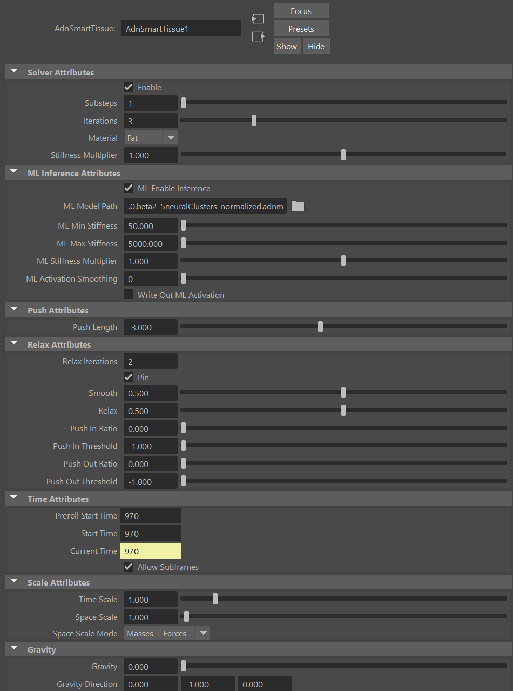 
  <figcaption><b>Figure 3</b>: AdnSmartTissue Attribute Editor.</figcaption>
</figure>

<figure style="width: 75%;" markdown>
  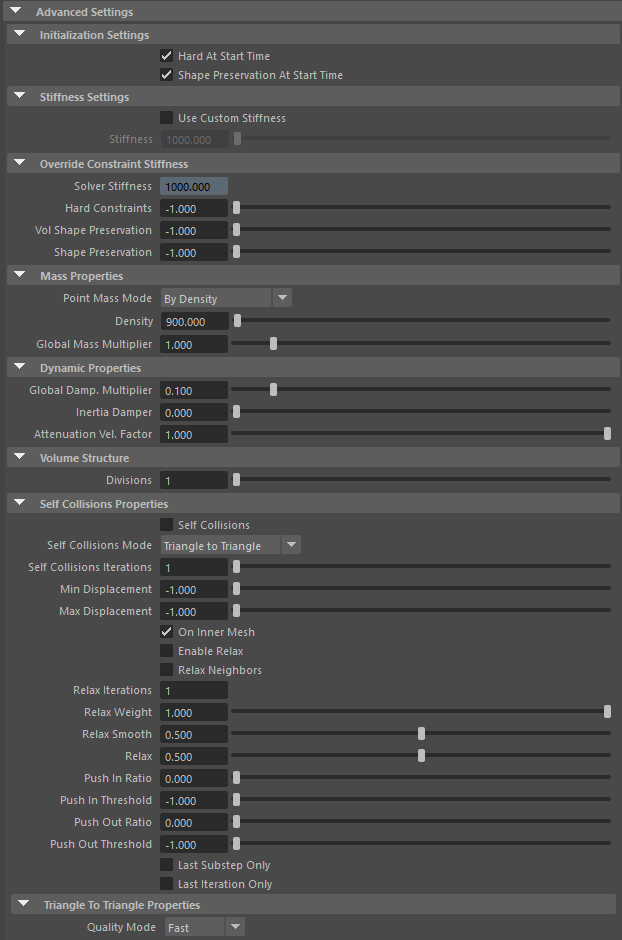
  <figcaption><b>Figure 4</b>: AdnSmartTissue Attribute Editor (Advanced Settings).</figcaption>
</figure>

<figure style="width: 75%;" markdown>
  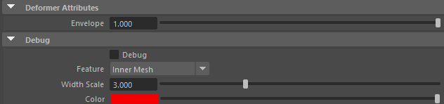
  <figcaption><b>Figure 5</b>: AdnSmartTissue Attribute Editor (Deformer Attributes and Debug menu)</figcaption>
</figure>

## Paintable Weights

In order to provide more artistic control, some key parameters of the AdnSmartTissue solver are exposed as paintable attributes in the deformer. The Maya paint tool must be used to paint those parameters to ensure that the values satisfy the solver requirements.

| Name | Default | Description |
| :--- | :------ | :---------- |
| **Activations**                     | 1.0 | Weight to modulate the effect of dynamic material properties predicted by the Adonis ML model. For example to remove their effect in regions like the face or feet of the character. |
| **Global Damping**                  | 1.0 | Set global damping per vertex in the simulated mesh. The greater the value per vertex is the more damping of velocities. |
| **Hard Constraints**                | 0.0 | Weight to modulate the correction applied to the vertices and the internal virtual points to keep them at a constant transformation, local to the closest point on the base mesh at initialization. Hard Constraint maps will force the points to keep the original position. |
| **Masses**                          | 1.0 | Multiplier to the individual mass values per vertex in the simulated volume. |
| **Mush Weights**                    | 1.0 | Weight to modulate the mush deformation applied to the vertices. |
| **Push Multiplier**                 | 1.0 | Weight used to multiply the global Push Length to determine the amount of adjustment applied at each vertex of the inner mesh. |
| **Push Weights**                    | 1.0 | Weight to modulate the push deformation applied to the vertices of the inner mesh. |
| **Relax Multiplier**                | 1.0 | Weight to multiply the relaxation applied to the inner mesh surface.  |
| **Relax Push In Ratio Multiplier**  | 1.0 | Weight to multiply the push in adjustment applied to the inner mesh surface. |
| **Relax Push Out Ratio Multiplier** | 1.0 | Weight to multiply the push out adjustment applied to the inner mesh surface. |
| **Relax Smooth Multiplier**         | 1.0 | Weight to multiply the smoothing applied to the inner mesh surface. |
| **Relax Weights**                   | 1.0 | Weights to modulate the relax deformation applied to the vertices of the inner mesh. |
| **Self Collision Weights**          | 1.0 | Amount of correction to apply to the current vertex when a collision with another vertex is detected.<ul><li>*Tip*: Paint with a value of 0.0 the areas that should not compute self collisions to reduce the computational impact.</li><li>*Tip*: Paint with a higher value the areas that should receive more correction due to self-intersections, and with a lower value the areas that should receive less correction.</li></ul> |
| **Shape Preservation**              | 1.0 | Amount of correction to apply to a vertex to maintain the initial state of the shape formed with the surrounding vertices. |
| **Volume Shape Preservation**       | 1.0 | Amount of correction to apply to the volume structure to preserve the initial volumetric shape and prevent it from distortion. |
| **Weights**                         | 1.0 | Maya standard weights map used to control the influence of the deformer at each vertex. |

<figure markdown>
  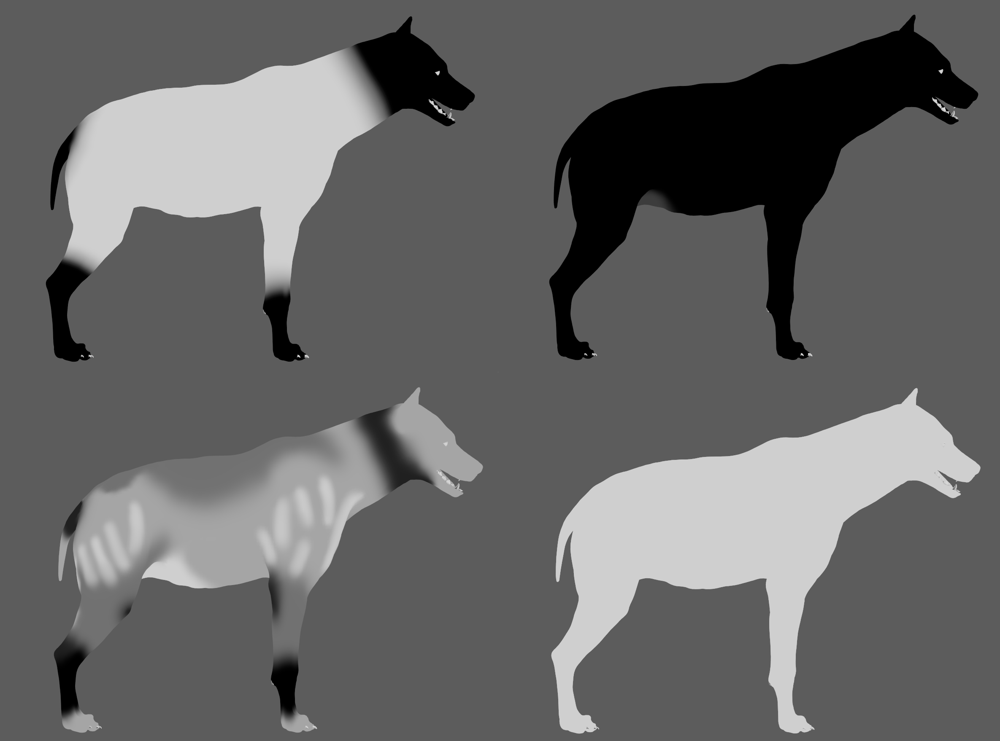
  <figcaption><b>Figure 6</b>: Example of painted weights on the skin of the Hyena. First row, from left to right: deformer weights and hard constraint weights. Second row, from left to right: push multiplier weights and weights flooded to 1.0 for the rest of the maps.</figcaption>
</figure>

## Debugger

In order to better visualize deformer constraints and attributes in the Maya viewport there is the option to enable the debugger, found in the dropdown menu labeled *Debug* in the Attribute Editor.

To enable the debugger the *Debug* checkbox must be marked. To select the specific feature you would like to visualize, choose it from the list provided in *Features*. The features that can be visualized with the debugger in the AdnSmartTissue deformer are:

 - **Inner Mesh**: A wireframe representation of the inner mesh will be drawn.
 - **Hard Constraints**: For each vertex on the simulated mesh and each virtual point that belongs to an internal layer, a line will be drawn from the point to the corresponding closest point on the base mesh if its *Hard Constraints* weight is greater than 0.0.
 - **Shape Preservation**: For each vertex with a shape preservation weight greater than 0.0, a line will be drawn from each adjacent vertex to the opposite adjacent vertex.
 - **Volume Structure**: A line will be drawn for every connection between two points in the volume. A point can be either a vertex on the inner mesh, a vertex on the simulated mesh or a virtual point that belongs to an internal layer generated by the procedural construction based on the *Divisions* attribute.

<figure markdown>
  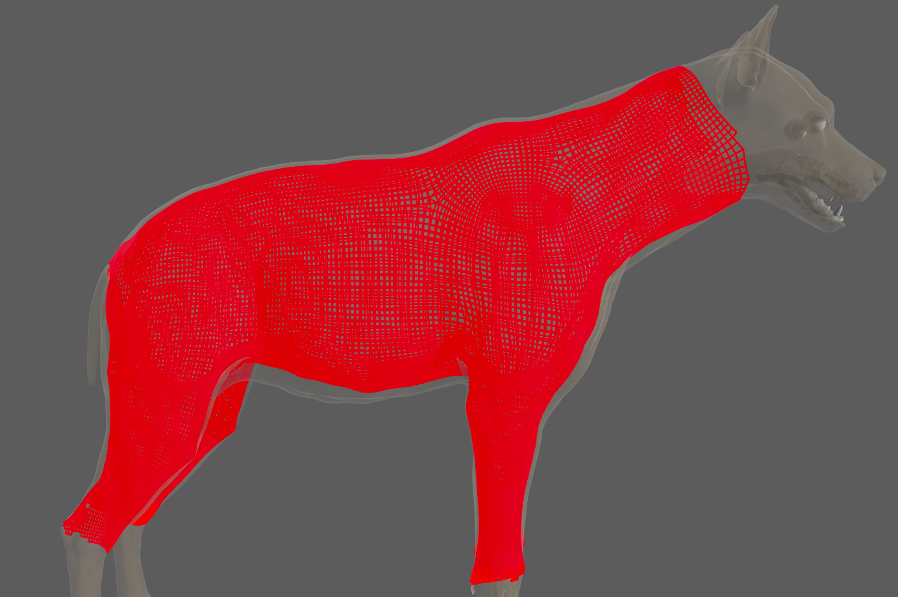
  <figcaption><b>Figure 7</b>: Inner Mesh debugging.</figcaption>
</figure>

<figure markdown>
  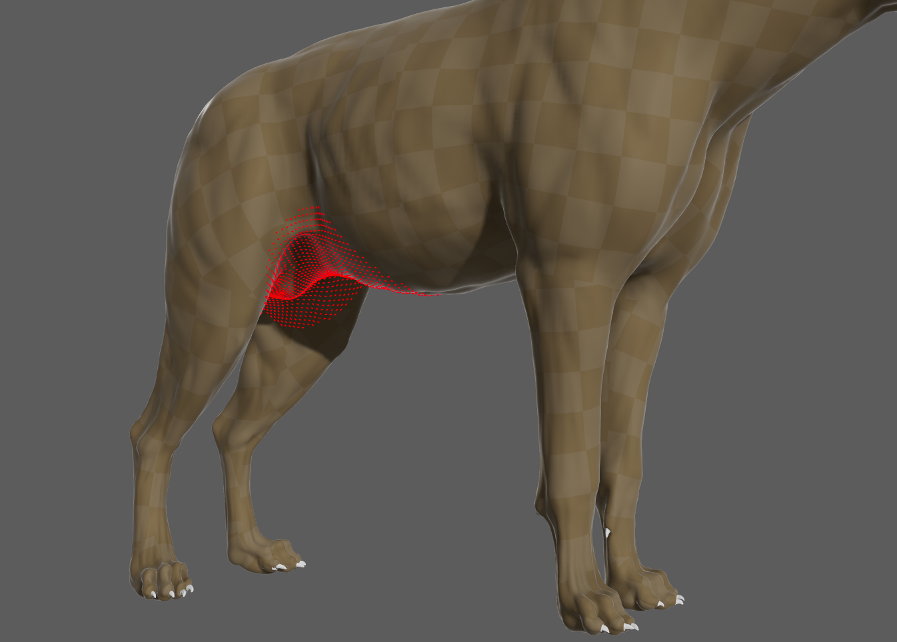
  <figcaption><b>Figure 8</b>: Hard Constraints debugging.</figcaption>
</figure>

<figure markdown>
  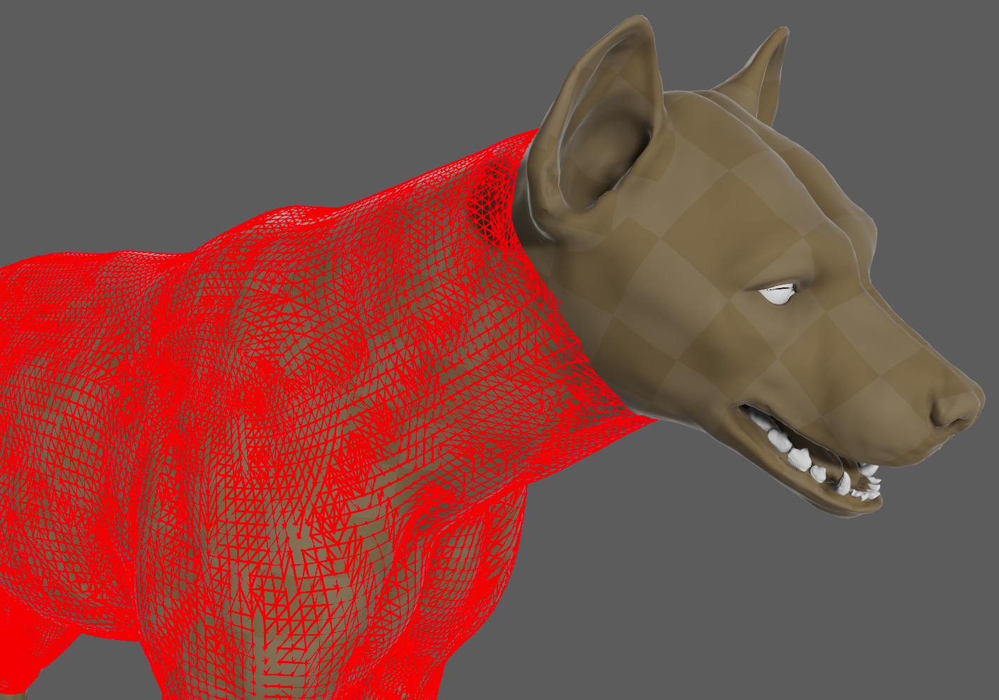
  <figcaption><b>Figure 9</b>: Shape Preservation debugging.</figcaption>
</figure>

<figure markdown>
  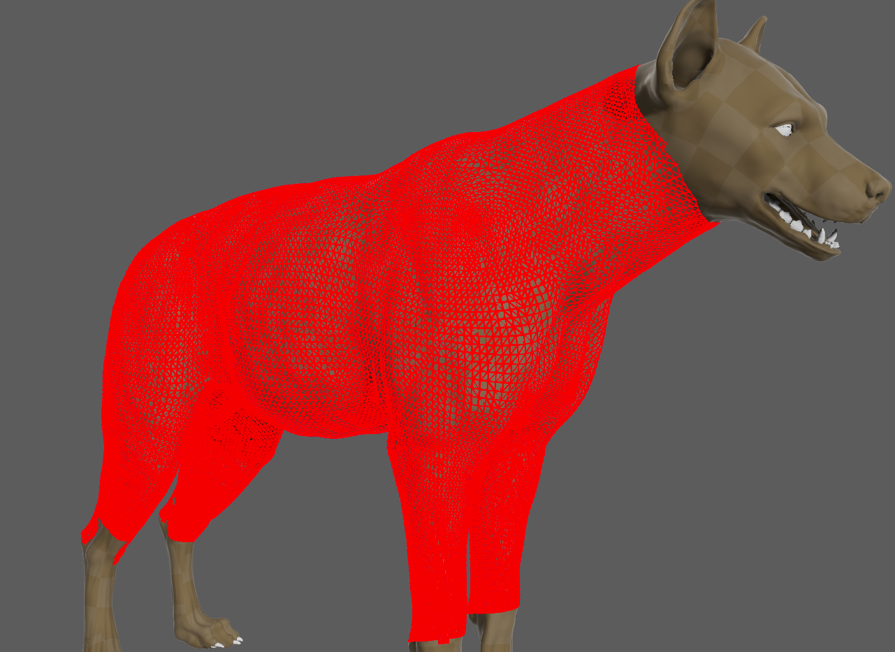
  <figcaption><b>Figure 10</b>: Volume Structure debugging.</figcaption>
</figure>

## Advanced

### Edit Smart Tissue

Once the AdnSmartTissue deformer is created, it is possible to modify the ML Model and the Joints connected to the deformer:

1. Select the mesh with the AdnSmartTissue deformer applied.
2. Press {style="width:4%"} in the Adonis shelf or *Smart Tissue* in the Adonis menu, under the Create Solvers section to open the Edit Smart Tissue UI.
3. Provide the path to an ML Model file (`.adnm`) trained with muscle activation generated by the Neural Training Tool.
4. Provide the path to a Joints Info file (`.json`) generated by the Data Extraction Tool.
5. Press *Edit* to update AdnSmartTissue to the mesh selected.