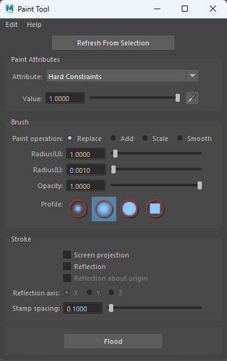
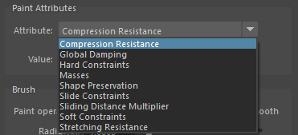

# Tools

AdonisFX includes several tools that allow for a smoother experience when interacting or configuring nodes and deformers. This page is intended to provide detailed explanation of the use, setup and application of each tool.

## Paint Tool

The **AdonisFX Paint Tool** is meant to be used for the manipulation of the paintable attributes of the AdnSkin, AdnMuscle and AdnRibbonMuscle deformers. Its functionalities are very similar to the standard Maya paint tool functionalities plus the ability to paint attributes with multiple influences (e.g. transform attachment constraints) where a single vertex can adopt a different weight value for the same attribute driven by multiple influent external objects. Also, it ensures the normalization of dependent attributes like hard, soft and slide constraints in AdnSkin deformer.

<figure>
   
  <figcaption><b>Figure 5</b>: AdonisFX Paint Tool</figcaption>
</figure>

The use of this tool is required for the correct setup of skin, muscle and ribbon muscle solvers. After every stroke, the internal logic processes the painted map and updates all dependent maps to keep the configuration of the solver safe. For example, if we paint the influence of one target of an AdnMuscle which has two targets assigned, then the tool will update the weights of the other target to ensure that the addition of both is normalized at each vertex. The same applies if we paint hard constraints of an AdnSkin deformer: the soft and slide constraints maps will be updated internally to keep the addition of the three maps normalized. Thanks to this logic, switching attributes (see Figure 7) or selecting influences (see Figure 8) from the AdonisFX Paint Tool provides automatic feedback to the user of the current status of all the maps.

> [!NOTE]
> AdnSimshape does not require this tool. Its paintable maps can be manipulated through the standard Maya paint context.

To open the tool:

  1. Select the mesh with the AdonisFX deformer applied to.
  2. Press the paint tool {style="width:4%"} shelf button or go to AdonisFX Menu > *Paint Tool*.

> [!NOTE]
> - The paint context is configured from the given selection to allow painting.
> - Make sure to select the transform node of the mesh.
> - If the context does not allow to paint, it is probably because the selected node is not a transform mesh node with an AdonisFx paintable deformer. Please, select the transform mesh node and click *Refresh From Selection* or restart the AdonisFX Paint Tool.

If the selection provided is valid, meaning the selected mesh has one of the AdonisFX deformers listed before, then the paint context will get configured and the user can paint. The map to be painted is the one associated to the selected attribute in the enumerator exposed at the top of the UI.

The painted weights are visualized in the viewport thanks to the **AdnWeightsDisplayNode**. This node is in charge of setting the vertex colors from the selected attribute in the UI on the mesh. This node is created and removed dynamically by the Paint Tool on entering and exiting from the context. Because of that, it is strongly recommended to keep the AdonisFX Paint Tool open while painting.

<figure markdown>
   
  <figcaption><b>Figure 6</b>: AdnWeightsDisplayNode created by the AdonisFX Paint Tool. </figcaption>
</figure>

> [!NOTE]
> - If the painted weights are not displayed, it is probably because the node got removed. Please, select the transform node of an AdonisFX paintable deformer and click *Refresh From Selection* or restart the AdonisFX Paint Tool.

Depending on the deformer and the attribute selected the UI can adjust to support multi-influence attributes by exposing the influences or restricting certain functionalities of the tool. In the following sections, the specific behavior of the tool for each deformer is presented.

#### Paint Tool on AdnMuscle and AdnRibbonMuscle

In the specific case of muscle deformers, the too will display the following attributes:

<figure markdown>
   
  <figcaption><b>Figure 7</b>: Paintable attributes in AdonisFX muscle deformer. </figcaption>
</figure>

  - **Attachments To Transforms** and **Attachments To Geometry**
    - If any of this attribute types is selected, then a list widget is shown with the names of the targets connected to the deformer (Figure 7).
    - Select the desired target to paint from the list widget and paint the weight values.
    - When selecting a target in the list, the object will also get selected in the scene, facilitating its identification.
    - If more than one target was added to the system, then the paint tool will normalize the weights automatically after a stroke has been completed, meaning that the sum of all attachment constraint weights in a vertex will always add up to a maximum value of 1.0.
    - If any target is removed or added to the system, then the paint tool will refresh the list on mouse hover over the UI.

    <figure>
       
      <figcaption><b>Figure 8</b>: AdonisFX Paint Tool listing multiple transform attachments.</figcaption>
    </figure>

  - **Stretching and Compression Resistance**
    - Stretching resistance is set to 1.0 by default. With this value, the solver will apply the corrections to the edges needed to keep the lengths at rest. Set values lower than 1.0 to linearly reduce the amount of correction applied by the solver when the edges get stretched.
    - Compression resistance is set to 1.0 by default. With this value, the solver will apply the corrections to the edges needed to keep the lengths at rest. Set values lower than 1.0 to linearly reduce the amount of correction applied by the solver when the edges get compressed.
  - **Fibers**
    - When selecting the fibers attribute, the fibers debugger will automatically get enabled, displaying the muscle fibers.
    - The initial direction displayed will be the one estimated by tendon weights.
    - To modify the fibers direction, comb the fibers towards the desired direction.
    - For better precision adjust the set direction using the *Smooth* brush.
    - To get all fibers more tightly aligned in a homogeneous way, press the flood button while having the *Smooth* brush selected.
  - **Global Damping**
    - By default, this map is set to 1.0.
    - This value is scaled by the *Global Damping Multiplier* during simulation to control the amount of damping the solver will apply at each vertex.
<!-- Note for later to update this information once the Global Damping attribute is added-->
<!-- Note for later to update this information once the Slide On Geometry Damping attribute is added-->
  - **Slide on Segment Constraints**
    - Slide on Segment Constraints operate similarly to attachment constraints, as they are both multi-influence attributes.
    - The entries in the list widget correspond in this case to the segments added to the constraint, with the name of the segment being "*root_transform* - *tip_transform*".
    - Select the desired segment to paint from the list widget and paint the weight values.
    - When selecting a segment in the list the two scene objects that form the root and tip of the segment will get selected as well, facilitating their identification.
    - If more than one segment was added to the system, then the paint tool will normalize the weights automatically after a stroke has been completed, meaning that the addition of all slide on segment constraint weights in a vertex will always add up to a maximum value of 1.0.

    <figure>
       
      <figcaption><b>Figure 9</b>: AdonisFX Paint Tool listing multiple segments.</figcaption>
    </figure>

  - **Tendons**
    - It is recommended to paint values of 1.0 wherever the tendon tissue is and values of 0.0 in the rest of the mesh.
    - This painting will internally trigger an automatic estimation of fibers direction which can be displayed using the debug functionalities of the deformer.

#### Paint Tool on AdnSkin

In the specific case of an AdnSkin deformer, the tool will display the following attributes:

<figure markdown> 
   
  <figcaption><b>Figure 10</b>: Paintable attributes listed in the UI for an AdnSkin deformer. </figcaption>
</figure>

  - **Hard Constraints**
    - Hard constraints are set to 1.0 by default. With this value the solver will apply the corrections to the vertices needed to keep them at a constant transformation, local to the closest point on the reference mesh at initialization.
    - This value is normalized alongside Soft Constraints and Slide Constraints.
  - **Soft Constraints**
    - Soft constraints are set to 0.0 by default. Modify this value to allow the solver to apply corrections to the vertices regarding the vertices keeping a constant distance to the closest point of the reference mesh.
    - This value is normalized alongside Hard Constraints and Slide Constraints.
  - **Slide Constraints**
    - Slide constraints are set to 0.0 by default. Modify this value to allow the solver to apply corrections to the vertices regarding the sliding of the simulated mesh along the reference surface.
    - This value is normalized alongside Hard Constraints and Soft Constraints.
  - **Stretching and Compression Resistance**
    - Stretching resistance is set to 1.0 by default. With this value, the solver will apply the corrections to the edges needed to keep the lengths at rest. Set values lower than 1.0 to linearly reduce the amount of correction applied by the solver when the edges get stretched.
    - Compression resistance is set to 1.0 by default. With this value, the solver will apply the corrections to the edges needed to keep the lengths at rest. Set values lower than 1.0 to linearly reduce the amount of correction applied by the solver when the edges get compressed.
  - **Sliding Distance Multiplier**
    - Sliding distance Multiplier is set to 1.0 by default. With this value, every vertex of the geometry will be able to slide along every vertex of the reference surface.
    - It is suggested to lower the value in those areas where slide constraints are less relevant or not present for better performance without losing quality.
  - **Masses**
    - Masses are set to 1.0 by default. This will mean that by default the solver will consider that the skin has a uniform mass.

## Importer

The **Importer** allows the user to import the configuration for a specific deformer from a previously exported AAD file. It allows the user to easily configure a deformer from an already known setup which includes data like weight maps, connections and attribute values.

<figure>
  
  <figcaption><b>Figure 1</b>: AdonisFX Import Tool UI</figcaption>
</figure>

To open the importer tool press the {style="width:4%"} shelf button or go to AdonisFX Menu > *Import*. To import and apply an ADD file to an entity in the current open scene with the deformer information follow these steps:

1. Locate the ADD file by going to *Input File Path's* folder button and select an AAD file from a directory.
2. Locate the available deformer names that were fetched from the AAD file on the left section of the tool ("Node" | "Node Type").
3. Locate the available nodes found in the current scene selection to which the AAD file configuration can be applied to ("Mesh" | "Candidate Node"). The selection can be redone and expanded by selecting elements from the scene and pressing the *Add Selected* button or can be cleared using the *Clear* button.
4. Select the deformer from which the AAD file data will be fetched in the left hand panel.
5. Select the node to which to apply the selected deformer configuration in the right hand panel.
6. Press the *Assign* button to temporarily assign the configuration to the target node. Or clear the assignment using *Delete*.
7. The assignments can then be imported using the *Import* button or everything can be cleared using the *Clear All* button.

After following the previous steps the tool will inform about the status of the import: if failed, only partial data could be imported or all data could be imported.

<figure>
  
  <figcaption><b>Figure 2</b>: AdonisFX Import Tool Active State</figcaption>
</figure>

> [!NOTE]
> When using this tool take into consideration that the mesh from which the AAD file was exported **must have the same number of vertices** as the one to which the configuration is getting imported.

## Exporter

The **Exporter** allows the user to export the configuration for a specific deformer into an AAD file. It allows the user to easily save a deformer configuration 
from an already existing setup containing data like weight maps, connections and attribute values.

<figure>
  
  <figcaption><b>Figure 3</b>: AdonisFX Export Tool Default State</figcaption>
</figure>

To open the tool press the {style="width:4%"} shelf button or go to AdonisFX Menu > *Export*. To export an ADD file from the current scene follow these steps:

1. If the tool had been opened on an already active selection containing an AdonisFX deformer the node will appear in the *Select Export Data* list. To add and remove a new selection press *Add Selection* or *Clear*.
2. Select, using the checkboxes, the deformers and the individual settings to export to the AAD file. For example selecting *Maps* and *Attachments* would export the painted attribute maps and the matrices for the transform attachments relative to an AdnMuscle or AdnRibbonMuscle deformer.
3. Define a name for the ADD file by going to *Output File Path* and selecting the folder icon.
4. Finally, pressing the *Export* button will generate the file in the designated location.

The AAD file that has been exported can then be imported in a scene with similar characteristics.

<figure>
  
  <figcaption><b>Figure 4</b>: AdonisFX Export Tool Active State</figcaption>
</figure>

> [!NOTE]
> When using this tool to export more than one AdonisFX deformer, all meshes with deformers must be contained within the same group in the scene.

## Sensors Connection Editor

To ease with the connection of sensors to deformers AdonisFX provides the **Sensors Connection Editor** in charge of facilitating the connection of sensors to the active deformers in the scene.

To use this tool go to the AdonisFX Menu > Sensors (under the Edit section) > *Connection Editor*.

<figure markdown> 
   
  <figcaption><b>Figure 11</b>: Sensor connection editor after opening it for the first time. </figcaption>
</figure>

Two main sections can be distinguished in this tool, labeled *source* and *destination*. In the source section the sensors and locators alongside their signal attributes will get displayed, while in the destination section the deformers alongside their possible input attributes will get displayed.

To retrieve these objects and display them in the tool, select the desired element from the scene (an AdonisFX locator containing a sensor or a deformer) and press their respective *Reload Left* or *Reload Right* button.

For Source elements (sensors) press the *Reload Left* button and for Destination elements (deformers) press the *Reload Right* button.

<figure markdown> 
   
  <figcaption><b>Figure 12</b>: Sensor connection editor after adding sensors and deformers from the selection. </figcaption>
</figure>

To make the connections select the two specific attribute to connect (one from *source* and one from *destination*) and press the *Make Connection* button. A message will then get displayed informing that the connection has been properly made.

To clear the selection and reset the tool to its initial state, press the *Clear All* button.