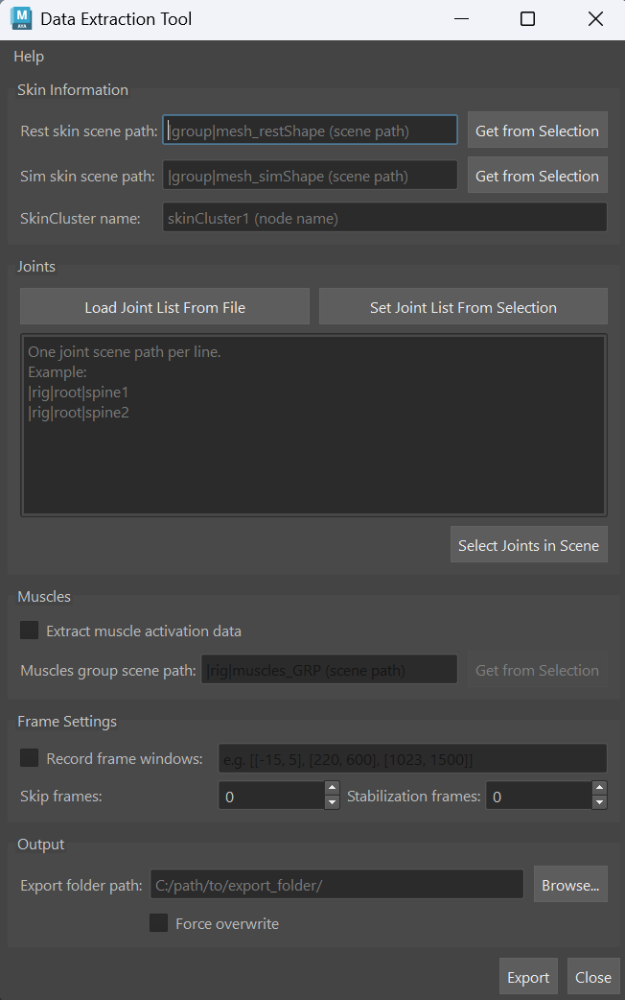
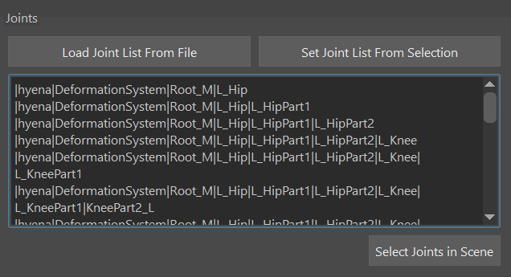
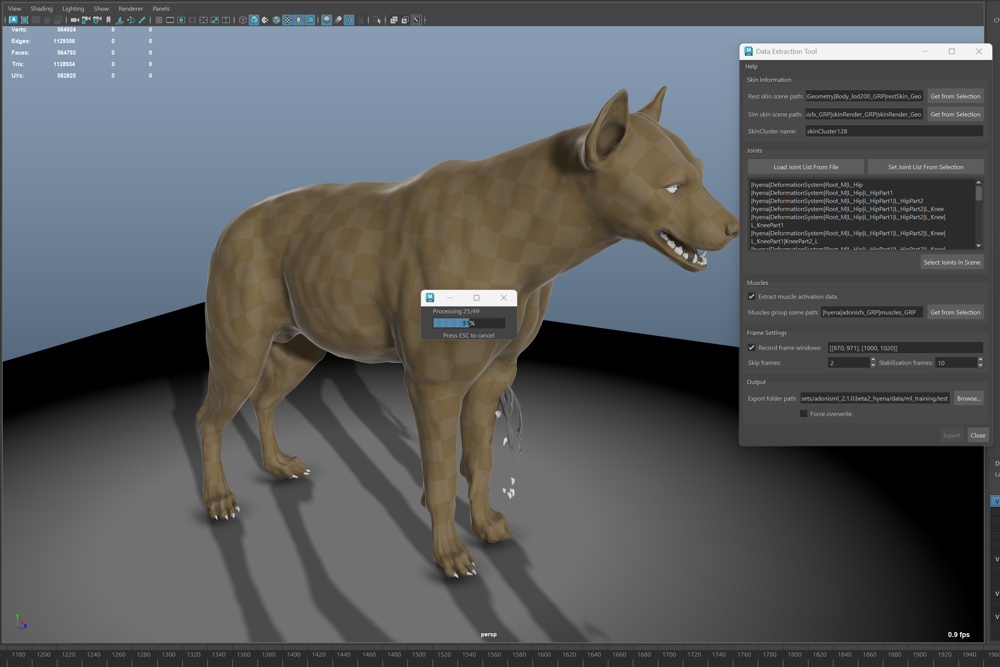

# Data Extraction Tool

> [!IMPORTANT]
> An Adonis ML license is required to use this feature.

The Adonis ML *Data Extraction Tool* is used to extract data for training AdonisML models.

Data extraction gathers the input and output data used by the AdonisML training workflow. The *Data Extraction Tool* reads the simulated skin, the rest skin, and the selected joint data, then exports the data required for training AdonisML models.

Optionally, the tool can also extract muscle activation data. When enabled, this allows the extraction process to include dynamic material properties prediction for AdnSmartTissue support of the trained ML models.

## UI

<figure style="width:50%;" markdown>
  
  <figcaption><b>Figure 1</b>: Adonis Data Extraction UI.</figcaption>
</figure>

The Data Extraction Tool (see Figure 1) provides an intuitive interface to configure the data extraction process according to specific requirements. Below is a breakdown of the available UI elements:

### Skin Information

- **Rest skin scene path**: Specifies the Maya scene path to the rest skin. The *Get From Selection* button allows users to select the rest skin geometry in the scene and automatically populate the field with its path.

- **Sim skin scene path**: Specifies the Maya scene path to the simulated skin. The *Get From Selection* button allows users to select the simulated skin geometry in the scene and automatically populate the field with its path.

- **SkinCluster name**: Specifies the name of the skinCluster node associated with the animated skin. This will be used to extract the animation joint data. The animated skin must have the same topology as the rest and simulated skins.

> [!NOTE]
> The geometries specified in *Rest skin scene path* and *Sim skin scene path* must have the same topology. They must have matching point counts and matching point order so the extraction process can compute displacement data correctly.

### Joints

- **Load Joint List From File**: This button allows users to load the list of joint paths from a `joints.json` file from previous data extractions. This can be useful for ensuring consistency across multiple data extractions or when working with complex rigs.

- **Set Joint List From Selection**: This button allows users to select the joints in the Maya scene that will be included in the data extraction. The selected joint paths will be displayed in the *Joint List* field.

- **Joint List**: This field displays the list of joint paths that will be included in the data extraction. Users can manually edit this list or use the buttons mentioned above to populate it.

- **Select Joints in Scene**: This button allows users to select the joints in the Maya scene based on the paths specified in the *Joint List* field. This can be useful for quickly verifying that the correct joints are included in the data extraction.

### Muscles

- **Extract muscle activation data**: Enables extraction of muscle activation data. When enabled, the extracted data can support training the ML model on material properties prediction for AdnSmartTissue. If disabled, the extracted data supports training models for AdnMLDeformer only.

- **Muscle group scene path**: If muscle activation data extraction is enabled, this field specifies the Maya scene path to the muscle group. The muscle group should contain the AdnMuscle and AdnRibbonMuscle nodes that will be included in the data extraction. The *Get From Selection* button allows users to select the muscle group in the scene and automatically populate the field with its path.

### Frame Settings

- **Record frame windows**: When enabled, the data extraction process will record the input and output data for the specified frame windows. If disabled, the data extraction will record data for the full animation playback range.

- **Frame windows**: This field specifies the frame windows for recording the data. Frame windows must be defined as separate frame ranges (for example: `[[1, 5], [220, 600], [1023, 1500]]`) where each range indicates the start and end frames for recording.

- **Skip frames**: Number of frames to skip during recording. This helps reduce redundant pose data and extract more diverse samples. Lower values are recommended for fast animations, while higher values can be used for slower animations. Typical suggested values for normal animation speeds are between `2` and `5`. The skip frames will be computed from the start of each frame window, ensuring that the starting frame of each window is always recorded in the dataset.

- **Stabilization frames**: This field specifies the number of times a frame should be stabilized before being recorded. This parameter damps the motion inertia in the recorded poses. Higher values make each of the recorded poses lose more dynamics and converge toward a static silhouette. Well stabilized data is required for good ML deformation training. Faster animations usually require more stabilization frames. Typical suggested values for normal animation speeds are between `5` and `10`. Increasing this value will increase the export time.

### Output

- **Export folder path**: Specifies the folder path where the extracted data will be saved. Use the **Browse** button to select the desired export folder.

- **Force overwrite**: When enabled, the data extraction process will overwrite any existing files in the export folder with the same names as the newly extracted data. Use this option with caution to avoid unintentional loss of previous data.

## Requirements

Before running the data extraction process, ensure that the Maya scene meets the following requirements to guarantee a successful extraction:

- The rest skin and simulated skin geometries must have the same topology (i.e. same vertex count and vertex IDs) to ensure that the extracted data is consistent and can be used effectively for training AdonisML models.

- The skinCluster node specified in the *SkinCluster name* field must be associated with the animated skin geometry that matches the rest skin and simulated skin topology. This is crucial for accurately extracting the joint animation data required for training AdonisML models.

- Muscle activation data extraction requires all muscles to be provided through *Muscle Group Scene Path* and does not support partial muscle setups.

## How To Use

To prepare the Maya scene for data extraction you can follow these steps:

1. Duplicate the animated skin geometry at rest pose. If you already have a rest skin geometry in the scene, you can skip this step.

2. Set the *Rest skin scene path* and *Sim skin scene path* fields.

    Add the scene paths for the rest skin and simulated skin geometries in the corresponding fields of the UI. You can use the *Get From Selection* buttons to select the geometries in the scene and automatically populate the fields.

3. Specify the *SkinCluster name* field.

    The skinCluster node should be the one associated with the animation that you want to extract.

4. Populate the *Joint List* field.

    You can use the *Load Joint List From File* button to load a previously saved list of joint paths from a `joints.json` file, or you can use the *Set Joint List From Selection* button to select the joints in the scene and automatically populate the field.

    <figure style="width:90%; margin-left:5%" markdown>
      
      <figcaption><b>Figure 2</b>: Data Extraction Tool joint selection.</figcaption>
    </figure>

5. Optionally enable *Extract Muscle Activation Data*.

    Enable *Extract Muscle Activation Data* if the exported data should support dynamic material properties prediction for AdnSmartTissue.

    When this option is enabled, set the *Muscle Group Scene Path* to the scene path of the muscle group containing the AdnMuscle and AdnRibbonMuscle nodes. You can use the *Get From Selection* button to select the muscle group in the scene and automatically populate the field.

    When muscle activation data is extracted, the generated data can support training ML models for AdnSmartTissue. If this input is not provided, the extracted data supports training models for AdnMLDeformer only.

6. Configure the frame settings.

    Use the *Frame Settings* parameters to define which frames should be recorded during data extraction.

    Enable *Record Frame Windows* to specify separate frame ranges for the extraction process. Frame windows must be defined as a list of frame ranges, for example: `[[1, 5], [220, 600], [1023, 1500]]`.

    Use *Skip frames* to skip frames during recording. This helps reduce redundant pose data and extract more diverse samples. Lower values are recommended for fast animations, while higher values can be used for slower animations. Typical suggested values for normal animation speeds are between `2` and `5`. Skip frames are computed from the start of each frame window, ensuring that the starting frame of each window is always recorded in the dataset.

    Use *Stabilization Frames* to define how many times each frame should be recooked before displacement data is computed and written. This helps stabilize the simulation dynamics before extraction. Typical suggested values for normal animation speeds are between `5` and `10`, but faster animations may require higher values.

7. Set the *Export Folder Path* field.

8. Launch the data extraction process by clicking the *Export* button. The extracted data will be saved in the specified export folder.

## Muscle Activation Data Initialization

If the *Extract Muscle Activation Data* option is enabled, the beginning of the data extraction process will initialize and cache the Adonis muscle setup information. This initialization step might require some time depending on the complexity of the muscle setup and the poly count of the meshes.

## Monitoring the Data Extraction Process

Once the data extraction process is launched, a progress bar will be displayed in the UI to indicate the current status of the extraction. The progress bar will show the percentage of completion. The process can be stopped at any time by pressing the `Escape` key on the keyboard and clicking `Yes` in the confirmation dialog that appears. Stopping the process will save the data extracted up to that point, but any frames that were being processed at the moment of stopping will not be included in the exported dataset.

<figure style="width:90%;" markdown>
    
    <figcaption><b>Figure 3</b>: Data Extraction Tool progress.</figcaption>
</figure>

## Result

The extraction process writes the data to the folder specified in *Export folder path*.

The following files are generated in the target export folder:

- `inputs.csv`: Contains the extracted input data, including the selected joint transforms.
- `outputs.csv`: Contains the extracted output data, including the simulated skin displacement data and optional data required for AdnSmartTissue material properties prediction.
- `joints.json`: Contains the exported joint hierarchy information used to associate the joint transform data with the extracted joints.
- `extraction_config.json`: Contains the configuration used for the extraction process, including the input paths, joint list, frame settings, and export settings.

> [!NOTE]
> If the extraction is interrupted or fails before completion, some of these files may already exist in the export folder but contain partial data.
