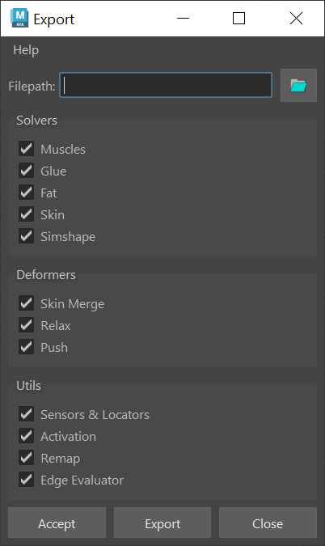
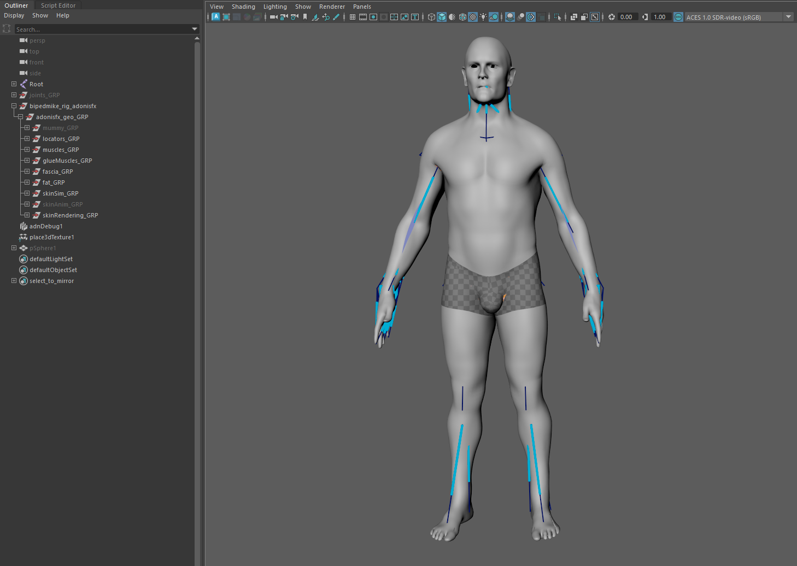
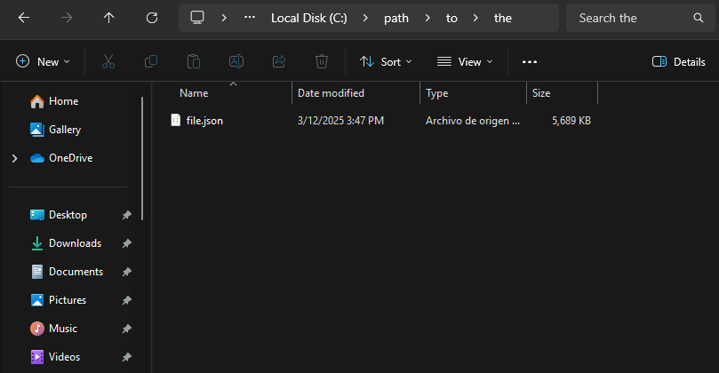

# Export

The AdonisFX Export is a tool designed to facilitate the export of a complete AdonisFX rig from a Maya scene. This tool enables users to selectively export various components of an AdonisFX rig, ensuring a structured and efficient workflow for data transfer, backup, or reuse across different projects.

## UI

<figure markdown>
  
  <figcaption><b>Figure 1</b>: AdonisFX Export UI. </figcaption>
</figure>

The Export Tool offers an intuitive interface (see Figure 1), allowing users to configure export settings according to their specific requirements. Below is a breakdown of the available UI elements:​

- **Filepath**. Specifies the destination path of the JSON file where the exported data will be saved. Clicking the folder icon opens a file browser to select the desired directory.

- **Solvers**. Defines which solvers should be exported. Options include:
    - Muscles: include AdnMuscle and AdnRibbonMuscle nodes in the exported data.
    - Glue: include AdnGlue nodes in the exported data.
    - Fat: include AdnFat nodes in the exported data.
    - Skin: include AdnSkin nodes in the exported data.

- **Deformers**: Specifies which deformers should be included in the export. Options include:
    - Skin Merge: include AdnSkinMerge nodes in the exported data.
    - Relax: include AdnRelax nodes in the exported data.

- **Utils**: Allows exporting additional utility components from the setup. Options include:
    - Sensors & Locators: include AdonisFX sensors and locators in the exported data, ensuring proper connections between components.
    - Activation: include activation nodes and their existing connections to AdnMuscle nodes in the exported data.

- **Buttons**:
    - Accept: executes the export process based on the selected options and closes the window.
    - Export: executes the export process based on the selected options without closing the window.
    - Close: closes the window without exporting.

## How To Use

Open the scene of a fully configured AdonisFX rig (see Figure 2) and follow these steps:

<figure markdown>
  
  <figcaption><b>Figure 2</b>: Fully configured rig of a biped character. The rig includes sensors, locators, activation nodes, muscles, glue, fascia, fat, skin, skin merge, and relax.</figcaption>
</figure>

1. Go to *AdonisFX menu > I/O > Export (beta)* to open the *Export* window.

2. Specify the file path where the exported data will be saved (e.g., `path/to/the/file.json`).

3. Select the features to export from the *Solvers*, *Deformers* and *Utils* sections. To export the entire rig, enable all options.

4. Click *Accept* or *Export* to execute the export process.

Depending on the complexity of the rig, the export process might take a few seconds to complete. Once finished, a JSON file containing the exported data will be created in the specified path.

<figure markdown>
  
  <figcaption><b>Figure 3</b>: Example of the generated JSON file after exporting.</figcaption>
</figure>

> [!NOTE]
> The Export Tool is labeled as *Beta* since it relies on the experimental [API](../api).

## Limitations

- If Maya nodes are applied to the simulated geometries (e.g. Delta Mush applied to the simulated skin), it is not guaranteed that the node order in the Maya node graph will be preserved after importing.
