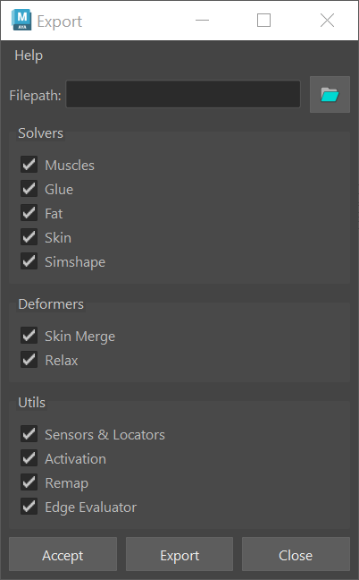

# Exporter

The AdonisFX Exporter is a comprehensive tool designed to facilitate the export of  a complete AdonisFX rig from a Maya scene. This tool enables users to selectively export various components of an AdonisFX rig, ensuring a structured and efficient workflow for data transfer, backup, or reuse across different projects.

## UI

The Exporter Tool offers an intuitive interface (see figure 1), allowing users to configure export settings according to their specific requirements. Below is a breakdown of the available UI elements:​

- **Filepath**. Specifies the destination file path where the exported data will be saved. Clicking the folder icon opens a file browser to select the desired directory.

- **Solvers**. Defines which solvers should be exported. Options include:
    - Muscles: include AdnMuscle nodes in the exported data.
    - Glue: include AdnGlue nodes in the exported data.
    - Fat: include AdnFat nodes in the exported data.
    - Skin: include AdnSkin nodes in the exported data.

- **Deformers**: Specifies which deformers should be included in the export. Options include:
    - **Skin Merge**: include AdnSkinMerge nodes in the exported data.
    - **Relax**: include AdnRelax nodes in the exported data.

- **Utils**: Allows exporting additional utility components from the setup. Options include:
    - Sensors & Locators: include AdonisFX sensors and locators in the exported data, ensuring proper connections between components.
    - Activation: include activation nodes and their existing connections to AdnMuscle nodes in the exported data.

- **Buttons**:
    - Accept: executes the export process based on the selected options and closes the window.
    - Export: executes the export process based on the selected options without closing the window.
    - Close: closes the window without exporting.

<figure markdown>
  
  <figcaption><b>Figure 1</b>: AdonisFX Exporter UI. </figcaption>
</figure>

## How To Use

1. Go to *AdonisFX menu > I/O > Export (beta)* to open the Exporter window.

2. Provide the path to the JSON file in which the exported data will be written.

3. Select the features that will be exported from the *Solvers*, *Deformers* and *Utils* sections.

4. Press *Accept* or *Export* to run the export process.

Depending on the complexity of the rig, the export process might take a few seconds to complete. After that, the file will be created in the path provided containing the exported data.

## Limitations

