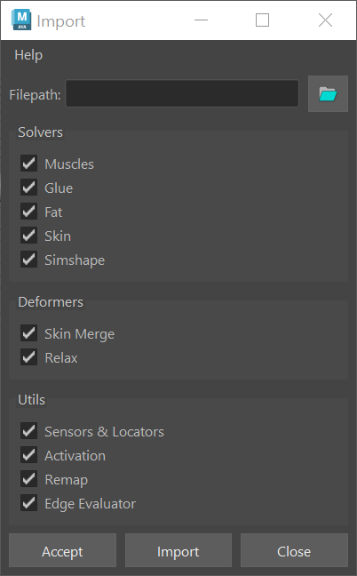

# Importer

The AdonisFX Importer is a tool designed to facilitate the import of a complete AdonisFX rig into a Maya scene. This tool enables users to restore previously exported rigs by reading the data from a JSON file and rebuilding all selected components in the scene. The tool ensures a structured and efficient workflow for transferring, reusing, or backing up AdonisFX rigs.

## UI

The Importer Tool offers an intuitive interface (see Figure 1), allowing users to configure import settings according to their specific requirements. Below is a breakdown of the available UI elements:

- **Filepath**. Specifies the path to the JSON file containing the data to be imported. Clicking the folder icon opens a file browser to select the desired file.

- **Solvers**. Defines which solvers should be imported. Options include:
    - Muscles: imports AdnMuscle nodes and their settings.
    - Glue: imports AdnGlue nodes and their settings.
    - Fat: imports AdnFat nodes and their settings.
    - Skin: imports AdnSkin nodes and their settings.

- **Deformers**. Specifies which deformers should be imported. Options include:
    - Skin Merge: imports AdnSkinMerge nodes and their settings.
    - Relax: imports AdnRelax nodes and their settings.

- **Utils**. Allows importing utility components from the JSON file. Options include:
    - Sensors & Locators: imports AdonisFX sensors and locators, ensuring proper connections between components.
    - Activation: imports activation nodes and their connections to AdnMuscle nodes.

- **Buttons**:
    - Accept: executes the export process based on the selected options and closes the window.
    - Export: executes the export process based on the selected options without closing the window.
    - Close: closes the window without exporting.

<figure markdown>
  
  <figcaption><b>Figure 1</b>: AdonisFX Importer UI.</figcaption>
</figure>

## Requirements

Before importing an AdonisFX rig, the target Maya scene must meet the following requirements to ensure a successful reconstruction:

- Matching Geometry for *Solvers* and *Deformers*: Any geometry that had solvers or deformers (i.e. AdnMuscle, AdnGlue, AdnFat, AdnSkin, AdnSkinMerge and AdnRelax) applied in the original scene must also exist in the target scene. The geometries must have the same name and topology (i.e. same vertex count and vertex IDs) as in the exported scene to ensure that weight maps and settings are correctly restored.

- Matching Transforms for *Locators* and *Sensors*: Since AdonisFX locators and sensors rely on transform inputs, the target scene must contain transforms with the same names as those used in the exported rig. This ensures that connections between nodes are restored properly.

## How To Use

To import an AdonisFX rig, ensure that you have a valid exported JSON file and follow these steps:

1. Optionally, if the target scene contain any dirty or unwanted AdonisFX nodes, it may be advisable to remove all of them by using the *Clear* option provided in *AdonisFX menu > Tools > Utils > Clear*.

<figure markdown>
  
  <figcaption><b>Figure 2</b>: Scene of a biped character after executing the *Clear* and ready to import.</figcaption>
</figure>

2. Go to to *AdonisFX menu > I/O > Import (beta)* to open the *Importer* window.

3. Specify the file path of the JSON file that contains the exported rig data (see figure 3).

<figure markdown>
  
  <figcaption><b>Figure 3</b>: File exported from an AdonisFX rig.</figcaption>
</figure>

4. Select the features to import from the from the *Solvers*, *Deformers* and *Utils* sections. To import the entire rig, enable all options.

5. Click *Accept* or *Import* to execute the import process.

Depending on the complexity of the rig, the import process might take a few seconds to complete. Once finished, all the selected components will be reconstructed in the scene.

<figure markdown>
  
  <figcaption><b>Figure 4</b>: Scene after importing the rig from a JSON file.</figcaption>
</figure>

The previous steps corresponds to importing a rig that was exported from the same scene. However the same steps can be followed to transfer the exported rig to a different asset as long as the target scene fulfills the requirements listed in this [section](#requirements).

<!-- To complete if we are finally allowed to expose Kobun asset) -->

## Limitations

- If Maya nodes are applied to the simulated geometries (e.g. Delta Mush applied to the simulated skin), it is not guaranteed that the node order in the Maya node graph will be preserved after importing.
