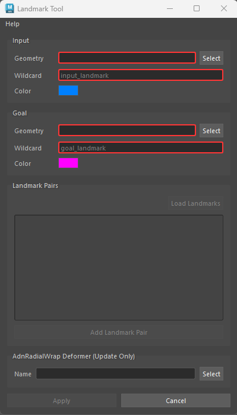
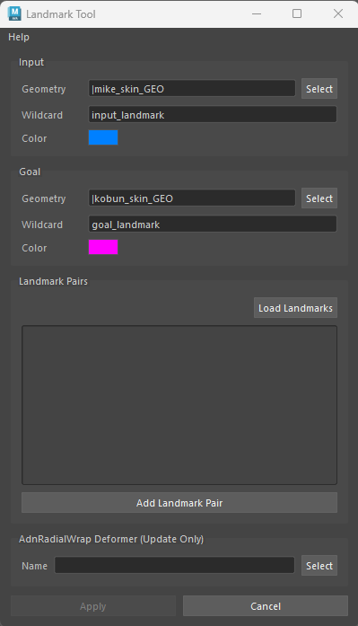
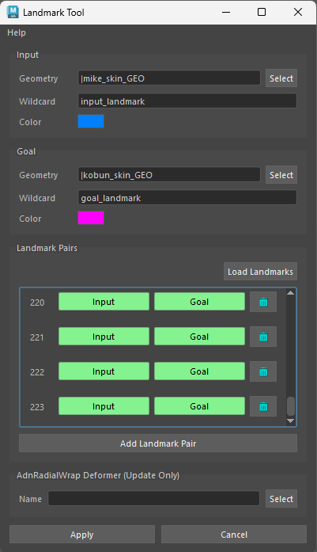
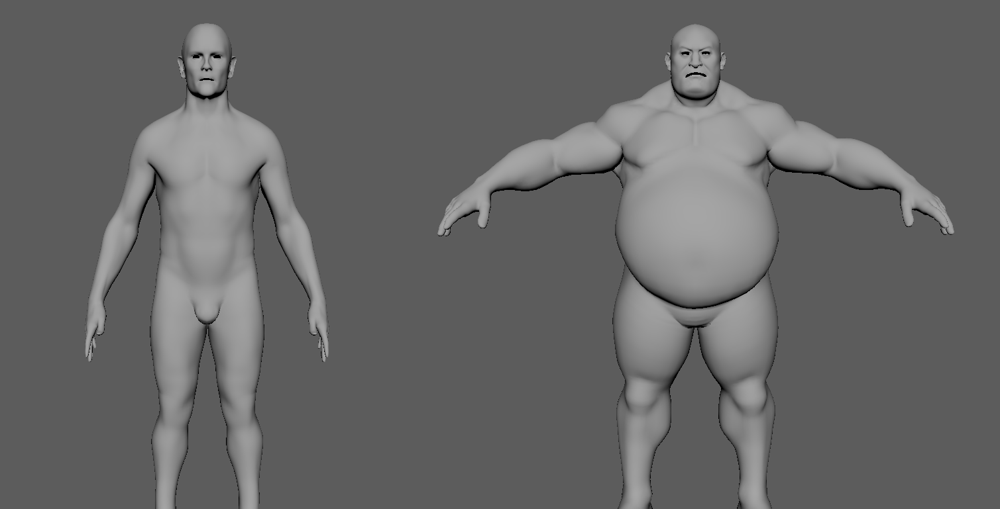

# Landmark Tool

The Landmark Tool is the main utility used to create, edit, manage, and connect landmarks to an AdnRadialWrap deformer.

It provides a streamlined workflow for defining anatomical correspondences between an input geometry and a goal geometry through pairs of landmarks represented by AdnPointLocator nodes. These landmark pairs are then connected to an AdnRadialWrap deformer, which uses them to compute the shape transfer.

The tool can either create a new AdnRadialWrap deformer automatically or update the landmark connections of an existing one.

The Landmark Tool works together with the following components:

- [AdnPointLocator](../utils/locators#adnpointlocator): In Maya, it represents individual landmarks on the input and goal geometries.
- [AdnRadialWrap](../deformers/radial_wrap): Computes the deformation based on the landmark correspondences.

AdnRadialWrap does not require topological match between the input and goal geometries because the correspondence is actually described by the pairs of landmarks.

The workflow consists of defining corresponding anatomical points between an input geometry and a goal geometry. These correspondences are then used by AdnRadialWrap to reshape and repose the input mesh.

## UI

<figure style="width:90%; margin-left:5%" markdown>
  
  <figcaption><b>Figure 1</b>: Landmark Tool UI without providing any input. Some buttons are disabled because there are missing inputs. </figcaption>
</figure>

### Input
- **Geometry**: Name of the input geometry.
- **Wildcard**: Pattern of the input landmarks (e.g. "input_landmark").
- **Color**: Color of the input landmark shapes.

### Goal
- **Geometry**: Name of the goal geometry.
- **Wildcard**: Pattern of the goal landmarks (e.g. "goal_landmark").
- **Color**: Color of the goal landmark shapes.

### Landmark Pairs
- **Load Landmarks**: Load input and goal landmarks that matches the wildcard patterns.
- **Add Landmark Pair**: Add new entry to the list representing a landmark pair.

### AdnRadialWrap Deformer (Update Only)
- **Name**: Name of an existing AdnRadialWrap deformer to update its connections to the landmarks. If not provided, a new AdnRadialWrap deformer will be created.

## Requirements

To load existing landmarks or create new ones, the following inputs are required:

- Input geometry.
- Goal geometry.
- Input wildcard pattern (e.g. "input_landmark")
- Goal wildcard pattern (e.g. "goal_landmark")

> [!NOTE]
> - To create or update an AdnRadialWrap, at least four pairs of corresponding landmarks must be defined, as this is the minimum requirement for AdnRadialWrap to compute a deformation.
> - The Landmark Tool only allows a single goal geometry to be provided for landmark placement. However, multiple goal geometries can still be used by creating the AdnRadialWrap deformer directly from the Adonis menu. Go to this [section](../deformers/radial_wrap#using-the-adonis-menu) in the AdnRadialWrap page for more information.

## How To Use

Aside from handling landmarks, the Landmark Tool can be used to create a new AdnRadialWrap or to update an existing one.

### Create new AdnRadialWrap

1. Open the Landmark Tool from the Adonis menu under the Tools section.
2. Provide the geometry to deform and assign it to *Input Geometry*.
3. Select the reference geometry and assign it to *Goal Geometry*.
4. Define the naming patterns for the landmarks using the *Input Wildcard* and *Goal Wildcard* fields.

<figure style="width:90%; margin-left:5%" markdown>
  
  <figcaption><b>Figure 2</b>: Landmark Tool UI after providing the inputs. </figcaption>
</figure>

5. Press *Add Landmark Pair* to create a new empty landmark pair entry.
6. Press the *Input* button of the new pair to create an input landmark.
7. Position the newly created landmark on the input geometry.
8. Press the *Goal* button of the same pair to create a goal landmark.
9. Position the newly created landmark on the goal geometry.
10. Repeat steps 6–10 until all desired landmark pairs have been defined.

<figure style="width:90%; margin-left:5%" markdown>
  
  <figcaption><b>Figure 3</b>: Landmark Tool UI after defining the landmarks. </figcaption>
</figure>

<figure style="width:90%; margin-left:5%" markdown>
  
  <figcaption><b>Figure 4</b>: Landmark pairs defined on two human bodies. </figcaption>
</figure>

11. Leave the *AdnRadialWrap Deformer (Update Only)* field empty to create a new deformer and automatically connect the input geometry, goal geometry, and defined landmarks.
12. Press *Apply*.

<figure style="width:90%; margin-left:5%" markdown>
  
  <figcaption><b>Figure 5</b>: Result of the AdnRadialWrap deformation. On the left, the geometry without deformation; on the right, the resulting deformation. </figcaption>
</figure>

### Update existing AdnRadialWrap

The tool can also be used to edit an existing AdnRadialWrap deformer to adjust landmark positions, add new landmark pairs, or remove existing ones.

1. Open the Landmark Tool from the Adonis menu under the Tools section.
2. Provide the geometry to deform and assign it to *Input Geometry*.
3. Select the reference geometry and assign it to *Goal Geometry*.
4. Define the naming patterns for the landmarks using the *Input Wildcard* and *Goal Wildcard* fields.
5. Press *Load Landmarks* to load the existing AdnPointLocator nodes whose names match the provided wildcard patterns.
6. Press *Add Landmark Pair* to create a new empty landmark pair entry.
7. Press the *Input* button of the new pair to create an input landmark.
8. Position the newly created landmark on the input geometry.
9. Press the *Goal* button of the same pair to create a goal landmark.
10. Position the newly created landmark on the goal geometry.
11. Repeat steps 6–10 until all desired landmark pairs have been defined.
12. Provide the name of an existing deformer in the *AdnRadialWrap Deformer (Update Only)* field to update its landmark connections. If not provided, a new AdnRadialWrap deformer will be created.
13. Press *Apply*.

## Landmarks

Landmarks are represented using [AdnPointLocator](../utils/locators#adnpointlocator) nodes, which are specialized Adonis locators designed specifically for the anatomy transfer workflow. These landmarks define the anatomical correspondences between the input and goal geometries that drive the deformation computed by the AdnRadialWrap deformer.

When a landmark is created by the tool:

- The newly created AdnPointLocator is automatically selected.
- The corresponding geometry (input or goal) is temporarily set to *Live* in Maya.
- The locator can then be moved and snapped directly onto the surface of the geometry.

This workflow helps ensure accurate landmark placement and makes it easier to establish reliable anatomical correspondences.

The Landmark Tool automatically manages landmark identification and visualization. Newly created landmarks are named using the input and goal wildcard patterns provided by the user (for example, `input_landmark1`, `input_landmark2`, etc.), allowing the tool to reliably identify, organize, and reload landmarks from the scene. The appropriate landmark identifier is also automatically assigned as a label to each created AdnPointLocator.

The appearance of input and goal landmarks can be customized independently using the color selectors available in the tool, making it easier to distinguish between the two landmark sets when working in the viewport.

## Limitations
- The tool does not allow more than one goal geometry to be provided.