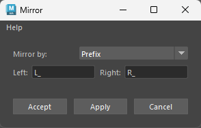

# Mirror Tool

The **AdonisFX Mirror Tool** is a feature designed to simplify and speed up the muscle setup process for digital characters within Maya. This tool efficiently transfers muscle configurations from one side of a character to the other, based on consistent naming conventions to distinguish between left and right sides. By automating this process, it significantly reduces the time and effort required to replicate complex muscle setups, enhancing efficiency and consistency.​

The tool replicates the following components:​

- **AdnMuscle deformers**, including their configurations, paintable maps, geometry targets, and connections to locators.​
- The three types of **AdonisFX locators** (i.e. AdnLocatorPosition, AdnLocatorDistance, and AdnLocatorRotation).
- The three types of **AdonisFX sensors** (i.e. AdnSensorPosition, AdnSensorDistance, and AdnSensorRotation).
- **AdnActivation nodes**, including their input and output connections.

<figure markdown>
   
  <figcaption><b>Figure 1</b>: AdonisFX Mirror Tool UI. </figcaption>
</figure>

The Mirror Tool interface is designed to be simple and intuitive, it contains the following elements:

- **Mirror by**: This dropdown menu allows to specify whether the naming convention used for scene entities is based on a prefix or suffix. The selected option determines how the tool identifies corresponding elements on the opposite side.

- **Left**: This input field is used to define the prefix or suffix for the left side of the character (e.g., "L_" for left-sided elements).

- **Right**: This input field is used to define the prefix or suffix for the right side of the character (e.g., "R_" for right-sided elements).

- **Accept**: Applies the mirroring process based on the provided settings and closes the interface.

- **Apply**: Applies the mirroring process without closing the interface.

- **Cancel**: Closes the interface without applying any changes.

## How To Use

In order to use the **Mirror Tool**, the rig must meet the following requirements to ensure a successful transfer of the muscle setup:

- **A completed setup on one side**: One side of the rig (either left or right) must be fully configured. This completed side will serve as the **source**, while the opposite side will be the **destination** for the mirrored setup.

- **Consistent naming convention**: All objects involved in the mirroring process (including geometries, muscle deformers, locators, sensors, and activation nodes) must follow a naming convention based on prefixes or suffixes (see figure 3). This allows the tool to differentiate between left and right-side entities. Naming conventions can use:
    - **Prefixes**: e.g., "L_" and "R_" or "l_" and "r_".
    - **Suffixes**: e.g., "_L" and "_R" or "_l" and "_r".

- **Symmetric muscle topology**: The left and right muscles must have identical topology. This means that:
    - The **vertex count** must be the same on both sides.
    - The **vertex IDs** of a muscle (e.g., "L_biceps") must match those of its counterpart (e.g., "R_biceps").

    This ensures that paintable maps and deformer weights are transferred accurately during the mirroring process.

<figure style="width:90%; margin-left:5%" markdown>
  
  <figcaption><b>Figure 2</b>: Starting point to execute the mirroring onto a biped asset. The left side is fully configured with muscle deformers, locators, sensors and activation nodes following the prefix naming convention "L_".</figcaption>
</figure>

<figure style="width:90%; margin-left:5%" markdown>
  
  <figcaption><b>Figure 3</b>: Example of the naming convention (using "L_" prefix) applied to muscles, sensors, locators and activation nodes.</figcaption>
</figure>

Once the scene fulfills the requirements listed previously, the procedure to follow is:

1. Select all geometries from the source side that have an AdnMuscle deformer applied and need to be mirrored.

2. Add to the selection all the AdonisFX locators from the same source side that need to be mirrored. Note that sensors and activation nodes (as not being DAG objects) do not need to be added to the selection. The Mirror Tool will automatically handle their mirroring.

<figure style="width:90%; margin-left:5%" markdown>
  
  <figcaption><b>Figure 4</b>: All geometry muscles and locators on the left side selected.</figcaption>
</figure>

3. Go to *AdonisFX Menu > Tools > Mirror* to open the Mirror Tool interface (see Figure 1). Provide the naming-related settings (*Mirror by*, *Left* and *Right*) that the rig follows and click *Accept* or *Apply* to start the mirroring process.

4. A confirmation dialog will appear, recommending the user to save a version of the scene before proceeding, since the mirroring process cannot be undone.

<figure style="width:60%; margin-left:20%" markdown>
  
  <figcaption><b>Figure 5</b>: Question dialog displayed to ask for confirmation before executing.</figcaption>
</figure>

5. Click *Yes* in the confirmation dialog to proceed with the mirroring.

Depending on the complexity of the rig, this process might take a few seconds to compute. If something goes wrong during the execution, an error dialog will be displayed informing about the problem to help with the troubleshooting.

<figure style="width:90%; margin-left:5%" markdown>
  
  <figcaption><b>Figure 6</b>: Result of the execution: all AdnMuscle from the left side are replicated on the right side. Additionally, all the locators, sensors and activation nodes from the left side are created and connected on the right side.</figcaption>
</figure>

> [!NOTE]
> Depending on the need, the script can mirror only the muscles (selection from step 1), only the locators and sensors (selection from step 2), or everything at once (including both selections from step 1 and 2).

> [!NOTE]
> The mirroring process can also be executed via Python scripting. For more details, please refer to the [Mirror Script section](../scripts#mirror).

## Limitations (WIP)

- The naming convention does not allow to place the side identifier at the middle of the name (e.g. biceps_L_muscle).
- The mirroring logic does not allow to mirror intermediate nodes between the AdnActivation and the AdnMuscle deformer.
