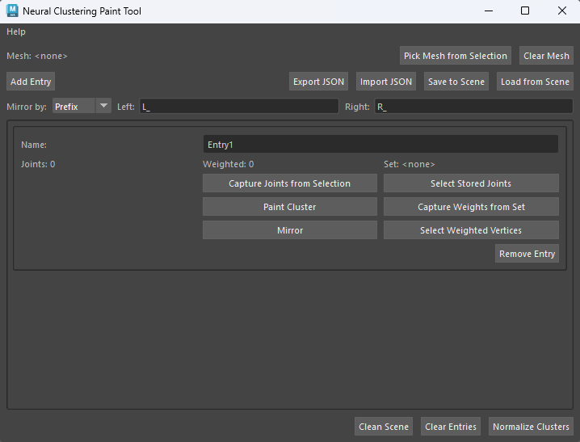
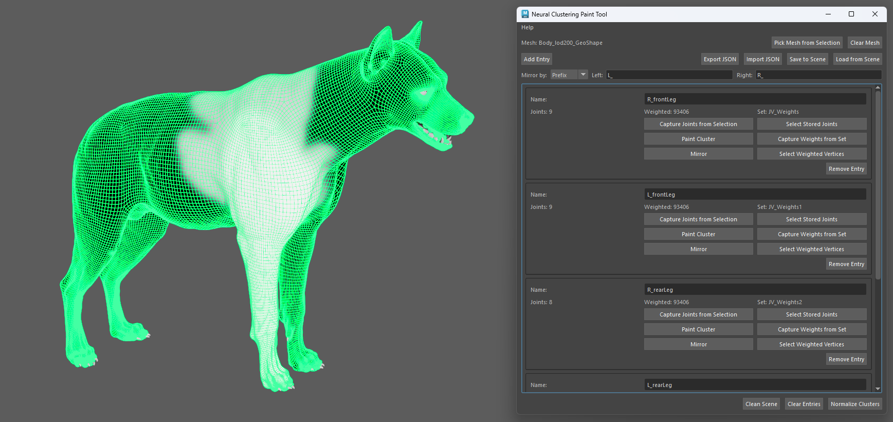

# Neural Clustering

> [!IMPORTANT]
> An Adonis ML license is required to use this feature.

The **Neural Clustering Paint Tool** is used to paint neural clusters on a static mesh. These clusters provide additional locality information for the machine learning training process, helping the model better isolate local deformations and activations.

The tool exports the painted cluster data to a `.json` file. This file is later used during neural training and can be provided when launching the training process with the [Neural Training Tool](../tools/neural_training_tool).

Neural clusters define local regions on the training mesh. These regions help the training process understand which parts of the mesh should be treated as related deformation areas, which can improve the posability of the trained rig.

The number and size of the clusters should be adjusted depending on the amount of extracted training data available. Larger datasets can support more granular clusters, while smaller datasets should usually use broader cluster regions.

If multiple clusters overlap, the cluster values can be normalized. Normalizing overlapping clusters helps keep the cluster data consistent and can improve the resulting training quality.

> [!TIP]
> The **Neural Clustering Paint Tool** is intended to be used as an optional data preparation step for machine learning workflows. It provides neural clustering information that can complement the data extracted through the **Data Extraction**.

## UI

<figure markdown>
  
  <figcaption><b>Figure 1</b>: Adonis Neural Clustering Tool UI.</figcaption>
</figure>

The Neural Clustering Paint Tool (see Figure 1) provides an interface to create, paint, mirror, save and load neural clusters. Following there is a breakdown of the available UI elements:

### Global Settings

- **Mesh**: Name of the mesh to paint. The mesh name will be stored in the exported `.json` file.
- **Pick Mesh from Selection**: Fills the *Mesh* parameter from the currently selected Maya object. The selected mesh will be the one used for painting, export, import, and cross-DCC compatibility. Use *Clear Mesh* to clear the *Mesh* from the UI. The selection of a mesh will automatically switch the associated material to a Maya Standard Surface shader with a neutral gray color to allow correct visualization of the painted clusters. The material is automatically created and assigned to the mesh if it does not exist.
- **Clear Mesh**: Clears the *Mesh* parameter. Clearing the mesh will ask for clearing of the tool data as well. If confirmed, this will clear the whole UI and remove the painted clusters, weights and imported data. When the mesh is cleared, the original material assigned to the mesh is restored.
- **Add Entry**: Adds a new empty entry to the UI. It represents a new cluster to paint and capture weights from.
- **Export JSON**: Exports the current neural cluster entry data to a `.json` file. Requires a valid *Mesh*, valid cluster *Name* values, and valid *Joints* fields.
- **Import JSON**: Imports neural cluster entry data from a `.json` file. This replaces the current entries in the tool with the entries from the file.
- **Save to Scene**: Saves the current Neural Cluster entries data to the scene in a hidden node. This allows to keep the data with the Maya file and work with it across different sessions without needing to export or import JSON files.
- **Load from Scene**: Loads Neural Cluster entries data from the scene hidden storage node and replaces the current entries in the tool.
- **Mirror by**: Defines how the left and right text is matched in cluster names and joint names. Use *Prefix* when the text is at the start, *Suffix* when it is at the end, or *Token* when it can appear anywhere in the name.
- **Left**: Left-side naming convention used for mirrored cluster names and joints. For example, use `L_` for prefix, `_L` for suffix, or `_L_` for token.
- **Right**: Right-side naming convention used for mirrored cluster names and joints. For example, use `R_` for prefix, `_R` for suffix, or `_R_` for token.
- **Clean Scene**: Clean up the Maya scene from all Neural Cluster ColorSets. This will not remove data from the tool entries.
- **Clear Entries**: Clear all Neural Cluster entries from the tool. This will also remove the associated Maya ColorSets.
- **Normalize Clusters**: Normalizes the weights between `0` and `1` across all clusters. This helps keep overlapping cluster weights consistent.

### Entry Settings

- **Name**: Neural cluster name. This will be the reference name of the cluster. The cluster name should avoid using spaces or special characters for cross-DCC compatibility.
- **Joints**: Number of joints captured for this cluster.
- **Weighted**: Number of vertices for which cluster weights are stored.
- **Set**: Name of the associated ColorSet used by Maya to paint vertices affected by this cluster.
- **Capture Joints from Selection**: Capture the currently selected joints and associate them to this Neural Cluster entry. Only objects of type *joint* or inheriting from type *joint* will be considered valid and captured.
- **Select Stored Joints**: Select the joints currently associated to this Neural Cluster entry. This button should be used to verify the correct selection of joints for the cluster. If the selection is not correct, use *Capture Joints from Selection* to update the joint association.
- **Paint Cluster**: Create or make active the Maya ColorSet for this Neural Cluster entry and switch to the Paint Vertex Color Tool. This will allow to paint vertex weights for this cluster directly on the mesh in the viewport.
- **Capture Weights from Set**: Read the vertex weights from the associated Maya ColorSet and store them in this Neural Cluster entry.
- **Mirror**: Creates or updates a mirrored neural cluster entry by copying joints and weights across the X axis. The entry name and joints are mirrored using the selected *Mirror by* mode and the *Left* and *Right* naming tokens. If the selected convention does not match, the tool will try to fall back to a simple `L`/`R` token swap. A warning will be logged in case of failure.
- **Select Weighted Vertices**: Select the vertices that have a weight value at or above 0.0 in the associated Maya ColorSet.
- **Remove Entry**: Remove this Neural Cluster entry and all its data.

## Requirements

The static mesh selected must match the topology of the mesh that will be used for training. This means both meshes must have matching point counts and matching point order so the exported cluster weights correspond to the expected training mesh data.

The ML joints captured from each entry should represent the joint set used as machine learning input data. In many cases, this can be the animated joints.

## How To Use

1. Press {style="width:4%"} in the Adonis shelf or *Neural Clustering Paint Tool* in the Adonis menu, under the ML Tools section to open the tool UI to launch the **Neural Clustering Paint Tool**.

2. Select the geometry to paint and click on *Pick Mesh from Selection*.

    The selected mesh will be stored in the exported `.json` file.

    For cross-DCC compatibility, the *Mesh* value should match the equivalent mesh name used in other DCCs.

    Use *Clear Mesh* to clear the *Mesh* from the UI. Clearing the mesh will ask for clearing of the tool data as well. If confirmed, this will clear the whole UI and remove the painted clusters, weights and imported data. When the mesh is cleared, the original material assigned to the mesh is restored (this action is undoable).

3. Configure the mirror naming convention.

    Use *Mirror by* to define how the left and right text is matched in cluster names and joint names.

    Use *Prefix* when the left and right text appears at the start of the name, for example `L_forearm` and `R_forearm`.

    Use *Suffix* when the left and right text appears at the end of the name, for example `forearm_L` and `forearm_R`.

    Use *Token* when the left and right text can appear anywhere in the name, for example `front_L_forearm` and `front_R_forearm`.

    Use *Left* and *Right* to define the side-specific naming convention. For example, use `L_` and `R_` for prefix names, `_L` and `_R` for suffix names, or `_L_` and `_R_` for token-based names.

    The mirror naming convention is used for both the cluster entry name and the joint names.

4. Create a cluster entry.

    Use the **Add Entry** button to create a new cluster entry.

5. Name the cluster entry.

    Use *Name* to assign a valid neural cluster name to the selected cluster entry. The cluster name should avoid using spaces or special characters for cross-DCC compatibility.

6. Assign joints to the cluster entry.

    Use *Capture Joints from Selection* to store the selected joints for the cluster entry. Only objects of type *joint* or inheriting from type *joint* will be considered valid and captured.

    The selected joints describe which rig controls are related to the painted cluster region.

7. Paint the cluster.

    Press *Paint Cluster* to create or make active the Maya ColorSet for the selected cluster entry. The button will automatically switch to the Paint Vertex Color Tool, allowing you to paint vertex weights for this cluster directly on the mesh in the viewport. The ColorSet map will be initialized as `0` (black color) for all vertices.

    The painted values represent the influence of the current neural cluster over the mesh. High values define the main area of influence for the cluster, while lower values can be used to create a smooth falloff into nearby regions, as shown in Figure 2.

    Make sure to paint the cluster region with smooth transitions between high and low values to avoid sharp edges in the cluster falloff.

    Once the cluster is painted, press *Capture Weights from Set* to read the vertex weights from the associated Maya ColorSet and store them in this Neural Cluster entry. The captured weights are stored per cluster and the corresponding attributes are stashed internally on the node.

    Use the *Select Weighted Vertices* button to select and visualize the stored vertices that have a weight value at or above `0.0` in the associated Maya ColorSet. This can be used to verify the painted region and ensure that the correct vertices are being affected by the cluster.

<figure style="width:90%; margin-left:5%" markdown>
  
  <figcaption><b>Figure 2</b>: Example of a painted neural cluster on a training mesh. Painted values closer to <code>1</code> are displayed toward white and represent higher influence, while values closer to <code>0</code> are displayed toward black and represent lower influence. Smooth transitions between these values define the cluster falloff.</figcaption>
</figure>

8. Mirror the cluster if needed.

    Press *Mirror* to create or update a mirrored neural cluster entry by copying joints and weights across the X axis.

    Mirroring is useful when one side of the character has already been configured and the opposite side should use corresponding joints and mirrored weight values.

    The entry name and joints are mirrored using the selected *Mirror by* mode and the *Left* and *Right* naming tokens. The same naming convention is used for both the cluster entry name and the joint names.

    The painted weights are mirrored across the X axis of the geometry. This means the tool transfers the painted region from one side of the mesh to the corresponding opposite-side region.

    If the selected convention does not match, the tool will try to fall back to a simple `L`/`R` token swap. A warning will be logged in case of failure.

9. Repeat the process for each cluster entry.

    Use the *Add Entry* button to create more cluster entries.

    For each cluster entry you can repeat the process of naming the entry, assigning joints, painting the cluster, capturing the weights, and mirroring if needed.

10. Normalize overlapping clusters if needed.

    Click *Normalize Clusters* when cluster regions overlap and the painted values should be normalized.

    Normalizing clusters adjusts the painted maps and weights between `0` and `1` across all clusters. This helps keep overlapping cluster data consistent and can improve the quality of the model predictions at the interface between clusters. This action will change the maps values painted in the Maya ColorSets and the weights stored in the tool entries (this action is undoable).

11. Export the cluster map.

    Use *Export JSON* to export the current neural cluster entry data to a `.json` file.

    Export requires a valid *Mesh*, valid cluster *Name* values, and valid *Joints* fields.

    The exported `.json` file can then be used during neural training with the [AdnNeuralTrainingTool](../tools/neural_training_tool).

    You can also use *Save to Scene* to save the current Neural Cluster entries data to the scene in a hidden node. This allows to keep the data with the Maya file and work with it across different sessions without needing to export or import JSON files.

13. Import and edit existing cluster map if needed.

    Use *Import JSON* or *Load from Scene* to import neural cluster entry data from a `.json` file or a scene storage node. This clears the tool entries and maps and replaces them with the entries from the file.

    Importing restores the cluster entries, the cluster names, the joint associations, and the painted weights stored for each cluster. All of the associated Maya ColorSets are also restored to the corresponing painted values.

    To edit the imported cluster data, select the desired entry and use *Paint Cluster* to enter the paint workflow for that cluster. Then mirror the entry to reflect the changes on the opposite side of the mesh if needed.

    You can follow this workflow as many times as needed to edit the cluster data and update the weights. After editing, use *Export JSON* to save the updated cluster data to a `.json` file.

## Cluster JSON Overview

The exported JSON file stores the mesh name and the list of neural cluster entries.

At the top level, the file contains:

- `mesh`: Source mesh name used for painting, export, import, and cross-DCC compatibility.
- `entries`: List of neural cluster entries.

Each entry contains:

- `name`: Cluster entry name. This corresponds to the neural cluster used by the tool.
- `joints`: List of full joint paths associated with the cluster.
- `vertex_indices`: Stored vertex index data for the entry.
- `color_set`: Name of the color set used to store the painted values.
- `weights`: Painted cluster weight values, stored by mesh component index.

For example, a cluster file may contain entries such as `R_frontLeg`, `L_frontLeg`, `R_rearLeg`, `L_rearLeg`, and `C_tailSpineNeck`. Each entry stores the joints associated with that region and the painted weight values for the mesh.

> [!NOTE]
> The exported cluster data is intended to be reusable across DCCs. For this reason, the mesh name, cluster names, and joint naming conventions should be kept consistent with the equivalent setup in other DCCs.

## Result

After configuring and painting clusters with the Neural Clustering Paint Tool, the painted neural clustering data can be exported to a `.json` file.

This `.json` file is used during neural training and can be provided when launching the training process with the [Neural Training Tool](../tools/neural_training_tool).

The generated clusters describe regions of locality on the mesh. These regions help the training process isolate local deformation and activation behavior, which can improve the posability of the trained rig.

## Recommendations

- Use broader cluster regions when the extracted training dataset contains fewer samples.
- Use more granular clusters only when enough training samples are available to support them.
- Paint clusters around regions where local deformation behavior should be isolated.
- Normalize clusters when painted regions overlap.
- Use clear cluster names that describe the body region or deformation area they represent.
- Associate each cluster with the joints that are expected to cause deformations in that region. For example, for a humanoid character, movements of the elbow, or forearm, joint are expected to cause bulging of the bicep and tricep muscles, therefore the cluster should cover that skin region.
- Keep mesh and cluster names aligned with other DCCs when the cluster data needs to be reused across applications.
- Remember that painted values closer to `1` represent higher influence and are displayed toward white, while values closer to `0` represent lower influence and are displayed toward black.
