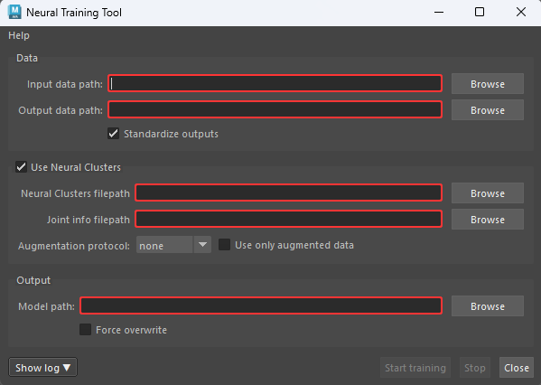
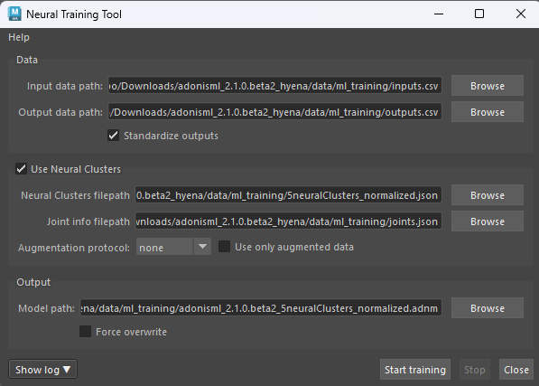
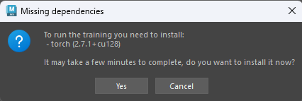
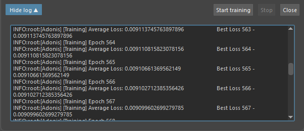

# Neural Training Tool

> [!IMPORTANT]
> An Adonis ML license is required to use this feature.

The Adonis ML *Neural Training Tool* is a UI wrapper around the Adonis neural training script. It provides a set of parameters to configure and launch the neural training process in Maya.

The tool can be used to train an `.adnm` model from the input and output data generated by the ML data extraction workflow. It can also use neural cluster data when a neural cluster `.json` file has been prepared with the [Neural Cluster Paint Tool](../tools/neural_clustering_paint_tool).

The tool can also help manage the training dependencies. If the required machine learning dependencies are missing when the training is launched, the tool prompts the user to install them. The dependencies can also be installed manually from **Adonis > Utils > *Install ML Dependencies***.

> [!NOTE]
> The training process checks automatically for an available Nvidia GPU and uses that to drastically accelerate training. If a supported GPU device is not available, training falls back to CPU execution, and will be significantly slower. Multi-GPU setups are currently not supported and the training will use the first available device.

> [!NOTE]
> This page describes how to run training from Maya using the Neural Training Tool. For dependency installation options, refer to the [Training Dependencies](#training-dependencies) section.

## UI

<figure markdown>
  
  <figcaption><b>Figure 1</b>: Adonis Neural Training Tool UI. </figcaption>
</figure>

The Neural Training Tool offers an intuitive interface (see Figure 1), allowing users to configure the training settings. Below is a breakdown of the available UI elements:​

### Data
- **Input data path**: Path to the input data `inputs.csv` file exported with Data Extraction. This file is generated by the data extraction process.
- **Output data path**: Path to the output data `outputs.csv` file exported with Data Extraction. This file is generated by the data extraction process.
- **Standardize outputs**: Rescales the output data to a standard normal distribution. This is generally recommended for better training results. If the amount of recorded training poses is low, disabling this option may help improve results for the trained model.

### Use Neural Clusters
- **Use Neural Clusters**: Enables training with neural cluster data. When enabled, the neural cluster `.json`, joint info `.json`, and augmentation settings are used during training.
- **Neural Clusters filepath**: Path to the neural cluster `.json` file containing the cluster data. This file is generated by the [Neural Cluster Paint Tool](../tools/neural_clustering_paint_tool).
- **Joint info filepath**: Path to the joint info `.json` file containing the joint information used by the neural cluster training process. This file should be selected from the same dataset folder as the input and output data files generated during data extraction.
- **Augmentation protocol**: Experimental data augmentation protocol to apply during training. Use only when training without augmentation is not giving good results and the dataset is small. Available options are *none*, *random*, and *simple*. This option uses the neural clusters to generate new synthetic pose data from the training samples. The *random* protocol generates new synthetic pose data by composing isolated deformed neural clusters with a random sample pose deformation from the dataset. The *simple* protocol generates new synthetic pose data by composing isolated deformed neural clusters with the rest pose, index `0` dataset sample, deformation. The synthetic poses generated may contain artifacts and may be less aligned to the original simulated silhouette.
- **Use only augmented data**: Uses only the augmented synthetic data for training, without including the original samples. This option is ignored if no augmentation protocol is selected.

### Output
- **Model path**: Path where the trained model file will be saved. The output file must use the `.adnm` extension.
- **Force overwrite**: Forces the tool to overwrite the model file if it already exists in the target path. Use with caution, because this will irreversibly delete any existing model file at the target path.

### Buttons
- **Show log**: Opens a text area where the output of the training will be prompted (e.g. epochs, average loss, etc).
- **Start training**: Launches the training process.
- **Stop**: Interrupts the training process.
- **Close**: Closes the tool window.

## Requirements

To train a model with the Neural Training Tool, the following files are required:

- *Input Data Path*: Input data `inputs.csv` file exported with Data Extraction.
- *Output Data Path*: Output data `outputs.csv` file exported with Data Extraction.
- *Model Path*: Output `.adnm` model path.

The input and output data files are generated by the data extraction workflow. For more information about generating training data, refer to the [Data Extraction Tool](../tools/data_extraction_tool) documentation.

The output model path must use the `.adnm` extension.

When training with neural clusters, the following additional files are required:

- *Neural Clusters Filepath*: Neural cluster `.json` file generated by the [Neural Cluster Paint Tool](../tools/neural_clustering_paint_tool).
- *Joint Info Filepath*: Joint information `.json` file used by the neural cluster training process. This file should be selected from the same dataset folder as the input and output data files generated during data extraction.

## How To Use

1. Press {style="width:4%"} in the Adonis shelf or *Neural Training* in the Adonis menu, under the ML Tools section to open the tool UI.

2. Set the input and output data paths.

    Use *Input Data Path* to specify the input data `inputs.csv` file exported with Data Extraction.

    Use *Output Data Path* to specify the output data `outputs.csv` file exported with Data Extraction.

    These files are generated by the data extraction process. For more information about generating training data, refer to the [Data Extraction Tool](../tools/data_extraction_tool) documentation.

    Enable *Standardize Outputs* to rescale the output data to a standard normal distribution. This is generally recommended for better training results. If the amount of recorded training poses is low, disabling this option may help improve results for the trained model.

3. Enable neural clusters if needed.

    Enable *Use Neural Clusters* to train using neural cluster data.

    When this option is enabled, the training process uses the neural cluster `.json` file and the joint info `.json` file for optimizing the network architecture.

    Use *Neural Clusters Filepath* to specify the neural cluster `.json` file containing the cluster data. This file is generated by the [Neural Cluster Paint Tool](../tools/neural_clustering_paint_tool) and describes the painted cluster regions used to provide locality information during training.

    Use *Joint Info Filepath* to specify the joint info `.json` file containing the joint information used by the neural cluster training process. This file should be selected from the same dataset folder as the input and output data files generated during data extraction.

4. Configure augmentation if needed.

    Use *Augmentation Protocol* to apply an experimental data augmentation protocol during training.

    Use this only when training without augmentation is not giving good results and the dataset is small.

    The available augmentation protocols are *none*, *random*, and *simple*. When augmentation is enabled, the tool uses the neural clusters to generate new synthetic pose data from the training samples.

    - *random* protocol will generate new synthetic pose data by composing isolated deformed neural clusters with a random sample pose deformation from the dataset.
    - *simple* protocol will generate new synthetic pose data by composing isolated deformed neural clusters with the rest pose, index `0` dataset sample, deformation.

    These generated poses may contain artifacts and may be less aligned to the original simulated silhouette. The use of this option will increase the hardware memory requirements during training.

    Enable *Use Only Augmented Data* to train only with the augmented synthetic data, without including the original samples.

    *Use Only Augmented Data* is ignored when *Augmentation Protocol* is set to *none*.

5. Set the output model path.

    Use *Model Path* to specify where the trained model file will be saved.

    The output model path must use the `.adnm` extension.

    Enable *Force Overwrite* to overwrite the existing model file if one already exists at the target path. Use this with caution, because the previous model file will be irreversibly deleted.

<figure style="width:50%; margin-left:5%" markdown>
  
  <figcaption><b>Figure 2</b>: Adonis Neural Training Tool UI after providing the inputs. </figcaption>
</figure>

6. Press *Start training* to start the process.

7. Install missing dependencies if prompted.

    If the required machine learning dependencies are missing, the tool displays a prompt when *Start training* is pressed.

    Press **OK** to install the dependencies from the prompt. This may take a few minutes.

<figure style="width:90%; margin-left:5%" markdown>
  
  <figcaption><b>Figure 3</b>: Missing dependencies prompt shown when Start training is pressed.</figcaption>
</figure>

8. Review the training output.

    After training finishes, the `.adnm` model file is written to the *Model Path*.

    The tool also generates a `<model_name>_log.txt` file next to the `.adnm` model. This log can be used to inspect training progress, epochs, losses, warnings, and errors.

    A `<model_name>_config.json` file is also generated with the training parameters used for the run. This can be used to review how the model was trained.

    During or after execution, the *Show log* button can be pressed to show epoch and average loss information. This is useful for debugging training behavior directly from the tool.

<figure style="width:90%; margin-left:5%" markdown>
  
  <figcaption><b>Figure 4</b>: Training output showing epoch progress, average loss, and best loss information. This information is useful for debugging and is also written to the generated log file next to the output model.</figcaption>
</figure>

## Training Dependencies

The Neural Training Tool requires the machine learning dependencies to be installed before training can run. For more information about the ML dependencies installation, please refer to this [section](../../installation#ml-dependencies) on the Installation page.

> [!NOTE]
> - The training process checks automatically for an available Nvidia GPU and uses that to drastically accelerate training. If a supported GPU device is not available, training falls back to CPU execution, and will be significantly slower. Multi-GPU setups are currently not supported and the training will use the first available device.
> - Machine learning dependencies are installed inside the Adonis installation directory rather than system-wide. As a result, the system environment remains unchanged and no global Python packages are installed.

## Output Files

After a successful training run, the following files are generated:

- `<model_name>.adnm`: Trained Adonis neural model file.
- `<model_name>_log.txt`: Training log file generated next to the `.adnm` model.
- `<model_name>_config.json`: Configuration file storing the training parameters used for the run.

The `<model_name>_log.txt` file can be used to inspect the training process. It contains epoch information, average loss, best loss, warnings, errors, and other training messages.

The `<model_name>_config.json` file can be used to review the training configuration used to produce the model.

## Recommendations

- Use data generated by the Data Extraction workflow as the training input and output data.
- Keep the input data, output data, and joint info files together in the same dataset folder.
- Use *Standardize Outputs* for most training runs.
- Consider disabling *Standardize Outputs* only when the number of training poses is low and preserving the original output distribution gives better results.
- Use neural clusters when local deformation regions should be isolated during training.
- Use augmentation only when the dataset is small and training without augmentation is not producing good results. However, if possible, recording new data should always be considered first.
- Prefer GPU training when compatible hardware and dependencies are available, because it is usually faster than CPU training.
- Review the generated `<model_name>_log.txt` file after training to inspect epoch progress and loss values.
- Review the generated `<model_name>_config.json` file to confirm the training configuration used for the model.
- Avoid neural clusters with large and redundant overlapping regions, because they can reduce training quality.
- Very small datasets may produce lower-quality models, especially when training complex deformations.
- Use *Force Overwrite* carefully, because it deletes any existing model file at the target path.

## Troubleshooting

If the training process fails or does not produce the expected result, check the following:

1. Check the log output from the tool by pressing *Show log*.

    The log can show whether the training process failed and may provide error information. The log can also show epoch progress, average loss, and best loss information, which is useful for debugging training behavior.

2. Check the generated `<model_name>_log.txt` file.

    The log file is generated next to the `.adnm` model and contains detailed training information, including epochs, losses, warnings, and errors.

3. Check the generated `<model_name>_config.json` file.

    The config file records the training parameters used for the run. This can help confirm that the correct paths, neural cluster settings, augmentation settings, and output options were used.

4. Confirm that the ML dependencies are installed.

    If the dependencies are missing, install them from the prompt or from **Adonis > Utils > *Install ML Dependencies***.

5. Confirm that the output path is valid.

    The *Model Path* must use the `.adnm` extension. If a model already exists at the target path, enable *Force Overwrite* only if the existing model can be safely replaced.

6. Confirm that the learning was successful.

    The training process will automatically stop when the predicted outputs stop improving. If the log shows training stopped after a small number of epochs, for example fewer than `100`, try recording new data or adjusting the cluster definitions. Datasets that are too small or clusters with too many overlapping regions can be detrimental for learning.

## Limitations

- Multi-GPU setups are currently not supported and the training will use the first available device.
