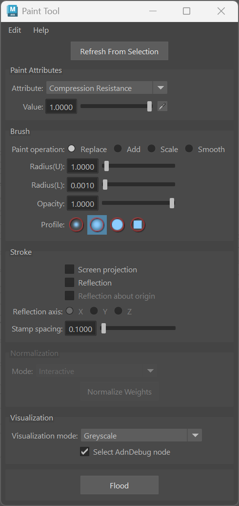
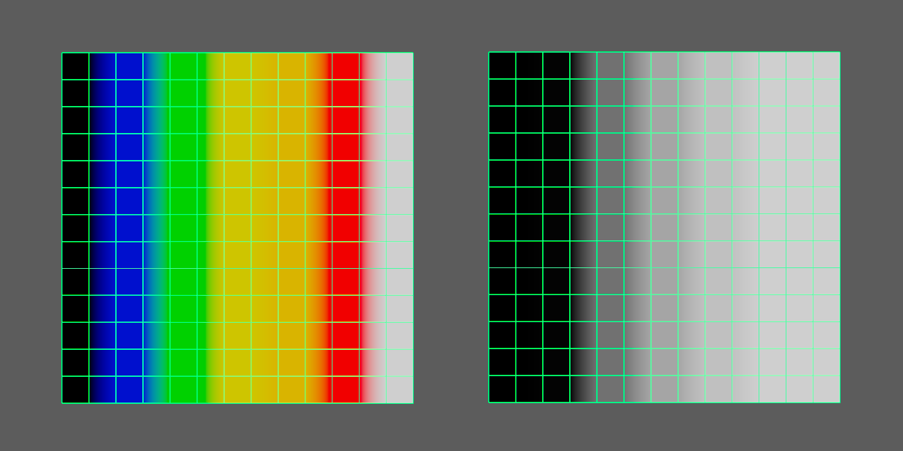

# Paint Tool

> [!IMPORTANT]
> Use the Adonis Paint Tool to manipulate the paintable maps of the AdnMuscle, AdnRibbonMuscle and AdnSkin solvers. For all other Adonis deformers and nodes, use Maya's standard paint context.

The **Adonis Paint Tool** is meant to be used for the manipulation of the paintable attributes of the AdnSkin, AdnMuscle and AdnRibbonMuscle deformers. Its functionalities are very similar to the standard Maya paint tool functionalities plus the ability to paint attributes with multiple influences (e.g. attachment to transform constraints) where a single vertex can adopt a different weight value for the same attribute driven by multiple influent external objects. It also provides normalization controls for dependent attributes such as the hard, soft and slide constraints of the AdnSkin deformer.

<figure style="width:50%" markdown>
  
  <figcaption><b>Figure 1</b>: Adonis Paint Tool.</figcaption>
</figure>

The use of this tool is required for the correct setup of skin, muscle and ribbon muscle solvers. The internal logic processes painted maps and their dependencies to keep the solver configuration safe. For example, if the influence of one target of an AdnMuscle which has two targets assigned is painted, then the tool will update the weights of the other target to ensure that the addition of both is normalized at each vertex (the normalization process is independent for transform and geometry targets). For the hard, soft and slide constraints of an AdnSkin deformer, normalization is controlled by the mode selected in the *Normalization* group. Switching attributes or selecting influences from the Adonis Paint Tool provides immediate feedback about the current state of the maps.

To open the tool:

  1. Select the mesh with the Adonis deformer applied to.
  2. Press the paint tool {style="width:4%"} shelf button or go to Adonis Menu > *Paint Tool*.

> [!NOTE]
> - The paint context is configured from the given selection to allow painting.
> - Make sure to select the transform node of the mesh.
> - If the context does not allow painting, it is probably because the selected node is not a transform mesh node with an Adonis paintable deformer. Please, select the transform mesh node and click *Refresh From Selection* or restart the Adonis Paint Tool.

## Paint Attributes

If the selection provided is valid, meaning the selected mesh has one of the Adonis deformers listed before, then the paint context will get configured and the user can paint. The *Paint Attributes* group contains the following controls:

  - **Attribute** selects the map to paint. The available attributes depend on the Adonis deformer and its current state.
  - **Value** sets the value used by the current paint operation. Enter a value in the field or adjust it with the slider.
  - **Pick Value** (the eyedropper button beside *Value*) samples a value from the mesh and assigns it to *Value*.

> [!NOTE]
> - With the optimizations introduced to the Adonis Paint Tool in version 1.4.0, the AdnWeightsDisplayNode is deprecated and no longer needed.
> - This deprecation is fully backward-compatible, meaning that scenes created in earlier versions will continue to work seamlessly in version 1.4.0.
> - In addition, we recommend using the utility available under Adonis Menu > Utils > *Upgrade Deprecated Nodes*, which safely removes any instances of the AdnWeightsDisplayNode from your scenes.

Depending on the deformer and the attribute selected the UI can adjust to support multi-influence attributes by exposing the influences or restricting certain functionalities of the tool. In the following sections, the specific behavior of the tool for each deformer is presented.

### AdnMuscle and AdnRibbonMuscle

In the specific case of muscle deformers, the tool will display the following attributes:

  - **Attachments To Geometry** and **Attachments To Transform**
    - If any of these attribute types is selected, then a list widget is shown with the names of the targets connected to the deformer.
    - Select the desired target to paint from the list widget and paint the weight values.
    - When selecting a target in the list, the object will also get selected in the scene, facilitating its identification.
    - If more than one target was added to the system, then the paint tool will normalize the weights automatically after a stroke has been completed, meaning that the sum of all attachment constraint weights in a vertex will always add up to a maximum value of 1.0.
    - If any target is removed or added to the system, then the paint tool will refresh the list on mouse hover over the UI.
  - **Compression Resistance** and **Stretching Resistance**
    - Compression resistance is set to 1.0 by default. With this value, the solver will apply the corrections to the edges needed to keep the lengths at rest. Set values lower than 1.0 to linearly reduce the amount of correction applied by the solver when the edges get compressed.
    - Stretching resistance is set to 1.0 by default. With this value, the solver will apply the corrections to the edges needed to keep the lengths at rest. Set values lower than 1.0 to linearly reduce the amount of correction applied by the solver when the edges get stretched.
  - **Fibers**
    - When selecting the fibers attribute, the fibers debugger will automatically get enabled, displaying the muscle fibers.
    - The initial direction displayed will be the one estimated by tendon weights.
    - To modify the fibers direction, comb the fibers towards the desired direction.
    - For better precision adjust the set direction using the *Smooth* brush.
    - To get all fibers more tightly aligned in a homogeneous way, press the flood button while having the *Smooth* brush selected.
  - **Fibers Multiplier**
    - Fibers Multiplier is set to 1.0 by default. With this value the solver will apply the activation uniformly throughout the muscle.
    - Set a value lower than 1.0 to decrease the effect of the activation in those areas. For example, paint only the belly of the muscle to 1.0 to concentrate activations in that area and paint the map to 0.0 in the tendinous area.
  - **Global Damping**
    - By default, this map is set to 1.0.
    - This value is scaled by the *Global Damping Multiplier* during simulation to control the amount of damping the solver will apply at each vertex.
  - **Masses**
    - Masses are set to 1.0 by default. This will mean that by default the solver will consider that the muscle has a uniform mass.
  - **Rest Length Weights**
    - Rest length weights are set to 1.0 by default. This map multiplies the rest length of the edges, giving the artist control over the target edge lengths across the surface. A value of 1.0 leaves the target length unchanged, while smaller values make it shorter.
  - **Shape Preservation**
    - Shape preservation weights are set to 0.0 by default in AdnMuscle and AdnRibbonMuscle. Modify this value to allow the solver to apply corrections to the current vertex to maintain the initial state of the shape formed with the surrounding vertices.
  - **Slide On Geometry**
    - If this attribute is selected, a list widget is shown with the names of the targets connected to the deformer.
    - Select the desired target to paint from the list widget and paint the weight values.
    - When selecting a target in the list, the object will also get selected in the scene, facilitating its identification.
    - If more than one target was added to the system, then the paint tool will normalize the weights automatically after a stroke has been completed, meaning that the sum of all sliding on geometry constraint weights in a vertex will always add up to a maximum value of 1.0.
    - If any target is removed or added to the system, then the paint tool will refresh the list on mouse hover over the UI.
  - **Slide On Segment**
    - Slide on Segment Constraints operate similarly to attachment constraints, as they are both multi-influence attributes.
    - The entries in the list widget correspond in this case to the segments added to the constraint, with the name of the segment being "*root_transform* - *tip_transform*".
    - Select the desired segment to paint from the list widget and paint the weight values.
    - When selecting a segment in the list the two scene objects that form the root and tip of the segment will get selected as well, facilitating their identification.
    - If more than one segment was added to the system, then the paint tool will normalize the weights automatically after a stroke has been completed, meaning that the addition of all slide on segment constraint weights in a vertex will always add up to a maximum value of 1.0.
  - **Sliding Distance Multiplier**
    - Sliding distance Multiplier is set to 1.0 by default. With this value, every vertex of the geometry will be able to slide along every vertex of the target surface.
    - It is suggested to lower the value in those areas where slide constraints are less relevant or not present for better performance without losing quality.
  - **Tendons**
    - It is recommended to paint values of 1.0 wherever the tendon tissue is and values of 0.0 in the rest of the mesh.
    - This painting will internally trigger an automatic estimation of fibers direction which can be displayed using the debug functionalities of the deformer.

> [!NOTE]
> - Fibers and Tendon weights should only be painted on the initialization frame for AdnMuscle and AdnRibbonMuscle, being the initialization frame the lowest value between Preroll Start Time and Start Time.
> - Some of the Paint Tool's paintable attributes will be disabled given certain conditions in the scene, like for example a time constraint. For example, Fibers and Tendons are not supposed to be paintable on a frame that is not the initialization frame and will be disabled in the Paint Tool UI if on a simulated frame. Hovering over the disabled attribute can inform about the action to be taken to remedy the warning.

### AdnSkin

In the specific case of an AdnSkin deformer, the tool will display the following attributes:

  - **Compression Resistance** and **Stretching Resistance**
    - Compression resistance is set to 1.0 by default. With this value, the solver will apply the corrections to the edges needed to keep the lengths at rest. Set values lower than 1.0 to linearly reduce the amount of correction applied by the solver when the edges get compressed.
    - Stretching resistance is set to 1.0 by default. With this value, the solver will apply the corrections to the edges needed to keep the lengths at rest. Set values lower than 1.0 to linearly reduce the amount of correction applied by the solver when the edges get stretched.
  - **Global Damping**
    - By default, this map is set to 1.0.
    - This value is scaled by the *Global Damping Multiplier* during simulation to control the amount of damping the solver will apply at each vertex.
  - **Hard Constraints**
    - Hard constraints are set to 1.0 by default. With this value the solver will apply the corrections to the vertices needed to keep them at a constant transformation, local to the closest point on the closest target mesh at initialization.
    - This value is normalized alongside Soft Constraints and Slide Constraints.
  - **Masses**
    - Masses are set to 1.0 by default. This will mean that by default the solver will consider that the skin has a uniform mass.
  - **Rest Length Weights**
    - Rest length weights are set to 1.0 by default. This map multiplies the rest length of the edges, giving the artist control over the target edge lengths across the surface. A value of 1.0 leaves the target length unchanged, while smaller values make it shorter.
  - **Self Collisions Radius Multiplier**
    - By default, this map is set to 1.0.
    - This value is scaled for each point by the *Point Radius Scale* attribute when the Self-Collisions are in *Point to Point* mode.
    - The greater this value is for a given point, the larger the radius of the spherical volume used for collision detection is.
    - Paint with a value of 0.0 the areas that should not compute self collisions to reduce the computational impact.
  - **Self Collisions Thickness Multiplier**
    - By default, this map is set to 1.0.
    - This value is scaled for each point by the *Thickness* attribute in both *Point to Point* and *Triangle to Triangle* modes.
    - In *Point to Point* mode, this value modulates the size of the spherical volume used for collision detection in the direction of the normal.
    - In *Triangle to Triangle* mode, this value modulates the push-out applied to the surface used for collision detection in the direction of the normal.
    - Paint with a value of 0.0 the areas to ignore the thickness; and with a value greater than 0.0 the areas to push along the direction of the normals.
  - **Self Collisions Weights**
    - By default, this map is set to 1.0.
    - Paint with a value of 0.0 the areas that should not compute self collisions to reduce the computational impact.
    - Paint with a higher value the areas that should receive more correction due to self-intersections, and with a lower value the areas that should receive less correction.
  - **Shape Preservation**
    - Shape preservation weights are set to 0.0 by default in AdnSkin. Modify this value to allow the solver to apply corrections to the current vertex to maintain the initial state of the shape formed with the surrounding vertices.
  - **Slide Constraints**
    - Slide constraints are set to 0.0 by default. Modify this value to allow the solver to apply corrections to the vertices regarding the sliding of the simulated mesh along the target surface.
    - This value is normalized alongside Hard Constraints and Soft Constraints.
  - **Sliding Distance Multiplier**
    - Sliding distance Multiplier is set to 1.0 by default. With this value, every vertex of the geometry will be able to slide along every vertex of the target surface.
    - It is suggested to lower the value in those areas where slide constraints are less relevant or not present for better performance without losing quality.
  - **Soft Constraints**
    - Soft constraints are set to 0.0 by default. Modify this value to allow the solver to apply corrections to the vertices regarding the vertices keeping a constant distance to the closest point on the closest target mesh.
    - This value is normalized alongside Hard Constraints and Slide Constraints.

## Brush

The controls in the *Brush* group reproduce Maya's standard Artisan paint behavior.

  - **Paint operation** determines how the brush combines *Value* with the existing map:
    - **Replace** moves the painted values toward *Value*, according to *Opacity*.
    - **Add** adds *Value* to the painted values, with the effect modulated by *Opacity*.
    - **Scale** multiplies the painted values by *Value*, with the effect modulated by *Opacity*.
    - **Smooth** averages each painted value with the values of its neighboring vertices to soften transitions. The strength of the effect is controlled by *Opacity*.
  - **Radius(U)** sets the brush radius. When painting with a pressure-sensitive stylus, it is the maximum radius the brush can reach.
  - **Radius(L)** sets the minimum brush radius for a pressure-sensitive stylus. It has no effect when painting without a stylus.
  - **Opacity** controls the strength of each brush stamp. Lower values produce more gradual changes; a value of 0.0 has no effect.
  - **Profile** selects the Gaussian, soft, solid or square brush. The selected profile determines the brush's shape and falloff across its radius.

## Stroke

The *Stroke* group controls how the brush stamps that make up a stroke are projected, mirrored and spaced:

  - **Screen projection** projects the brush from the view plane onto the mesh. When disabled, the brush follows the surface. Screen projection can make convoluted surfaces easier to paint, but may smear the result where a surface is nearly perpendicular to the view and can be slower.
  - **Reflection** mirrors every stroke across the selected reflection axis.
  - **Reflection about origin** uses the scene origin as the reflection plane. When disabled, reflection uses the center of the selected object's bounding box. This option is available only when *Reflection* is enabled.
  - **Reflection axis** selects the X, Y or Z axis across which strokes are mirrored. This option is available only when *Reflection* is enabled.
  - **Stamp spacing** controls the distance between consecutive brush stamps relative to the brush size. At 1.0, adjacent stamp edges touch; values below 1.0 overlap the stamps, while values above 1.0 leave gaps.

## Normalization

The *Normalization* group is enabled only when a normalizable attribute is selected. The normalizable attributes are *Hard Constraints*, *Soft Constraints* and *Slide Constraints*, which correspond to the three Uber Constraints in the AdnSkin solver. Their weights are normalized together at each vertex.

  - **Mode** controls when normalization is performed:
    - **Interactive** normalizes only the vertices whose values actually change during each paint or flood operation.
    - **On Demand** preserves the authored values until normalization is explicitly requested with *Normalize Weights*.
  - **Normalize Weights** normalizes the current component restriction and writes the normalized values back to the authored maps. If vertices are selected, only those vertices are normalized; if the Paint Tool is unrestricted, all vertices are normalized. The operation is undoable.

## Visualization

The *Visualization* group contains the following controls:

  - **Visualization mode** selects how painted values are displayed in the viewport. The available modes are *Greyscale* and *Heat Map*.
  - **Select AdnDebug node** selects the AdnDebug node whenever the Paint Tool UI is entered or refreshed. This is useful for debugging because the node remains included when you isolate the selection, allowing you to keep painting while visualizing the Adonis debugger in the viewport. Disable this option to preserve the current selection.

The *Greyscale* and *Heat Map* modes provide different ways to inspect the same painted values.

The *Greyscale* mode colors vertices from black to white based on the painted weight (black for 0.0 and white for 1.0). This is the default mode and provides a visualization similar to the Maya Paint Tool.

In contrast, the *Heat Map* mode assigns a color ramp to vertices according to the painted weight. The following example compares the same painted weights displayed using both modes.

<figure style="width:75%" markdown>
  
  <figcaption><b>Figure 2</b>: Weight map displayed in "Heat Map" mode (left) and "Greyscale" mode (right). From left to right, the painted values are: 0.0, 0.01, 0.25, 0.5, 0.75, 0.99, and 1.0.</figcaption>
</figure>

The following table shows how the painted weight maps to the color gradient used in *Heat Map* mode:

| Weight (w) | Color |
|:-----------|:------|
| `w = 0.0`         | Black |
| `0.00 < w < 0.25` | Gradient from Blue to Green |
| `0.25 ≤ w < 0.50` | Gradient from Green to Yellow |
| `0.50 ≤ w < 0.75` | Gradient from Yellow to Orange |
| `0.75 ≤ w < 1.00` | Gradient from Orange to Red |
| `w = 1.0`         | White |

## Flood

The **Flood** button applies the active *Paint operation*, *Value* and *Opacity* settings to the paintable area in a single operation instead of requiring a brush stroke. If a vertex restriction is active, unselected vertices remain unchanged. For example, use *Replace* to assign a uniform value, or *Smooth* to average the current values across the surface. Flooding with *Smooth* is also useful for aligning fibers more uniformly, as described in the *Fibers* attribute section above.
