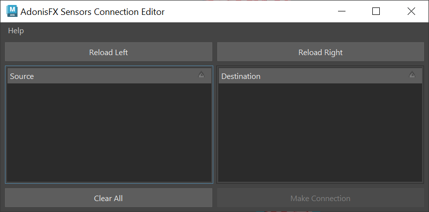
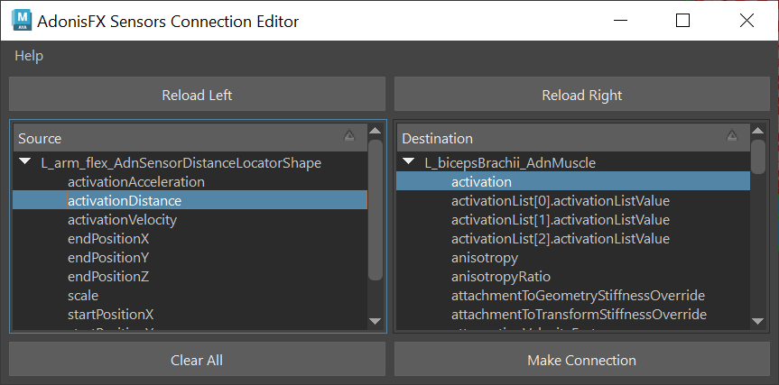

# Sensors Connection Editor

To ease with the connection of sensors to deformers AdonisFX provides the **Sensors Connection Editor** in charge of facilitating the connection of sensors to the active deformers in the scene.

To use this tool go to the AdonisFX Menu > Sensors (under the Edit section) > *Connection Editor*.

<figure markdown> 
   
  <figcaption><b>Figure 1</b>: Sensor connection editor after opening it for the first time. </figcaption>
</figure>

Two main sections can be distinguished in this tool, labeled *source* and *destination*. The source section is intended to display the signal attributes of sensors and locators, but it can also display the float attributes of any node. Meanwhile, the destination section will display the deformers along with their possible input attributes.

To retrieve these objects and display them in the tool, select the desired element from the scene (an AdonisFX locator containing a sensor or a deformer) and press their respective *Reload Left* or *Reload Right* button.

For Source elements (sensors) press the *Reload Left* button and for Destination elements (deformers) press the *Reload Right* button.

<figure markdown> 
   
  <figcaption><b>Figure 2</b>: Sensor connection editor after adding sensors and deformers from the selection. </figcaption>
</figure>

To make the connections select the two specific attributes to connect (one from *source* and one from *destination*) and press the *Make Connection* button. A message will then get displayed informing that the connection has been properly made.

To clear the selection and reset the tool to its initial state, press the *Clear All* button.

> [!NOTE]
> - If an AdonisFX locator (i.e. typically the shape node) is connected to a muscle deformer and the history of the muscle geometry is deleted, Maya will also delete the shape node of that AdonisFX locator. To avoid this, it is recommended to connect either the AdonisFX sensor or the intermediate [AdnRemap](../nodes/remap) node instead.
