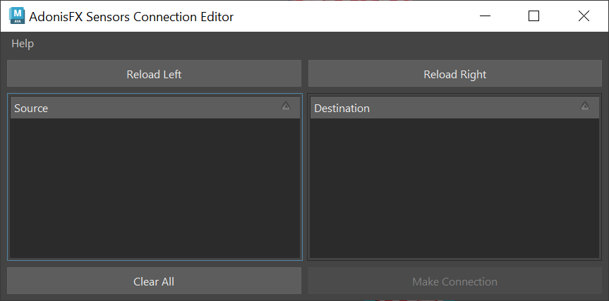
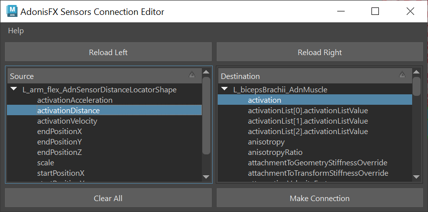

# Sensors Connection Editor

To ease with the connection of sensors to the muscle activations AdonisFX provides the **Sensors Connection Editor** tool. Instead of connecting the sensors directly to the muscle deformers, this tool is designed to make the connection through the locators in order to keep the node graph aligned with the standard structure in AdonisFX of: (1) sensors connected to locators, (2) then locators connected to muscles.

To use this tool go to the AdonisFX Menu > Sensors (under the Edit section) > *Connection Editor*.

<figure markdown> 
   
  <figcaption><b>Figure 1</b>: Sensor connection editor after opening it for the first time. </figcaption>
</figure>

Two main sections can be distinguished in this tool, labeled *source* and *destination*. The source section is intended to display the signal attributes of locators, but it also displays any other float attributes. Meanwhile, the destination section will display the muscle deformers along with their possible input attributes.

To retrieve these objects and display them in the tool, select the desired element from the scene (an AdonisFX locator containing a sensor or a deformer) and press their respective *Reload Left* or *Reload Right* button.

For Source elements (locators) press the *Reload Left* button and for Destination elements (muscle deformers) press the *Reload Right* button.

<figure markdown> 
   
  <figcaption><b>Figure 2</b>: Sensor connection editor after adding a distance locator and a muscle from the selection. </figcaption>
</figure>

To make the connections select the two specific attributes to connect (one from *source* and one from *destination*) and press the *Make Connection* button. A message will then get displayed informing that the connection has been properly made.

To clear the selection and reset the tool to its initial state, press the *Clear All* button.
