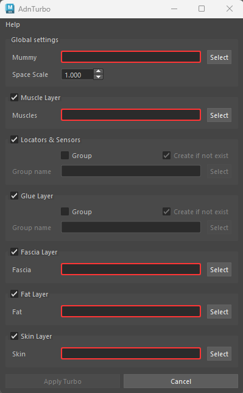
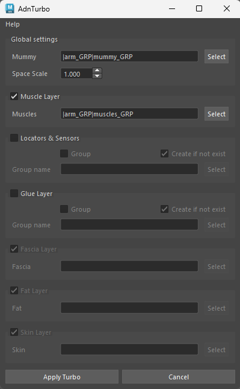
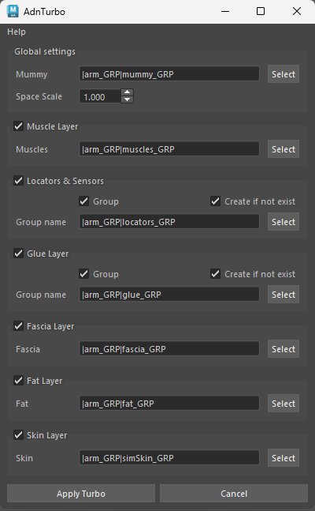
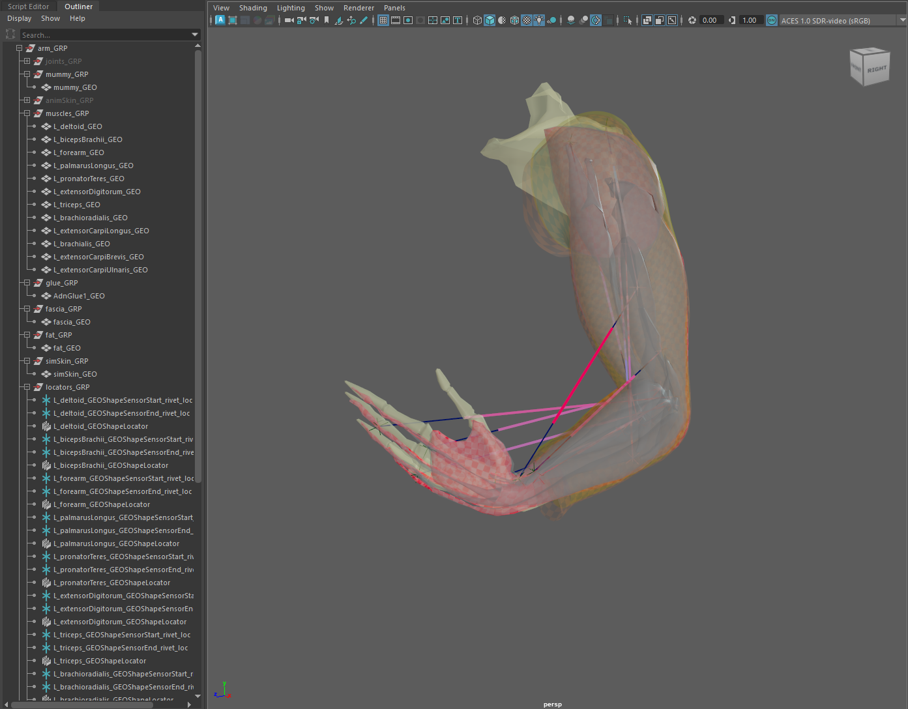

# AdnTurbo

The **AdnTurbo Tool** is a feature designed to automate the creation of an AdonisFX rig from scratch on a clean asset within Maya, from which fine-tuning and customization can proceed. It sequentially configures the following simulation layers:

- **Muscle layer**
- **Glue layer**
- **Fascia layer**
- **Fat layer**
- **Skin layer**

<figure style="width:45%;" markdown>
  
  <figcaption><b>Figure 1</b>: AdnTurbo UI without providing any input. The <i>Apply Turbo</i> button is disabled because there are missing inputs. </figcaption>
</figure>

<figure style="width:45%;" markdown>
  
  <figcaption><b>Figure 2</b>: AdnTurbo UI with the minimum requirements. </figcaption>
</figure>

<figure style="width:45%;" markdown>
  
  <figcaption><b>Figure 3</b>: AdnTurbo UI providing all the inputs. </figcaption>
</figure>

Please, check this [section](#limitations) to know more about the current limitations.

## Requirements

Each layer builds upon the previous one, this means that a specific layer will be disabled in the UI unless all the previous layer checkboxes have been checked.

To configure at least the muscle layer, the following inputs are required:

- **Mummy**: the skeletal mesh that drives the muscle simulation.
- **Muscles**: one or more meshes representing muscles. The **Muscle Layer** checkbox must be enabled to provide this input.

When these two inputs are provided and the following layers are unchecked, AdnTurbo will be ready to be executed.

To configure the downstream layers, the following inputs have to be provided:

- **Fascia**: the fascia mesh to which AdnSkin is applied. The **Glue Layer** checkbox must be checked for the **Fascia Layer** to become enabled.
- **Fat**: the fat mesh to which AdnFat is applied. The **Fascia Layer** checkbox must be checked for the **Fat Layer** to become enabled.
- **Skin**: the skin mesh to which AdnSkin is applied. The **Fat Layer** checkbox must be checked for the **Skin Layer** to become enabled.

Note that if any input is wrong or missing, the corresponding input text will turn red and an error message will be shown when hovering over it. In this case, the *Apply Turbo* button will be disabled.

## How to use

1. Open a scene containing the geometries for all the layers to be built.

<figure style="width:90%; margin-left:5%" markdown>
  
  <figcaption><b>Figure 4</b>: Starting point to execute AdnTurbo onto an arm asset. The scene contains the geometries for: mummy, muscles, fascia, fat and skin.</figcaption>
</figure>

2. Provide the inputs in the Turbo UI according to the layers that have to be built. Refer to Figure 3 to build all the layers.

3. Additionally, to place the output glue geometry in a specific group, check the *Group Glue* option and provide a *Glue Group*. If the specified group does not exist, checking the *Create if not exist* option will make AdnTurbo to create it automatically.

4. If the scene contains AdonisFX nodes, a confirmation dialog will appear informing about it. Press *Yes* to automatically delete all AdonisFX nodes or *No* to cancel the execution.

<figure style="width:90%; margin-left:5%" markdown>
  
  <figcaption><b>Figure 5</b>: Question dialog informing about AdonisFX nodes in the scene before executing.</figcaption>
</figure>

5. If something goes wrong during the execution, an error dialog will be displayed informing about the problem to help with the troubleshooting. Note that the whole AdnTurbo can be undone.

<figure style="width:90%; margin-left:5%" markdown>
  
  <figcaption><b>Figure 6</b>: All simulation layers configured after the execution: muscles, glue, fascia, fat and skin.</figcaption>
</figure>

> [!NOTE]
> - If multiple geometries or groups share the same name in different groups (e.g. group1|geo and group2|geo, group1|group3 and group2|group3), providing the full DAG path will be required.
> - AdnTurbo can also be executed via Python scripting. For more details, please refer to the [Turbo Script page](../scripts/turbo).

## Result

As a result of executing the tool by providing the geometries for all the layers, the following nodes will be created:

- An AdnMuscle for each muscle geometry with the mummy geometry as target.
- An AdonisFX locator and sensor for each AdnMuscle to drive the muscle activation.
- An AdnGlue node (including its glue output geometry) with all the muscles as inputs.
- An AdnSkin node for the fascia geometry with the mummy and glue geometries as targets.
- An AdnRelax node applied on top of the fascia AdnSkin.
- An AdnFat node for the fat geometry with the fascia geometry as base mesh.
- An AdnRelax node applied on top of the AdnFat.
- An AdnSkin node for the skin geometry.

## Limitations

- The **Glue Layer** cannot be bypassed. This means that for the **Fascia Layer** to be enabled, the **Glue Layer** checkbox must be checked.
- If the *Yes* button is pressed in the question dialog (see figure 5) the tool will automatically remove all the AdonisFX nodes from the scene. However, other auxiliary nodes created in previous executions of the script will not be removed (i.e. glue output geometry, rivet nodes).
- The default values that AdnTurbo will use to configure each deformer cannot be customized.
