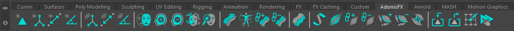
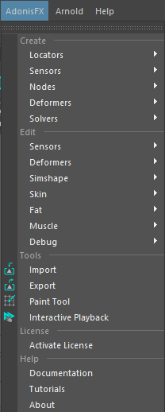
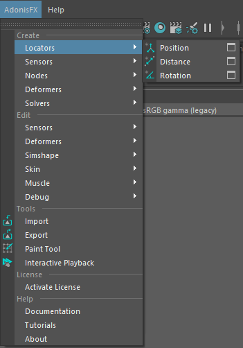
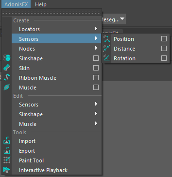
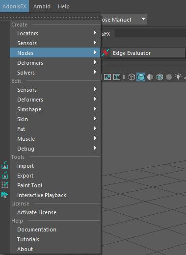
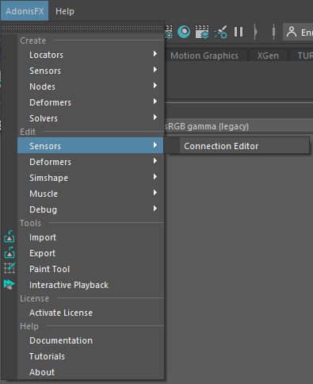
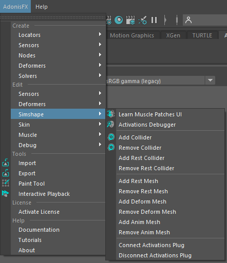

# UI Overview

The AdonisFX UI for Maya can be separated into two main elements presented in this page: the **AdonisFX Shelf** and the **AdonisFX Menu**.

## AdonisFX Shelf

The AdonisFX Shelf can be found in the Maya shelf tab under the label *AdonisFX*. It allows for quick access to the main AdonisFX functionalities.

<figure style="width: 100%;" markdown>
  
  <figcaption><b>Figure 1</b>: AdonisFX shelf.</figcaption>
</figure>

| Icon | Description | Menu Shortcut |
| :--- | :---------- | :------------ |
|  | Creates an [AdnLocator](locators.md#adonisfx-logo-locator) at the origin. This object is a standard Maya locator with a custom shape for better visualization in the viewport. | |
|  | Creates an [AdnLocatorPosition](locators.md#adnlocatorposition) from the selected transform node. The locator shape represents the position change of the element provided. Double click will launch a simple UI to provide a custom name for the node. | AdonisFX Menu > Create Locators > *Position* |
|  | Creates an [AdnLocatorDistance](locators.md#adnlocatordistance) from the two selected transform nodes. The locator shape represents the distance between the two elements provided. Double click will launch a simple UI to provide a custom name for the node. | AdonisFX Menu > Create Locators > *Distance* |
|  | Creates an [AdnLocatorRotation](locators.md#adnlocatorrotation) from the three selected transform nodes. The locator shape represents the angle between the two segments represted by the three nodes. Double click will launch a simple UI to provide a custom name for the node. | AdonisFX Menu > Create Locators > *Rotation* |
|||
|  | Creates an [AdnSensorPosition](sensors.md#adnsensorposition) from the transform object and the AdnLocatorPosition selected. If only the transform nodes is provided, then both the locator and the sensor are created. Double click will launch a simple UI to provide a custom name for the node. | AdonisFX Menu > Create Sensors > *Position* |
|  | Creates an [AdnSensorDistance](sensors.md#adnsensordistance) from the two transform nodes and the AdnLocatorDistance selected. If only the transform nodes are provided, then both the locator and the sensor are created. Double click will launch a simple UI to provide a custom name for the node. | AdonisFX Menu > Create Sensors > *Distance* |
|  | Creates an [AdnSensorRotation](sensors.md#adnsensorrotation) from the three transform nodes and the AdnLocatorRotation selected. If only the transform nodes are provided, then both the locator and the sensor are created. Double click will launch a simple UI to provide a custom name for the node. | AdonisFX Menu > Create Sensors > *Rotation* |
|||
|  | Applies an [AdnSimshape](simshape.md#create-simshape) deformer to the selected mesh. For more information about the possible selections see [Create AdnSimshape](simshape.md#create-simshape). Double click will launch a simple UI to assign a custom name and configure generic solver parameters. | AdonisFX Menu > *Create Simshape* |
|  | [Adds a Collider](simshape.md#add-collider) to AdnSimshape selecting the collider and the mesh with AdnSimshape applied. | AdonisFX Menu > Edit Simshape > *Add Collider* |
|  | [Removes a Collider](simshape.md#remove-collider) from AdnSimshape selecting the collider and the mesh with AdnSimshape applied. | AdonisFX Menu > Edit Simshape > *Remove Collider* |
|  | Launches the [AdnSimshape Muscle Patches Learning](simshape.md#generate-muscle-patches) tool used to generate the *AdonisFX Muscle Patches* file (.amp) file. | AdonisFX Menu > Edit Simshape > *Learn Muscle Patches UI* |
|  | Toggles the [Simshape Activations Debug Mode](simshape.md#debug-activations). Current frame has to match the preroll or start frame in the AdnSimshape deformer for this toggle to work. | AdonisFX Menu > Edit Simshape > *Activations Debugger* |
|||
|  | Creates [AdnSkin](skin.md#create-adnskin) deformer to the selected mesh. First, select the reference mesh and then the skin mesh to apply the deformer. Double click will launch a simple UI to assign a custom name and configure generic solver parameters. | AdonisFX Menu > *Create Skin* |
|  | Creates [AdnRibbonMuscle](ribbon.md#create-ribbon-muscle) deformer to the selected mesh. The deformer will be applied to the last element in the selection. Other elements in the list (optional) will be considered as attachment objects. Double click will launch a simple UI to assign a custom name and configure generic solver parameters. | AdonisFX Menu > *Create Ribbon Muscle* |
|  | Creates [AdnMuscle](muscle.md#create-muscle) deformer to the selected mesh. The deformer will be applied to the last element in the selection. Other elements in the list (optional) will be considered as attachment objects. Double click will launch a simple UI to assign a custom name and configure generic solver parameters. | AdonisFX Menu > *Create Muscle* |
|  | Assigns attachment objects to the selected deformer (utility compatible with AdnRibbonMuscle and AdnMuscle deformers). The mesh with the deformer applied must be the last element in the selection. | AdonisFX Menu > Edit Muscle > *Add Attachments* |
|  | Removes attachment objects assigned to the selected deformer (utility compatible with AdnRibbonMuscle and AdnMuscle deformers). The mesh with the deformer applied must be the last element in the selection. | AdonisFX Menu > Edit Muscle > *Remove Attachments* |
|||
|  | Launches the AdonisFX Asset Definition [Importer](tools.md#adonisfx-import-tool) to load and create AdonisFX nodes from file (.JSON). | AdonisFX Menu > Tools *Importer* |
|  | Launches the AdonisFX Asset Definition [Exporter](tools.md#adonisfx-export-tool) to save AdonisFX nodes information into a file (.JSON). | AdonisFX Menu > Tools *Exporter* |
|  | Opens the [Paint Tool UI](tools.md#adonisfx-paint-tool) to modify the paintable maps in AdnSkin, AdnMuscle and AdnRibbonMuscle deformers. | AdonisFX Menu > *Tools* Paint Tool |
|  | Enables Maya Interactive Playback. In this playback mode, dynamic interaction with objects and parameters while simulating is allowed. | AdonisFX Menu > Tools *Interactive Playback* |

## AdonisFX Maya Menu

The AdonisFX Menu provides access to the options in the shelf and other more advanced utilities that are organised in 3 groups: Create, Edit and Tools.

<figure style="width: 30%;" markdown>
  
  <figcaption><b>Figure 2</b>: AdonisFX Menu.</figcaption>
</figure>

### Create Section

#### Locators and Sensors

There is an item to create each locator and sensor type (Figures 3 and 4). Also, there are option boxes to launch a simple UI to provide a custom name for the node to create (Figure 5).

<figure style="width: 49%;float: left" markdown>
  
  <figcaption><b>Figure 3</b>: AdonisFX Menu Create Locators section.</figcaption>
</figure>

<figure style="width: 49%;float: right" markdown>
  
  <figcaption><b>Figure 4</b>: AdonisFX Menu Create Sensors section.</figcaption>
</figure>

<figure style="width: 50%;" markdown>
  
  <figcaption><b>Figure 5</b>: Locators and Sensors creator UI.</figcaption>
</figure>

#### Nodes

In Nodes section, there is a menu item to create an AdnEdgeEvaluator node.

<figure style="width: 50%;" markdown>
  
  <figcaption><b>Figure 8</b>: AdonisFX Menu Create Nodes section.</figcaption>
</figure>

#### Deformers

Option boxes can be used to launch a UI to assign the name to the deformer and configure generic solver parameters.

<figure style="width: 50%;" markdown>
  
  <figcaption><b>Figure 6</b>: Deformer Creator UI creating for an AdnSkin deformer.</figcaption>
</figure>

### Edit Section

#### Sensors

<figure style="width: 50%;" markdown>
  
  <figcaption><b>Figure 7</b>: AdonisFX Menu Edit Sensors section.</figcaption>
</figure>

- **Connection Editor**. Launches the [Connection Editor](tools.md#adonisfx-sensors-connection-editor) UI. This tool will assist with the connectivity of the locators and sensors output plugs with the AdonisFX deformer nodes.

#### Simshape

<figure style="width: 50%;" markdown>
  
  <figcaption><b>Figure 8</b>: AdonisFX Menu Edit AdnSimshape section.</figcaption>
</figure>

- **Learn Muscle Patches UI**. Launches the [AdnSimshape Muscle Patches Learning](simshape.md#generate-muscle-patches) tool used to generate the *AdonisFX Muscle Patches* (.amp) file.
- **Activations Debugger**. Toggles the [Simshape Activations Debug Mode](simshape.md#debug-activations). Current frame must match the specified initialization frame at the AdnSimshape deformer to toggle.
- **Add Collider**. Assigns a [Collider](simshape.md#add-collider) to the selected deformer. The selection must consist of: first the mesh to assign as a Collider and lastly the mesh with the deformer applied.
- **Remove Collider**. Removes a [Collider](simshape.md#remove-collider) from the selected deformer. The selection must consist of: first the Collider mesh to remove and lastly the mesh with the deformer applied.
- **Add Rest Collider**. Assigns a [Rest Collider](simshape.md#add-rest-collider) to the selected deformer. The selection must consist of: first the mesh to assign as a Rest Collider and lastly the mesh with the deformer applied.
- **Remove Rest Collider**. Removes a [Rest Collider](simshape.md#remove-rest-collider) from the selected deformer. The selection must consist of: first the Rest Collider mesh to remove and lastly the mesh with the deformer applied.
- **Add Rest Mesh**. Assigns a [Rest Mesh](simshape.md#requirements) to the selected deformer. The selection must consist of: first the Rest Mesh that to assign and lastly the mesh with the deformer applied.
- **Remove Rest Mesh**. Removes a [Rest Mesh](simshape.md#requirements) from the selected deformer. The selection must consist of: first the Rest Mesh that to remove and lastly the mesh with the deformer applied.
- **Add Deform Mesh**. Assigns a [Deform Mesh](simshape.md#requirements) to the selected deformer. The selection must consist of: first the Deform Mesh that to assign and lastly the mesh with the deformer applied.
- **Remove Deform Mesh**. Removes a [Deform Mesh](simshape.md#requirements) from the selected deformer. The selection must consist of: first the Deform Mesh that to remove and lastly the mesh with the deformer applied.
- **Add Anim Mesh**. Assigns an [Anim Mesh](simshape.md#requirements) to the selected deformer. The selection must consist of: first the Anim Mesh to assign and lastly the mesh with the deformer applied.
- **Remove Anim Mesh**. Removes an [Anim Mesh](simshape.md#requirements) from the selected deformer. The selection must consist of: first the Anim Mesh to remove and lastly the mesh with the deformer applied.
- **Connect Activations Plug**. Connects the output compression map from an [Edge Evaluator](edge_evaluator.md#simshape-activation-using-edge-evaluator-node) node to the activations plug of the AdnSimshape selected deformer. The selection must consist of: first the Edge Evaluator node and lastly the AdnSimshape deformer node.
- **Disconnect Activations Plug**. Disconnects the output compression map from an [Edge Evaluator](edge_evaluator.md#simshape-activation-using-edge-evaluator-node) node from the activations plug of the AdnSimshape selected deformer. The selection must consist of: first the Edge Evaluator node and lastly the AdmSimshape deformer node.

#### Muscle

<figure style="width: 50%;" markdown>
  
  <figcaption><b>Figure 9</b>: AdonisFX Menu Edit Muscle section.</figcaption>
</figure>

- **Add Attachments**. Adds attachment objects to the selected muscle. The mesh with the deformer applied must be the last element in the selection.
- **Remove Attachments**. Removes attachment objects from the selected muscle. The mesh with the deformer applied must be the last element in the selection. If only the muscle geometry is selected, then all attachments are removed.
- **Add Slide On Segment Constraint**. Adds segments based on the two (or more) transform objects and the mesh with the deformer node applied selected.
- **Remove Slide On Segment Constraint**. Removes anchors from segments based on the transform objects and the mesh with the deformer node applied selected.
- **Draw Fibers**. Enables *Muscle Fibers* Debugging from all the AdnRibbonMuscle and AdnMuscle in the scene.
- **Hide Fibers**. Disables *Muscle Fibers* Debugging from all the AdnRibbonMuscle and AdnMuscle in the scene.

#### Tools section

- **Import**. Launches the AdonisFX Asset Definition Importer to load and create AdonisFX nodes from file (.JSON).
- **Export**. Launches the AdonisFX Asset Definition Exporter to save AdonisFX nodes information into a file (.JSON).
- **Paint Tool**. Opens the Paint Tool UI to modify the paintable maps in AdnSkin, AdnMuscle and AdnRibbonMuscle deformers.
- **Interactive Playback**. Enables Maya Interactive Playback. In this playback mode, dynamic interaction with objects and parameters while simulating is allowed.
