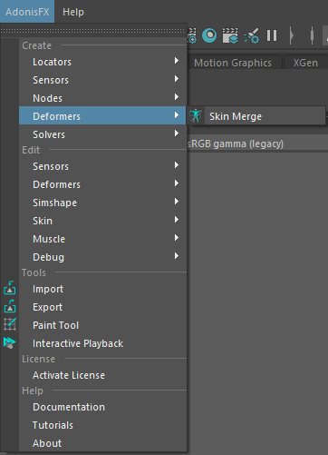
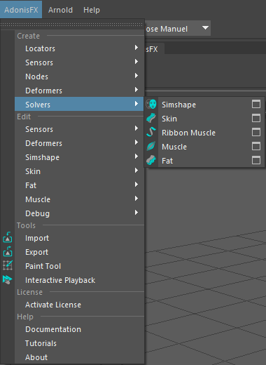
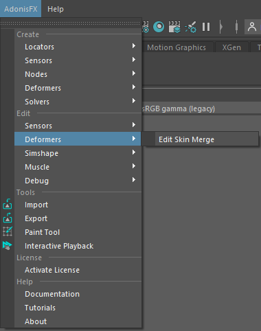
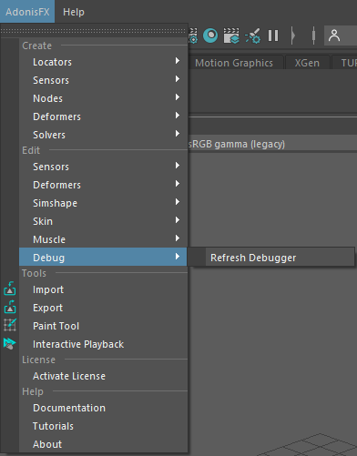

# UI Overview

The AdonisFX UI for Maya can be separated into two main elements presented in this page: the **AdonisFX Shelf** and the **AdonisFX Menu**.

## AdonisFX Shelf

The AdonisFX Shelf can be found in the Maya shelf tab under the label *AdonisFX*. It allows for quick access to the main AdonisFX functionalities.

<figure style="width: 100%;" markdown>
  
  <figcaption><b>Figure 1</b>: AdonisFX shelf.</figcaption>
</figure>

| Icon | Description | Menu Shortcut |
| :--- | :---------- | :------------ |
|  | Creates an AdnLocator at the origin. This object is a standard Maya locator with a custom shape for better visualization in the viewport. | |
|  | Creates an AdnLocatorPosition from the selected transform node. The locator shape represents the position change of the element provided. Double click will launch a simple UI to provide a custom name for the node. | AdonisFX Menu > Create Locators > *Position* |
|  | Creates an AdnLocatorDistance from the two selected transform nodes. The locator shape represents the distance between the two elements provided. Double click will launch a simple UI to provide a custom name for the node. | AdonisFX Menu > Create Locators > *Distance* |
|  | Creates an AdnLocatorRotation from the three selected transform nodes. The locator shape represents the angle between the two segments represted by the three nodes. Double click will launch a simple UI to provide a custom name for the node. | AdonisFX Menu > Create Locators > *Rotation* |
|||
|  | Creates an AdnSensorPosition from the transform object and the AdnLocatorPosition selected. If only the transform nodes is provided, then both the locator and the sensor are created. Double click will launch a simple UI to provide a custom name for the node. | AdonisFX Menu > Create Sensors > *Position* |
|  | Creates an AdnSensorDistance from the two transform nodes and the AdnLocatorDistance selected. If only the transform nodes are provided, then both the locator and the sensor are created. Double click will launch a simple UI to provide a custom name for the node. | AdonisFX Menu > Create Sensors > *Distance* |
|  | Creates an AdnSensorRotation from the three transform nodes and the AdnLocatorRotation selected. If only the transform nodes are provided, then both the locator and the sensor are created. Double click will launch a simple UI to provide a custom name for the node. | AdonisFX Menu > Create Sensors > *Rotation* |
|||
|  | Applies an AdnSimshape deformer to the selected mesh. Double click will launch a simple UI to assign a custom name and configure generic solver parameters. | AdonisFX Menu > Create Solvers > *Simshape* |
|  | Adds a collider to AdnSimshape selecting the collider and the mesh with AdnSimshape applied. | AdonisFX Menu > Edit Simshape > *Add Collider* |
|  | Removes a collider from AdnSimshape selecting the collider and the mesh with AdnSimshape applied. | AdonisFX Menu > Edit Simshape > *Remove Collider* |
|  | Launches the Learn Muscle Patches UI used to generate the *AdonisFX Muscle Patches* file (.amp) file. | AdonisFX Menu > Edit Simshape > *Learn Muscle Patches UI* |
|  | Toggles the AdnSimshape activations debug mode. Current frame has to match the preroll or start frame in the AdnSimshape deformer for this toggle to work. | AdonisFX Menu > Edit Simshape > *Activations Debugger* |
|||
|  | Creates AdnSkin deformer to the selected mesh. First, select the reference mesh and then the skin mesh to apply the deformer. Double click will launch a simple UI to assign a custom name and configure generic solver parameters. | AdonisFX Menu > Create Solvers > *Skin* |
|  | Launches the Create Skin Merge UI used to create an AdnSkinMerge deformer. | AdonisFX Menu > Create Deformers > *Skin Merge* |
|||
|  | Creates AdnRibbonMuscle deformer to the selected mesh. The deformer will be applied to the last element in the selection. Other elements in the list (optional) will be considered as attachment objects. Double click will launch a simple UI to assign a custom name and configure generic solver parameters. | AdonisFX Menu > Create Solvers > *Ribbon Muscle* |
|  | Creates AdnMuscle deformer to the selected mesh. The deformer will be applied to the last element in the selection. Other elements in the list (optional) will be considered as attachment objects. Double click will launch a simple UI to assign a custom name and configure generic solver parameters. | AdonisFX Menu > Create Solvers > *Muscle* |
|  | Assigns target objects to the selected deformer (utility compatible with AdnRibbonMuscle and AdnMuscle deformers). The mesh with the deformer applied must be the last element in the selection. | AdonisFX Menu > Edit Muscle > *Add Targets* |
|  | Removes target objects assigned to the selected deformer (utility compatible with AdnRibbonMuscle and AdnMuscle deformers). The mesh with the deformer applied must be the last element in the selection. | AdonisFX Menu > Edit Muscle > *Remove Targets* |
|  | Adds slide segments based on the two (or more) transform objects and the mesh with the deformer node applied (utility compatible with AdnRibbonMuscle and AdnMuscle deformers). This mesh must be the last element in the selection. | AdonisFX Menu > Edit Muscle > *Add Slide On Segment* |
|  | Removes slide segments assigned to the selected deformer (utility compatible with AdnRibbonMuscle and AdnMuscle deformers). The mesh with the deformer applied must be the last element in the selection. | AdonisFX Menu > Edit Muscle > *Remove Slide On Segment* |
|||
|  | Launches the Importer to load and create nodes from an AdonisFX Asset Definition file (.JSON). | AdonisFX Menu > Tools *Importer* |
|  | Launches the Exporter to save AdonisFX nodes information into an AdonisFX Asset Definition file (.JSON). | AdonisFX Menu > Tools *Exporter* |
|  | Opens the AdonisFX Paint Tool to modify the paintable maps in AdnSkin, AdnMuscle and AdnRibbonMuscle deformers. | AdonisFX Menu > *Tools* Paint Tool |
|  | Enables Maya Interactive Playback. In this playback mode, dynamic interaction with objects and parameters while simulating is allowed. | AdonisFX Menu > Tools *Interactive Playback* |

## AdonisFX Maya Menu

The AdonisFX Menu provides access to the options in the shelf and other more advanced utilities that are organised in 3 groups: Create, Edit and Tools.

<figure style="width: 30%;" markdown>
  
  <figcaption><b>Figure 2</b>: AdonisFX Menu.</figcaption>
</figure>

### Create Section

#### Locators and Sensors

There is an item to create each locator and sensor type (Figures 3 and 4). Also, there are option boxes to launch a simple UI to provide a custom name for the node to create (Figure 5).

<figure style="width: 49%;float: left" markdown>
  
  <figcaption><b>Figure 3</b>: AdonisFX Menu Create Locators section.</figcaption>
</figure>

<figure style="width: 49%;float: right" markdown>
  
  <figcaption><b>Figure 4</b>: AdonisFX Menu Create Sensors section.</figcaption>
</figure>

<figure style="width: 50%;" markdown>
  
  <figcaption><b>Figure 5</b>: Locators and Sensors creator UI.</figcaption>
</figure>

#### Nodes

In Nodes section, there is a menu item to create an AdnEdgeEvaluator node.

<figure style="width: 50%;" markdown>
  
  <figcaption><b>Figure 8</b>: AdonisFX Menu Create Nodes section.</figcaption>
</figure>

#### Deformers

In the Deformers section, there is a menu item to open the UI to create an AdnSkinMerge node.

<figure style="width: 50%;" markdown>
  
  <figcaption><b>Figure 3</b>: AdonisFX Menu Create Deformers section.</figcaption>
</figure>

#### Solvers

In the Deformers section, there are all options to create AdonisFX simulation deformer nodes.

<figure style="width: 50%;" markdown>
  
  <figcaption><b>Figure 3</b>: AdonisFX Menu Create Solvers section.</figcaption>
</figure>

Option boxes can be used to launch a UI to assign the name to the deformer and configure generic solver parameters.

<figure style="width: 50%;" markdown>
  
  <figcaption><b>Figure 6</b>: Deformer Creator UI creating for an AdnSkin deformer.</figcaption>
</figure>

### Edit Section

#### Sensors

<figure style="width: 50%;" markdown>
  
  <figcaption><b>Figure 7</b>: AdonisFX Menu Edit Sensors section.</figcaption>
</figure>

- **Connection Editor**. Launches the Sensors Connection Editor UI. This tool will assist with the connectivity of the locators and sensors output plugs with the AdonisFX deformer nodes.

#### Deformers

<figure style="width: 50%;" markdown>
  
  <figcaption><b>Figure 3</b>: AdonisFX Menu Edit Deformers section.</figcaption>
</figure>

- **Edit Skin Merge**. Launches the Edit Skin Merge UI. This tool will assist with the edition of simulation and animation meshes lists. To open this UI a mesh with the AdnSkinMerge must be selected.

#### Simshape

<figure style="width: 50%;" markdown>
  
  <figcaption><b>Figure 8</b>: AdonisFX Menu Edit AdnSimshape section.</figcaption>
</figure>

- **Learn Muscle Patches UI**. Launches the Learn Muscle Patches UI required to generate the *AdonisFX Muscle Patches* (.amp) file.
- **Activations Debugger**. Toggles the AdnSimshape activations debug mode. The current frame must match the specified initialization frame at the AdnSimshape deformer to toggle.
- **Add Collider**. Assigns the collider to the selected deformer. The selection must consist of: first the mesh to assign as a Collider and lastly the mesh with the deformer applied.
- **Remove Collider**. Removes the collider from the selected deformer. The selection must consist of: first the Collider mesh to remove and lastly the mesh with the deformer applied.
- **Add Rest Collider**. Assigns the collider at rest to the selected deformer. The selection must consist of: first the mesh to assign as a Rest Collider and lastly the mesh with the deformer applied.
- **Remove Rest Collider**. Removes the collider at rest from the selected deformer. The selection must consist of: first the Rest Collider mesh to remove and lastly the mesh with the deformer applied.
- **Add Rest Mesh**. Assigns the rest mesh to the selected deformer. The selection must consist of: first the Rest Mesh that to assign and lastly the mesh with the deformer applied.
- **Remove Rest Mesh**. Removes the rest Mesh from the selected deformer. The selection must consist of: first the Rest Mesh that to remove and lastly the mesh with the deformer applied.
- **Add Deform Mesh**. Assigns the deform mesh to the selected deformer. The selection must consist of: first the Deform Mesh that to assign and lastly the mesh with the deformer applied.
- **Remove Deform Mesh**. Removes the deform mesh from the selected deformer. The selection must consist of: first the Deform Mesh that to remove and lastly the mesh with the deformer applied.
- **Add Anim Mesh**. Assigns the animated mesh to the selected deformer. The selection must consist of: first the Anim Mesh to assign and lastly the mesh with the deformer applied.
- **Remove Anim Mesh**. Removes the animated mesh from the selected deformer. The selection must consist of: first the Anim Mesh to remove and lastly the mesh with the deformer applied.
- **Connect Activations Plug**. Connects the output compression map from an AdnEdgeEvaluator node to the activations plug of the AdnSimshape selected deformer. The selection must consist of: first the Edge Evaluator node and lastly the AdnSimshape deformer node.
- **Disconnect Activations Plug**. Disconnects the output compression map from an AdnEdgeEvaluators node from the activations plug of the AdnSimshape selected deformer. The selection must consist of: first the Edge Evaluator node and lastly the AdmSimshape deformer node.

#### Muscle

<figure style="width: 50%;" markdown>
  
  <figcaption><b>Figure 9</b>: AdonisFX Menu Edit Muscle section.</figcaption>
</figure>

- **Add Targets**. Adds target objects to the selected muscle. The mesh with the deformer applied must be the last element in the selection.
- **Remove Targets**. Removes target objects from the selected muscle. The mesh with the deformer applied must be the last element in the selection. If only the muscle geometry is selected, then all targets are removed.
- **Add Slide On Segment Constraint**. Adds segments based on the two (or more) transform objects and the mesh with the deformer node applied selected.
- **Remove Slide On Segment Constraint**. Removes anchors from segments based on the transform objects and the mesh with the deformer node applied selected.
- **Draw Fibers**. Enables *Muscle Fibers* Debugging from all the AdnRibbonMuscle and AdnMuscle in the scene.
- **Hide Fibers**. Disables *Muscle Fibers* Debugging from all the AdnRibbonMuscle and AdnMuscle in the scene.

#### Debug

<figure style="width: 50%;" markdown>
  
  <figcaption><b>Figure 3</b>: AdonisFX Menu Debug section.</figcaption>
</figure>

- **Refresh Debugger**. Refreshes the scene graph for debugging purposes by making sure the AdnDataNode and the AdnDebugLocator exist in the scene and are properly connected.

### Tools section

- **Import**. Launches the AdonisFX Asset Definition Importer to load and create AdonisFX nodes from file (.JSON).
- **Export**. Launches the AdonisFX Asset Definition Exporter to save AdonisFX nodes information into a file (.JSON).
- **Paint Tool**. Opens the Paint Tool UI to modify the paintable maps in AdnSkin, AdnMuscle and AdnRibbonMuscle deformers.
- **Interactive Playback**. Enables Maya Interactive Playback. In this playback mode, dynamic interaction with objects and parameters while simulating is allowed.

### License section

- **Activate License**. Launches a dialog to activate an AdonisFX license or the trial period if the license hasn't been activated.

### Help section

- **Documentation**. Opens the AdonisFX technical documentation on a web browser.
- **Tutorials**. Opens the AdonisFX tutorials on YouTube on a web browser.
- **About**. Launches the AdonisFX About dialog with version information and credits.
