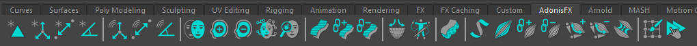
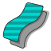
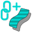
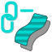
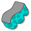
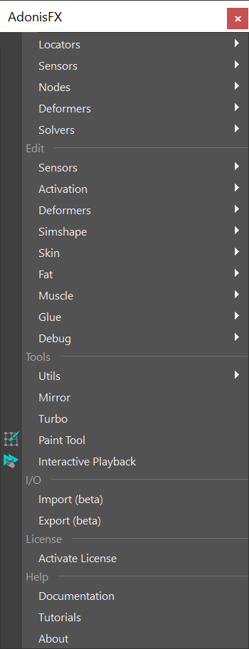
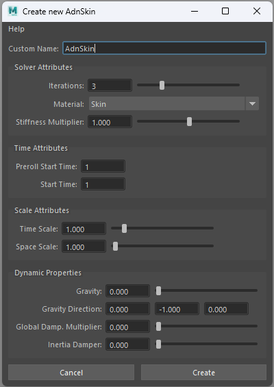

# UI Overview

The AdonisFX UI for Maya can be separated into two main elements presented in this page: the **AdonisFX Shelf** and the **AdonisFX Menu**.

## AdonisFX Shelf

The AdonisFX Shelf can be found in the Maya shelf tab under the label *AdonisFX*. It allows for quick access to the main AdonisFX functionalities.

<figure style="width: 100%;" markdown>
  
  <figcaption><b>Figure 1</b>: AdonisFX shelf.</figcaption>
</figure>

| Icon | Description | Menu Shortcut |
| :--- | :---------- | :------------ |
|  | Creates an AdnLocator at the origin. This object is a standard Maya locator with a custom shape for better visualization in the viewport. | |
|  | Creates an AdnLocatorPosition from the selected transform node. The locator shape represents the position change of the element provided. Double click will launch a simple UI to provide a custom name for the node. | AdonisFX Menu > Create Locators > *Position* |
|  | Creates an AdnLocatorDistance from the two selected transform nodes. The locator shape represents the distance between the two elements provided. Double click will launch a simple UI to provide a custom name for the node. | AdonisFX Menu > Create Locators > *Distance* |
|  | Creates an AdnLocatorRotation from the three selected transform nodes. The locator shape corresponds to the angle between the two segments represented by the three nodes. Double click will launch a simple UI to provide a custom name for the node. | AdonisFX Menu > Create Locators > *Rotation* |
|||
|  | Creates an AdnSensorPosition from the transform object and the AdnLocatorPosition selected. If only the transform node is provided, then both the locator and the sensor are created. Double click will launch a simple UI to provide a custom name for the node. | AdonisFX Menu > Create Sensors > *Position* |
|  | Creates an AdnSensorDistance from the two transform nodes and the AdnLocatorDistance selected. If only the transform nodes are provided, then both the locator and the sensor are created. Double click will launch a simple UI to provide a custom name for the node. | AdonisFX Menu > Create Sensors > *Distance* |
|  | Creates an AdnSensorRotation from the three transform nodes and the AdnLocatorRotation selected. If only the transform nodes are provided, then both the locator and the sensor are created. Double click will launch a simple UI to provide a custom name for the node. | AdonisFX Menu > Create Sensors > *Rotation* |
|||
|  | Applies an AdnSimshape deformer to the selected mesh. Double click will launch a simple UI to assign a custom name and configure generic solver parameters. | AdonisFX Menu > Create Solvers > *Simshape* |
|  | Adds a collider to AdnSimshape selecting the collider and the mesh with AdnSimshape applied. | AdonisFX Menu > Edit Simshape > *Add Collider* |
|  | Removes a collider from AdnSimshape selecting the collider and the mesh with AdnSimshape applied. | AdonisFX Menu > Edit Simshape > *Remove Collider* |
|  | Launches the Learn Muscle Patches UI used to generate the *AdonisFX Muscle Patches* file (.amp) file. | AdonisFX Menu > Edit Simshape > *Learn Muscle Patches UI* |
|  | Toggles the AdnSimshape activations debug mode. The current frame has to match the preroll or start frame in the AdnSimshape deformer for this toggle to work. | AdonisFX Menu > Edit Simshape > *Activations Debugger* |
|||
|  | Creates AdnSkin deformer to the selected mesh. The deformer will be applied to the last element in the selection. Other elements in the list (optional) will be considered as target meshes. Double click will launch a simple UI to assign a custom name and configure generic solver parameters. | AdonisFX Menu > Create Solvers > *Skin* |
|  | Assigns target meshes to the selected AdnSkin deformer. The mesh with the deformer applied must be the last element in the selection. | AdonisFX Menu > Edit Skin > *Add Targets* |
|  | Removes target meshes assigned to the selected AdnSkin deformer. The mesh with the deformer applied must be the last element in the selection. | AdonisFX Menu > Edit Skin > *Remove Targets* |
|||
|  | Applies an AdnRelax deformer to the selected mesh. | AdonisFX Menu > Create Deformers > *Relax* |
|  | Launches the Create Skin Merge UI used to create an AdnSkinMerge deformer. | AdonisFX Menu > Create Deformers > *Skin Merge* |
|||
|  | Applies an AdnFat deformer to the selected mesh. The deformer will be applied to the second element in the selection, while the first element will be considered as base mesh. | AdonisFX Menu > Create Solvers > *Fat* |
|||
|  | Creates AdnRibbonMuscle deformer to the selected mesh. The deformer will be applied to the last element in the selection. Other elements in the list (optional) will be considered as target objects. Double click will launch a simple UI to assign a custom name and configure generic solver parameters. | AdonisFX Menu > Create Solvers > *Ribbon Muscle* |
|  | Creates AdnMuscle deformer to the selected mesh. The deformer will be applied to the last element in the selection. Other elements in the list (optional) will be considered as target objects. Double click will launch a simple UI to assign a custom name and configure generic solver parameters. | AdonisFX Menu > Create Solvers > *Muscle* |
|  | Assigns target objects to the selected deformer (utility compatible with AdnRibbonMuscle and AdnMuscle deformers). The mesh with the deformer applied must be the last element in the selection. | AdonisFX Menu > Edit Muscle > *Add Targets* |
|  | Removes target objects assigned to the selected deformer (utility compatible with AdnRibbonMuscle and AdnMuscle deformers). The mesh with the deformer applied must be the last element in the selection. | AdonisFX Menu > Edit Muscle > *Remove Targets* |
|  | Adds slide segments based on the two (or more) transform objects and the mesh with the deformer node applied (utility compatible with AdnRibbonMuscle and AdnMuscle deformers). The mesh must be the last element in the selection. | AdonisFX Menu > Edit Muscle > *Add Slide On Segment* |
|  | Removes slide segments assigned to the selected deformer (utility compatible with AdnRibbonMuscle and AdnMuscle deformers). The mesh with the deformer applied must be the last element in the selection. | AdonisFX Menu > Edit Muscle > *Remove Slide On Segment* |
|  | Creates an AdnGlue node and connects the selected geometries to the inputs array plug of the node. A new geometry will be generated as the result of gluing all the inputs together. | AdonisFX Menu > Create Solvers > *Glue* |
|||
|  | Opens the AdonisFX Paint Tool to modify the paintable maps in AdnSkin, AdnMuscle and AdnRibbonMuscle deformers. | AdonisFX Menu > *Tools* Paint Tool |
|  | Enables Maya Interactive Playback. In this playback mode, dynamic interaction with objects and parameters while simulating is allowed. | AdonisFX Menu > Tools *Interactive Playback* |

## AdonisFX Maya Menu

The AdonisFX Menu provides access to the options in the shelf and other more advanced utilities that are organized in 5 groups: Create, Edit, Tools, I/O, License and Help.

<figure style="width: 30%;" markdown>
  
  <figcaption><b>Figure 2</b>: AdonisFX Menu.</figcaption>
</figure>

### Create Section

#### Locators

- **Position**. Creates an AdnLocatorPosition from the selected transform node. The locator shape represents the position change of the element provided. Double click will launch a simple UI to provide a custom name for the node. This item corresponds to the shelf button {style="width:4%"}.
- **Distance**. Creates an AdnLocatorDistance from the two selected transform nodes. The locator shape represents the distance between the two elements provided. Double click will launch a simple UI to provide a custom name for the node. This item corresponds to the shelf button {style="width:4%"}.
- **Rotation**. Creates an AdnLocatorRotation from the three selected transform nodes. The locator shape corresponds to the angle between the two segments represented by the three nodes. Double click will launch a simple UI to provide a custom name for the node. This item corresponds to the shelf button {style="width:4%"}.

#### Sensors

- **Position**. Creates an AdnSensorPosition from the transform object and the AdnLocatorPosition selected. If only the transform nodes are provided, then both the locator and the sensor are created. Double click will launch a simple UI to provide a custom name for the node. This item corresponds to the shelf button {style="width:4%"}.
- **Distance**. Creates an AdnSensorDistance from the two transform nodes and the AdnLocatorDistance selected. If only the transform nodes are provided, then both the locator and the sensor are created. Double click will launch a simple UI to provide a custom name for the node. This item corresponds to the shelf button {style="width:4%"}.
- **Rotation**. Creates an AdnSensorRotation from the three transform nodes and the AdnLocatorRotation selected. If only the transform nodes are provided, then both the locator and the sensor are created. Double click will launch a simple UI to provide a custom name for the node. This item corresponds to the shelf button {style="width:4%"}.

Both in Locators and Sensors there are option boxes to launch a simple UI to provide a custom name for the node to create.

<figure style="width: 50%;" markdown>
  
  <figcaption><b>Figure 3</b>: Locators and Sensors creator UI.</figcaption>
</figure>

#### Nodes

- **Edge Evaluator**. Creates an AdnEdgeEvaluator node from two selected meshes with the same topology. 
- **Activation**. Creates an AdnActivation node. If meshes with a muscle deformer applied are provided in the selection, the new AdnActivation node will be connected to the activation plug of those deformers.

#### Deformers

- **Relax**. Applies an AdnRelax deformer to the selected mesh. This item corresponds to the shelf button {style="width:4%"}.
- **Skin Merge**. Launches the Create Skin Merge UI used to create an AdnSkinMerge deformer. This item corresponds to the shelf button {style="width:4%"}.

#### Solvers

- **Simshape**. Applies an AdnSimshape deformer to the selected mesh. This item corresponds to the shelf button {style="width:4%"}.
- **Skin**. Creates an AdnSkin deformer to the selected mesh. This item corresponds to the shelf button {style="width:4%"}.
- **Fat**. Applies an AdnFat deformer to the selected mesh. The deformer will be applied to the second element in the selection. The first element will be considered as base mesh. This item corresponds to the shelf button {style="width:4%"}.
- **Ribbon Muscle**. Creates AdnRibbonMuscle deformer to the selected mesh. The deformer will be applied to the last element in the selection. Other elements in the list (optional) will be considered as attachment objects. This item corresponds to the shelf button {style="width:4%"}.
- **Muscle**. Creates AdnMuscle deformer to the selected mesh. The deformer will be applied to the last element in the selection. Other elements in the list (optional) will be considered as attachment objects. This item corresponds to the shelf button {style="width:4%"}.
- **Glue**. Creates an AdnGlue node and connects the selected geometries to the inputs array plug of the node. A new geometry will be generated as the result of gluing all the inputs together. This item corresponds to the shelf button {style="width:4%"}.

Option boxes can be used to launch a UI to assign the name to the deformer and configure generic solver parameters.

<figure style="width: 50%;" markdown>
  
  <figcaption><b>Figure 4</b>: Deformer Creator UI creating for an AdnSkin deformer.</figcaption>
</figure>

### Edit Section

#### Sensors

- **Connection Editor**. Launches the Sensors Connection Editor UI. This tool will assist with the connection of the locators and sensors output plugs with the AdonisFX deformer nodes.

#### Activation

- **Remove Inputs**: Removes inputs from an AdnActivation node.

    - To remove all inputs, do one of the following selections:
        1. The AdnActivation node.
        2. The mesh with a muscle deformer applied that is connected to an AdnActivation node.

    - To remove specific inputs, do one of the following selections:
        1. The locators to remove and the AdnActivation node.
        2. First the locators to remove, lastly the mesh with a muscle deformer applied that is connected to an AdnActivation node.

#### Deformers

- **Edit Skin Merge**. Launches the Edit Skin Merge UI. This tool will assist with the editing of simulation and animation meshes lists of an AdnSkinMerge deformer. To open this UI a mesh with an AdnSkinMerge applied must be selected.

#### Simshape

- **Learn Muscle Patches UI**. Launches the Learn Muscle Patches UI required to generate the *AdonisFX Muscle Patches* (.amp) file. This item corresponds to the shelf button {style="width:4%"}.
- **Activations Debugger**. Toggles the AdnSimshape activations debug mode. The current frame must match the specified initialization frame at the AdnSimshape deformer to toggle. This item corresponds to the shelf button {style="width:4%"}. 
- **Add Collider**. Assigns the collider to the selected deformer. The selection must consist of: first the mesh to assign as a Collider and lastly the mesh with the deformer applied. This item corresponds to the shelf button {style="width:4%"}. 
- **Remove Collider**. Removes the collider from the selected deformer. The selection must consist of: first the Collider mesh to remove and lastly the mesh with the deformer applied. This item corresponds to the shelf button {style="width:4%"}. 
- **Add Rest Collider**. Assigns the collider at rest to the selected deformer. The selection must consist of: first the mesh to assign as a Rest Collider and lastly the mesh with the deformer applied.
- **Remove Rest Collider**. Removes the collider at rest from the selected deformer. The selection must consist of: first the Rest Collider mesh to remove and lastly the mesh with the deformer applied.
- **Add Rest Mesh**. Assigns the rest mesh to the selected deformer. The selection must consist of: first the Rest Mesh to assign and lastly the mesh with the deformer applied.
- **Remove Rest Mesh**. Removes the rest Mesh from the selected deformer. The selection must consist of: first the Rest Mesh to remove and lastly the mesh with the deformer applied.
- **Add Deform Mesh**. Assigns the deform mesh to the selected deformer. The selection must consist of: first the Deform Mesh to assign and lastly the mesh with the deformer applied.
- **Remove Deform Mesh**. Removes the deform mesh from the selected deformer. The selection must consist of: first the Deform Mesh to remove and lastly the mesh with the deformer applied.
- **Add Anim Mesh**. Assigns the animated mesh to the selected deformer. The selection must consist of: first the Anim Mesh to assign and lastly the mesh with the deformer applied.
- **Remove Anim Mesh**. Removes the animated mesh from the selected deformer. The selection must consist of: first the Anim Mesh to remove and lastly the mesh with the deformer applied.
- **Connect Activations Plug**. Connects the output compression map from an AdnEdgeEvaluator node to the activations plug of the AdnSimshape selected deformer. The selection must consist of: first the Edge Evaluator node and lastly the AdnSimshape deformer node.
- **Disconnect Activations Plug**. Disconnects the output compression map from an AdnEdgeEvaluators node from the activations plug of the AdnSimshape selected deformer. The selection must consist of: first the Edge Evaluator node and lastly the AdmSimshape deformer node.

#### Skin

- **Add Targets**. Adds target meshes to the selected skin. The mesh with the deformer applied must be the last element in the selection. This item corresponds to the shelf button {style="width:4%"}.
- **Remove Targets**. Removes target meshes from the selected skin. The mesh with the deformer applied must be the last element in the selection. If only the skin geometry is selected, then all targets are removed. This item corresponds to the shelf button {style="width:4%"}.

#### Fat

- **Add Base Mesh**. Assigns a base mesh to the selected fat. The selection must consist of: first the mesh to assign as Base Mesh and lastly the mesh with the deformer applied.
- **Remove Base Mesh**. Removes the base mesh from the selected fat. The selection must consist of: the mesh with the deformer applied.

#### Muscle

- **Add Targets**. Adds target objects to the selected muscle. The mesh with the deformer applied must be the last element in the selection. This item corresponds to the shelf button {style="width:4%"}.
- **Remove Targets**. Removes target objects from the selected muscle. The mesh with the deformer applied must be the last element in the selection. If only the muscle geometry is selected, then all targets are removed. This item corresponds to the shelf button {style="width:4%"}.
- **Add Slide On Segment Constraint**. Adds segments based on the two (or more) transform objects and the mesh with the deformer node applied selected. This item corresponds to the shelf button {style="width:4%"}.
- **Remove Slide On Segment Constraint**. Removes anchors from segments based on the transform objects and the mesh with the deformer node applied selected. This item corresponds to the shelf button  {style="width:4%"}.
- **Draw Fibers**. Enables *Muscle Fibers* Debugging from all the AdnRibbonMuscle and AdnMuscle in the scene.
- **Hide Fibers**. Disables *Muscle Fibers* Debugging from all the AdnRibbonMuscle and AdnMuscle in the scene.

#### Glue

- **Add Inputs**. Adds input meshes to an existing AdnGlue node. The output mesh of the destination AdnGlue has to be the last object selected.
- **Remove Inputs**. Removes input meshes from an existing AdnGlue node. The output mesh of the destination AdnGlue has to be the last object selected. If only the glue output mesh is selected, then all inputs will be removed.

#### Debug

- **Refresh Debugger**. Refreshes the scene graph for debugging purposes by making sure the AdnDataNode and the AdnDebugLocator exist in the scene and are properly connected.

### Tools section

#### Utils

- **Upgrade Deprecated Nodes**. Refreshes the node graph and upgrades all deprecated nodes making sure that the scene still works the same.
- **Clear**. Removes all AdonisFX nodes from the scene.

 

- **Mirror**. Opens the Mirror Tool UI to mirror the muscle setup from one side of the body to the other.
- **Paint Tool**. Opens the Paint Tool UI to modify the paintable maps in AdnSkin, AdnMuscle and AdnRibbonMuscle deformers. This item corresponds to the shelf button {style="width:4%"}.
- **Interactive Playback**. Enables Maya Interactive Playback. In this playback mode, dynamic interaction with objects and parameters while simulating is allowed. This item corresponds to the shelf button {style="width:4%"}.

### I/O section

- **Import (beta)**. Opens the Import UI which allows to import an AdonisFX rig into the scene.
- **Export (beta)**. Opens the Export UI which allows to export an AdonisFX rig from the scene.

### License section

- **Activate License**. Checks the license status and if it is not activated yet, then a dialog will be prompted to guide on the product key registration. This functionality is only available in the Interactive Node-Locked license.

### Help section

- **Documentation**. Opens the AdonisFX technical documentation on a web browser.
- **Tutorials**. Opens the AdonisFX tutorials on YouTube on a web browser.
- **About**. Launches the AdonisFX About dialog with version information and credits.
