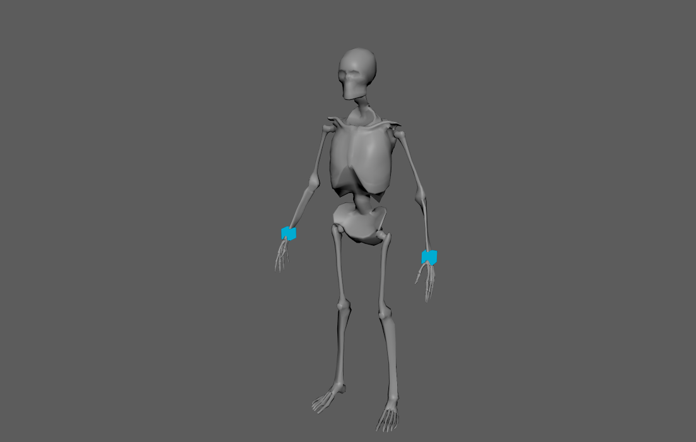
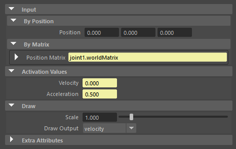
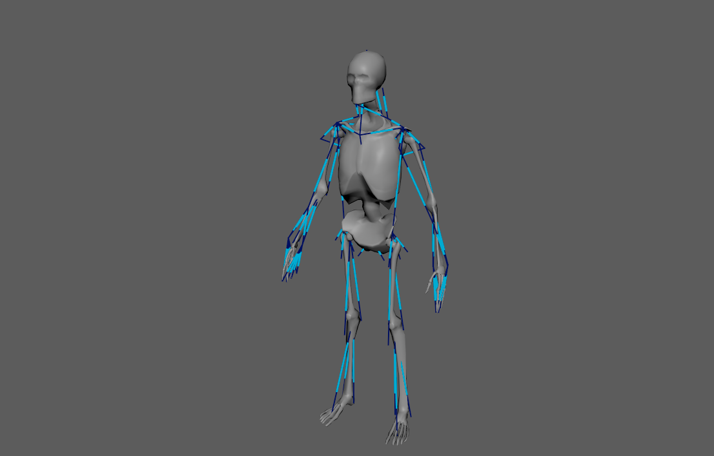
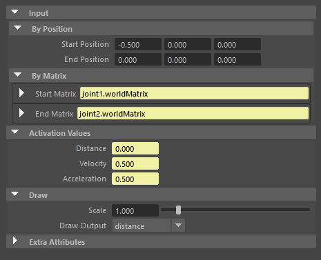
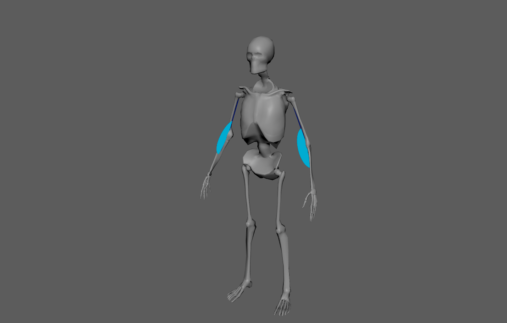
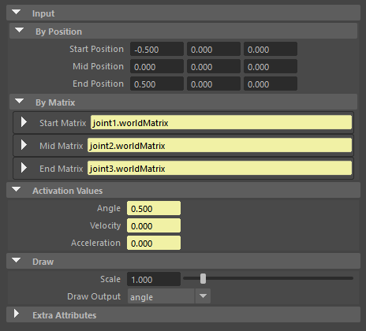
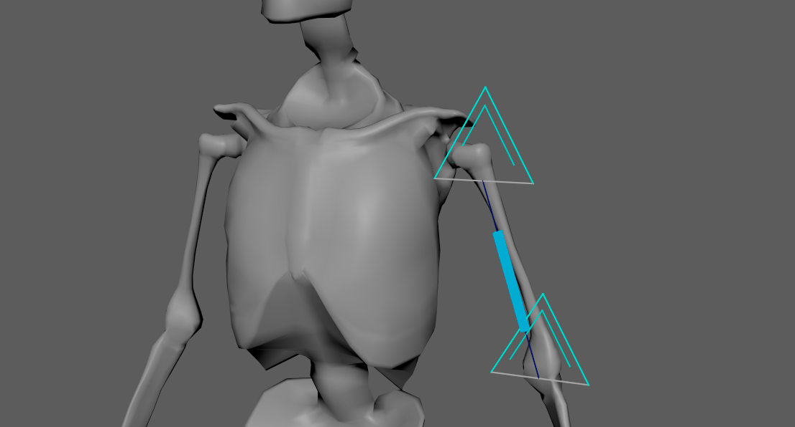
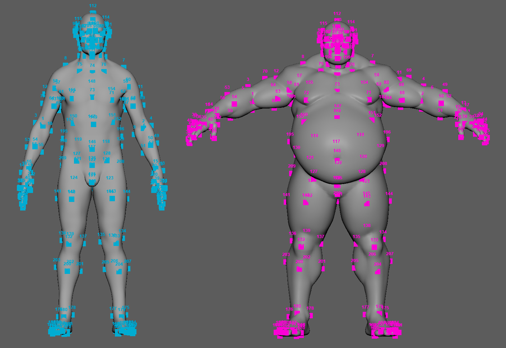

# Locators

Adonis Locators are visualizers that are meant for visualizing and measuring transform nodes which provide valuable input information for setting up the deformers. They can visualize information representing position, distance, or angle as well as velocities or accelerations represented via coloring when used in combination with Sensors.

## AdnLocatorPosition

AdnLocatorPosition is the locator for visualizing the position of a single transform node. When connected to its corresponding AdnSensorPosition, velocity or acceleration can be visualized with a color code blue-to-red.

### How To Use

An AdnLocatorPosition will only visualize the information of the transform node to which it is applied. To be able to read, process and visualize information like the velocity or acceleration an [AdnSensorPosition](sensors#adnsensorposition) has to be applied.

<figure markdown>
  
  <figcaption><b>Figure 1</b>: AdnLocatorPosition used in a human model.</figcaption>
</figure>

Only one transform will be required to create the AdnLocatorPosition. The creation process is the following:

 1. Select a transform node in the scene.
 2. Press the {style="width:4%"} button in the Adonis shelf or press *Position* in the Adonis menu, under the *Locators* submenu. If the shelf button is double-clicked or the option box in the menu is selected a window will be displayed where a custom name and initial attribute values can be set.
 3. The AdnLocatorPosition is created and ready to be used.

### Attributes

#### Input
| Name | Type | Default | Animatable | Description |
| :--- | :--- | :------ | :--------- | :---------- |
| **Position**        | Float3 | {0.0, 0.0, 0.0} | ✓ | Position in world space of the transform node. This plug is used if: 1) it has input connections; 2) it does not have input connections and *Position Matrix* does not have input connections neither. Otherwise, *Position Matrix* is used instead.|
| **Position Matrix** | Matrix | Identity        | ✓ | Matrix containing the position in world space of the transform node. This plug is used if: 1) it has input connections and *Position* does not have input connections. Otherwise, *Position* is used instead. |

#### Activation Values
| Name | Type | Default | Animatable | Description |
| :--- | :--- | :------ | :--------- | :---------- |
| **Velocity**     | Float | 0.0 | ✓ | Magnitude of the velocity of the transform node. |
| **Acceleration** | Float | 0.0 | ✓ | Magnitude of the acceleration of the transform node. |

#### Draw
| Name | Type | Default | Animatable | Description |
| :--- | :--- | :------ | :--------- | :---------- |
| **Scale**       | Float      | 1.0      | ✓ | Sets the scaling factor applied to the position locator visualizer. Has a range of \[0.0, 10.0\]. The upper limit is soft, higher values can be used. |
| **Draw Output** | Enumerator | Velocity | ✓ | Selects the property of the locator to be visualized on the locator visualizer.<ul><li>**Velocity:** Color the visualizer of the locator according to the input velocity activation.</li><li>**Acceleration:** Color the visualizer of the locator according to the input acceleration activation.</li></ul> |

### Attribute Editor Template

<figure style="width: 75%;" markdown>
   
  <figcaption><b>Figure 2</b>: AdnLocatorPosition Attribute Editor.</figcaption>
</figure>

## AdnLocatorDistance

AdnLocatorDistance is the locator for visualizing the distance between two transform nodes. When connected to its corresponding AdnSensorDistance, distance, velocity or acceleration can be visualized with a color code blue-to-red.

### How To Use

An AdnLocatorDistance will only visualize the information of the distance between two transform nodes to which it is applied. To be able to read, process and visualize information like the distance magnitude, velocity or acceleration an [AdnSensorDistance](sensors#adnsensordistance) has to be applied.

<figure markdown>
  
  <figcaption><b>Figure 3</b>: AdnLocatorDistance used in a human model.</figcaption>
</figure>

Two transform nodes will be required to create an AdnLocatorDistance representing each extremity. The creation process is the following:

 1. Select two transform nodes in the scene.
 2. Press the {style="width:4%"} button in the Adonis shelf or press *Distance* in the Adonis menu, under the *Locators* submenu. If the shelf button is double-clicked or the option box in the menu is selected a window will be displayed where a custom name and initial attribute values can be set.
 3. The AdnLocatorDistance is created and ready to be used.

### Attributes

#### Input
| Name | Type | Default | Animatable | Description |
| :--- | :--- | :------ | :--------- | :---------- |
| **Start Position** | Float3 | {0.0, 0.0, 0.0} | ✓ | Position in world space of the first transform node. This plug is used if: 1) it has input connections; 2) it does not have input connections and *Start Matrix* does not have input connections neither. Otherwise, *Start Matrix* is used instead.|
| **End Position**   | Float3 | {0.0, 0.0, 0.0} | ✓ | Position in world space of the second transform node. This plug is used if: 1) it has input connections; 2) it does not have input connections and *End Matrix* does not have input connections neither. Otherwise, *End Matrix* is used instead.|
| **Start Matrix**   | Matrix | Identity        | ✓ | Matrix containing the position in world space of the first transform node. This plug is used if: 1) it has input connections and *Start Position* does not have input connections. Otherwise, *Start Position* is used instead. |
| **End Matrix**     | Matrix | Identity        | ✓ | Matrix containing the position in world space of the second transform node. This plug is used if: 1) it has input connections and *End Position* does not have input connections. Otherwise, *End Position* is used instead. |

#### Activation Values
| Name | Type | Default | Animatable | Description |
| :--- | :--- | :------ | :--------- | :---------- |
| **Distance**     | Float | 0.0 | ✓ | Magnitude of the distance between the transform nodes. |
| **Velocity**     | Float | 0.0 | ✓ | Magnitude of the velocity between the transform nodes. |
| **Acceleration** | Float | 0.0 | ✓ | Magnitude of the acceleration between the transform nodes. |

#### Draw
| Name | Type | Default | Animatable | Description |
| :--- | :--- | :------ | :--------- | :---------- |
| **Scale**       | Float      | 1.0      | ✓ | Sets the scaling factor applied to the distance locator visualizer. Has a range of \[0.0, 10.0\]. The upper limit is soft, higher values can be used. |
| **Draw Output** | Enumerator | Distance | ✓ | Selects the property of the locator to be visualized on the locator visualizer. <ul><li>**Distance:** Color the visualizer of the locator according to the input distance activation.</li><li>**Velocity:** Color the visualizer of the locator according to the input velocity activation.</li><li>**Acceleration:** Color the visualizer of the locator according to the input acceleration activation.</li></ul> |

### Attribute Editor Template

<figure style="width: 75%;" markdown>
   
  <figcaption><b>Figure 4</b>: AdnLocatorDistance Attribute Editor.</figcaption>
</figure>

## AdnLocatorRotation

AdnLocatorRotation is the locator for visualizing the angle between three transform nodes. When connected to its corresponding AdnSensorRotation, angle, angular velocity or angular acceleration can be visualized with a color code blue-to-red.

### How To Use

An AdnLocatorRotation will only visualize the information of the connections and angle between the three transform nodes. To be able to read, process and visualize information like the angle, angular velocity or angular acceleration an [AdnSensorRotation](sensors#adnsensorrotation) has to be applied.

<figure markdown>
  
  <figcaption><b>Figure 5</b>: AdnLocatorRotation locator used in a human model.</figcaption>
</figure>

Three transform nodes will be required to create the AdnLocatorRotation. The creation process is the following:

 1. Select three transform objects in the scene. The order in which the objects are selected is relevant, as the created angle will have the following arrangement:
    - First selected object: Start point of the angle.
    - Second selected object: Middle point of the angle.
    - Third selected object: End point of the angle.
 2. Press the {style="width:4%"} button in the Adonis shelf or press *Rotation* in the Adonis menu, under the *Locators* submenu. If the shelf button is double-clicked or the option box in the menu is selected a window will be displayed where a custom name and initial attribute values can be set.
 3. The AdnLocatorRotation is created and ready to be used.

### Attributes

#### Input
| Name | Type | Default | Animatable | Description |
| :--- | :--- | :------ | :--------- | :---------- |
| **Start Position** | Float3 | {0.0, 0.0, 0.0} | ✓ | Position in world space of the first transform node. This plug is used if: 1) it has input connections; 2) it does not have input connections and *Start Matrix* does not have input connections neither. Otherwise, *Start Matrix* is used instead.|
| **Mid Position**   | Float3 | {0.0, 0.0, 0.0} | ✓ | Position in world space of the second transform node. This plug is used if: 1) it has input connections; 2) it does not have input connections and *Mid Matrix* does not have input connections neither. Otherwise, *Mid Matrix* is used instead.|
| **End Position**   | Float3 | {0.0, 0.0, 0.0} | ✓ | Position in world space of the third transform node. This plug is used if: 1) it has input connections; 2) it does not have input connections and *End Matrix* does not have input connections neither. Otherwise, *End Matrix* is used instead.|
| **Start Matrix**   | Matrix | Identity        | ✓ | Matrix containing the position in world space of the first transform node. This plug is used if: 1) it has input connections and *Start Position* does not have input connections. Otherwise, *Start Position* is used instead. |
| **Mid Matrix**     | Matrix | Identity        | ✓ | Matrix containing the position in world space of the second transform node. This plug is used if: 1) it has input connections and *Mid Position* does not have input connections. Otherwise, *Mid Position* is used instead. |
| **End Matrix**     | Matrix | Identity        | ✓ | Matrix containing the position in world space of the third transform node. This plug is used if: 1) it has input connections and *End Position* does not have input connections. Otherwise, *End Position* is used instead. |

#### Activation Values
| Name | Type | Default | Animatable | Description |
| :--- | :--- | :------ | :--------- | :---------- |
| **Angle**        | Float | 0.0 | ✓ | Magnitude of the angle between the three transform nodes. |
| **Velocity**     | Float | 0.0 | ✓ | Magnitude of the angular velocity between the three transform nodes. |
| **Acceleration** | Float | 0.0 | ✓ | Magnitude of the angular acceleration between the three transform nodes. |

#### Draw
| Name | Type | Default | Animatable | Description |
| :--- | :--- | :------ | :--------- | :---------- |
| **Scale**       | Float      | 1.0   | ✓ | Sets the scaling factor applied to the rotation locator visualizer. Has a range of \[0.0, 10.0\]. The upper limit is soft, higher values can be used. |
| **Draw Output** | Enumerator | Angle | ✓ | Selects the property of the locator to be visualized on the locator visualizer.<ul><li>**Angle:** Color the visualizer of the locator according to the input angle activation.</li><li>**Velocity:** Color the visualizer of the locator according to the input velocity activation.</li><li>**Acceleration:** Color the visualizer of the locator according to the input acceleration activation.</li></ul> |

### Attribute Editor Template

<figure style="width: 75%;" markdown>
   
  <figcaption><b>Figure 6</b>: AdnLocatorRotation Attribute Editor.</figcaption>
</figure>

## AdnLocator

The AdnLocator is an native alternative to Maya locators. This locator can be used to visualize any kind of scene element with a transform node. For example they can be used as inputs to other Adonis locators presented in this page.

### How To Use

To create an AdnLocator just click on the {style="width:4%"} button in the Adonis shelf. The locator will be created at the origin of your scene.

<figure markdown>
  
  <figcaption><b>Figure 7</b>: AdnLocator used for distance constraints.</figcaption>
</figure>

## AdnPointLocator

AdnPointLocator is an Adonis locator specifically designed to represent landmarks in the anatomy transfer workflow and to work together with the [AdnRadialWrap](../deformers/radial_wrap) deformer. These landmarks are used to establish anatomical correspondences between an input geometry and one or more goal geometries, defining how regions of one model relate to regions of another. AdnPointLocator nodes provide a convenient way to visualize landmark positions and identify them in the viewport through labels.

### How To Use

The recommended workflow is to use the [Landmark Tool](../tools/landmark_tool), which simplifies the creation and management of landmark pairs.

1. Press *Landmark Tool* in the Adonis menu, under the Tools section.
2. Provide the input and goal geometries.
3. Provide the input and goal wildcard patterns.
4. Press *Add Landmark Pair* to add a new empty pair of landmarks.
5. Press the button corresponding to the input landmark to create an AdnPointLocator, then position it as desired.
6. Press the button corresponding to the goal landmark to create an AdnPointLocator, then position it as desired.
7. Repeat steps 4 to 6 for as many landmarks as needed.
8. Press *Apply* to create a new AdnRadialWrap and automatically connect the defined landmarks.

Landmarks must be precisely placed on the surface of their respective geometry. To facilitate this process, the Landmark Tool temporarily sets the corresponding geometry *live* while performing steps 5 and 6.

The Landmark Tool also handles the naming of AdnPointLocator nodes and automatically assigns the right landmark identifier as a label.

<figure markdown>
  
  <figcaption><b>Figure 8</b>: AdnPointLocator nodes placed on two human bodies to define the anatomy correspondence.</figcaption>
</figure>

### Attributes

| Name | Type | Default | Animatable | Description |
| :--- | :--- | :------ | :--------- | :---------- |
| **Label**      | String  |            | X | Label to identify the locator in the viewport. |
| **Point Size** | Float   | 15.0       | ✓ | Size of the drawn shape in pixels. The minimum value allowed is 1.0. |
| **Font Size**  | Integer | 12         | ✓ | Size of the drawn label in pixels. The minimum value allowed is 1.|
| **Color**      | Color   | Light Blue | ✓ | Color of the drawn shape. |

### Attribute Editor Template

<figure style="width: 75%;" markdown>
   
  <figcaption><b>Figure 9</b>: AdnPointLocator Attribute Editor.</figcaption>
</figure>

